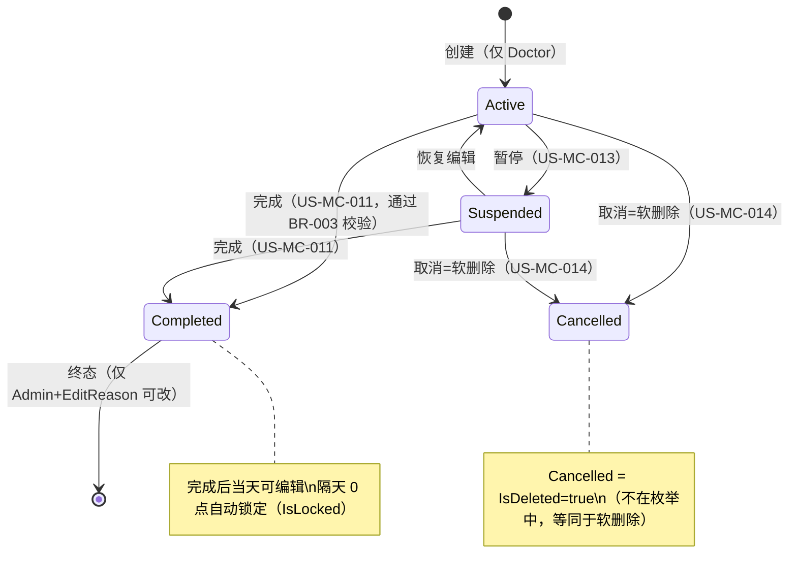

# 医案管理 (Medical Case Management) — 核心聚合根

> 版本: v2.0 | 日期: 2026-06-15 | 状态: 重建
>
> **本模块是系统唯一的聚合根（Aggregate Root）。** MedicalCase 聚合 Consultation（中医诊断，内部实体）和 Prescription（处方，内部实体），所有写操作通过聚合根统一入口完成（CQRS + 聚合根模式）。本模块文档是全系统最详细的需求规格。

## 模块概述

医案（MedicalCase）是中医诊疗的完整记录，涵盖一次就诊从创建到归档的完整生命周期。一个医案包含患者信息、主治医生、中医诊断（Consultation，含四诊结果与辨证分析）和处方（Prescription，含药材列表与价格计算）。

医案模块采用 CQRS（Command Query Responsibility Segregation）+ 聚合根模式：5 个 CQRS 服务（Command/Query/Processing/Audit/Print）由 `IMedicalCaseFacade` 聚合门面统一调度。所有业务规则集中在 `MedicalCaseBusinessRules`。核心设计原则：

1. **单一聚合根**：Consultation 和 Prescription 是 MedicalCase 的内部实体，无独立 CRUD 接口；外部模块（如验方导入）通过 MedicalCase 聚合根间接操作。
2. **状态机驱动**：状态转换由域方法统一控制（如 `CompleteAsync`），禁止通过 `UpdateStatusAsync` 直接设置 `Completed`。
3. **权限与编辑控制**：基于角色 + 资源所有权 + 状态的综合权限模型，已完成医案当天可编辑，隔天自动锁定。
4. **打印保护**：打印后任何内容修改需提供 EditReason，修改后 `IsPrinted=false`、`PrintVersion++`，确保纸质与电子记录一致。

## 业务规则

### BR-001：同一患者单活跃医案约束（核心铁律）

**规则**：同一患者在同一时间只能有一个 `Active` 或 `Suspended` 状态的医案。

**触发时机**：创建医案（US-MC-001）。

**碰撞处理**：当患者已有 `Active`/`Suspended` 医案时，系统提示用户选择：
1. **重开现有医案** — 导航到已有的 Active/Suspended 医案继续编辑
2. **关闭旧的后新建** — 将已有医案软删除（Cancelled），然后创建新医案
3. **取消操作** — 放弃创建

**技术实现**：代码层检查（`MedicalCaseBusinessRules`）+ DB 唯一索引（Active + Suspended 状态）。并发冲突风险极低（NFR 1-3 用户，MC-D06）。

### BR-002：医案离开界面操作

离开医案编辑界面时，必须选择一种处置方式：
1. **挂起** — 状态设为 Suspended，保存当前数据，稍后可继续（US-MC-013）
2. **取消** — 执行软删除（IsDeleted=true）
3. **完成** — 状态设为 Completed，需通过完成校验（US-MC-011）

异常状态（崩溃/断网/强制关闭）：医案保持当前状态（Active），未保存变更丢失（MC-D18，不实现自动保存）。

### BR-003：医案完成校验规则

完成医案（US-MC-011）时必须通过以下校验：

| 校验项 | 条件 | 错误消息 |
|--------|------|----------|
| 中医辨证 | TcmDiagnosis 非空 | 请填写中医辨证 |
| 处方需求标记 | NeedsPrescription 非 null | 请先标记是否需要开处方 |
| 处方存在性 | NeedsPrescription=true 时 Prescription 非 null | 已标记需要开处方，但处方不存在 |
| 处方药材 | NeedsPrescription=true 时 Items.Count > 0 | 处方至少包含一味药材 |
| 处方必填字段 | NeedsPrescription=true 时 DosageCount > 0 | 请填写帖数 |

**统一入口**：所有完成操作通过 `CompleteAsync`（含 `skipWorkflowValidation` 参数控制是否跳过三步流程校验）。`UpdateStatusAsync` 拒绝 `Completed` 状态，强制使用 `CompleteAsync`。

### 状态机



**关键说明**：
- `Cancelled` 不在 `MedicalCaseStatus` 枚举中，取消 = 软删除（`IsDeleted=true`）
- `Completed` 是业务终态，仅 Admin/SuperAdmin 提供 EditReason 后可编辑
- `IsLocked` 是计算属性：`IsCompleted && CompletedAt.Date < Today`，0 点自动生效，无后台任务
- `Draft` 状态已被移除（MC-D20），由 `Suspended` 承载"工作流暂停"语义

### 权限矩阵

| 操作 | Receptionist (0) | Doctor (1) | Admin (10) | SuperAdmin (100) |
|------|:---:|:---:|:---:|:---:|
| **创建医案** | ❌ | ✅ | ❌ **Admin 不可创建** | ❌ |
| **列表/查询** | ❌ | 仅自己 | 全部 | 全部 |
| **编辑 Active/Suspended** | ❌ | 仅自己 | 全部 | 全部 |
| **编辑 Completed（当天）** | ❌ | 仅自己 | 全部 | 全部 |
| **编辑 Completed（隔天锁定）** | ❌ | ❌ | ✅（需 EditReason） | ✅（需 EditReason） |
| **取消（当天本人）** | ❌ | ✅ | ✅ | ✅ |
| **取消（非当天/非本人）** | ❌ | ❌ | ✅（需 EditReason） | ✅（需 EditReason） |
| **删除/批量删除** | ❌ | 仅自己 | 全部 | 全部 |
| **强制关闭** | ❌ | ❌ | ✅ | ✅ |
| **查询权限** | ❌ | ✅ | ✅ | ✅ |
| **查询审计日志** | ❌ | ✅（仅自己） | ✅（全部） | ✅（全部） |

> **关键铁律**：Admin/SuperAdmin **不可创建医案**——只有 Doctor 角色能创建。Admin 仅负责管理和审计。

### 编辑锁定规则

**锁定条件**（计算属性，无后台任务）：
```
IsLocked = IsCompleted && (CompletedAt.Date < Today)
```

**锁定后行为**：
- Doctor 不可编辑
- Admin/SuperAdmin 编辑需提供 EditReason
- 无显式解锁接口，管理员直接编辑（需 EditReason）

### 编辑理由（EditReason）要求

| 场景 | 需要 EditReason |
|------|:---:|
| 当天本人修改 Active/Suspended 医案 | ❌ |
| 修改已完成（Completed）医案 | ✅ |
| 隔天修改任何医案 | ✅ |
| 非本人修改医案 | ✅ |
| 取消医案（非当天本人） | ✅ |
| 打印后修改内容（IsPrinted=true） | ✅ |

预置修改原因选项：补充遗漏信息 / 更正录入错误 / 患者要求修改 / 医嘱调整

### 打印保护耦合

**规则**（MC-D15）：打印字段全部位于 MedicalCase 聚合根（Prescription 无打印字段）。

| 事件 | 行为 |
|------|------|
| 打印成功 | `IsPrinted=true`、`PrintCount++`、`LastPrintedAt=now`，生成 `MedicalCasePrintLog` |
| 打印后修改 Consultation 或 Prescription | **必须**提供 EditReason（ERR-30403） |
| 修改成功后 | `IsPrinted=false`、`PrintVersion++`（标记需重新打印） |
| 删除处方 | 始终禁止（ERR-30404，IsPrinted=true 时） |

### 双模式说明

本模块 22 个端点全部通过 `IMedicalCaseFacade` 统一调度，双模式行为完全一致。

## 用户故事

### US-MC-001: 创建医案（含诊断+处方聚合）

**角色**: 医生
**优先级**: Must
**状态**: ✅ 已实现

**作为** 医生，**我想要** 为患者创建新的诊疗记录（MedicalCase 聚合根），**以便** 我可以开始记录本次诊疗的诊断和处方信息。

**验收标准**:
- [ ] Admin/SuperAdmin 角色调用 POST → 返回 403（仅 Doctor 可创建）
- [ ] 创建成功 → Consultation 实体自动创建（1:1 共享主键）
- [ ] 创建成功 → 自动生成医案编号（格式：MC20260210001）
- [ ] 患者 `Status=Disabled` → 返回 422（ERR-30105）
- [ ] 患者已有 `Active` 医案 → 返回 422（ERR-30103），提示选择处理方式（BR-001）
- [ ] 患者已有 `Suspended` 医案 → 返回 422（ERR-30104），提示选择处理方式（BR-001）
- [ ] 初始状态为 `Active`

**业务规则**:
1. PatientId 必填，UserId（医生ID）必填
2. 仅 Doctor 可创建（Admin/SuperAdmin 不可创建——关键铁律）
3. 初始状态为 `Active`
4. 自动创建 Consultation（1:1 共享主键）
5. 自动生成医案编号（MC+yyyyMMdd+3位序号；CaseNumber 为展示用，Guid Id 为唯一标识）
6. 冗余存储 PatientName 和 DoctorName（读优化，创建时快照）
7. **患者状态检查**：Patient.Status 必须为 Enabled，禁用患者不可创建医案（ERR-30105）
8. **BR-001 单活跃医案约束**：同一患者同一时间只能有一个 Active 或 Suspended 医案（见上方 BR-001）
9. **两种创建入口（MC-D19）**：模式 1 前台挂号→医生从挂号队列选中；模式 2 医生直接查询患者创建。两种模式在 BR-001 检查后完全收敛

**双模式**:
| 模式 | 行为 |
|------|------|
| 远程 | POST `/api/v1/medicalcases` |
| 本地 | 完全一致（通过统一 Service 层） |

**实现参考**: `src/Server/Services/LYBT.WebAPI/Controllers/MedicalCasesController.cs:26`、`src/Shared/LYBT.Shared.Validators/BusinessRules/MedicalCaseBusinessRules.cs:9`

---

### US-MC-002: 保存医案（统一聚合保存）

**角色**: 医生、管理员
**优先级**: Must
**状态**: ✅ 已实现

**作为** 医生，**我想要** 一次性保存医案的诊断和处方信息，**以便** 我不必分别保存各部分数据，减少操作步骤和网络请求。

**验收标准**:
- [ ] 编辑锁定医案未提供 EditReason → 返回 422
- [ ] 更新处方 Items → 原有 Items 全部替换为新列表
- [ ] `IsPrinted=true` 且修改 Consultation/Prescription 内容但未提供 EditReason → 返回 422（ERR-30403）
- [ ] `IsPrinted=true` 修改成功后 → `IsPrinted=false`、`PrintVersion++`
- [ ] Doctor 保存 `UserId≠自己` 的医案 → 返回 403
- [ ] 乐观锁冲突（DbUpdateConcurrencyException）→ 最多重试 3 次

**业务规则**:
1. **聚合根整体保存**（MedicalCase + Consultation + Prescription + Items）
2. 权限检查：Doctor 只能保存自己的；Admin/SuperAdmin 可保存全部（需 EditReason）
3. 编辑已完成/隔天/非本人医案需要提供 EditReason（见编辑理由表）
4. 处方药材采用粗粒度替换策略（完整替换 Items 集合）
5. 记录审计日志（US-MC-017）
6. **打印保护**：若 `MedicalCase.IsPrinted=true` 且请求包含 Consultation 或 Prescription 内容变更，则 EditReason 必填（ERR-30403）。修改成功后：`MedicalCase.IsPrinted=false`、`MedicalCase.PrintVersion++`（需重新打印）
7. **乐观并发控制**：RowVersion + 3 次重试（MC-D10）

**双模式**:
| 模式 | 行为 |
|------|------|
| 远程 | PUT `/api/v1/medicalcases/{id}` |
| 本地 | 完全一致（通过统一 Service 层） |

**实现参考**: `src/Server/Services/LYBT.WebAPI/Controllers/MedicalCasesController.cs:26`、`src/Server/Modules/LYBT.Module.MedicalCase/Interfaces/IMedicalCaseFacade.cs:15`

---

### US-MC-003: 设置处方需求标志（3步工作流第2步）

**角色**: 医生
**优先级**: Must
**状态**: ✅ 已实现

**作为** 医生，**我想要** 标记本次诊疗是否需要开具处方，**以便** 系统可以在完成医案时校验处方完整性（BR-003）。

**验收标准**:
- [ ] `NeedsPrescription=false` → 已有 Prescription 被清除
- [ ] `NeedsPrescription=true` → 允许创建/编辑 Prescription
- [ ] `NeedsPrescription=null` 时完成医案 → 返回 422（ERR-30302）

**业务规则**:
1. `NeedsPrescription`: true（需要）/ false（不需要）/ null（未决策）
2. 设为 false 时，如已有处方则清除
3. 设为 true 时，允许创建/编辑处方
4. 完成医案时此字段不可为 null（BR-003）

**双模式**:
| 模式 | 行为 |
|------|------|
| 远程 | PUT `/api/v1/medicalcases/{id}/prescription-flag` |
| 本地 | 完全一致（通过统一 Service 层） |

**实现参考**: `src/Server/Services/LYBT.WebAPI/Controllers/MedicalCasesController.cs:26`

---

### US-MC-004: 查询医案详情（含诊断+处方）

**角色**: 医生、管理员
**优先级**: Must
**状态**: ✅ 已实现

**作为** 医生，**我想要** 查看医案的完整聚合详情（含诊断和处方），**以便** 我可以了解本次诊疗的全部信息。

**验收标准**:
- [ ] 有效 ID → 返回 `MedicalCaseDetailDto`（含 Consultation + Prescription + Items 嵌套数据）
- [ ] Doctor 查询 `UserId≠自己` 的医案 → 返回 403
- [ ] 包含计算属性：IsLocked、IsActive、IsCompleted、HasPrescription

**业务规则**:
1. 返回完整聚合（MedicalCase + Consultation + Prescription + Items）
2. 权限检查：Doctor 仅自己；Admin/SuperAdmin 全部
3. 包含计算属性
4. `HasPrescription` 计算：`entity.Prescription != null && !entity.Prescription.IsDeleted`

**双模式**:
| 模式 | 行为 |
|------|------|
| 远程 | GET `/api/v1/medicalcases/{id}` |
| 本地 | 完全一致（通过统一 Service 层） |

**实现参考**: `src/Server/Services/LYBT.WebAPI/Controllers/MedicalCasesController.cs:26`

---

### US-MC-005: 分页查询医案列表（按角色过滤）

**角色**: 医生、管理员
**优先级**: Must
**状态**: ✅ 已实现

**作为** 医生或管理员，**我想要** 分页查看医案列表并按条件筛选，**以便** 我可以快速找到需要处理或回顾的医案。

**验收标准**:
- [ ] Doctor 查询 → 仅返回 `UserId=自己` 的医案
- [ ] Admin 查询 → 返回全部医案
- [ ] 支持按状态、患者、关键词筛选
- [ ] 默认排序 → CreatedAt DESC（最新优先，MC-D11）
- [ ] 默认分页：page=1，pageSize=20

**业务规则**:
1. 支持按状态（status）、患者（patientId）、关键词（keyword）筛选
2. Admin 查看全部，Doctor 仅查看自己的
3. 默认排序：CreatedAt DESC（MC-D11）
4. 分页参数校验：page ≥ 1，pageSize 1-100

**双模式**:
| 模式 | 行为 |
|------|------|
| 远程 | GET `/api/v1/medicalcases?status=&patientId=&keyword=&page=&pageSize=` |
| 本地 | 完全一致（通过统一 Service 层） |

**实现参考**: `src/Server/Services/LYBT.WebAPI/Controllers/MedicalCasesController.cs:26`

---

### US-MC-006: 统一查询（ByPatient/Pending/Recent 等）

**角色**: 医生、管理员
**优先级**: Must
**状态**: ✅ 已实现

**作为** 医生，**我想要** 通过统一查询端点获取不同维度的医案集合（如按患者、待诊、最近），**以便** 我可以适配不同的工作场景。

**验收标准**:
- [ ] 支持多种 QueryType（ByPatient/Pending/Recent 等）
- [ ] 返回 `PagedResult<MedicalCaseDto>`
- [ ] Doctor 仅查询自己的；Admin 查询全部

**业务规则**:
1. 统一查询端点支持多种 QueryType
2. Pending 查询：返回 `Active` 或 `Suspended` 状态医案，按 CreatedAt ASC 排序（先到先看，MC-D11）
3. ByPatient 查询：按患者 ID 过滤
4. Recent 查询：返回最近 N 条（默认 20，最大 50）

**双模式**:
| 模式 | 行为 |
|------|------|
| 远程 | GET `/api/v1/medicalcases/query?type=&...` |
| 本地 | 完全一致（通过统一 Service 层） |

**实现参考**: `src/Server/Services/LYBT.WebAPI/Controllers/MedicalCasesController.cs:26`

---

### US-MC-007: 跨模块搜索（患者+诊断+日期）

**角色**: 医生、管理员
**优先级**: Must
**状态**: ✅ 已实现

**作为** 医生，**我想要** 按患者名/诊断关键词/日期范围全文搜索医案，**以便** 我可以在复诊时快速找到患者的历史诊疗记录。

**验收标准**:
- [ ] `diagnosisKeyword="风寒"` → 返回 TcmDiagnosis 含"风寒"的医案
- [ ] 支持患者姓名搜索
- [ ] 支持日期范围筛选（startDate/endDate）
- [ ] 返回完整 `MedicalCaseDetailDto`（含嵌套数据）

**业务规则**:
1. 支持按患者姓名搜索
2. 支持按诊断关键词搜索（TcmDiagnosis 模糊匹配）
3. 支持日期范围筛选
4. 返回完整 MedicalCaseDetailDto（含嵌套数据）
5. 权限过滤：Doctor 仅自己；Admin 全部

**双模式**:
| 模式 | 行为 |
|------|------|
| 远程 | GET `/api/v1/medicalcases/search?patientName=&diagnosisKeyword=&startDate=&endDate=` |
| 本地 | 完全一致（通过统一 Service 层） |

**实现参考**: `src/Server/Services/LYBT.WebAPI/Controllers/MedicalCasesController.cs:26`

---

### US-MC-008: 查询诊断历史

**角色**: 医生、管理员
**优先级**: Should
**状态**: ✅ 已实现

**作为** 医生，**我想要** 查询某患者的所有历史诊断记录，**以便** 复诊时参考既往辨证。

**验收标准**:
- [ ] 按 patientId 查询 → 返回该患者所有已完成医案的 Consultation 列表
- [ ] 按时间倒序排列
- [ ] Doctor 仅查询自己经手的；Admin 查询全部

**业务规则**:
1. 返回 Consultation 摘要（含 TcmDiagnosis、四诊、医案时间）
2. 仅返回 `Completed` 状态医案的 Consultation
3. 按时间 DESC 排序

**双模式**:
| 模式 | 行为 |
|------|------|
| 远程 | GET `/api/v1/medicalcases/{patientId}/consultations` 或通过统一查询 |
| 本地 | 完全一致（通过统一 Service 层） |

**实现参考**: `src/Server/Services/LYBT.WebAPI/Controllers/MedicalCasesController.cs:26`

---

### US-MC-009: 查询处方历史

**角色**: 医生、管理员
**优先级**: Should
**状态**: ✅ 已实现

**作为** 医生，**我想要** 查询某患者的所有历史处方记录，**以便** 复诊时复制或参考既往处方（US-MC-018 复制历史处方）。

**验收标准**:
- [ ] 按 patientId 查询 → 返回该患者所有已完成医案的 Prescription 列表
- [ ] 按时间倒序排列
- [ ] 含处方药材明细

**业务规则**:
1. 返回 Prescription 摘要（含 Items、DosageCount、TotalPrice）
2. 仅返回 `Completed` 状态医案的 Prescription
3. 按时间 DESC 排序
4. 支持复制操作（US-MC-018）

**双模式**:
| 模式 | 行为 |
|------|------|
| 远程 | GET `/api/v1/medicalcases/{patientId}/prescriptions` 或通过统一查询 |
| 本地 | 完全一致（通过统一 Service 层） |

**实现参考**: `src/Server/Services/LYBT.WebAPI/Controllers/MedicalCasesController.cs:26`

---

### US-MC-010: 更新医案状态（Active/Suspended）

**角色**: 医生、管理员
**优先级**: Must
**状态**: ✅ 已实现

**作为** 医生，**我想要** 在 Active 和 Suspended 之间切换医案状态，**以便** 我可以暂停当前诊疗稍后继续。

**验收标准**:
- [ ] `Active` → `Suspended` 成功
- [ ] `Suspended` → `Active` 成功
- [ ] `Completed` → `Suspended` → 返回 422（ERR-30304，已完成不可挂起）
- [ ] 已删除医案挂起 → 返回 422（ERR-30305）
- [ ] **禁止通过 UpdateStatusAsync 设置 Completed**（强制使用 CompleteAsync）

**业务规则**:
1. 状态机：`Active ↔ Suspended`（双向）
2. 挂起（Suspend）：不验证数据完整性（TcmDiagnosis 可空）
3. `UpdateStatusAsync` 拒绝 `Completed` 状态，强制使用 `CompleteAsync`（US-MC-011）
4. Doctor 仅可操作自己的；Admin 全部

**双模式**:
| 模式 | 行为 |
|------|------|
| 远程 | PUT `/api/v1/medicalcases/{id}/suspend` 或 `/activate` |
| 本地 | 完全一致（通过统一 Service 层） |

**实现参考**: `src/Server/Services/LYBT.WebAPI/Controllers/MedicalCaseProcessingController.cs:25`

---

### US-MC-011: 完成医案（工作流验证）

**角色**: 医生、管理员
**优先级**: Must
**状态**: ✅ 已实现

**作为** 医生，**我想要** 标记医案为已完成，**以便** 本次诊疗正式归档，触发隔天自动锁定保护。

**验收标准**:
- [ ] 完成医案 → `CaseStatus=Completed`，`CompletedAt` 记录当前时间
- [ ] `CompletedAt.Date < Today` → `IsLocked=true`（自动锁定）
- [ ] TcmDiagnosis 为空 → 返回 422（BR-003）
- [ ] `NeedsPrescription=null` → 返回 422（ERR-30302）
- [ ] `NeedsPrescription=true` 但无处方 → 返回 422（ERR-30303）
- [ ] `NeedsPrescription=true` 但 Items.Count=0 → 返回 422
- [ ] 通过聚合根域方法 `MedicalCase.Complete()` 统一设置
- [ ] 完成后关联的 Registration 状态自动变为 Completed（US-REG-007）

**业务规则**:
1. 状态设为 `Completed`，通过聚合根域方法 `MedicalCase.Complete()` 统一设置
2. 记录 `CompletedAt` 时间（域方法内设置）
3. 完成后当天内可编辑，隔天锁定（IsLocked 计算属性，0 点生效，无后台任务）
4. 锁定后编辑需要 Admin 权限 + 修改原因
5. **统一入口**：所有完成操作通过 `CompleteAsync`（含 `skipWorkflowValidation` 参数）
6. **禁止通过状态更新完成**：`UpdateStatusAsync` 拒绝 `Completed`
7. **完成校验规则（BR-003）**：见业务规则 BR-003 表格
8. **Registration 联动**：完成后关联 Registration 自动 Completed（US-REG-007）

**双模式**:
| 模式 | 行为 |
|------|------|
| 远程 | PUT `/api/v1/medicalcases/{id}/close` |
| 本地 | 完全一致（通过统一 Service 层） |

**实现参考**: `src/Server/Services/LYBT.WebAPI/Controllers/MedicalCaseProcessingController.cs:25`、`src/Shared/LYBT.Shared.Validators/BusinessRules/MedicalCaseBusinessRules.cs:9`

---

### US-MC-012: 强制关闭医案

**角色**: 管理员
**优先级**: Should
**状态**: ✅ 已实现

**作为** 管理员，**我想要** 强制关闭异常状态的医案（如长期挂起的孤儿医案），**以便** 维护系统数据清洁。

**验收标准**:
- [ ] 仅 Admin/SuperAdmin 可操作
- [ ] 强制关闭跳过 BR-003 完成校验（`skipWorkflowValidation=true`）
- [ ] 状态设为 `Completed`
- [ ] 记录审计日志（含强制关闭原因）

**业务规则**:
1. 仅 Admin/SuperAdmin 可操作
2. 调用 `CompleteAsync(skipWorkflowValidation: true)` 跳过三步流程校验
3. 用于清理异常状态医案（如长期 Suspended 的孤儿医案）
4. 必须记录操作原因

**双模式**:
| 模式 | 行为 |
|------|------|
| 远程 | PUT `/api/v1/medicalcases/{id}/close?force=true`（Admin 权限） |
| 本地 | 完全一致（通过统一 Service 层） |

**实现参考**: `src/Server/Services/LYBT.WebAPI/Controllers/MedicalCaseProcessingController.cs:25`

---

### US-MC-013: 暂停医案

**角色**: 医生、管理员
**优先级**: Must
**状态**: ✅ 已实现

**作为** 医生，**我想要** 暂时挂起当前诊疗的医案，**以便** 我可以先处理紧急患者，稍后再回来继续本次诊疗。

**验收标准**:
- [ ] 挂起成功 → 状态=Suspended，可继续编辑
- [ ] TcmDiagnosis 为空 → 挂起成功（不验证完整性）
- [ ] 已完成医案挂起 → 返回 422（ERR-30304）
- [ ] 已删除医案挂起 → 返回 422（ERR-30305）
- [ ] 保存当前诊断数据

**业务规则**:
1. 状态设为 `Suspended`（MC-D20）
2. 保存当前诊断数据
3. 不要求数据完整性（TcmDiagnosis 可空）
4. Doctor 仅可操作自己的；Admin 全部
5. v1.0 不实现自动清理（MC-D05），BR-001 形成天然卡点提醒

**双模式**:
| 模式 | 行为 |
|------|------|
| 远程 | PUT `/api/v1/medicalcases/{id}/suspend` |
| 本地 | 完全一致（通过统一 Service 层） |

**实现参考**: `src/Server/Services/LYBT.WebAPI/Controllers/MedicalCaseProcessingController.cs:25`

---

### US-MC-014: 取消医案（软删除+打印保护）

**角色**: 医生、管理员
**优先级**: Must
**状态**: ✅ 已实现

**作为** 医生，**我想要** 取消本次诊疗，**以便** 错误创建或患者临时取消的医案可以标记作废而不影响正常医案列表。

**验收标准**:
- [ ] 取消后 → `IsDeleted=true`，医案不可再编辑
- [ ] 诊断/处方数据保留在数据库中
- [ ] 已完成医案取消 → 返回 422（ERR-30306，已完成不可取消）
- [ ] 已打印医案取消 → 禁止（打印保护）
- [ ] 非当天本人取消 → 需提供 EditReason
- [ ] 取消后关联 Registration 根据来源回退或自动取消（US-REG-007）

**业务规则**:
1. 状态设为 Cancelled（通过 `IsDeleted=true` 软删除，不在枚举中）
2. 诊断/处方数据保留（软删除）
3. 非当天本人取消需要审计理由（EditReason）
4. 需要用户确认（"确定要取消?"）
5. **打印保护**：已打印（IsPrinted=true）的医案不可取消
6. **Registration 联动**：取消后根据 Source 执行不同策略（US-REG-007）
   - Source=Receptionist：Registration 回退为 Waiting
   - Source=Doctor：Registration 自动变为 Cancelled

**双模式**:
| 模式 | 行为 |
|------|------|
| 远程 | PUT `/api/v1/medicalcases/{id}/cancel` |
| 本地 | 完全一致（通过统一 Service 层） |

**实现参考**: `src/Server/Services/LYBT.WebAPI/Controllers/MedicalCaseProcessingController.cs:25`

---

### US-MC-015: 删除/批量删除医案

**角色**: 医生、管理员
**优先级**: Must
**状态**: ✅ 已实现

**作为** 管理员，**我想要** 删除或批量删除医案，**以便** 清理无效或测试数据。

**验收标准**:
- [ ] 单个删除 → 软删除（IsDeleted=true）
- [ ] 批量删除 → 单次请求，返回成功/失败计数
- [ ] 批量删除 IDs 为空 → 返回 400（ERR-30604）
- [ ] Doctor 删除 `UserId≠自己` 的医案 → 返回 403
- [ ] 已打印医案删除处方 → 禁止（ERR-30404）

**业务规则**:
1. 删除 = 软删除（IsDeleted=true）
2. 权限检查：Doctor 仅自己；Admin 全部
3. **删除权限 = 编辑权限**
4. 批量删除 IDs 列表非空校验
5. 已打印医案受打印保护

**双模式**:
| 模式 | 行为 |
|------|------|
| 远程 | DELETE `/api/v1/medicalcases/{id}` 或 POST `/api/v1/medicalcases/batch-delete` |
| 本地 | 完全一致（通过统一 Service 层） |

**实现参考**: `src/Server/Services/LYBT.WebAPI/Controllers/MedicalCasesController.cs:26`

---

### US-MC-016: 查询医案权限

**角色**: 医生、管理员
**优先级**: Must
**状态**: ✅ 已实现

**作为** 系统，**我想要** 基于角色和资源所有权实施细粒度权限检查，**以便** 医生只能操作自己的医案，管理员可以在提供理由后操作任意医案。

**验收标准**:
- [ ] Doctor 编辑 `UserId≠自己` 的医案 → 返回 403
- [ ] GET permissions → 返回 `MedicalCasePermissionDto`（CanEdit/CanDelete/RequiresEditReason/DenialReason）
- [ ] Admin 编辑已完成医案 → 提供 EditReason 后成功
- [ ] 权限查询不修改医案状态

**业务规则**:
1. Doctor：只能编辑自己创建的未完成（Active/Suspended）医案
2. Admin/SuperAdmin：可编辑所有医案（含已完成）
3. 编辑已完成医案：需提供修改原因
4. 隔天编辑：需提供修改原因
5. 非本人编辑：需提供修改原因
6. 权限查询端点返回 CanEdit/CanDelete/RequiresEditReason/DenialReason
7. **删除权限 = 编辑权限**

**双模式**:
| 模式 | 行为 |
|------|------|
| 远程 | GET `/api/v1/medicalcases/{id}/permissions` |
| 本地 | 完全一致（通过统一 Service 层） |

**实现参考**: `src/Server/Services/LYBT.WebAPI/Controllers/MedicalCaseAuditController.cs:23`

---

### US-MC-017: 查询审计日志（20字段差异）

**角色**: 管理员
**优先级**: Should
**状态**: ✅ 已实现

**作为** 管理员，**我想要** 查看医案的完整变更历史（含字段级 diff），**以便** 出现纠纷时可以追溯每次修改的操作人、时间、原因和具体变更内容。

**验收标准**:
- [ ] Create → 生成 `MedicalCaseAuditLog`，OperationType=Create，OldValues 为空
- [ ] Update/StatusChange → ChangedFields 仅包含实际变更的字段
- [ ] 提供 EditReason → AuditLog.Reason 字段包含该值
- [ ] 审计写入异常 → 主业务保存成功，仅记录 Error 日志（异常隔离）
- [ ] 支持分页查询

**业务规则**:
1. 记录操作人（ID/姓名/角色）、操作类型、变更字段、前后值
2. 操作类型：Create/Update/StatusChange/SoftDelete（取消统一为 SoftDelete）。OperationType 使用 int 枚举存储
3. 修改原因：历史医案修改时必填
4. 支持分页查看审计日志
5. 变更字段和值以 JSON 格式存储（CamelCase）
6. 创建操作：仅记录 NewValues（无 OldValues）
7. **更新操作覆盖 20 个字段**：MedicalCase 顶层字段 + Consultation 4 字段 + Prescription 8 字段（含 IsDeleted + ItemCount）
8. 删除操作：记录 IsDeleted=true 变更
9. **审计记录写入失败不影响主业务流程**（异常隔离）

**双模式**:
| 模式 | 行为 |
|------|------|
| 远程 | GET `/api/v1/medicalcases/{id}/audit-logs?page=&pageSize=`（完整字段级审计） |
| 本地 | 不支持完整审计日志，仅保留实体级审计字段（CreatedAt/UpdatedAt/CreatedBy/UpdatedBy） |

**实现参考**: `src/Server/Services/LYBT.WebAPI/Controllers/MedicalCaseAuditController.cs:23`

---

### US-MC-018: 批量详情查询（≤50，解决 N+1）

**角色**: 医生、管理员
**优先级**: Should
**状态**: ✅ 已实现

**作为** 医生，**我想要** 批量查询多个医案的详情，**以便** 在列表场景下避免 N+1 查询问题，提升性能。

**验收标准**:
- [ ] 单次最多查询 50 个医案（IDs.Count > 50 → 返回 400，ERR-30603）
- [ ] IDs 为空 → 返回 400
- [ ] 返回 `List<MedicalCaseDetailDto>`（含嵌套数据）
- [ ] 一次查询返回所有关联的 Consultation 和 Prescription（避免 N+1）

**业务规则**:
1. 单次查询上限 50 个医案（ERR-30603）
2. IDs 列表非空校验（ERR-30604）
3. 返回完整聚合（MedicalCase + Consultation + Prescription + Items）
4. 权限过滤：Doctor 仅自己；Admin 全部
5. 用于列表场景的批量预加载，避免 N+1 查询

**双模式**:
| 模式 | 行为 |
|------|------|
| 远程 | POST `/api/v1/medicalcases/batch-details`（请求体含 ids 列表） |
| 本地 | 完全一致（通过统一 Service 层） |

**实现参考**: `src/Server/Services/LYBT.WebAPI/Controllers/MedicalCasesController.cs:26`

---

## 处方价格计算（CQRS 内部）

处方价格由聚合根内部计算，无独立端点：

| 字段 | 计算公式 |
|------|---------|
| PrescriptionItem.Amount | UnitPrice × Dosage |
| SingleDosePrice | SUM(Items.Amount) |
| TotalPrice | SingleDosePrice × DosageCount × Discount（MC-D14） |

- DosageCount（帖数）范围 1-100，默认 7
- Discount（折扣）范围 0-1，默认 1.0（1.0=无折扣，0.9=九折）

## 验方导入到处方

验方导入到处方（原 US-MC-016）的能力由处方聚合保存接口承载，相关业务规则：
- 仅展示 `ValidationStatus=Validated` 且 `Status=Enabled` 的验方（MC-D08）
- 已禁用药材自动跳过 + 提示"以下药材已停用，已跳过: xxx"（MC-D09）
- 导入为数据复制，修改处方中药材不影响原验方（MC-D12）
- 重复药材剂量合并策略可通过 `FeatureToggleOptions.DuplicateHerbMergeStrategy` 配置（Max/Min/Sum/Import/Keep，MC-D17）

详见 [验方管理](06-formulas.md)。

## 交叉引用

- [挂号管理 US-REG-007 医案联动](08-registration.md)
- [处方打印](09-printing.md)（打印回写 IsPrinted/PrintCount/LastPrintedAt/PrintVersion）
- [验方管理 US-FORM-011 处方导入过滤](06-formulas.md)（MC-D08）
- [药材管理](05-herbs.md)（禁用药材跳过 MC-D09）
- [数据同步](10-sync.md)（MedicalCase 为同步实体之一）
- [平台基础设施 审计日志](11-platform.md)（SecurityAuditLog）
- [术语表 MedicalCase = 医案（NOT 病历）](../01-product/03-glossary.md)
