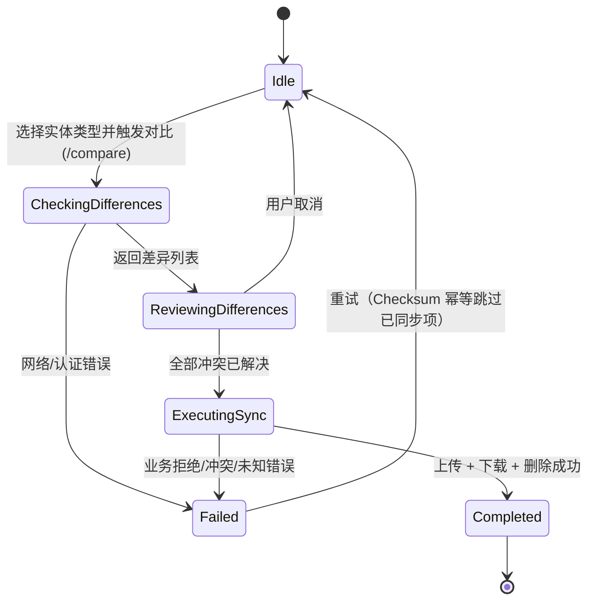

# 数据同步 (Sync)

> 版本: v2.0 | 日期: 2026-06-15 | 状态: 重建

## 模块概述

数据同步是双模式架构（远程 SQL Server + 本地 LocalDB）闭环的关键：医生外出看诊离线产生数据，返回诊所后将本地变更可靠回传到服务端，并下载服务端最新数据。本模块基于 SHA256 Checksum 比对差异，支持冲突逐条人工解决，覆盖 4 类实体（Herb / Patient / Formula / MedicalCase）。

同步本质上为本地 Desktop ↔ 远程 Server 的双向操作；本地模式下本模块自身不适用（需联网）。

## 业务规则

1. **5 阶段工作流**：`Idle → CheckingDifferences → ReviewingDifferences → ExecutingSync → Completed/Failed`（见下图）。
2. **差异检测**：基于 SHA256 `ChecksumHelper` 比对，差异类型 `LocalOnly` / `ServerOnly` / `Modified` / `Identical`。
3. **冲突解决**：逐项 `UseLocal` / `UseServer` / `Skip`；**所有冲突必须解决后才能执行同步**，绝不自动覆盖。
4. **错误分类**：`TransientNetwork`、`AuthExpired`、`BusinessReject`、`ConflictChanged`、`Unknown`；仅前 3 类启用重试。
5. **前置条件**：`SessionManager.IsAuthenticated` 且 `IApiHealthCheckService.CheckHealthAsync` 通过。
6. **删除引用检查**：服务端拒绝存在外键引用的删除（返回拒绝原因）。
7. **支持实体（4）**：Herb、Patient、Formula、MedicalCase（聚合级，含 Consultation + Prescription + Items）。
8. **SYNC-D01**：仅 `Completed` 医案参与同步（Active/Suspended 生命周期应在单一模式内闭合）；模式切换前强制本地无未完成医案。
9. **幂等性**：Checksum 一致的数据在重试时自动跳过，不重复传输。

## 5 阶段工作流

## 用户故事

### US-SYNC-001: 查询支持的同步实体类型

**角色**: 医生 / 管理员
**优先级**: Must
**状态**: ✅ 已实现

**作为** 医生，**我想要** 查询系统支持同步的实体类型列表，**以便** 知道哪些数据可在本地与服务端之间同步。

**验收标准**:
- [ ] 请求返回 `["Herb","Patient","Formula","MedicalCase"]`
- [ ] 端点受 `DoctorOrAdmin` 策略保护

**业务规则**:
1. 支持类型固定为 4 类：药材、患者、验方、医案（聚合）。
2. 返回实体类型名称列表，供客户端 UI 渲染选择项。

**双模式**:
| 模式 | 行为 |
|------|------|
| 远程 | `GET /api/v1/Sync/entity-types` |
| 本地 | 不适用（本功能需联网） |

**实现参考**: `src/Server/Services/LYBT.WebAPI/Controllers/SyncController.cs:20`、`ISyncService`

---

### US-SYNC-002: 获取实体元数据

**角色**: 医生
**优先级**: Must
**状态**: ✅ 已实现

**作为** 医生，**我想要** 获取指定实体类型在服务端的元数据（ID + Checksum + 修改时间），**以便** 客户端与本地数据进行差异比对。

**验收标准**:
- [ ] 返回每条记录的 `EntityId`、`Checksum`(SHA256)、`LastModifiedAt`、`IsDeleted`、`EntityName`
- [ ] 实体字段变更 → Checksum 值变化
- [ ] 元数据列表包含 `IsDeleted=true` 的记录（用于同步删除）

**业务规则**:
1. 元数据用于客户端本地比对，不含完整实体数据。
2. Checksum = SHA256(JSON(业务字段))，排除审计字段（Id/CreatedAt/UpdatedAt/IsDeleted）。
3. `ChangedFields` 变更字段检测当前未填充（延期），Checksum 比对已足够识别差异存在。

**双模式**:
| 模式 | 行为 |
|------|------|
| 远程 | `GET /api/v1/Sync/metadata?entityType=` |
| 本地 | 不适用 |

**实现参考**: `SyncController.cs:20`、`ISyncRepository`、`ChecksumHelper`

---

### US-SYNC-003: 对比本地与服务端差异（Checksum）

**角色**: 医生
**优先级**: Must
**状态**: ✅ 已实现

**作为** 医生，**我想要** 比较本地与服务端数据的差异，**以便** 清楚知道哪些数据需要同步、哪些存在冲突。

**验收标准**:
- [ ] 比对结果包含 `LocalOnly` / `ServerOnly` / `Modified` 分类
- [ ] Checksum 一致 → 差异类型 `Identical`
- [ ] 返回 `ServerTotalCount` 与 `ComparedAt`

**业务规则**:
1. 客户端发送本地元数据列表，服务端比对后返回 `SyncCompareResultDto`。
2. `SyncDiffDto` 含：`EntityType`、`EntityId`、`DiffType`、`EntityName`、`LocalChecksum`、`ServerChecksum`、修改时间。
3. MedicalCase 为聚合级 Checksum（合并 MedicalCase + Consultation + Prescription + Items 业务字段）。

**双模式**:
| 模式 | 行为 |
|------|------|
| 远程 | `POST /api/v1/Sync/compare` |
| 本地 | 不适用 |

**实现参考**: `SyncController.cs`（`/compare`）、`SyncViewModel.cs:21`（`CheckingDifferences` 阶段）

---

### US-SYNC-004: 上传本地独有实体

**角色**: 医生
**优先级**: Must
**状态**: ✅ 已实现

**作为** 医生，**我想要** 将本地数据上传到服务端，**以便** 外出看诊期间产生的数据汇入诊所统一数据库。

**验收标准**:
- [ ] 上传 `LocalOnly` 数据 → 服务端新增该记录
- [ ] 数据已存在且 `OverwriteConflicts=false` → 返回 `IsConflict=true`
- [ ] 部分失败不影响其他记录，返回逐项结果
- [ ] 返回 `SuccessCount` / `ConflictCount` / 逐项 `Items`

**业务规则**:
1. 序列化为 JSON 传输。
2. 支持覆盖冲突选项 `OverwriteConflicts`。
3. MedicalCase 上传为聚合级原子事务：整聚合作为单一 JSON，任一部分失败整体回滚。
4. 服务端校验引用完整性：`PatientId`/`HerbId` 不存在则拒绝（`ERR-70301/70302`）。
5. 仅 `Completed` 医案可上传（SYNC-D01）。

**双模式**:
| 模式 | 行为 |
|------|------|
| 远程 | `POST /api/v1/Sync/upload` |
| 本地 | 不适用 |

**实现参考**: `SyncController.cs`（`/upload`）、`SyncUploadResultDto`

---

### US-SYNC-005: 下载服务端独有实体

**角色**: 医生
**优先级**: Must
**状态**: ✅ 已实现

**作为** 医生，**我想要** 从服务端下载数据到本地，**以便** 本地设备拥有最新的药材/患者/验方数据用于离线工作。

**验收标准**:
- [ ] 下载 `ServerOnly` 数据 → 本地 LocalDB 新增该记录
- [ ] 按实体 ID 列表下载，返回 JSON 实体数据
- [ ] 客户端负责保存到本地 LocalDB

**业务规则**:
1. 客户端发送待下载的 `EntityId` 列表。
2. 服务端返回完整实体 JSON。
3. MedicalCase 下载同样为聚合级（含子实体）。

**双模式**:
| 模式 | 行为 |
|------|------|
| 远程 | `POST /api/v1/Sync/download` |
| 本地 | 不适用 |

**实现参考**: `SyncController.cs`（`/download`）、`SyncDownloadResultDto`

---

### US-SYNC-006: 同步删除（引用检查）

**角色**: 管理员
**优先级**: Must
**状态**: ✅ 已实现

**作为** 管理员，**我想要** 将本地软删除操作同步到服务端，**以便** 两端删除状态一致。

**验收标准**:
- [ ] 药材被处方引用 → 拒绝，返回原因"药材被 N 个处方引用"
- [ ] 患者有关联医案 → 拒绝并返回引用计数
- [ ] 返回成功 ID 列表与被拒绝项列表

**业务规则**:
1. 删除前进行引用检查（FK 约束）。
2. 有引用的实体被拒绝，返回具体拒绝原因字符串。
3. 仅同步 `IsDeleted=true` 标记（软删除）。
4. 实体不存在或已删除 → `ERR-70404`。

**双模式**:
| 模式 | 行为 |
|------|------|
| 远程 | `POST /api/v1/Sync/delete` |
| 本地 | 不适用 |

**实现参考**: `SyncController.cs`（`/delete`）、`SyncDeleteResultDto`

---

### US-SYNC-007: 冲突解决（逐项 UseLocal/Server/Skip）

**角色**: 医生
**优先级**: Must
**状态**: ✅ 已实现

**作为** 医生，**我想要** 对每条冲突数据明确选择保留本地版本/使用服务端版本/跳过，**以便** 医疗数据绝不被自动覆盖，冲突由人工裁决。

**验收标准**:
- [ ] `Modified` 差异项进入冲突解决 UI（左右对比）
- [ ] 选择"使用本地版本" → 上传覆盖服务端（`OverwriteConflicts=true`）
- [ ] 选择"使用服务端版本" → 下载覆盖本地
- [ ] 选择"跳过" → 该项本次不同步
- [ ] 所有冲突解决前 `CanExecute=false`

**业务规则**:
1. 冲突解决方式：`UseLocal` / `UseServer` / `Skip`，逐项处理。
2. 选择模型：`IsSelected` 标记；computed counts 驱动 `CanExecute`。
3. 多条冲突逐条解决，显示进度（如"1/3"）。
4. `SyncConflictDetailDto`（字段级左右对比）当前延期，冲突对话框展示 Checksum 信息。

**双模式**:
| 模式 | 行为 |
|------|------|
| 远程 | 客户端 UI 协调上传/下载 API |
| 本地 | 不适用 |

**实现参考**: `src/Client/Desktop/Modules/LYBT.Desktop.Sync/ViewModels/SyncViewModel.cs:21`（`ReviewingDifferences` 阶段）、`SyncPhase.cs:7`

---

### US-SYNC-008: 错误分类与重试（Transient/Conflict/Auth）

**角色**: 医生
**优先级**: Should
**状态**: ✅ 已实现

**作为** 医生，**我想要** 同步失败时系统按错误类型分类并提示是否可重试，**以便** 临时网络问题可快速重试，而认证过期能引导我重新登录。

**验收标准**:
- [ ] `TransientNetwork` / `AuthExpired` / `BusinessReject` → 启用"重试"按钮
- [ ] `ConflictChanged` / `Unknown` → 不启用重试，提示重新检查差异
- [ ] 重试时已同步项通过 Checksum 幂等跳过
- [ ] 网络中断 → 显示错误摘要 + "重新同步"按钮

**业务规则**:
1. 错误分类枚举：`TransientNetwork`、`AuthExpired`、`BusinessReject`、`ConflictChanged`、`Unknown`。
2. 仅前 3 类（瞬时网络/认证过期/业务拒绝）允许重试。
3. 失败恢复策略：重新开始；Checksum 一致性保证已同步数据不重复传输。
4. 前置检查失败（网络不可用/Token 过期）→ 提示用户并阻止进入对比阶段。

**双模式**:
| 模式 | 行为 |
|------|------|
| 远程 | 客户端按错误分类决定重试/引导重登录 |
| 本地 | 不适用 |

**实现参考**: `SyncViewModel.cs`（错误分类逻辑）、`SyncPhase.cs:7`（`Failed → Idle` 重试路径）

---

## 依赖

| 依赖 | 说明 |
|------|------|
| [02-auth.md](02-auth.md) | 同步前置：`SessionManager.IsAuthenticated` + Token 有效性 |
| [07-medical-cases.md](07-medical-cases.md) | MedicalCase 聚合级同步、SYNC-D01 仅 Completed |
| [11-platform.md](11-platform.md#health-diagnostics) | `IApiHealthCheckService.CheckHealthAsync` 前置检查 |
