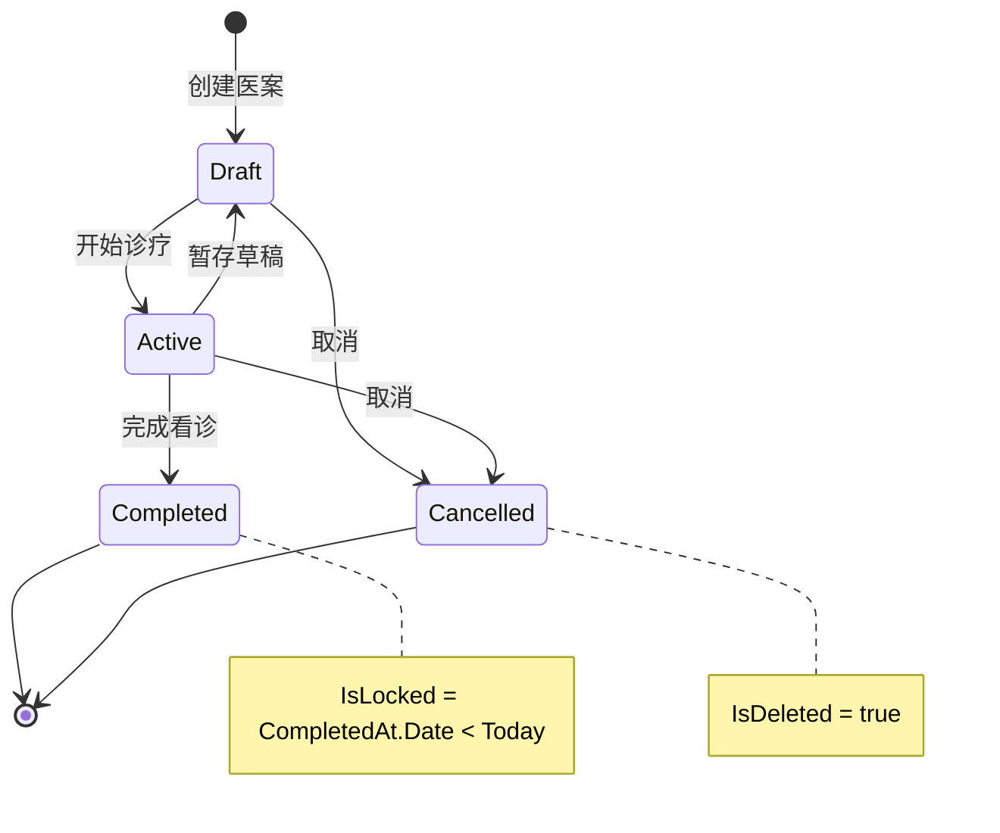

# 医案管理 需求规格

## 概述

医案管理是系统的核心模块。MedicalCase 是唯一聚合根 (DDD)，包含诊断 (Consultation, 1:1) 和处方 (Prescription, 1:0..1) 作为内部实体。实现完整的诊疗流程: 创建医案 → 填写诊断 → 标记处方需求 → 开具处方 → 完成医案。采用 CQRS 模式分离读写操作。

---

## 用户角色

| 角色 | 在本模块中的操作权限 |
|------|---------------------|
| SuperAdmin | 查看/编辑全部医案，无时间限制 |
| Admin | 查看/编辑全部医案，无时间限制 |
| Doctor | 创建医案；查看/编辑自己的未完成医案 |
| Receptionist | 查看未完成医案简要提示 (创建时间 + 主治医生，不含诊断/处方详情) |

> 创建/编辑/完成/取消等写操作受 `DoctorOrAdmin` 策略保护。创建医案仅 Doctor: `[Authorize(Roles = "Doctor")]`。Receptionist 仅可访问简要提示端点。

---

## 功能清单

### FR-MC-001: 创建医案

- **描述**: 为患者创建新的诊疗记录 (MedicalCase 聚合根)
- **业务规则**:
  1. PatientId 必填，UserId (医生ID) 必填
  2. 仅 Doctor 可创建
  3. 初始状态为 Draft
  4. 自动创建 Consultation (1:1 共享主键)
  5. 自动生成医案编号 (格式: MC20260210001)
  6. 冗余存储 PatientName 和 DoctorName (读优化)
  7. **患者状态检查**: Patient.Status 必须为 Enabled，禁用患者不可创建医案 (ERR-30105)
  8. **患者选择列表过滤**: 创建医案的患者选择界面仅展示 Status=Enabled 的患者 (禁用患者不出现在候选列表中)
- **远程模式**: POST `/api/v1/medicalcases`
- **本地模式**: DataSource 本地存储
- **验收标准**:
  - [ ] Admin 角色调用 POST -> 返回 403 (仅 Doctor 可创建)
  - [ ] 创建医案成功 -> Consultation 实体自动创建 (共享主键)

### FR-MC-002: 填写诊断

- **描述**: 填写中医诊断信息 (Consultation)
- **业务规则**:
  1. 中医辨证 (TcmDiagnosis) 必填
  2. 现病史 (PresentIllness)、舌诊 (TongueDiagnosis)、脉诊 (PulseDiagnosis) 可选
  3. 通过聚合保存 (PUT /{id}) 更新
- **远程模式**: PUT `/api/v1/medicalcases/{id}` (聚合保存，含 Consultation)
- **本地模式**: 本地更新
- **验收标准**:
  - [ ] TcmDiagnosis 为空时完成医案 -> 返回 422

### FR-MC-003: 标记处方需求

- **描述**: 标记本次诊疗是否需要开具处方
- **业务规则**:
  1. NeedsPrescription: true (需要) / false (不需要) / null (未决策)
  2. 设为 false 时，如已有处方则清除
  3. 设为 true 时，允许创建/编辑处方
- **远程模式**: PUT `/api/v1/medicalcases/{id}/prescription-flag`
- **本地模式**: 本地标记
- **验收标准**:
  - [ ] NeedsPrescription=false -> 已有 Prescription 被清除
  - [ ] NeedsPrescription=true -> 允许创建 Prescription

### FR-MC-004: 开具处方

- **描述**: 为医案创建处方，包含药材列表
- **业务规则**:
  1. 至少包含 1 个处方项 (PrescriptionItem)
  2. DosageCount (帖数) 范围 1-100，默认 7
  3. Discount (折扣) 范围 0-1，默认 1.0
  4. 处方编号自动生成 (格式: RX-YYYYMMDD-NNNN)
  5. 每个处方项: HerbId + HerbName + Dosage + UnitPrice + DecocteMethod
  6. 小计金额 = UnitPrice x Dosage (自动计算)
  7. 单剂价格 (SingleDosePrice) = SUM(所有 Items.Amount)，即一剂所有药材小计之和
  8. 总价 (TotalPrice) = SingleDosePrice x DosageCount x Discount
  9. 折扣 (Discount) 语义: 1.0 = 无折扣, 0.9 = 九折, 0.85 = 八五折
- **远程模式**: PUT `/api/v1/medicalcases/{id}` (聚合保存，含 Prescription + Items)
- **本地模式**: 本地存储
- **验收标准**:
  - [ ] 处方 Items 为空 -> 返回 400 验证失败
  - [ ] UnitPrice=10, Dosage=15 -> Amount=150
  - [ ] 3 味药 Amount 分别为 100/150/200, DosageCount=7, Discount=0.9 -> SingleDosePrice=450, TotalPrice=450x7x0.9=2835

### FR-MC-005: 聚合保存

- **描述**: 一次性保存医案的诊断和处方信息
- **业务规则**:
  1. 聚合根整体保存 (MedicalCase + Consultation + Prescription + Items)
  2. 权限检查: Doctor 只能保存自己的
  3. 编辑已完成/隔天/非本人医案需要提供 EditReason
  4. 处方药材采用粗粒度替换策略 (完整替换 Items 集合)
  5. 记录审计日志
  6. **打印保护**: 若 `MedicalCase.IsPrinted=true` 且请求包含 Consultation 或 Prescription 内容变更，则 EditReason 必填 (ERR-30403)。修改成功后: `MedicalCase.IsPrinted=false`、`MedicalCase.PrintVersion++` (需重新打印)
- **远程模式**: PUT `/api/v1/medicalcases/{id}`
- **本地模式**: 本地保存
- **验收标准**:
  - [ ] 编辑锁定医案未提供 EditReason -> 返回 422
  - [ ] 更新处方 Items -> 原有 Items 全部替换为新列表

### FR-MC-006: 暂存草稿

- **描述**: 保存当前进度为草稿，可稍后继续
- **业务规则**:
  1. 状态设为 Draft
  2. 保存当前诊断数据
  3. 不要求数据完整性 (TcmDiagnosis 可空)
- **远程模式**: PUT `/api/v1/medicalcases/{id}/draft`
- **本地模式**: 本地暂存
- **验收标准**:
  - [ ] 暂存成功 -> 状态=Draft，可继续编辑
  - [ ] TcmDiagnosis 为空 -> 暂存成功 (不验证)

### FR-MC-007: 完成医案

- **描述**: 标记医案为已完成，锁定编辑
- **业务规则**:
  1. 状态设为 Completed
  2. 记录 CompletedAt 时间
  3. 完成后当天内可编辑，隔天锁定
  4. 锁定后编辑需要 Admin 权限 + 修改原因
- **远程模式**: PUT `/api/v1/medicalcases/{id}/close`
- **本地模式**: 本地完成
- **验收标准**:
  - [ ] 完成医案 -> CompletedAt 记录当前时间
  - [ ] CompletedAt.Date < Today -> IsLocked=true

### FR-MC-008: 取消医案

- **描述**: 取消本次诊疗，数据保留但不可编辑
- **业务规则**:
  1. 状态设为 Cancelled (通过 IsDeleted=true 软删除)
  2. 取消前自动保存诊断数据
  3. 保存失败不阻止取消
  4. 非当天本人取消需要审计理由
  5. 需要用户确认 ("确定要取消?")
- **远程模式**: PUT `/api/v1/medicalcases/{id}/cancel`
- **本地模式**: 本地取消
- **验收标准**:
  - [ ] 取消后 -> IsDeleted=true，医案不可再编辑
  - [ ] 取消后 -> 诊断/处方数据保留在数据库中

### FR-MC-009: 医案列表查询

- **描述**: 分页查看医案列表，支持多种筛选条件
- **业务规则**:
  1. 支持按状态、患者、关键词筛选
  2. Admin 查看全部，Doctor 仅查看自己的
  3. 默认分页: page=1, pageSize=20
  4. 统一查询端点支持多种 QueryType
  5. 排序规则: CreatedAt DESC (最新优先)
- **远程模式**: GET `/api/v1/medicalcases?status=&patientId=&keyword=&page=&pageSize=` 或 GET `/api/v1/medicalcases/query`
- **本地模式**: 本地查询
- **验收标准**:
  - [ ] Doctor 查询 -> 仅返回 UserId=自己的医案
  - [ ] status=Completed -> 仅返回已完成医案

### FR-MC-010: 跨医案搜索

- **描述**: 全文搜索医案内容 (患者名/诊断关键词)
- **业务规则**:
  1. 支持按患者姓名搜索
  2. 支持按诊断关键词搜索 (TcmDiagnosis)
  3. 支持日期范围筛选
  4. 返回完整 MedicalCaseDetailDto (含嵌套数据)
- **远程模式**: GET `/api/v1/medicalcases/search?patientName=&diagnosisKeyword=&startDate=&endDate=`
- **本地模式**: 本地搜索
- **验收标准**:
  - [ ] diagnosisKeyword="风寒" -> 返回 TcmDiagnosis 含"风寒"的医案

### FR-MC-011: 编辑模式

- **描述**: 工作区模式 (Clinical/Management) 和编辑状态 (Editing/ReadOnly) 的管理
- **业务规则**:
  1. Clinical 模式: 从患者选择进入，默认 Editing，返回患者选择页
  2. Management 模式: 从医案列表进入，默认 ReadOnly，返回医案列表页
  3. 保存后状态切换为 ReadOnly，留在当前界面
  4. Management 模式未保存修改弹窗确认 (保存/放弃/取消)
  5. Clinical 模式底部按钮: [暂存医案] [打印处方笺] [完成看诊]
  6. Management 模式底部按钮: [打印处方笺] [保存医案] 或 [编辑医案]
- **远程模式**: 客户端 UI 逻辑
- **本地模式**: 同远程模式
- **验收标准**:
  - [ ] Clinical 模式默认 Editing，Management 模式默认 ReadOnly
  - [ ] Clinical: [暂存][打印][完成]，Management: [打印][保存] 或 [编辑]

### FR-MC-012: 审计日志

- **描述**: 记录医案所有变更的完整审计历史，MedicalCaseAuditService 自动检测字段级变更并记录前后值
- **业务规则**:
  1. 记录操作人 (ID/姓名/角色)、操作类型、变更字段、前后值
  2. 操作类型: Create/Update/StatusChange/SoftDelete/Cancel
  3. 修改原因: 历史医案修改时必填
  4. 支持分页查看审计日志
  5. 变更字段和值以 JSON 格式存储 (CamelCase)
  6. 创建操作: 仅记录 NewValues (无 OldValues)
  7. 更新操作: 自动比较前后值，仅记录实际变更的字段
  8. 删除操作: 记录 IsDeleted=true 变更
  9. 审计记录写入失败不影响主业务流程 (异常隔离)
- **远程模式**: GET `/api/v1/medicalcases/{id}/audit-logs?page=&pageSize=`
- **本地模式**: 不支持完整审计日志。仅保留实体级审计字段 (CreatedAt/UpdatedAt/CreatedBy/UpdatedBy)
- **数据模型 (MedicalCaseAuditLog)**:

| 字段 | 类型 | 约束 | 说明 |
|------|------|------|------|
| Id | Guid | PK | 主键 |
| MedicalCaseId | Guid | FK, Required | 关联医案 |
| OperatorId | Guid | Required | 操作者 ID |
| OperatorName | string | Required, MaxLength(100) | 操作者姓名 |
| OperatorRole | string | Required, MaxLength(50) | 操作者角色 |
| OperationType | string | Required, MaxLength(20) | Create/Update/Delete |
| ChangedFields | string? | JSON | 变更字段列表 `["PatientId","CaseStatus"]` |
| OldValues | string? | JSON | 变更前值 `{"PatientId":"guid1"}` |
| NewValues | string? | JSON | 变更后值 `{"PatientId":"guid2"}` |
| Reason | string? | MaxLength(500) | 操作原因 (历史医案修改时必填) |
| CreatedAt | DateTime | Default=UtcNow | 审计记录时间 |

- **验收标准**:
  - [ ] Create -> 生成 MedicalCaseAuditLog，OperationType="Create"，OldValues 为空
  - [ ] Update/StatusChange -> ChangedFields 仅包含实际变更的字段
  - [ ] 提供 EditReason -> AuditLog.Reason 字段包含该值
  - [ ] 审计写入异常 -> 主业务保存成功，仅记录 Error 日志

> **交叉引用**: 安全审计日志 (SecurityAuditLog) 见 [logging.md](logging.md) FR-LOG-002；日志保留策略见 [nfr.md](nfr.md) NFR-SEC-005。

### FR-MC-013: 权限控制

- **描述**: 基于角色和资源的细粒度权限检查
- **业务规则**:
  1. Doctor: 只能编辑自己创建的未完成 (Draft/Active) 医案
  2. Admin/SuperAdmin: 可编辑所有医案
  3. 编辑已完成医案: 需提供修改原因
  4. 隔天编辑: 需提供修改原因
  5. 非本人编辑: 需提供修改原因
  6. 权限查询端点返回 CanEdit/CanDelete/RequiresEditReason/DenialReason
- **远程模式**: GET `/api/v1/medicalcases/{id}/permissions`，返回 MedicalCasePermissionDto
- **本地模式**: 本地权限检查
- **验收标准**:
  - [ ] Doctor 编辑 UserId!=自己的医案 -> 返回 403
  - [ ] GET permissions -> 返回 CanEdit/CanDelete/RequiresEditReason/DenialReason

### FR-MC-014: 锁定规则

- **描述**: 已完成且非当天的医案自动锁定
- **业务规则**:
  1. 锁定条件: `IsLocked = IsCompleted && (CompletedAt.Date < Today)`
  2. 锁定后 Doctor 不可编辑
  3. 锁定后 Admin 编辑需提供修改原因
- **远程模式**: 服务端权限检查
- **本地模式**: 本地检查
- **验收标准**:
  - [ ] CompletedAt.Date == Today -> IsLocked=false
  - [ ] CompletedAt.Date < Today -> IsLocked=true, Doctor 不可编辑

### FR-MC-015: 打印触发

- **描述**: 触发医案内容打印，管理打印版本和打印保护。打印为 MedicalCase 聚合根的能力，v1.0 支持处方打印 (PrintType=Prescription)
- **业务规则**:
  1. 打印操作设置 `MedicalCase.IsPrinted=true`，`Prescription.PrintCount++`，`Prescription.LastPrintedAt=now`
  2. 打印后修改任何内容 (Consultation 或 Prescription) 需提供 EditReason (MC-D15)
  3. 修改成功后: `MedicalCase.IsPrinted=false`，`MedicalCase.PrintVersion++` (标记需重新打印)
  4. 每次打印记录 MedicalCasePrintLog，含当前 `MedicalCase.PrintVersion` 和 PrintType
  5. 打印模板为 A5 纸张，详见 [printing.md](printing.md)
- **远程模式**: 客户端打印 + 服务端记录日志
- **本地模式**: 本地打印
- **验收标准**:
  - [ ] 打印操作 -> MedicalCase.IsPrinted=true, Prescription.PrintCount += 1
  - [ ] IsPrinted=true 时修改 Consultation -> 需提供 EditReason，修改后 IsPrinted=false, MedicalCase.PrintVersion++
  - [ ] IsPrinted=true 时修改 Prescription -> 需提供 EditReason，修改后 IsPrinted=false, MedicalCase.PrintVersion++
  - [ ] 打印操作 -> 生成 MedicalCasePrintLog (PrintType=Prescription, PrintVersion=当前版本)

### FR-MC-016: 验方导入到处方

- **描述**: 将经验方模板导入为处方药材
- **业务规则**:
  1. 从验方列表选择导入
  2. **仅展示 ValidationStatus=Validated 且 Status=Enabled 的验方** (MC-D08)
  3. 导入验方的药材组成到处方 Items
  4. 价格从药材库实时获取
  5. 记录引用的验方名称 (ReferencedFormulas)
  6. **已禁用药材 (Status=Disabled) 自动跳过，提示"以下药材已停用，已跳过: xxx"** (MC-D09)
  7. **导入为数据复制，修改处方中的药材不影响原验方** (MC-D12)
- **远程模式**: 客户端操作，药材价格从 API 获取
- **本地模式**: 从本地药材库获取价格
- **验收标准**:
  - [ ] 验方导入列表 -> 仅展示 ValidationStatus=Validated 且 Status=Enabled 的验方
  - [ ] 选择验方导入 -> 处方 Items 包含验方所有启用药材
  - [ ] 导入时 -> UnitPrice 从药材库当前价格获取
  - [ ] 验方含已禁用药材 -> 跳过禁用药材 + 弹出提示

### FR-MC-017: 待诊队列

- **描述**: 显示当前医生的待看诊患者列表
- **业务规则**:
  1. 筛选状态为 Draft 或 Active 的医案
  2. 排序规则: CreatedAt ASC (先到先看)
  3. 显示患者姓名、创建时间
  4. 支持按患者 ID 过滤
- **远程模式**: GET `/api/v1/medicalcases/pending?doctorId=&patientId=`
- **本地模式**: 本地查询
- **验收标准**:
  - [ ] 查询待诊队列 -> 仅返回 CaseStatus=Draft 或 Active 的医案

### FR-MC-018: 复制历史处方

- **描述**: 从患者历史医案中复制处方到当前新医案，支持复诊场景下的快速开方
- **业务规则**:
  1. 仅可从同一患者的已完成 (Completed) 医案中复制处方
  2. 展示该患者的历史医案列表 (含处方摘要)，按 CreatedAt DESC 排序
  3. 选择历史医案后，预览处方药材列表 (药名、剂量、煎法)
  4. 确认后复制药材列表到当前医案的处方 Items
  5. **价格从药材库实时获取** (与 FR-MC-016 验方导入保持一致)，不使用历史快照价格 (MC-D13)
  6. **已禁用药材 (Status=Disabled) 自动跳过，提示"以下药材已停用，已跳过: xxx"** (复用 MC-D09 规则)
  7. **复制为数据副本，修改不影响源处方** (复用 MC-D12 规则)
  8. DosageCount 和 Discount 从历史处方复制，医生可修改
  9. Usage (用法) 和 Advice (医嘱) 从历史处方复制
  10. 记录引用来源: ReferencedFormulas 追加 "复制自医案 {CaseNumber}"
- **远程模式**: 客户端操作，药材价格从 API 获取，历史医案列表通过 GET `/api/v1/medicalcases?patientId={id}&status=Completed` 查询
- **本地模式**: 从本地药材库获取价格，本地查询历史医案
- **验收标准**:
  - [ ] 历史医案列表 -> 仅展示同一患者的 Completed 医案
  - [ ] 选择历史医案 -> 预览处方药材 (药名/剂量/煎法)
  - [ ] 确认复制 -> 当前处方 Items 包含历史处方所有启用药材
  - [ ] 复制时 -> UnitPrice 从药材库当前价格获取，非历史价格
  - [ ] 历史处方含已禁用药材 -> 跳过禁用药材 + 弹出提示
  - [ ] 修改复制后的处方 -> 不影响源历史处方

---

## 状态机



| 状态 | 值 | 说明 | 允许操作 |
|------|-----|------|----------|
| Draft | 0 | 暂存 | 编辑、转 Active、取消 |
| Active | 1 | 进行中 | 编辑、暂存、完成、取消 |
| Completed | 2 | 已完成 | 查看 (Admin 可编辑需理由) |
| Cancelled | 3 | 已取消 | 无 |

---

## 数据模型

### MedicalCase (医案 -- 聚合根)

| 字段 | 类型 | 约束 | 说明 |
|------|------|------|------|
| Id | Guid | PK | 医案ID |
| PatientId | Guid | FK, Required | 患者ID |
| PatientName | string(50) | Required | 患者姓名 (创建时快照，后续改名不影响历史医案) |
| UserId | Guid | Required | 主治医生ID |
| DoctorName | string(50) | Required | 医生姓名 (创建时快照，后续改名不影响历史医案) |
| CaseNumber | string(50)? | - | 医案编号 |
| CaseStatus | MedicalCaseStatus | Required | 业务状态 |
| NeedsPrescription | bool? | - | 是否需要处方 |
| CompletedAt | DateTime? | - | 完成时间 |
| Remark | string(500)? | - | 备注 |
| IsPrinted | bool | Default: false | 是否已打印 (聚合根级打印保护，打印后任何内容修改需提供 EditReason) |
| PrintVersion | int | Default: 1 | 打印版本号 (内容变更时递增，用于打印溯源) |
| Consultation | Consultation? | 1:1 | 诊断记录 (共享主键) |
| Prescription | Prescription? | 1:0..1 | 处方 (可选) |

> 计算属性: IsLocked, IsActive, IsCompleted, HasPrescription

### Consultation (诊断 -- 内部实体)

| 字段 | 类型 | 约束 | 说明 |
|------|------|------|------|
| Id | Guid | PK (= MedicalCase.Id) | 诊断ID (共享主键) |
| PresentIllness | string(2000)? | - | 现病史 |
| TongueDiagnosis | string(500)? | - | 舌诊 |
| PulseDiagnosis | string(500)? | - | 脉诊 |
| TcmDiagnosis | string(500)? | 完成时必填 | 中医辨证 |

### Prescription (处方 -- 内部实体)

| 字段 | 类型 | 约束 | 说明 |
|------|------|------|------|
| Id | Guid | PK | 处方ID |
| MedicalCaseId | Guid | FK | 医案ID |
| PrescriptionNumber | string(20)? | - | 处方编号 (RX-YYYYMMDD-NNNN) |
| DosageCount | int | Default: 7 | 帖数 |
| Discount | decimal(5,4) | Default: 1.0 | 折扣 |
| Usage | string(500)? | - | 用法 |
| Advice | string(500)? | - | 医嘱 |
| ReferencedFormulas | string(1000)? | - | 引用来源 (JSON 数组，见下方格式) |
| PrintCount | int | Default: 0 | 打印次数 (处方专属统计) |
| LastPrintedAt | DateTime? | - | 最后打印时间 (处方专属统计) |
| Items | ICollection | 导航 | 处方项列表 |

> **ReferencedFormulas 格式**: JSON 数组，记录处方药材的导入来源，用于审计追溯。验方/历史处方被删除后不清除记录 (导入为数据复制，无强关联)。
> ```json
> [
>   {"type": "formula", "id": "uuid-1", "name": "四君子汤", "importedAt": "2026-02-15T10:00:00"},
>   {"type": "history", "id": "uuid-2", "name": "复制自医案 MC20260210001", "importedAt": "2026-02-18T09:30:00"}
> ]
> ```

### PrescriptionItem (处方项)

| 字段 | 类型 | 约束 | 说明 |
|------|------|------|------|
| Id | Guid | PK | 项ID |
| PrescriptionId | Guid | FK | 处方ID |
| HerbId | Guid | FK | 药材ID |
| HerbName | string(100) | Required | 药材名称 |
| Dosage | int | Required | 剂量 (数值部分，单位由 Unit 指定) |
| Unit | string(16) | Required | 单位 (克/g/ml/条/粒 等) |
| DecocteMethod | DecocteMethod | Default: Normal | 煎法 (见下方枚举定义) |
| UnitPrice | decimal(18,2) | Required | 单价 (元/单位，如 元/克) |
| Usage | string(200)? | - | 特殊用法 |
| Amount | decimal(18,2) | 计算属性 | 小计 (元) = UnitPrice x Dosage |

### DecocteMethod (煎法枚举)

| 值 | 名称 | 说明 | 打印标注 |
|----|------|------|---------|
| Normal (0) | 水煎 | 默认煎法，不单独标注 | (无) |
| DecocteFirst (1) | 先煎 | 矿石/贝壳类，需先煎 20-30 分钟 | 先煎 |
| DecocteLater (2) | 后下 | 芳香类，最后 5-10 分钟下 | 后下 |
| WrapDecoction (3) | 包煎 | 细小种子/绒毛类，纱布包裹煎 | 包煎 |
| SeparateDecoction (4) | 另炖 | 贵重药材，单独炖煮 | 另炖 |
| MeltIn (5) | 烊化 | 胶类药材，热药液中融化 | 烊化 |
| TakeWithDecoction (6) | 冲服 | 粉末/液体类，药液冲服 | 冲服 |

> 打印规则: DecocteMethod=Normal 不标注；其他煎法在药材表格中追加标注列，或在处方笺备注区统一列出 "特殊煎法: 药名1(先煎)、药名2(后下)"。

### MedicalCaseAuditLog (审计日志)

| 字段 | 类型 | 说明 |
|------|------|------|
| MedicalCaseId | Guid | 医案ID (FK) |
| OperatorId | Guid | 操作人ID |
| OperatorName | string(50) | 操作人姓名 |
| OperatorRole | UserRole | 操作人角色 |
| OperationType | AuditOperationType | 操作类型 |
| ChangedFields | string? | 变更字段 (JSON) |
| OldValues | string? | 变更前值 (JSON) |
| NewValues | string? | 变更后值 (JSON) |
| Reason | string(500)? | 修改原因 |

---

## 审计理由判断

| 场景 | 需要修改原因 |
|------|-------------|
| 当天本人修改 Draft/Active 医案 | 不需要 |
| 修改已完成 (Completed) 医案 | 需要 |
| 隔天修改 | 需要 |
| 非本人修改 | 需要 |
| 取消医案 (非当天本人) | 需要 |

预置修改原因选项: 补充遗漏信息 / 更正录入错误 / 患者要求修改 / 医嘱调整

---

## 业务规则

### BR-001: 同一患者单活跃医案约束

- **规则**: 同一患者在同一时间只能有一个 Draft 或 Active 状态的医案
- **触发时机**: 创建医案 (FR-MC-001)
- **碰撞处理**: 当患者已有 Draft/Active 医案时，提示用户选择:
  1. **重开现有医案** - 导航到已有的 Draft/Active 医案继续编辑
  2. **关闭旧的后新建** - 将已有医案软删除 (Cancelled)，然后创建新医案
  3. **取消操作** - 放弃创建
- **技术实现**: 代码层检查 + DB 唯一索引 (仅 Active 状态)

### BR-002: 医案离开界面操作

- **规则**: 离开医案编辑界面时，必须选择一种处置方式
- **处置选项**:
  1. **挂起** - 状态设为 Draft，数据保存，稍后可继续
  2. **关闭** - 执行软删除 (IsDeleted=true, CaseStatus=Cancelled)
  3. **完成** - 状态设为 Completed，需通过完成校验 (BR-003)
- **异常状态** (崩溃/断网/强制关闭): 统一按挂起处理，医案保持当前状态

### BR-003: 医案完成校验规则

- **规则**: 完成医案 (FR-MC-007) 时必须通过以下校验
- **校验项**:

| 校验项 | 条件 | 错误消息 |
|--------|------|----------|
| 中医辨证 | TcmDiagnosis 非空 | 请填写中医辨证 |
| 处方需求标记 | NeedsPrescription 非 null | 请先标记是否需要开处方 |
| 处方存在性 | NeedsPrescription=true 时 Prescription 非 null | 已标记需要开处方，但处方不存在 |
| 处方药材 | NeedsPrescription=true 时 Items.Count > 0 | 处方至少包含一味药材 |
| 处方必填字段 | NeedsPrescription=true 时 DosageCount > 0 | 请填写帖数 |

- **校验时机**: 调用 FR-MC-007 (完成医案) 时服务端统一校验
- **校验失败**: 返回 422，包含所有未通过校验项的错误消息列表

### BR-DEL-001: 统一删除策略

- **适用范围**: 全系统实体删除行为统一规范
- **规则**:
  - **有引用关系** -> 禁止删除，仅可禁用 (Status=Disabled)
  - **无引用关系** -> 允许软删除 (IsDeleted=true)
- **各模块适用**:

| 模块 | 被引用关系 | 删除行为 |
|------|-----------|----------|
| Patients | 被 MedicalCase 引用 | 有医案: 禁止删除 (422)，建议禁用; 无医案: 软删除 |
| Herbs | 被 PrescriptionItem 引用 | 有处方引用: 禁止删除，建议禁用; 无引用: 软删除 |
| Formulas | 无被引用关系 (导入为复制) | 直接软删除 |
| Users | 特殊规则 | 保持现有逻辑 (参见 [users.md](users.md)) |

---

## 错误码

> MedicalCase 模块采用 CQRS + 聚合根模式。异常由全局 IExceptionHandler 统一处理。并发场景使用 3 次重试机制。错误码分区: 3xxxx，编号体系: MCCEE (M=模块3, CC=子类别, EE=序号)。

### 创建医案错误 (301xx)

| 错误码 | 枚举名 | HTTP | 用户消息 | 触发条件 |
|--------|--------|------|----------|----------|
| ERR-30101 | PatientNotFound | 404 | 患者不存在 | PatientRepository 查询失败 |
| ERR-30102 | DoctorNotFound | 404 | 医生不存在 | UserRepository 查询失败 |
| ERR-30103 | ActiveCaseExists | 422 | 该患者已有进行中的医案，请先完成现有医案 | 患者有 Active 状态医案 (BR-001) |
| ERR-30104 | DraftCaseExists | 422 | 该患者已有暂存的医案，请先处理现有医案（继续或关闭） | 患者有 Draft 状态医案 (BR-001) |
| ERR-30105 | PatientDisabled | 422 | 该患者已被禁用，无法创建医案 | Patient.Status=Disabled 时创建医案 |

### 权限错误 (302xx)

| 错误码 | 枚举名 | HTTP | 用户消息 | 触发条件 |
|--------|--------|------|----------|----------|
| ERR-30201 | CannotEditCase | 403 | 无权限编辑此医案 | Doctor 编辑他人医案 / 状态不允许编辑 |
| ERR-30202 | CannotDeleteCase | 403 | 无权限删除此医案 | Doctor 删除他人医案 |
| ERR-30203 | CannotCancelCase | 403 | 无权限取消此医案 | Doctor 取消他人医案 |
| ERR-30204 | CannotDeletePrescription | 403 | 无权限删除此医案的处方 | Doctor 删除他人医案处方 |
| ERR-30205 | CannotSaveDraft | 403 | 无权限编辑此医案 | Doctor 暂存他人医案 |

### 状态转换错误 (303xx)

| 错误码 | 枚举名 | HTTP | 用户消息 | 触发条件 |
|--------|--------|------|----------|----------|
| ERR-30301 | InvalidStatusTransition | 422 | 不允许从{oldStatus}状态转换到{newStatus}状态 | 不符合状态机规则 |
| ERR-30302 | PrescriptionFlagRequired | 422 | 请先标记是否需要开处方 | Complete 时 NeedsPrescription 为 null (BR-003) |
| ERR-30303 | PrescriptionRequired | 422 | 已标记需要开处方，但处方不存在，无法完成医案 | NeedsPrescription=true 但 Prescription 为 null |
| ERR-30304 | CompletedCannotDraft | 422 | 已完成的医案不可暂存 | SaveDraft 时状态为 Completed |
| ERR-30305 | CancelledCannotDraft | 422 | 已取消的医案不可暂存 | SaveDraft 时状态为 Cancelled |
| ERR-30306 | CompletedCannotCancel | 422 | 已完成的医案不可取消 | Cancel 时状态为 Completed |
| ERR-30307 | AlreadyCancelled | 422 | 医案已经是取消状态 | Cancel 时已是 Cancelled |

### 处方错误 (304xx)

| 错误码 | 枚举名 | HTTP | 用户消息 | 触发条件 |
|--------|--------|------|----------|----------|
| ERR-30401 | PrescriptionFlagNotSet | 422 | 未标记需要开处方，请先设置处方需求标记 | NeedsPrescription != true 时创建处方 |
| ERR-30402 | PrescriptionAlreadyExists | 422 | 医案已存在处方，请使用更新接口 | Prescription 已存在且未删除 (AR-003) |
| ERR-30403 | PrintedRequiresReason | 422 | 医案已打印，修改需要提供修改原因 | MedicalCase.IsPrinted=true 且未提供 EditReason 时修改 |
| ERR-30404 | PrintedCannotDelete | 422 | 医案已打印，不允许删除处方 | MedicalCase.IsPrinted=true 时删除处方 |
| ERR-30405 | ConsultationNotFound | 500 | (内部错误) | Consultation 为 null |

### 并发和系统错误 (305xx)

| 错误码 | 枚举名 | HTTP | 用户消息 | 触发条件 |
|--------|--------|------|----------|----------|
| ERR-30501 | PrescriptionCreateRetryFailed | 500 | 创建处方失败，请稍后重试 | DbUpdateConcurrencyException 重试 3 次仍失败 |
| ERR-30502 | SaveRetryFailed | 500 | 保存失败，请稍后重试 | SaveAsync 重试 3 次仍失败 |

### 参数验证错误 (306xx)

| 错误码 | 枚举名 | HTTP | 用户消息 | 触发条件 |
|--------|--------|------|----------|----------|
| ERR-30601 | RequestIdMismatch | 400 | (ValidationFail) | request.Id != 路由 id |
| ERR-30602 | InvalidPagination | 400 | 页码和页大小参数无效（页码>0，页大小1-100） | 分页参数校验失败 ([nfr.md](nfr.md) NFR-API-001) |
| ERR-30603 | BatchQueryExceeded | 400 | 单次最多查询50个医案 | batch-details ids.Count > 50 |
| ERR-30604 | BatchOperationEmpty | 400 | 请至少选择一个医案 | batch-delete ids 为空 |
| ERR-30605 | InvalidPatientId | 400 | (BadRequest) | patientId == Guid.Empty |
| ERR-30606 | InvalidCountParam | 400 | 返回数量参数无效（1-50） | count<=0 或 count>50 |
| ERR-30607 | CaseNotFound | 404 | 医案不存在 | GetByIdAsync 返回 null |

---

## 边界条件 (Round 9 补强)

### 医案生命周期边界

| 场景 | 行为 | 决策编号 |
|------|------|---------|
| 患者被删除 | 有关联医案的患者禁止删除 (返回 422)，仅可禁用。见 [patients.md](patients.md) FR-PAT-005 | MC-D04 |
| 草稿积压 | v1.0 不实现自动清理。BR-001 阻止同一患者多个 Draft/Active，形成天然卡点提醒 | MC-D05 |
| 并发创建重复草稿 | 代码层 BR-001 检查 + DB 唯一索引 (仅 Active)。NFR 1-3 并发用户，并发风险极低，接受现状 | MC-D06 |

### 患者状态联动

| 场景 | 行为 | 决策编号 |
|------|------|---------|
| 禁用患者创建医案 | 禁止: 患者选择列表过滤禁用患者; 接口层返回 422 (ERR-30105) 双重保护 | MC-D16 |
| 禁用患者历史医案查阅 | 允许: 医案列表/搜索 (FR-MC-009/010) 包含禁用患者的医案。PatientName 按角色脱敏: Admin/SuperAdmin 完整显示，Doctor 掩码 (如 "张*") | MC-D16 |
| 有活跃医案的患者禁用 | 禁止禁用，需先完成或取消活跃医案 (见 [patients.md](patients.md) FR-PAT-013) | MC-D16 |

### 处方与药材联动边界

| 场景 | 行为 | 决策编号 |
|------|------|---------|
| 禁用药材在历史处方展示 | 名称后缀标注"(已停用)"，仅可查看不可修改剂量 | MC-D07 |
| 验方导入处方过滤 | 仅展示 ValidationStatus=Validated 的验方，Draft 不出现在导入列表 | MC-D08 |
| 验方含禁用药材导入 | 自动跳过禁用药材 + 弹出提示"以下药材已停用，已跳过: xxx" | MC-D09 |
| 历史处方含禁用药材复制 | 同 MC-D09: 自动跳过 + 弹出提示 | MC-D09 |
| 历史处方药材价格变动 | 使用药材库当前价格，非历史快照。预览时可对比历史价格与当前价格差异 | MC-D13 |

### 并发与锁定

| 场景 | 行为 | 决策编号 |
|------|------|---------|
| 两人同时编辑同一医案 | 乐观并发控制 (RowVersion)。后保存者触发 DbUpdateConcurrencyException，3 次重试后返回 500 | MC-D10 |
| 隔天自动锁定时间点 | 计算属性 `IsLocked = IsCompleted && CompletedAt.Date < Today`，0 点自动生效，无后台任务 | FR-MC-014 |
| 管理员编辑锁定医案 | 无显式解锁接口，管理员直接编辑 (需 EditReason) | FR-MC-013 |
| 打印后修改医案内容 | MedicalCase.IsPrinted=true 时修改 Consultation 或 Prescription 均需 EditReason。修改后 MedicalCase.IsPrinted=false、MedicalCase.PrintVersion++，需重新打印 | MC-D15 |

### 排序规则

| 查询场景 | 排序规则 | 决策编号 |
|----------|---------|---------|
| 医案列表 (FR-MC-009) | CreatedAt DESC (最新优先) | MC-D11 |
| 待诊队列 (FR-MC-017) | CreatedAt ASC (先到先看) | MC-D11 |

---

## 决策记录

| 编号 | 问题 | 影响范围 | 状态 |
|------|------|----------|------|
| 1 | 本地模式下审计日志的存储和同步策略 | FR-MC-012 | 已确定: 仅实体级审计字段。本地模式为单用户操作，字段级变更审计价值有限 |
| 2 | 本地模式下医案编号的生成规则 | FR-MC-001 | 已确定: MC+yyyyMMdd+3位序号。CaseNumber 为展示用编号 (非唯一约束)，Guid Id 为实际唯一标识。同日本地/远程可能重号，不影响数据完整性 |
| 3 | 本地模式下跨医案搜索的性能 | FR-MC-010 | 已确定: 满足需求。诊所场景 (百~千级) SQLite 性能良好，已应用 AsNoTracking + 分页优化 |
| MC-D04 | 患者删除引用检查 | FR-MC-001 + patients.md FR-PAT-005 | 已确定: 有关联医案的患者禁止删除 (422)，仅可禁用 |
| MC-D05 | 草稿自动清理 | FR-MC-006 | 已确定: v1.0 不实现。BR-001 卡点 + 用户手动处理 |
| MC-D06 | DB 唯一索引范围 | FR-MC-001 | 已确定: 仅 Active 唯一索引，接受低概率并发风险 (NFR 1-3 用户) |
| MC-D07 | 禁用药材历史处方展示 | FR-MC-004 | 已确定: 名称后缀"(已停用)"，仅可查看不可修改剂量 |
| MC-D08 | 验方导入处方过滤 | FR-MC-016 | 已确定: 仅展示 Validated 验方，Draft 不出现在导入列表 |
| MC-D09 | 禁用药材导入处理 | FR-MC-016 | 已确定: 跳过禁用药材 + 提示 |
| MC-D10 | 并发编辑策略 | FR-MC-005 | 已确定: 乐观锁 (RowVersion) + 3 次重试，不增加悲观锁 |
| MC-D11 | 排序规则 | FR-MC-009 + FR-MC-017 | 已确定: 列表 CreatedAt DESC，待诊队列 CreatedAt ASC |
| MC-D12 | 验方导入独立性 | FR-MC-016 | 已确定: 导入为数据复制，修改处方中药材的剂量/增减不影响原验方 |
| MC-D13 | 历史处方复制价格策略 | FR-MC-018 | 已确定: 价格从药材库实时获取，与验方导入 (FR-MC-016) 保持一致。历史价格仅作预览参考，不作为新处方定价依据 |
| MC-D14 | 处方总价计算公式 | FR-MC-004 | 已确定: SingleDosePrice = SUM(Items.Amount); TotalPrice = SingleDosePrice x DosageCount x Discount |
| MC-D15 | 打印保护策略 | FR-MC-005 + FR-MC-015 | 已确定: IsPrinted 和 PrintVersion 均在 MedicalCase 聚合根上。打印后修改任何内容 (Consultation/Prescription) 需 EditReason，修改后 MedicalCase.IsPrinted=false + MedicalCase.PrintVersion++。打印日志从 PrescriptionPrintLog 重构为 MedicalCasePrintLog (FK=MedicalCaseId, 新增 PrintType)。处方删除始终禁止 (ERR-30404) |
| MC-D16 | 患者禁用与医案联动 | FR-MC-001 + FR-PAT-013 | 已确定: 禁用患者 (主要场景: 已故) 禁止创建新医案 (ERR-30105); 历史医案可查阅但 PatientName 按角色脱敏 (Admin 完整/Doctor 掩码); 有活跃医案时阻止禁用 |

---

## 变更记录

| 日期 | 版本 | 变更内容 |
|------|------|----------|
| 2026-02-10 | v1.0 | 初始版本，从 4 个 spec + MedicalCasesController + 5 个实体提取 |
| 2026-02-11 | v1.1 | 新增错误码章节，含创建 4 个 + 权限 5 个 + 状态转换 7 个 + 处方 5 个 + 并发 2 个 + 参数 6 个场景 |
| 2026-02-11 | v1.2 | 验收标准格式统一为 [场景] -> [预期结果] 格式，增加具体参数和返回值描述 |
| 2026-02-17 | v1.3 | Round 7: FR-MC-012 深化 -- 补充 MedicalCaseAuditLog 数据模型、自动字段级 diff 规则、审计异常隔离、交叉引用 |
| 2026-02-17 | v1.4 | Round 9: 边界条件补强 -- 新增边界条件章节 (生命周期/药材联动/并发锁定/排序规则)，FR-MC-016 增加 Validated 过滤 + 禁用药材跳过，FR-MC-009/017 补充排序规则，8 条新决策 (MC-D04~D11) |
| 2026-02-17 | v1.5 | Round 10: FR-MC-016 补充验方导入独立性说明 (MC-D12) |
| 2026-02-17 | v1.6 | PRD审查修复: A2-Receptionist改为简要提示, B2-FR-MC-017验收标准补充Draft, D1-新增业务规则章节(BR-001/BR-002/BR-003/BR-DEL-001) |
| 2026-02-18 | v1.7 | 新增 FR-MC-018 复制历史处方 (复诊核心流程补全); FR-MC-004 补充总价计算公式 (SingleDosePrice/TotalPrice); 新增决策 MC-D13/MC-D14; 边界条件补充禁用药材/价格变动场景 |
| 2026-02-18 | v1.8 | 数据模型修复: Prescription 补充 LastPrintedAt; PrescriptionItem.Dosage/UnitPrice/Amount 补充单位语义; 新增 DecocteMethod 枚举定义 (7 种煎法); ReferencedFormulas 改为 JSON 数组格式; DoctorName/PatientName 标注快照语义; 错误消息"病案"统一修正为"医案" |
| 2026-02-18 | v1.9 | 错误码全量分配: 6 个子类别 (301xx~306xx) 共 29 个错误码，统一 ERR-MCCEE 格式 + 枚举名 |
| 2026-02-18 | v2.0 | 打印保护策略 (MC-D15): IsPrinted 从 Prescription 提升到 MedicalCase 聚合根; FR-MC-005 增加打印保护规则; FR-MC-015 重写; ERR-30403 调整为需 EditReason; 边界条件新增打印后修改场景 |
| 2026-02-18 | v2.1 | 患者禁用联动 (MC-D16): FR-MC-001 新增患者状态检查; ERR-30105; 边界条件新增患者状态联动 (禁用创建/历史查阅脱敏/活跃医案阻止禁用) |
| 2026-02-21 | v2.2 | 打印层级提升到医案层: FR-MC-015 "处方打印"->"打印触发"; MedicalCase 新增 PrintVersion 字段; Prescription 移除 PrintVersion (保留 PrintCount/LastPrintedAt); FR-MC-005 打印保护规则 PrintVersion 引用改为 MedicalCase; MC-D15 更新打印日志重构说明; 边界条件打印场景明确 MedicalCase 前缀 |
