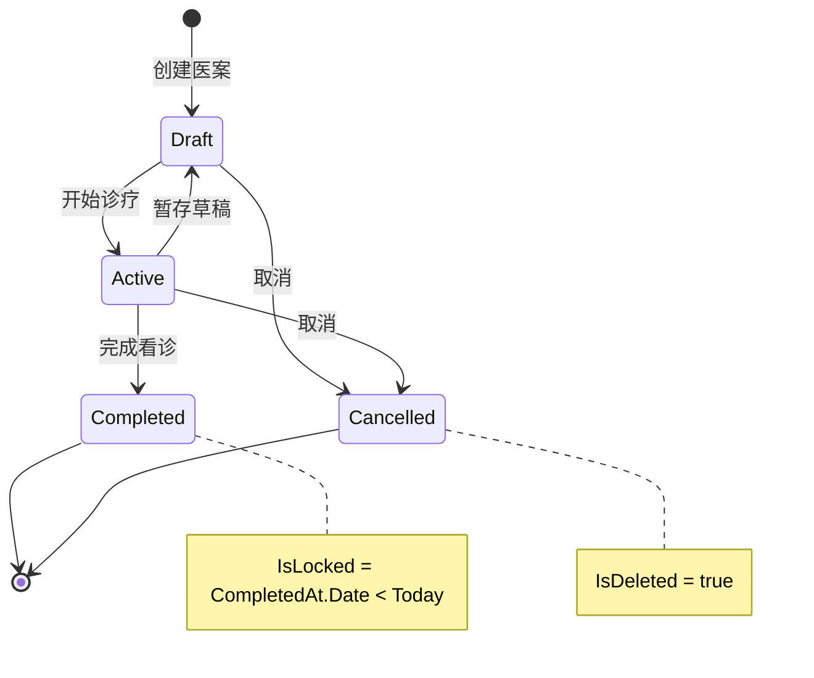

# 医案管理 需求规格

## 概述

医案管理是系统的核心模块。MedicalCase 是唯一聚合根 (DDD)，包含诊断 (Consultation, 1:1) 和处方 (Prescription, 1:0..1) 作为内部实体。实现完整的诊疗流程: 创建医案 → 填写诊断 → 标记处方需求 → 开具处方 → 完成医案。采用 CQRS 模式分离读写操作。

---

## 用户角色

| 角色 | 在本模块中的操作权限 |
|------|---------------------|
| SuperAdmin | 查看/编辑全部医案，无时间限制 |
| Admin | 查看/编辑全部医案，无时间限制 |
| Doctor | 创建医案；查看/编辑自己的未完成医案 |
| Receptionist | 无权限 |

> 整体受 `DoctorOrAdmin` 策略保护。创建医案仅 Doctor: `[Authorize(Roles = "Doctor")]`。

---

## 功能清单

### FR-MC-001: 创建医案

- **描述**: 为患者创建新的诊疗记录 (MedicalCase 聚合根)
- **业务规则**:
  1. PatientId 必填，UserId (医生ID) 必填
  2. 仅 Doctor 可创建
  3. 初始状态为 Draft
  4. 自动创建 Consultation (1:1 共享主键)
  5. 自动生成医案编号 (格式: MC20260210001)
  6. 冗余存储 PatientName 和 DoctorName (读优化)
- **远程模式**: POST `/api/v1/medicalcases`
- **本地模式**: DataSource 本地存储
- **验收标准**:
  - [ ] Admin 创建医案返回 403
  - [ ] Consultation 自动创建

### FR-MC-002: 填写诊断

- **描述**: 填写中医诊断信息 (Consultation)
- **业务规则**:
  1. 中医辨证 (TcmDiagnosis) 必填
  2. 现病史 (PresentIllness)、舌诊 (TongueDiagnosis)、脉诊 (PulseDiagnosis) 可选
  3. 通过聚合保存 (PUT /{id}) 更新
- **远程模式**: PUT `/api/v1/medicalcases/{id}` (聚合保存，含 Consultation)
- **本地模式**: 本地更新
- **验收标准**:
  - [ ] 无 TcmDiagnosis 时保存失败

### FR-MC-003: 标记处方需求

- **描述**: 标记本次诊疗是否需要开具处方
- **业务规则**:
  1. NeedsPrescription: true (需要) / false (不需要) / null (未决策)
  2. 设为 false 时，如已有处方则清除
  3. 设为 true 时，允许创建/编辑处方
- **远程模式**: PUT `/api/v1/medicalcases/{id}/prescription-flag`
- **本地模式**: 本地标记
- **验收标准**:
  - [ ] 标记为 false 后处方被清除
  - [ ] 标记为 true 后可创建处方

### FR-MC-004: 开具处方

- **描述**: 为医案创建处方，包含药材列表
- **业务规则**:
  1. 至少包含 1 个处方项 (PrescriptionItem)
  2. DosageCount (帖数) 范围 1-100，默认 7
  3. Discount (折扣) 范围 0-1，默认 1.0
  4. 处方编号自动生成 (格式: RX-YYYYMMDD-NNNN)
  5. 每个处方项: HerbId + HerbName + Dosage + UnitPrice + DecocteMethod
  6. 小计金额 = UnitPrice x Dosage (自动计算)
- **远程模式**: PUT `/api/v1/medicalcases/{id}` (聚合保存，含 Prescription + Items)
- **本地模式**: 本地存储
- **验收标准**:
  - [ ] 无药材项时保存失败
  - [ ] 金额正确计算

### FR-MC-005: 聚合保存

- **描述**: 一次性保存医案的诊断和处方信息
- **业务规则**:
  1. 聚合根整体保存 (MedicalCase + Consultation + Prescription + Items)
  2. 权限检查: Doctor 只能保存自己的
  3. 编辑已完成/隔天/非本人医案需要提供 EditReason
  4. 处方药材采用粗粒度替换策略 (完整替换 Items 集合)
  5. 记录审计日志
- **远程模式**: PUT `/api/v1/medicalcases/{id}`
- **本地模式**: 本地保存
- **验收标准**:
  - [ ] 需要审计理由时未提供返回错误
  - [ ] 处方项完整替换

### FR-MC-006: 暂存草稿

- **描述**: 保存当前进度为草稿，可稍后继续
- **业务规则**:
  1. 状态设为 Draft
  2. 保存当前诊断数据
  3. 不要求数据完整性 (TcmDiagnosis 可空)
- **远程模式**: PUT `/api/v1/medicalcases/{id}/draft`
- **本地模式**: 本地暂存
- **验收标准**:
  - [ ] 暂存后可继续编辑
  - [ ] 不验证必填字段

### FR-MC-007: 完成医案

- **描述**: 标记医案为已完成，锁定编辑
- **业务规则**:
  1. 状态设为 Completed
  2. 记录 CompletedAt 时间
  3. 完成后当天内可编辑，隔天锁定
  4. 锁定后编辑需要 Admin 权限 + 修改原因
- **远程模式**: PUT `/api/v1/medicalcases/{id}/close`
- **本地模式**: 本地完成
- **验收标准**:
  - [ ] CompletedAt 正确记录
  - [ ] 隔天锁定生效

### FR-MC-008: 取消医案

- **描述**: 取消本次诊疗，数据保留但不可编辑
- **业务规则**:
  1. 状态设为 Cancelled (通过 IsDeleted=true 软删除)
  2. 取消前自动保存诊断数据
  3. 保存失败不阻止取消
  4. 非当天本人取消需要审计理由
  5. 需要用户确认 ("确定要取消?")
- **远程模式**: PUT `/api/v1/medicalcases/{id}/cancel`
- **本地模式**: 本地取消
- **验收标准**:
  - [ ] 取消后不可恢复编辑
  - [ ] 数据保留用于审计

### FR-MC-009: 医案列表查询

- **描述**: 分页查看医案列表，支持多种筛选条件
- **业务规则**:
  1. 支持按状态、患者、关键词筛选
  2. Admin 查看全部，Doctor 仅查看自己的
  3. 默认分页: page=1, pageSize=20
  4. 统一查询端点支持多种 QueryType
- **远程模式**: GET `/api/v1/medicalcases?status=&patientId=&keyword=&page=&pageSize=` 或 GET `/api/v1/medicalcases/query`
- **本地模式**: 本地查询
- **验收标准**:
  - [ ] Doctor 只能看到自己的医案
  - [ ] 筛选条件正确过滤

### FR-MC-010: 跨医案搜索

- **描述**: 全文搜索医案内容 (患者名/诊断关键词)
- **业务规则**:
  1. 支持按患者姓名搜索
  2. 支持按诊断关键词搜索 (TcmDiagnosis)
  3. 支持日期范围筛选
  4. 返回完整 MedicalCaseDetailDto (含嵌套数据)
- **远程模式**: GET `/api/v1/medicalcases/search?patientName=&diagnosisKeyword=&startDate=&endDate=`
- **本地模式**: 本地搜索
- **验收标准**:
  - [ ] 诊断关键词匹配正确

### FR-MC-011: 编辑模式

- **描述**: 工作区模式 (Clinical/Management) 和编辑状态 (Editing/ReadOnly) 的管理
- **业务规则**:
  1. Clinical 模式: 从患者选择进入，默认 Editing，返回患者选择页
  2. Management 模式: 从医案列表进入，默认 ReadOnly，返回医案列表页
  3. 保存后状态切换为 ReadOnly，留在当前界面
  4. Management 模式未保存修改弹窗确认 (保存/放弃/取消)
  5. Clinical 模式底部按钮: [暂存医案] [打印处方笺] [完成看诊]
  6. Management 模式底部按钮: [打印处方笺] [保存医案] 或 [编辑医案]
- **远程模式**: 客户端 UI 逻辑
- **本地模式**: 同远程模式
- **验收标准**:
  - [ ] 工作区正确切换
  - [ ] 按钮按模式显示

### FR-MC-012: 审计日志

- **描述**: 记录医案所有变更的完整审计历史
- **业务规则**:
  1. 记录操作人 (ID/姓名/角色)、操作类型、变更字段、前后值
  2. 操作类型: Create/Update/StatusChange/SoftDelete/Cancel
  3. 修改原因: 历史医案修改时必填
  4. 支持分页查看审计日志
  5. 变更字段和值以 JSON 格式存储
- **远程模式**: GET `/api/v1/medicalcases/{id}/audit-logs?page=&pageSize=`
- **本地模式**: 不支持完整审计日志。仅保留实体级审计字段 (CreatedAt/UpdatedAt/CreatedBy/UpdatedBy)
- **验收标准**:
  - [ ] 每次变更都有审计记录
  - [ ] 修改原因正确记录

### FR-MC-013: 权限控制

- **描述**: 基于角色和资源的细粒度权限检查
- **业务规则**:
  1. Doctor: 只能编辑自己创建的未完成 (Draft/Active) 医案
  2. Admin/SuperAdmin: 可编辑所有医案
  3. 编辑已完成医案: 需提供修改原因
  4. 隔天编辑: 需提供修改原因
  5. 非本人编辑: 需提供修改原因
  6. 权限查询端点返回 CanEdit/CanDelete/RequiresEditReason/DenialReason
- **远程模式**: GET `/api/v1/medicalcases/{id}/permissions`，返回 MedicalCasePermissionDto
- **本地模式**: 本地权限检查
- **验收标准**:
  - [ ] Doctor 编辑他人医案返回 403
  - [ ] 权限端点正确返回

### FR-MC-014: 锁定规则

- **描述**: 已完成且非当天的医案自动锁定
- **业务规则**:
  1. 锁定条件: `IsLocked = IsCompleted && (CompletedAt.Date < Today)`
  2. 锁定后 Doctor 不可编辑
  3. 锁定后 Admin 编辑需提供修改原因
- **远程模式**: 服务端权限检查
- **本地模式**: 本地检查
- **验收标准**:
  - [ ] 当天完成的医案不锁定
  - [ ] 隔天自动锁定

### FR-MC-015: 处方打印

- **描述**: 打印处方笺，管理打印版本
- **业务规则**:
  1. 每次内容修改后打印，PrintVersion 递增
  2. 记录打印日志 (PrescriptionPrintLog)
  3. IsPrinted 和 PrintCount 自动更新
  4. 打印模板为 A5 纸张
- **远程模式**: 客户端打印 + 服务端记录日志
- **本地模式**: 本地打印
- **验收标准**:
  - [ ] 打印版本正确递增
  - [ ] 打印日志正确记录

### FR-MC-016: 验方导入到处方

- **描述**: 将经验方模板导入为处方药材
- **业务规则**:
  1. 从验方列表选择导入
  2. 导入验方的药材组成到处方 Items
  3. 价格从药材库实时获取
  4. 记录引用的验方名称 (ReferencedFormulas)
- **远程模式**: 客户端操作，药材价格从 API 获取
- **本地模式**: 从本地药材库获取价格
- **验收标准**:
  - [ ] 药材正确导入
  - [ ] 价格从药材库获取

### FR-MC-017: 待诊队列

- **描述**: 显示当前医生的待看诊患者列表
- **业务规则**:
  1. 筛选状态为 Active 的医案
  2. 按创建时间排序
  3. 显示患者姓名、创建时间
  4. 支持按患者 ID 过滤
- **远程模式**: GET `/api/v1/medicalcases/pending?doctorId=&patientId=`
- **本地模式**: 本地查询
- **验收标准**:
  - [ ] 仅显示 Active 状态的医案

---

## 状态机

| 状态 | 值 | 说明 | 允许操作 |
|------|-----|------|----------|
| Draft | 0 | 暂存 | 编辑、转 Active、取消 |
| Active | 1 | 进行中 | 编辑、暂存、完成、取消 |
| Completed | 2 | 已完成 | 查看 (Admin 可编辑需理由) |
| Cancelled | 3 | 已取消 | 无 |

---

## 数据模型

### MedicalCase (医案 -- 聚合根)

| 字段 | 类型 | 约束 | 说明 |
|------|------|------|------|
| Id | Guid | PK | 医案ID |
| PatientId | Guid | FK, Required | 患者ID |
| PatientName | string(50) | Required | 患者姓名 (冗余-读优化) |
| UserId | Guid | Required | 主治医生ID |
| DoctorName | string(50) | Required | 医生姓名 (冗余-读优化) |
| CaseNumber | string(50)? | - | 医案编号 |
| CaseStatus | MedicalCaseStatus | Required | 业务状态 |
| NeedsPrescription | bool? | - | 是否需要处方 |
| CompletedAt | DateTime? | - | 完成时间 |
| Remark | string(500)? | - | 备注 |
| Consultation | Consultation? | 1:1 | 诊断记录 (共享主键) |
| Prescription | Prescription? | 1:0..1 | 处方 (可选) |

> 计算属性: IsLocked, IsActive, IsCompleted, HasPrescription

### Consultation (诊断 -- 内部实体)

| 字段 | 类型 | 约束 | 说明 |
|------|------|------|------|
| Id | Guid | PK (= MedicalCase.Id) | 诊断ID (共享主键) |
| PresentIllness | string(2000)? | - | 现病史 |
| TongueDiagnosis | string(500)? | - | 舌诊 |
| PulseDiagnosis | string(500)? | - | 脉诊 |
| TcmDiagnosis | string(500)? | 完成时必填 | 中医辨证 |

### Prescription (处方 -- 内部实体)

| 字段 | 类型 | 约束 | 说明 |
|------|------|------|------|
| Id | Guid | PK | 处方ID |
| MedicalCaseId | Guid | FK | 医案ID |
| PrescriptionNumber | string(20)? | - | 处方编号 (RX-YYYYMMDD-NNNN) |
| DosageCount | int | Default: 7 | 帖数 |
| Discount | decimal(5,4) | Default: 1.0 | 折扣 |
| Usage | string(500)? | - | 用法 |
| Advice | string(500)? | - | 医嘱 |
| ReferencedFormulas | string(500)? | - | 引用验方 (逗号分隔) |
| PrintVersion | int | Default: 1 | 打印版本号 |
| PrintCount | int | Default: 0 | 打印次数 |
| IsPrinted | bool | Default: false | 是否已打印 |
| Items | ICollection | 导航 | 处方项列表 |

### PrescriptionItem (处方项)

| 字段 | 类型 | 约束 | 说明 |
|------|------|------|------|
| Id | Guid | PK | 项ID |
| PrescriptionId | Guid | FK | 处方ID |
| HerbId | Guid | FK | 药材ID |
| HerbName | string(100) | Required | 药材名称 |
| Dosage | int | Required | 剂量 (整数克) |
| Unit | string(16) | Required | 单位 |
| DecocteMethod | DecocteMethod | Default: Default | 煎法 |
| UnitPrice | decimal(18,2) | Required | 单价 |
| Usage | string(200)? | - | 特殊用法 |
| Amount | decimal | 计算属性 | 小计 = UnitPrice x Dosage |

### MedicalCaseAuditLog (审计日志)

| 字段 | 类型 | 说明 |
|------|------|------|
| MedicalCaseId | Guid | 医案ID (FK) |
| OperatorId | Guid | 操作人ID |
| OperatorName | string(50) | 操作人姓名 |
| OperatorRole | UserRole | 操作人角色 |
| OperationType | AuditOperationType | 操作类型 |
| ChangedFields | string? | 变更字段 (JSON) |
| OldValues | string? | 变更前值 (JSON) |
| NewValues | string? | 变更后值 (JSON) |
| Reason | string(500)? | 修改原因 |

---

## 审计理由判断

| 场景 | 需要修改原因 |
|------|-------------|
| 当天本人修改 Draft/Active 医案 | 不需要 |
| 修改已完成 (Completed) 医案 | 需要 |
| 隔天修改 | 需要 |
| 非本人修改 | 需要 |
| 取消医案 (非当天本人) | 需要 |

预置修改原因选项: 补充遗漏信息 / 更正录入错误 / 患者要求修改 / 医嘱调整

---

## 决策记录

| 编号 | 问题 | 影响范围 | 状态 |
|------|------|----------|------|
| 1 | 本地模式下审计日志的存储和同步策略 | FR-MC-012 | 已确定: 仅实体级审计字段。本地模式为单用户操作，字段级变更审计价值有限 |
| 2 | 本地模式下医案编号的生成规则 | FR-MC-001 | 已确定: MC+yyyyMMdd+3位序号。CaseNumber 为展示用编号 (非唯一约束)，Guid Id 为实际唯一标识。同日本地/远程可能重号，不影响数据完整性 |
| 3 | 本地模式下跨医案搜索的性能 | FR-MC-010 | 已确定: 满足需求。诊所场景 (百~千级) SQLite 性能良好，已应用 AsNoTracking + 分页优化 |

---

## 变更记录

| 日期 | 版本 | 变更内容 |
|------|------|----------|
| 2026-02-10 | v1.0 | 初始版本，从 4 个 spec + MedicalCasesController + 5 个实体提取 |
