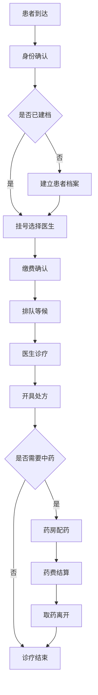
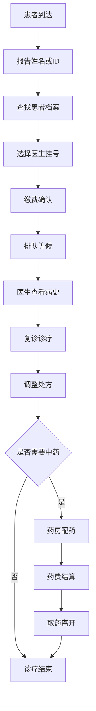
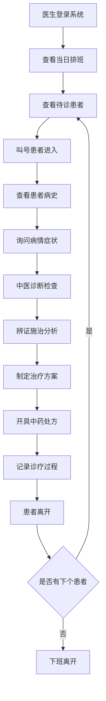
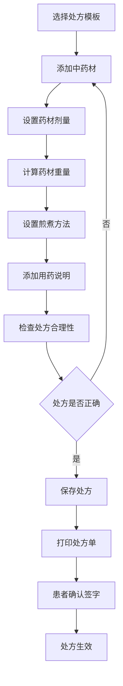
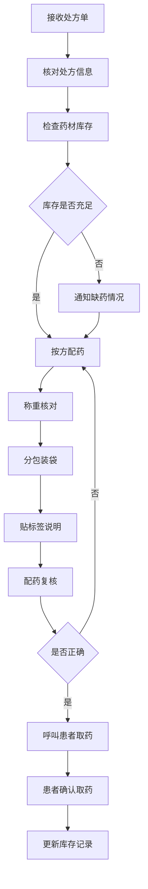
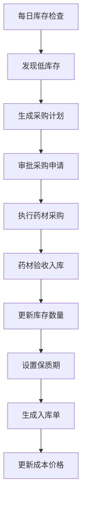
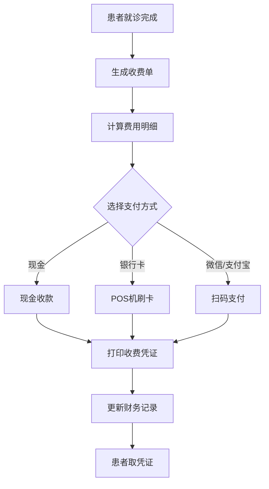
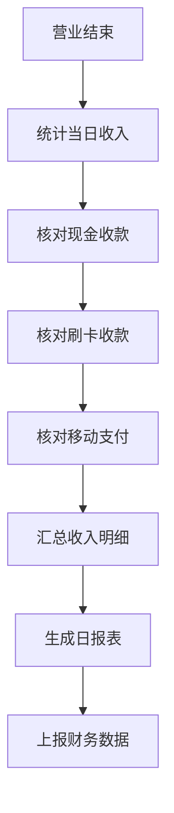

# LYBTZYZS业务需求规格书

**文档版本**: v1.0.0  
**创建日期**: 2025-08-06  
**最后更新**: 2025-08-06  
**文档状态**: [已发布]  
**作者**: 产品经理  
**审核人**: 业务专家  

---

## 文档概述

本文档详细描述凌隐宝堂中医诊所管理系统的业务需求，包括业务背景、业务目标、业务流程、功能需求和性能需求，为系统设计和开发提供明确的业务指导。

## 目标读者

- 产品经理和业务分析师
- 系统架构师和技术团队
- 项目管理和质量保证人员
- 客户和业务干系人

## 相关文档

- [功能需求规格书](./功能需求规格书.md)
- [中医诊所业务流程](./中医诊所业务流程.md)
- [用户角色与权限](./用户角色与权限.md)
- [项目概述](../01-项目管理/项目概述.md)

---

## 一、业务背景分析

### 1.1 行业背景

#### 中医诊所行业现状
中医药作为中华民族的瑰宝，在现代医疗体系中占据重要地位。随着人们健康意识的提升和对传统医学的重新认识，中医诊所的市场需求持续增长。

**行业特点**:
- **个性化诊疗**: 中医注重辨证施治，针对不同患者制定个性化治疗方案
- **复方用药**: 中药处方通常包含多种药材的复杂组合
- **经验传承**: 中医诊疗依重临床经验和传统验方
- **整体观念**: 注重人体整体调理和预防保健

#### 信息化需求
传统中医诊所管理方式面临的挑战：
- **手工记录**: 病历和处方手工记录，易出错且难以查询
- **库存管理**: 中药材种类繁多，库存管理复杂
- **流程效率**: 人工流程效率低下，患者等待时间长
- **数据分析**: 缺乏有效的数据统计和分析手段

### 1.2 诊所现状

#### 凌隐宝堂基本情况
- **诊所性质**: 传统中医诊所，专注于中医药诊疗服务
- **服务范围**: 中医内科、妇科、儿科、针灸、推拿等
- **医师团队**: 5-8名中医师，包括主任医师和主治医师
- **日接诊量**: 平均每日接诊50-80人次
- **药房规模**: 常备中药材300+种，月周转库存

#### 现有管理痛点
1. **患者管理混乱**
   - 患者信息记录不规范
   - 病历查询困难
   - 复诊患者信息难以快速获取

2. **诊疗流程低效**
   - 挂号排队时间长
   - 病历书写耗时
   - 处方开具效率低

3. **药房管理困难**
   - 库存信息不准确
   - 药材过期损耗大
   - 配药错误风险高

4. **财务管理不清**
   - 收费项目不规范
   - 财务统计困难
   - 医保结算复杂

### 1.3 业务目标

#### 短期目标 (0-6个月)
- **效率提升**: 诊疗流程效率提升50%以上
- **错误减少**: 处方配药错误率降低80%
- **患者满意**: 患者等待时间减少30分钟
- **成本控制**: 药材库存周转率提升20%

#### 中期目标 (6-18个月)
- **标准化管理**: 建立标准化的诊疗和管理流程
- **数据驱动**: 基于数据分析优化运营决策
- **品牌提升**: 通过服务质量提升诊所品牌形象
- **规模扩展**: 支持诊所业务规模的持续扩展

#### 长期目标 (18个月以上)
- **智能化**: 引入AI辅助诊断和智能推荐
- **连锁化**: 支持多分店统一管理
- **平台化**: 构建中医药服务生态平台
- **行业标杆**: 成为中医诊所数字化转型的行业标杆

## 二、业务范围定义

### 2.1 业务边界

#### 系统覆盖范围
```
🏥 诊所核心业务
├── 前台服务
│   ├── 患者接待和咨询
│   ├── 预约挂号管理
│   ├── 排队叫号服务
│   └── 收费结算管理
│
├── 医疗服务
│   ├── 患者档案管理
│   ├── 医生诊疗工作
│   ├── 病历记录管理
│   └── 处方开具管理
│
├── 药房服务
│   ├── 中药材库存管理
│   ├── 处方配药服务
│   ├── 药品发放管理
│   └── 库存统计分析
│
└── 管理服务
    ├── 用户权限管理
    ├── 系统参数配置
    ├── 数据备份恢复
    └── 运营统计分析
```

#### 系统边界说明
**包含在系统内**:
- 诊所内部业务流程管理
- 患者在诊所内的完整就医流程
- 中药材库存和处方管理
- 诊所运营数据分析和统计

**不包含在系统内**:
- 在线预约网站/APP (可作为扩展)
- 医保实时结算接口 (预留接口)
- 电子发票系统 (可集成第三方)
- 短信/邮件通知服务 (可集成第三方)

### 2.2 用户群体

#### 系统用户分类
| 用户类型 | 人员数量 | 主要职责 | 系统使用频率 |
|----------|----------|----------|-------------|
| **系统管理员** | 1-2人 | 系统配置、用户管理、数据维护 | 每日1-2小时 |
| **中医师** | 5-8人 | 患者诊疗、病历记录、处方开具 | 每日6-8小时 |
| **前台人员** | 2-3人 | 患者接待、挂号收费、排队管理 | 每日8小时 |
| **药房人员** | 2-3人 | 库存管理、处方配药、药品发放 | 每日6-8小时 |
| **财务人员** | 1人 | 财务统计、收费管理、报表分析 | 每日2-3小时 |

#### 用户特征分析
**技能水平**:
- 医疗专业人员，计算机操作水平中等
- 年龄分布30-60岁，对新技术接受度一般
- 重视系统的易用性和稳定性

**使用环境**:
- 快节奏的医疗工作环境
- 需要快速响应和操作
- 对系统可靠性要求高

### 2.3 业务规模

#### 业务量指标
| 业务指标 | 当前规模 | 预期规模 | 系统设计目标 |
|----------|----------|----------|-------------|
| **日均就诊患者** | 50-80人次 | 100-150人次 | 支持200人次/日 |
| **并发用户数** | 10-15人 | 20-25人 | 支持50并发用户 |
| **患者档案数** | 3000+ | 10000+ | 支持100万患者档案 |
| **处方记录** | 月均1500张 | 月均3000张 | 支持海量处方记录 |
| **药材种类** | 300+种 | 500+种 | 支持1000种药材 |
| **月营业额** | 50-80万 | 100-150万 | 支持大金额交易 |

#### 增长预期
- **患者增长**: 年增长30-50%
- **业务扩展**: 可能增加分店或新服务项目
- **数据增长**: 历史数据长期保存和查询需求

## 三、核心业务流程

### 3.1 患者就医完整流程

#### 3.1.1 新患者首诊流程


#### 3.1.2 老患者复诊流程


### 3.2 医生工作流程

#### 3.2.1 日常诊疗流程


#### 3.2.2 处方开具流程


### 3.3 药房工作流程

#### 3.3.1 配药流程


#### 3.3.2 库存管理流程


### 3.4 财务管理流程

#### 3.4.1 收费流程


#### 3.4.2 日结算流程


## 四、功能需求概述

### 4.1 核心功能模块

#### 4.1.1 用户权限管理
**功能描述**: 管理系统用户、角色和权限
- **用户管理**: 用户注册、信息维护、状态管理
- **角色管理**: 角色定义、权限分配、层级管理
- **权限控制**: 功能权限、数据权限、操作权限
- **登录认证**: 安全登录、密码策略、会话管理

#### 4.1.2 患者档案管理
**功能描述**: 建立和维护完整的患者档案系统
- **基本信息**: 姓名、性别、年龄、联系方式、地址
- **病史信息**: 既往病史、过敏史、家族史
- **体质信息**: 中医体质分类、体质特征记录
- **档案查询**: 多条件查询、模糊查询、统计分析

#### 4.1.3 医生信息管理
**功能描述**: 管理医生基本信息和执业信息
- **基本信息**: 姓名、科室、职称、联系方式
- **执业信息**: 执业证号、专业特长、出诊时间
- **排班管理**: 工作日程、休假安排、临时调整
- **工作统计**: 接诊量、处方量、患者评价

#### 4.1.4 预约挂号管理
**功能描述**: 处理患者预约和现场挂号业务
- **预约功能**: 电话预约、现场预约、时间段选择
- **挂号管理**: 号源管理、排队序号、叫号提醒
- **费用收取**: 挂号费、诊疗费、其他费用
- **预约查询**: 预约记录查询、取消预约

#### 4.1.5 诊疗记录管理
**功能描述**: 记录和管理患者诊疗过程信息
- **症状记录**: 主诉、现病史、体格检查
- **中医诊断**: 辨证分析、病机分析、诊断结论
- **治疗方案**: 治疗原则、具体方法、注意事项
- **疗效评估**: 治疗效果、病情变化、调整方案

#### 4.1.6 处方管理系统
**功能描述**: 中药处方的开具和管理
- **处方开具**: 药材选择、剂量设定、煎煮方法
- **验方管理**: 常用验方、经典方剂、个人经验方
- **配伍检查**: 药物相互作用、配伍禁忌检查
- **处方统计**: 用药频次、费用统计、疗效分析

#### 4.1.7 药房库存管理
**功能描述**: 中药材库存的全面管理
- **库存管理**: 入库、出库、盘点、调拨
- **药材档案**: 药材信息、供应商、价格、规格
- **保质期管理**: 到期提醒、批次管理、损耗处理
- **采购管理**: 采购计划、订单管理、验收入库

#### 4.1.8 收费结算管理
**功能描述**: 医疗费用的收取和结算管理
- **费用计算**: 诊疗费、药费、其他费用自动计算
- **支付管理**: 现金、刷卡、移动支付多种方式
- **发票管理**: 收费凭证、发票打印、存根管理
- **财务统计**: 收入统计、成本分析、利润核算

### 4.2 辅助功能模块

#### 4.2.1 统计分析模块
- **业务统计**: 接诊量、收入、药品消耗统计
- **报表生成**: 日报、周报、月报、年报
- **趋势分析**: 业务发展趋势、季节性分析
- **决策支持**: 经营分析、成本控制、效率优化

#### 4.2.2 系统管理模块
- **参数配置**: 系统参数、业务参数、界面配置
- **数据备份**: 定期备份、手动备份、数据恢复
- **日志管理**: 操作日志、错误日志、审计日志
- **系统监控**: 性能监控、异常监控、使用统计

#### 4.2.3 打印输出模块
- **处方打印**: 处方单、用药说明、煎煮方法
- **收费凭证**: 收费单据、发票、明细清单
- **报表打印**: 各类统计报表、分析图表
- **标签打印**: 药品标签、档案标签、条码标签

## 五、非功能性需求

### 5.1 性能需求

#### 5.1.1 响应时间要求
- **界面响应**: 用户界面操作响应时间<2秒
- **数据查询**: 常规数据查询响应时间<3秒
- **报表生成**: 复杂报表生成时间<30秒
- **系统启动**: 系统启动时间<60秒

#### 5.1.2 并发性能要求
- **并发用户**: 支持50个用户同时在线操作
- **数据库连接**: 支持100个并发数据库连接
- **事务处理**: 支持高并发的事务处理能力
- **资源占用**: 系统资源占用率<80%

#### 5.1.3 数据处理能力
- **患者档案**: 支持100万患者档案存储和查询
- **处方记录**: 支持千万级处方记录存储和查询
- **库存数据**: 支持1000种药材的库存管理
- **历史数据**: 支持5年以上的历史数据查询

### 5.2 可靠性需求

#### 5.2.1 可用性要求
- **系统可用率**: 99.5%以上(年停机时间<44小时)
- **故障恢复**: 系统故障后1小时内恢复
- **数据完整性**: 确保医疗数据的完整性和一致性
- **容错能力**: 具备基本的容错和自动恢复能力

#### 5.2.2 数据安全要求
- **数据备份**: 每日自动备份，异地备份保存
- **数据加密**: 敏感数据加密存储和传输
- **访问控制**: 严格的用户权限和访问控制
- **审计日志**: 完整的操作审计和安全日志

### 5.3 可维护性需求

#### 5.3.1 系统维护要求
- **模块化设计**: 系统采用模块化设计，便于维护
- **配置管理**: 系统参数可配置，减少代码修改
- **错误处理**: 完善的错误处理和异常恢复机制
- **日志记录**: 详细的系统日志，便于问题定位

#### 5.3.2 升级扩展要求
- **版本升级**: 支持系统版本的平滑升级
- **功能扩展**: 预留接口，支持功能模块的扩展
- **数据迁移**: 支持数据结构变更和数据迁移
- **向下兼容**: 新版本保持对旧版本数据的兼容

### 5.4 用户体验需求

#### 5.4.1 易用性要求
- **界面友好**: 直观易懂的用户界面设计
- **操作简便**: 符合用户习惯的操作流程
- **学习成本**: 新用户培训时间不超过4小时
- **帮助支持**: 在线帮助和操作指导

#### 5.4.2 适应性要求
- **多分辨率**: 支持不同分辨率的显示设备
- **键盘操作**: 支持键盘快捷键操作
- **打印适配**: 支持各种打印机和纸张规格
- **网络适应**: 适应不同网络环境和带宽

## 六、约束条件

### 6.1 技术约束

#### 6.1.1 平台约束
- **操作系统**: Windows 10/11 (64位)
- **数据库**: SQL Server 2019或以上版本
- **开发平台**: .NET 8.0框架
- **客户端**: WPF桌面应用程序

#### 6.1.2 性能约束
- **硬件配置**: 最低4GB内存，推荐8GB内存
- **网络要求**: 局域网环境，带宽不低于10Mbps
- **存储空间**: 至少100GB可用存储空间
- **处理器**: Intel i5或同等性能处理器

### 6.2 业务约束

#### 6.2.1 法规约束
- **医疗法规**: 符合国家医疗管理法规要求
- **数据保护**: 符合患者隐私保护相关法律
- **处方管理**: 符合中药处方管理规范
- **财务规范**: 符合财务管理和税务要求

#### 6.2.2 业务约束
- **工作时间**: 系统需适应诊所工作时间安排
- **用户习惯**: 兼容现有工作习惯和流程
- **培训成本**: 用户培训成本控制在合理范围
- **数据迁移**: 现有数据需要平滑迁移

### 6.3 项目约束

#### 6.3.1 时间约束
- **项目周期**: 16周内完成系统开发和部署
- **上线时间**: 必须在2025年底前正式上线
- **培训时间**: 用户培训时间不超过1周
- **切换时间**: 系统切换造成的业务中断<4小时

#### 6.3.2 预算约束
- **开发成本**: 在预算范围内完成开发
- **硬件成本**: 硬件投资控制在合理范围
- **培训成本**: 用户培训成本最小化
- **维护成本**: 考虑长期维护成本

## 七、验收标准

### 7.1 功能验收标准

#### 7.1.1 核心功能验收
- [ ] **用户登录**: 所有用户角色能够正常登录系统
- [ ] **患者管理**: 患者档案建立、查询、修改功能正常
- [ ] **诊疗记录**: 病历录入、查看、修改功能正常
- [ ] **处方管理**: 处方开具、打印、统计功能正常
- [ ] **药房管理**: 库存管理、配药、发药功能正常
- [ ] **收费结算**: 费用计算、收款、打印功能正常

#### 7.1.2 业务流程验收
- [ ] **完整就医流程**: 从挂号到取药的完整流程能够正常进行
- [ ] **数据一致性**: 各模块间数据保持一致性
- [ ] **权限控制**: 不同用户角色的权限控制正确
- [ ] **异常处理**: 各种异常情况能够正确处理

### 7.2 性能验收标准

#### 7.2.1 响应性能验收
- [ ] **界面响应**: 95%的界面操作在2秒内完成响应
- [ ] **查询性能**: 95%的数据查询在3秒内返回结果
- [ ] **并发性能**: 系统能够支持50个用户同时操作
- [ ] **稳定性**: 系统连续运行7天无宕机

#### 7.2.2 数据处理验收
- [ ] **数据容量**: 能够处理设计要求的数据容量
- [ ] **查询效率**: 大数据量查询保持合理的响应时间
- [ ] **数据完整性**: 数据存储和传输过程中保持完整
- [ ] **备份恢复**: 数据备份和恢复功能正常

### 7.3 用户体验验收

#### 7.3.1 易用性验收
- [ ] **学习成本**: 新用户经过4小时培训能够熟练操作
- [ ] **操作便捷**: 常用功能操作步骤不超过3步
- [ ] **界面友好**: 界面布局合理，符合用户使用习惯
- [ ] **帮助完善**: 提供完整的帮助文档和操作指导

#### 7.3.2 适应性验收
- [ ] **环境适应**: 在目标硬件环境下正常运行
- [ ] **兼容性**: 与现有软硬件环境兼容
- [ ] **打印支持**: 支持常用打印机和纸张规格
- [ ] **网络适应**: 在不同网络条件下稳定运行

---

## 总结

本业务需求规格书详细描述了LYBTZYZS系统的业务背景、需求目标、功能范围和验收标准，为系统的设计开发提供了明确的业务指导。

**关键成功要素**:
1. **准确理解业务**: 深入理解中医诊所的业务特点和需求
2. **用户体验优先**: 以提升用户工作效率为核心目标
3. **数据安全保障**: 确保医疗数据的安全性和隐私保护
4. **系统稳定可靠**: 保证系统在医疗环境下的稳定运行
5. **持续优化改进**: 根据用户反馈持续优化系统功能

通过实现这些业务需求，LYBTZYZS系统将显著提升凌隐宝堂中医诊所的管理效率和服务质量，为诊所的数字化转型奠定坚实基础。

---

**维护说明**: 本需求规格书将根据业务发展和用户反馈持续更新和完善  
**变更控制**: 重要需求变更需要经过正式的需求变更控制流程进行评估和确认