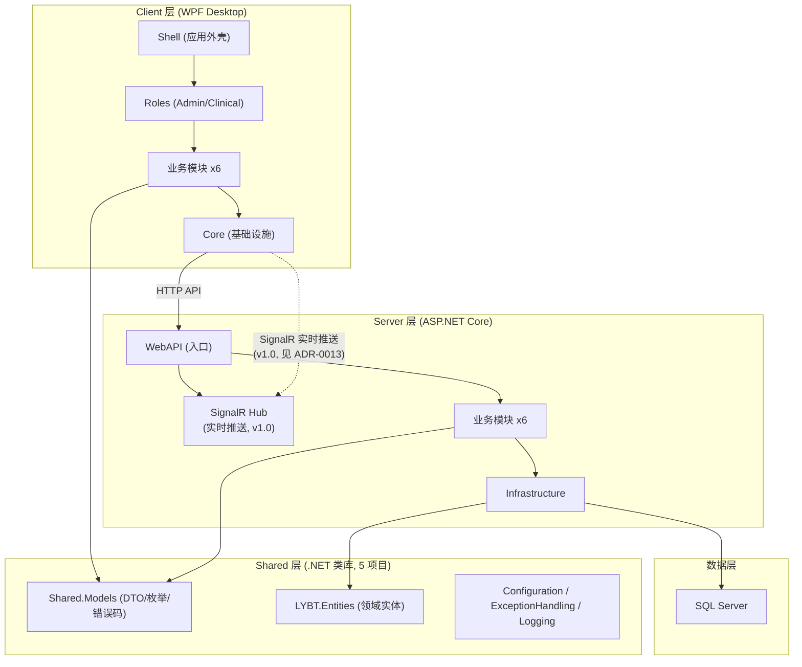
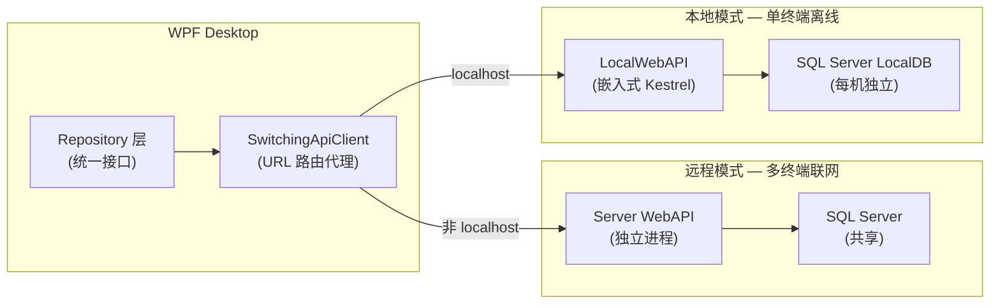
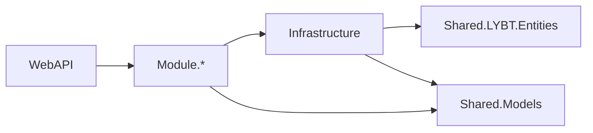
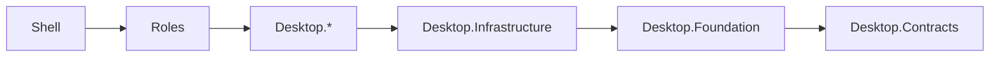
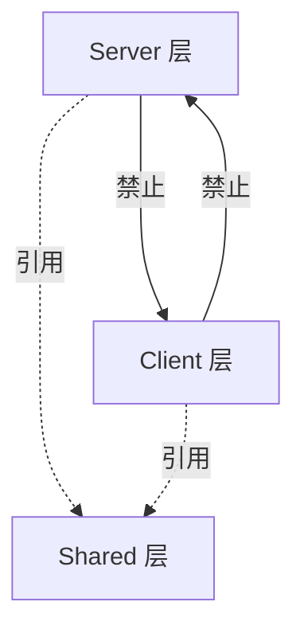

# 系统架构总览
> 版本: v1.8 | 日期: 2026-09-17

## 概述

凌隐宝堂中医诊所管理系统采用 Server/Shared/Client 三层架构。Server 层提供 RESTful API 服务，Client 层为 WPF 桌面应用，Shared 层提供两端共享的 DTO、工具类和组件。系统支持**远程模式**（连接 Server WebAPI + 远程 SQL Server）和**本地模式**（嵌入式 LocalWebAPI + 本地 LocalDB）双模式运行，通过 URL 自动切换，业务代码完全复用。详见 [双模式架构](05-dual-mode.md)。

## 系统架构图



### 双模式运行架构

系统支持两种运行模式，通过 URL 自动切换，Repository 层完全无感知：



双模式对比详见 [05-dual-mode.md §概述](05-dual-mode.md#概述)（远程/本地触发条件、API 宿主、数据库、认证差异）。

## 解决方案结构（Shared 层权威见 [08-shared.md](08-shared.md)；Server 模块细节权威见 [03-server.md](03-server.md)）

> 以下清单按仓库实际 `*.csproj` 对齐（2026-09-17）。历史文档中的 Shared.Components/Utilities/Primitives/Validators 已坍缩为 `LYBT.Shared.Models` 内文件夹，详见 [08-shared.md](08-shared.md)。

```
LYBTZYZS/
src/
  Client/Desktop/                    # WPF 桌面客户端
    Core/                            # 核心库 (5 个项目)
      LYBT.Desktop.Contracts/        # 接口定义（IApiClient 统一契约）
      LYBT.Desktop.Foundation/       # 基础设施 (HTTP/安全/配置)
      LYBT.Desktop.Infrastructure/   # 通用服务、控件
      LYBT.Desktop.Controls/         # 可复用控件
      LYBT.Desktop.Printing/         # 打印服务
    Modules/                         # 业务模块 (6 个)
      LYBT.Desktop.Auth/             # 认证
      LYBT.Desktop.Users/            # 用户
      LYBT.Desktop.Catalog/          # 药材 + 验方（合并模块）
      LYBT.Desktop.Patients/         # 患者 (含读卡器集成)
      LYBT.Desktop.Registrations/    # 挂号
      LYBT.Desktop.MedicalCase/      # 医案 (含处方+编辑状态机)
      # LYBT.Desktop.Sync/           # 🧲 v2.0 (N1 决策：v1.0 数据孤立)
    Roles/                           # 角色入口 (2 个)
      LYBT.Desktop.Admin/            # 管理员端
      LYBT.Desktop.Clinical/         # 临床端
    Shell/
      LYBT.Desktop.Shell/            # 应用外壳
    LocalWebAPI/
      LYBT.LocalWebAPI/              # 本地模式嵌入式 API 宿主

  Server/                            # 后端服务
    Core/
      LYBT.Infrastructure/           # 基础设施 (DbContext, Repository基类, 跨模块服务)
      # 实体源已移至 src/Shared/LYBT.Entities（2026-08）
    Modules/                         # 业务模块 (6 个物理项目)
      LYBT.Module.Identity/          # 认证 + 用户
      LYBT.Module.Catalog/           # 药材 + 验方
      LYBT.Module.Patients/          # 患者
      LYBT.Module.MedicalCases/      # 医案 (聚合根)
      LYBT.Module.Registrations/     # 挂号
      LYBT.Module.Reports/           # 报表/历史聚合查询
    Services/
      LYBT.WebAPI/                   # Web API 入口

  Shared/                            # 共享库 (5 个项目，权威见 08-shared.md)
    LYBT.Entities/                   # 领域实体 (贫血模型, MedicalCase 唯一充血聚合根)
    LYBT.Shared.Models/              # DTO/Contract/Enums/ErrorCodes/Validators/Utilities
    LYBT.Shared.Configuration/       # 共享配置模型 (Options + Validators)
    LYBT.Shared.ExceptionHandling/   # 统一异常类型定义
    LYBT.Shared.Logging/             # 统一日志抽象 (Serilog/脱敏/CorrelationId)

tests/                               # 测试 (3 个项目, Testing Trophy 架构)
    LYBT.Tests.Server/               # Server 集成/单元测试 (真实 SQL Server + Respawn)
    LYBT.Tests.Desktop/              # Desktop 测试 (SQL Server LocalDB + 真实 Repository)
    LYBT.Tests.Architecture/         # 架构防护测试 (含 AntiMockRules)
docs/                                # 文档
```

**项目总数**: 主解决方案约 31 个 csproj（含 LocalWebAPI/Shell/Roles/Tests；不含 Tools）

## 设计原则（贯穿所有 project）

1. **模块自治**（见 [ADR-0017](decisions/0017-modular-monolith-cqrs.md)）：每个业务模块完整 Domain/Application/Infrastructure 三层，独立 DbContext（A-20 落地）
2. **契约单一**（A-18）：桌面对外唯一接口面 `IApiClient`，Refit 特性接口 internal 化
3. **双轨设计**（见 [ADR-0002](decisions/0002-dual-mode-architecture.md) / [ADR-0009](decisions/0009-url-driven-dual-mode.md) / [ADR-0010](decisions/0010-localwebapi-unified-service-layer.md)）：Remote/Local 共享同一业务逻辑（同一 Service 双宿主），切换由用户自主（A-19）
4. **映射单一**（见 [ADR-0011](decisions/0011-mapperly-migration.md) + A-18 P1-4）：Mapperly 编译期映射，Target 策略
5. **共享单源**：公共类型只在 Shared 定义一次（Gender 样板），禁止两端重复
6. **拒绝屎山**（用户红线）：发现错误直接重写，不做兼容层
7. **Status vs State 语义边界**（2026-08-08 A-26 定案）：**域内持久化状态用 `Status` 枚举**（`MedicalCaseStatus`/`RegistrationStatus`/`FormulaValidationStatus`/`CommonStatus`，存于 `Shared.Models/Enums/`）；**客户端 UI/会话状态用 `State` 枚举**（`WorkspaceEditState`/`EditState`/`AuthState`/`SessionState`/`TokenLifecycleState`）。禁止域状态用 State、会话状态用 Status 的混用

## 技术栈全景

> 技术栈详见 [[00-architecture-summary]]

## 依赖方向

### Server 层依赖



**规则**:
- WebAPI -> Modules -> Infrastructure -> Entities（实体位于 `src/Shared/LYBT.Entities`，单向）
- 所有层可引用 Shared.Models
- Module 之间禁止直接依赖，跨模块通过域接口（`IXxxCrossModuleService`）通信

> **注意**：`AuthService` 为死代码（Controller 绕过直接用 UserManager），详见 [[auth]]

### Client 层依赖



**规则**:
- Shell -> Roles -> Modules -> Infrastructure -> Foundation -> Contracts (单向)
- 业务模块之间禁止直接依赖

### 跨层依赖



**铁律**:
- Server 和 Client 之间只通过 HTTP API 通信，禁止项目引用
- Shared 层不引用 Server 或 Client 层
- 所有依赖方向必须单向，禁止循环引用

## 模块通信

### Server 端跨模块通信

```mermaid
sequenceDiagram
    participant MC as MedicalCaseService
    participant CMS as IXxxCrossModuleService
    participant PS as PatientRepository

    MC->>CMS: GetPatientBasicInfoAsync(patientId)
    CMS->>PS: 查询患者基本信息
    PS-->>CMS: PatientBasicInfo
    CMS-->>MC: PatientBasicInfo
```text

- 使用跨模块服务接口 (ISP 原则，按域拆分):
  - `IPatientCrossModuleService` -- 患者查询 + 引用检查
  - `IHerbCrossModuleService` -- 药材查询 + 引用检查
  - `IUserCrossModuleService` -- 用户查询 + 凭证操作
  - `ICrossModuleAuthService` -- Token 撤销 (独立接口，6 个触发场景)
- ~~旧 `ICrossModuleService` 标记 `[Obsolete]`~~ → **已删除（A-31-C8 定案）**，模块间通信统一走域接口（`IPatient/IHerb/IUser/IAuth/IMedicalCase/IRegistrationCrossModuleService`）
- 禁止直接注入其他模块的 Repository
- 返回轻量级 BasicInfo DTO

### Client 端模块通信

- 使用 Prism `IEventAggregator` 发布/订阅事件
- 使用 `IRegionManager` 进行导航
- 禁止模块间直接引用

## 项目命名规范

| 层级 | 前缀 | 示例 |
|------|------|------|
| Server Core | `LYBT.` | LYBT.Infrastructure |
| Server Module | `LYBT.Module.` | LYBT.Module.Patients, LYBT.Module.Identity |
| Server Service | `LYBT.` | LYBT.WebAPI |
| Shared | `LYBT.Entities` / `LYBT.Shared.` | LYBT.Entities, LYBT.Shared.Models |
| Client Core | `LYBT.Desktop.` | LYBT.Desktop.Foundation |
| Client Module | `LYBT.Desktop.` | LYBT.Desktop.Patients, LYBT.Desktop.Catalog |
| Client Role | `LYBT.Desktop.` | LYBT.Desktop.Clinical |
| Client Shell | `LYBT.Desktop.` | LYBT.Desktop.Shell |

## 架构决策记录

- [ADR-0001: MedicalCase 聚合根](decisions/0001-medicalcase-aggregate-root.md) — 系统唯一的 DDD 聚合根
- [ADR-0003: 集成优先测试策略](decisions/0003-integration-first-testing.md) — Testing Trophy 架构
- [ADR-0008: Token 安全防御性设计](decisions/0008-token-security-defensive-design.md) — Token 族旋转 + 重放检测
- [ADR-0009: URL 驱动双模式](decisions/0009-url-driven-dual-mode.md) — Remote + LocalWebAPI
- [ADR-0013: SignalR 实时推送](decisions/0013-signalr-realtime-push.md) — v1.0 远程模式推送
- [ADR-0014: Sysadmin 配置双模式](decisions/0014-sysadmin-config-dual-mode.md) — 服务端 Configuration API

## API 版本控制策略

| 约束 | 值 | 说明 |
|------|-----|------|
| 版本化方式 | URL Path | `/api/v1/` 前缀 |
| 版本递增 | 重大破坏性变更时 | v1 → v2，保持旧版本兼容期 |
| 共存策略 | 多版本并行 | 同一请求仅命中一个版本 |
| 弃用策略 | 标记 `[Obsolete]` + 6 个月过渡期 | 先标记废弃，再移除 |

## 变更记录

| 日期 | 版本 | 变更内容 |
|------|------|----------|
| 2026-02-10 | v1.0 | 初始版本，从 project-architecture spec 整合 |
| 2026-02-26 | v1.1 | Sprint3-Batch5a DOC3: 标注 Consultation/Prescriptions 空壳模块; 项目数更新为 40+; 新增 Desktop.LocalData/CardReader; 新增 Shared 工具项目 (Logging/Validators/Configuration/Primitives/ExceptionHandling) |
| 2026-02-26 | v1.2 | DOC3-15: 工具层 4 个辅助项目文档化 (Benchmarks/PerformanceTests/CompatibilityTests/TestConfiguration); tests/ 主项目列表展开 |
| 2026-03-04 | v1.3 | Testing Trophy 重构: 5+4 项目 -> 3 项目; 辅助测试项目已删除 |
| 2026-03-09 | v1.4 | Sprint 4: 补充 Registration 模块; Desktop 测试数更新 (482); Integration 测试项目已创建; Consultation Desktop 模块移除 (集成到 MedicalCase) |
| 2026-03-09 | v1.5 | Sprint 5: SQLite->LocalDB 描述修正 (架构图/目录注释/测试描述); Desktop 测试数更新 (493) |
| 2026-06-13 | v1.6 | 补充双模式运行架构章节：Mermaid 架构图展示远程/本地两条数据路径 + 对比表 |
| 2026-06-28 | v1.7 | **模块清单 + 测试库对齐**: Server 模块清单补 Reports（D9 补回 v1.0），架构图 "8 active + Sync v2.0"; Desktop 模块清单 Sync 标 v2.0; Desktop 测试库描述 SQLite InMemory → SQL Server LocalDB; 测试数对齐 ADR-0003 |
| 2026-09-17 | v1.8 | **SSOT 按实际 csproj 重写清单**：Shared 8→5 项目（权威改指 [08-shared.md](08-shared.md)）；Server 模块 Auth/Users/Herbs/Formula → Identity/Catalog/Patients/MedicalCases/Registrations/Reports（6 物理项目）；Desktop Herbs/Formula 合并 Catalog，Roles 仅 Admin/Clinical，Core 实际 5 项目；tests 4→3（删除 Integration）；实体位置标注 `src/Shared/LYBT.Entities` |
