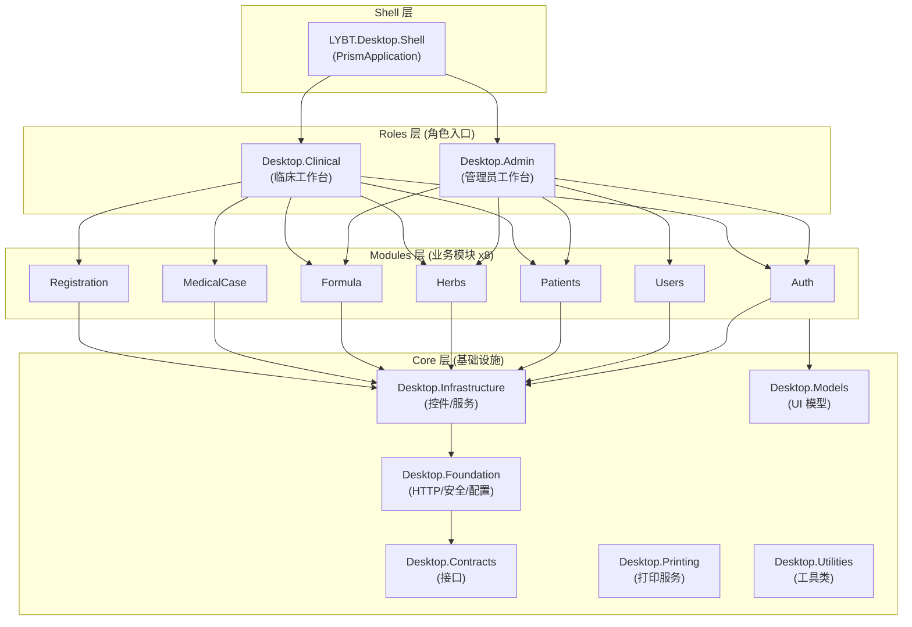

# 桌面端架构

## 概述

桌面端采用 WPF + Prism 8.1.97 MVVM 架构，共 16 个项目，分为 Core (基础设施)、Modules (业务模块)、Roles (角色入口)、Shell (应用外壳) 四层。通过 DryIoc DI 容器管理依赖，使用 Prism Region 机制实现模块间导航。

## 架构图



## Core 层 (8 个项目)

| 项目 | 职责 | 主要内容 |
|------|------|----------|
| LYBT.Desktop.Contracts | 接口定义 | IApi 接口 (Refit)、IRepository 接口 (6 个，Sprint 6 SYNC-D02 迁移)、IService 接口 |
| LYBT.Desktop.Foundation | 基础设施 | HTTP 客户端、缓存、安全、配置、日志 |
| LYBT.Desktop.Infrastructure | WPF 服务 | DialogService、NavigationService、控件、转换器、主题 |
| LYBT.Desktop.Models | 客户端模型 | ViewState、Item 模型、事件模型 |
| LYBT.Desktop.Printing | 打印服务 | MedicalCase 聚合根打印能力 (A5/A4 处方打印模板、打印预览、PDF 导出 QuestPDF) |
| LYBT.Desktop.Utilities | 工具类库 | 通用辅助方法 |
| LYBT.Desktop.LocalData | 本地数据访问 (LocalWebAPI HTTP Proxy Repository) | LocalXxxRepository 实现 |
| LYBT.Desktop.CardReader | 硬件集成 | 身份证读卡器策略模式、多厂商支持 |

**依赖方向**: Shell -> Roles -> Modules -> Infrastructure -> Foundation -> Contracts

## Modules 层 (8 个业务模块)

### 标准目录结构

```
LYBT.Desktop.{Domain}/
  {Domain}Module.cs              # Prism 模块注册 (IModule)
  Data/                          # 数据访问层
    I{Entity}Repository.cs       # Repository 接口
    {Entity}Repository.cs        # Repository 实现
    I{Entity}DataManager.cs      # DataManager 接口 (聚合根)
    {Entity}DataManager.cs       # DataManager 实现
  Models/                        # UI 模型
    {Entity}DetailModel.cs       # 可编辑的 Master-Detail 模型
    Items/
      {Entity}Item.cs            # 只读列表项模型
  Views/                         # XAML 视图
    Controls/                    # 可复用业务控件
    Dialogs/                     # 弹窗视图
  ViewModels/                    # ViewModel
    Components/                  # ViewModel 组件 (>500行时拆分)
    Dialogs/                     # 弹窗 ViewModel
  Services/                      # 客户端服务 (可选)
```

### 模块类型

| 类型 | 数据访问层 | 典型模块 | 说明 |
|------|-----------|----------|------|
| 独立实体 | Repository | Patients, Herbs, Users | 标准 CRUD |
| 聚合根 | Repository + DataManager | MedicalCase, Formula | 管理子实体 |
| 从属实体 | CommandHandler | Consultation | 通过父聚合操作 |

### 模块清单

| 模块 | 角色台 | 说明 |
|------|--------|------|
| Auth | Admin + Clinical | 登录、Token 管理 |
| Users | Admin | 用户 CRUD、密码管理 |
| Patients | Admin + Clinical | 患者 CRUD、导入导出、读卡器集成 |
| Herbs | Admin + Clinical | 药材 CRUD、分类 |
| Formula | Admin + Clinical | 验方 CRUD、药材绑定 |
| MedicalCase | Clinical | 医案核心 (含处方、EditModeStateMachine) |
| Registration | Admin + Clinical | 挂号管理 |

> 🧲 **Sync 模块属 v2.0**（N1 决策 2026-06-28）：v1.0 远程与本地数据孤立，Desktop.Sync 模块及其 SyncPhase FSM 延期至 v2.0。下方「同步 UI 架构」章节为 v2.0 设计参考。

### Registration 模块

标准独立实体模块 (Repository 模式)，提供挂号队列管理功能:

| 组件 | 说明 |
|------|------|
| RegistrationModule | Prism 模块注册，DI 注册 Repository + ViewModel + View |
| IRegistrationRepository | 挂号数据访问接口 |
| RegistrationRepository | HTTP Proxy 实现 |
| RegistrationListViewModel | 挂号列表页，支持按状态筛选 |
| RegistrationViewModel | 挂号详情/新建，集成患者选择和医生指派 |

**交互流程**: 选择患者 → 选择医生 → 创建挂号 (Waiting) → 医生接诊 (InProgress，自动创建 MedicalCase) → 完成 (Completed)

> 注: Desktop 端无独立 Consultation 模块，诊断编辑集成在 MedicalCase 模块内。

## Views 和 Controls 目录约定

| 目录 | 用途 | 命名约定 | 说明 |
|------|------|----------|------|
| `Views/` | 页面级视图 | `{Feature}View.xaml` | 与 ViewModel 1:1 对应，负责整体页面布局 |
| `Controls/` | 可复用业务控件 | `{Feature}Control.xaml` | 跨模块或模块内复用的 UI 组件，拥有独立 ViewModel |

**区分原则**: Views/ 中的视图是导航目标 (通过 `RegisterForNavigation` 注册)，Controls/ 中的控件是嵌入式组件 (通过 XAML 引用或 Region 注入)。一个 View 可以组合多个 Control。

---

## Roles 层 (2 个角色入口)

### Admin (管理员工作台)

- **包含模块**: Auth, Users, Patients, Herbs, Formula
- **核心功能**: 用户管理、数据维护、系统配置

### Clinical (临床工作台)

- **包含模块**: Auth, Patients, MedicalCase, Registration, Herbs, Formula
- **核心功能**: 诊疗流程、开方、处方打印

> 🧲 Sync 模块属 v2.0，v1.0 不加载。

### 视图分离原则 (ARCH-010)

| 类型 | 位置 | 职责 |
|------|------|------|
| 页面视图 (View) | Roles/*/Views/ | 页面布局、导航、角色操作 |
| 控件 (Control) | Modules/*/Controls/ | 可复用业务组件 |
| 对话框 (Dialog) | Modules/*/Dialogs/ | 模态交互 |

**模式**: 角色台创建薄包装 View，引用业务模块的 Control。业务逻辑在 Control 层，角色特定 UI 在 View 层。

## Shell 层

应用入口，负责:
- 应用启动和初始化 (PrismApplication)
- 主窗口和 Region 定义
- 模块加载编排 (ConfigureModuleCatalog + RoleRegistry 单一真相源)
- 全局异常处理

> **v1.0 重构**（C1 决策 2026-06-28）：删除 LoginCoordinator 硬编码旁路，统一走 RoleRegistry。

## ViewModel 基类体系

### 核心基类 (5 个)

```
ObservableObject (CommunityToolkit.Mvvm)
  CoreViewModelBase             # 最小核心: IsBusy, Logger, EventAggregator
    NavigableViewModelBase      # 导航: INavigationAware, IRegionMemberLifetime
      ValidatingViewModelBase   # 验证: INotifyDataErrorInfo
      PageViewModelBase         # 主页面: PageTitle, RefreshCommand
    DialogViewModelBase         # 对话框: IDialogAware
```

| 基类 | 用途 | 关键功能 |
|------|------|----------|
| CoreViewModelBase | 最小核心 | IsBusy, Logger, EventAggregator |
| NavigableViewModelBase | 导航支持 | OnNavigatedTo/From, IRegionMemberLifetime |
| DialogViewModelBase | 对话框 | IDialogAware, RequestClose |
| ValidatingViewModelBase | 表单验证 | INotifyDataErrorInfo |
| PageViewModelBase | 主内容页 | PageTitle, RefreshCommand |

### Item 类 (列表项模型)

> 对应 [ADR-0012: CommunityToolkit.Mvvm 采纳](decisions/0012-communitytoolkit-mvvm-adoption.md)。

**新代码**：Item 类继承 `ObservableObject`（CommunityToolkit.Mvvm），使用 `[ObservableProperty]` 源生成器，**禁止使用 Prism `BindableBase`**。

**历史代码**：部分既有 Item 类仍使用 `BindableBase` + 显式属性（Mapperly 兼容性历史原因），允许保留但新代码不得沿用。

### ViewModel 大小限制

- 简单 ViewModel: <= 200 行
- 中型 ViewModel: <= 400 行
- 复杂 ViewModel: <= 600 行 (配合 Components 拆分)
- 超过 600 行: 必须拆分

## Components 分层模式

大型 ViewModel 拆分为 Coordinator + Components:

```
ViewModels/
  {Feature}ViewModel.cs              # 协调器 (绑定 + 导航)
  Components/
    {Feature}DataManager.cs          # 数据加载、缓存
    {Feature}CommandHandler.cs       # CRUD 命令
    {Feature}Validator.cs            # 业务验证
    {Feature}Calculator.cs           # 计算逻辑 (可选)
```

| Component 类型 | 职责 | 必需性 |
|----------------|------|--------|
| CommandHandler | CRUD/批量操作 | 推荐 |
| DataManager | 数据加载、保存、导入导出 | 推荐 |
| Validator | 业务验证 | 推荐 |
| Calculator | 计算逻辑 | 可选 |
| Coordinator | 跨组件协调 | 可选 |
| StateMachine | 状态管理 | 可选 |

## 模块注册规范

### DI 生命周期

| 类型 | 生命周期 | 注册方式 |
|------|----------|----------|
| Repository | Singleton | `RegisterSingleton<IRepo, Repo>()` |
| DataManager | Scoped | `RegisterScoped<IDM, DM>()` |
| CommandHandler | Transient | `Register<ICH, CH>()` |
| ViewModel | Transient | `Register<VM>()` |
| View 导航 | - | `RegisterForNavigation<View>()` |
| Dialog | - | `RegisterDialog<Dialog, DialogVM>()` |

### 注册示例

```csharp
public class PatientsModule : IModule
{
    public void OnInitialized(IContainerProvider containerProvider) { }

    public void RegisterTypes(IContainerRegistry containerRegistry)
    {
        containerRegistry.RegisterSingleton<IPatientsRepository, PatientsRepository>();
        containerRegistry.Register<PatientListViewModel>();
        containerRegistry.RegisterForNavigation<PatientListView>();
    }
}
```

## Data 层组件职责

| 组件 | 职责 | 说明 |
|------|------|------|
| Repository | API 调用封装 | 调用 IApi 接口，返回 DTO |
| DataManager | 聚合状态管理 | 子实体协调、脏数据追踪、并发控制 |
| CommandHandler | 命令执行 | 委托父聚合 DataManager |

## 命令模式

使用 CommunityToolkit.Mvvm 源生成器:

```csharp
[RelayCommand(CanExecute = nameof(CanSave))]
private async Task SaveAsync()
{
    await ExecuteWithErrorHandlingAsync(async () =>
    {
        await _service.SaveAsync(CurrentItem);
        HasUnsavedChanges = false;
    }, "保存失败");
}

private bool CanSave() => !IsBusy && !HasErrors;
```

## 导航模式

- **Region 导航**: `IRegionManager.RequestNavigate(regionName, viewName, params)`
- **参数传递**: `NavigationParameters` 类型安全提取
- **导航确认**: `IConfirmNavigationRequest` (未保存数据提示)
- **事件通信**: `IEventAggregator` + `EventSubscriptionManager` 自动生命周期管理

## 事件架构

所有 PubSubEvent 类型按领域组织为静态类内的嵌套类，统一使用 `record` 作为 Payload，通过 `EventSubscriptionManager` 自动管理生命周期。

### 事件清单（按领域）

| 领域 | 位置 | 事件类型 |
|------|------|----------|
| **AuthEvents** | `Core/LYBT.Desktop.Foundation/Security/AuthEvents.cs` | LoginStarted / LoginSucceeded / LoginFailed / LogoutStarted / LogoutCompleted / ServerLogoutFailed / PendingLogoutsCleared / PasswordChanged / SessionExtended / TokenRefreshSucceeded / TokenRefreshFailed / SessionExpired（12 个） |
| **AuthStateChangedPubSubEvent** | `AuthenticationStateMachine.cs` | `PubSubEvent<AuthStateChangedEventArgs>` — 状态机转换通知 |
| **PatientEvents** | `Core/LYBT.Desktop.Infrastructure/Events/PatientEvents.cs` | Created / Updated / Selected |
| **CaseEvents** | `Core/LYBT.Desktop.Infrastructure/Events/CaseEvents.cs` | ConsultationCompleted / PrescriptionCompleted / WorkspaceChanged |
| **SyncEvents** 🧲 v2.0 | `Core/LYBT.Desktop.Contracts/Events/SyncEvents.cs` | StatusChanged |
| **CacheEvents** | `Core/LYBT.Desktop.Contracts/Events/CacheEvents.cs` | Invalidated（`CacheDomain`: Patients/MedicalCases/Herbs/Formulas/Users/All） |
| **TokenLifecycleStateChangedEvent** | `Core/LYBT.Desktop.Foundation/Security/` | TokenLifecycleStateChanged（`TokenLifecycleState`: Active/Warning/Expired） |

> 各事件的具体 Payload 类型、发布者、订阅者详见源码相应文件。

### EventSubscriptionManager

**位置**: `Core/LYBT.Desktop.Infrastructure/Events/EventSubscriptionManager.cs`

自动管理 Prism `IEventAggregator` 订阅生命周期，防止内存泄漏:

- **自动取消订阅**: Dispose 时清除所有 `SubscriptionToken`，无需手动 Unsubscribe
- **默认 UI 线程**: `Subscribe<TEvent, TPayload>(handler)` 默认使用 `ThreadOption.UIThread`
- **keepSubscriberReferenceAlive**: 默认 `false` (弱引用)，仅在需要长生命周期的订阅者时设为 `true`
- **发布方法**: `Publish<TEvent, TPayload>(payload)` 和 `Publish<TEvent>()` (无参数版本)

**使用模式** (在 ViewModel 中):

```csharp
// CoreViewModelBase 提供 Events 属性 (lazy-initialized EventSubscriptionManager)
protected EventSubscriptionManager Events { get; }

// 订阅 (UI线程，弱引用)
Events.Subscribe<AuthEvents.LoginSucceededEvent, LoginSucceededPayload>(OnLoginSucceeded);

// 订阅 (后台线程，带过滤器)
Events.Subscribe<CaseEvents.WorkspaceChangedEvent, WorkspaceChangedPayload>(
    OnWorkspaceChanged, ThreadOption.BackgroundThread, filter: p => p.WorkspaceState == "Editing");

// 发布
Events.Publish<SyncEvents.StatusChangedEvent, SyncStatusPayload>(new SyncStatusPayload { ... });

// Dispose 时自动清理 (CoreViewModelBase.Dispose 中调用)
```

### 通信模式选择

| 场景 | 推荐方式 | 说明 |
|------|----------|------|
| 跨模块通知 | PubSubEvent | 通过 EventSubscriptionManager 管理生命周期 |
| 导航到详情页 | Region Navigation | `IRegionManager.RequestNavigate`，参数通过 NavigationParameters |
| 父子 ViewModel 通信 | Direct method call / Property binding | 同一模块内直接调用，无需事件 |
| 长时间操作结果 | PubSubEvent + background thread | `ThreadOption.BackgroundThread`，避免阻塞 UI |

---

## 启动管线

### StartupPipeline 步骤序列

**位置**: `Shell/Services/Startup/StartupPipeline.cs`

按 `Order` 属性排序执行的启动步骤序列:

| 序号 | 步骤 | Order | 必需 | 说明 |
|------|------|:-----:|:----:|------|
| 1 | ErrorHandlingStartupStep | 10 | **是** | 注册全局异常处理器 (`AppDomain.UnhandledException`, `TaskScheduler.UnobservedTaskException`, `DispatcherUnhandledException`) |
| 2 | ModuleCoordinatorStartupStep | 20 | 否 | 订阅 Prism `IModuleManager` 加载事件，记录各模块初始化耗时 |
| 3 | CoreServicesStartupStep | 30 | **是** | 初始化核心基础服务 (API 客户端、缓存、映射配置等)，委托 `IApplicationInitializationService.InitializeCoreServicesAsync` |
| 4 | ApiHealthCheckStartupStep | 40 | 否 | 后台异步检查 API 可用性 (`_applicationStateService.CheckApiHealthAsync`)，默认超时 10s，**不阻塞启动** |
| 5 | WarmupStartupStep | 50 | 否 | 预加载常用资源 (药材缓存等)，委托 `IStartupOptimizationService.WarmupApplicationAsync` |

**失败处理策略**:

| 步骤 | 失败行为 | 原因 |
|------|---------|------|
| ErrorHandling (必需) | **阻塞启动** | 全局异常处理是安全网，无法跳过 |
| ModuleCoordinator (可选) | 记录警告，继续 | 仅影响诊断日志，不影响功能 |
| CoreServices (必需) | **阻塞启动** | 核心服务未初始化则后续功能无法工作 |
| ApiHealthCheck (可选) | 记录警告，继续 | 后台执行，失败由 HealthCheckCoordinator 重试 |
| Warmup (可选) | 记录警告，继续 | 仅影响首次使用体验，不影响功能正确性 |

**管道状态机**: `NotStarted → Running → Completed / Failed / Cancelled`

**性能监控**: 每个步骤自动注册 `IPerformanceMonitor` 计时 (`StartupStep_{StepName}`)。

### 条件模块加载

**位置**: `Shell/Services/Bootstrap/ApplicationBootstrapper.cs`

登录成功后通过 `ApplicationBootstrapper.LoadModulesForRoleAsync(userRole)` 根据角色动态加载模块:

| 角色 | 加载模块 | 说明 |
|------|---------|------|
| Doctor | AuthModule, PatientsModule, MedicalCaseModule, RegistrationModule, HerbsModule, FormulaModule | 临床全功能 |
| Admin | AuthModule, UsersModule, PatientsModule, HerbsModule, FormulaModule | 管理全功能 |
| Receptionist | AuthModule, PatientsModule, RegistrationModule | 患者 CRUD + 挂号 (临床子集) |
| SuperAdmin | 全部模块 | 系统管理 + 临床 |

> 🧲 **SyncModule 属 v2.0**（N1 决策）：上表已从 Doctor 角色模块清单中移除 SyncModule。SyncModule 代码仍存在，但 v1.0 不通过 `RoleRegistry` 加载。

**模块加载容错**: 单个模块加载失败记录错误日志但不中断其他模块加载 (graceful degradation)。加载失败的模块相关功能不可用，但不影响已加载模块的正常使用。

**实现**: `RoleRegistry` (`Core/LYBT.Desktop.Infrastructure/Roles/RoleRegistry.cs`) 维护角色到模块列表的映射，通过 `IRoleDefinition.GetAllModules()` 返回模块名列表。

---

## 可复用业务控件

Modules 层中提取的可复用 UI 组件，采用独立 ViewModel + 事件驱动模式。

### HerbListControl (药材列表编辑器)

**位置**: `Modules/LYBT.Desktop.Herbs/Controls/HerbList/`
**使用场景**: 处方药材编辑 (MedicalCase)、验方药材编辑 (Formula)

| 职责 | 说明 |
|------|------|
| 药材项管理 | 增删移动药材项 (ObservableCollection) |
| 重复检测 | 检测相同药材重复添加，支持合并策略 (DuplicateDosageStrategy) |
| 数据转换 | LoadFromDto / ToDto 与 PrescriptionItemDto 互转 |
| 空槽管理 | 自动创建空槽 (RequestNewSlot, GetNextEmptySlotIndex) |

**关键接口**:
- `ListChanged` 事件: 药材列表变更通知
- `Validate()`: 全部项验证
- `CanAddHerb(herbId)`: 重复检查

### HerbItemControl (单味药材编辑器)

**位置**: `Modules/LYBT.Desktop.Herbs/Controls/HerbItem/`
**使用场景**: HerbListControl 内部子组件

| 职责 | 说明 |
|------|------|
| 药材选择 | 下拉自动补全 (AllHerbs -> FilteredHerbs -> SelectedHerb) |
| 剂量验证 | 实时验证剂量有效性 (IsDosageValid, ValidationMessage) |
| 煎法选择 | DecocteMethod 枚举选择 |
| 状态判断 | IsEmpty (未选择药材), IsValid (已选择且剂量有效) |

**关键接口**:
- `ItemChanged` 事件: 单项变更通知
- `LoadFromDto(PrescriptionItemDto)` / `ToDto()`: 数据转换

---

## 业务弹窗

所有业务弹窗继承 `DialogViewModelBase`，通过 `IDialogService.ShowDialog` 调用。

| 弹窗 | 位置 | 用途 | 基类 |
|------|------|------|------|
| FormulaImportDialog | Modules/MedicalCase/Dialogs | 从验方库导入药材到处方 | DialogViewModelBase |
| HistoryCopyDialog | Modules/MedicalCase/Dialogs | 从历史医案复制处方 | DialogViewModelBase |
| UnsavedChangesDialog | Modules/MedicalCase/Dialogs | 未保存修改确认 (保存/放弃/取消) | ObservableObject |
| SyncConflictDialog | Modules/Sync/ViewModels | 同步冲突逐条处理 | DialogViewModelBase |
| UnfinishedCaseDialog | Core/Infrastructure/ViewModels | 未完成医案处理 (继续/新建/关闭) | ObservableObject |

### FormulaImportDialog

从验方库中搜索和选择验方，将验方中的药材导入到当前处方。

**交互流程**: 分类筛选 -> 关键词搜索 -> 选择验方 -> 预览药材列表 -> 确认导入

**关键属性**: SearchText, SelectedCategory, FilteredFormulas, SelectedFormula, SelectedFormulaHerbs

### HistoryCopyDialog

从患者历史医案中选择处方进行复制。

**交互流程**: 选择患者 -> 时间范围筛选 -> 选择医案 -> 预览处方药材 -> 确认复制

**关键属性**: PatientName, FilteredCases, SelectedCase, SelectedPrescriptionItems, IsShowingAllPatients

### SyncConflictDialog

逐条处理本地-服务端数据冲突。

**交互流程**: 查看冲突详情 -> 选择策略 (保留本地/使用服务端/跳过) -> 下一条 -> 全部处理完成

**关键命令**: UseLocalCommand, UseServerCommand, SkipCommand, UseAllLocalCommand, UseAllServerCommand

---

## 编辑模式状态机 (EditModeStateMachine)

> 对应 [US-MC-011](../02-requirements/07-medical-cases.md)。Sprint 4 实现。

**位置**: `Modules/LYBT.Desktop.MedicalCase/`
- `Interfaces/IEditModeStateMachine.cs`
- `ViewModels/Components/EditModeStateMachine.cs`
- `Models/WorkspaceEditState.cs`
- `Models/WorkspaceEditEvent.cs`

### 状态 (WorkspaceEditState)

```
ReadOnly ──BeginEdit──> Editing ──MakeChange──> DirtyEditing
                           |                         |
                     SaveRequest              SaveRequest
                           └─────────> Saving <──────┘
                                          |
                                    SaveComplete -> ReadOnly
                                    SaveFailed   -> DirtyEditing

DirtyEditing ──LeaveRequest──> LeavingConfirming
                                     |
                               LeaveConfirmed -> ReadOnly
                               LeaveCancelled -> DirtyEditing

(任意状态) ──ForceLeave──> ReadOnly
(Saving/LeavingConfirming) ──重复事件──> TransitionBlocked (reentrancy guard)
```

**6 状态**: `ReadOnly / Editing / DirtyEditing / Saving / LeavingConfirming / TransitionBlocked`

**10 事件**: `BeginEdit / MakeChange / SaveRequest / SaveComplete / SaveFailed / LeaveRequest / LeaveConfirmed / LeaveCancelled / ForceLeave / Reset`

### 设计要点

- 转换表驱动 (`Dictionary<(State,Event), State>`)，同 AuthenticationStateMachine
- `lock` 保证线程安全，`StateChanged` 事件在锁外触发
- `_returnState` private field 记录 LeavingConfirming 后的回退目标 (不作为枚举值)
- `MedicalCaseWorkspaceViewModel` 通过 `OnEditStateChanged` 响应状态变化，驱动按钮显隐和 Banner 显示

---

## CardReader 集成

**位置**: `Core/LYBT.Desktop.CardReader/`
**所属层级**: Core 层 (非 Modules 层)

身份证读卡器硬件集成模块，通过策略模式支持多厂商设备。

> **为何在 Core 层**: CardReader 属于硬件集成基础设施，与具体业务模块无关。放在 Core 层使其可被多个业务模块 (如 Patients) 引用，符合基础设施下沉的架构原则。类似 Printing 项目的定位。

### 架构

```
PatientMasterDetailViewModel
    |-- ReadCardCommand
        |-- IPatientCardReaderIntegration
            |-- MatchPatientAsync(CardReadResult) -> PatientMatchResult
            |       降级链: IdNumber精确 -> Name+BirthDate模糊 -> MultipleCandidates -> NoMatch
            |-- FindOrCreatePatientAsync (查找或创建)
            |-- GetPatientDetailByIdAsync (获取患者详情)
                |-- ICardReader
                    |-- ConnectAsync / DisconnectAsync
                    |-- ReadCardAsync -> CardReadResult
                    |-- DetectCardAsync
```

**PatientMatchResult**: `MatchType (PatientMatchType) + Patient? + Candidates IReadOnlyList<>`

**PatientMatchType**: `ExactMatch / FuzzyMatch / MultipleCandidates / NoMatch`

**CardReaderOptions**: 从 `appsettings.json ["CardReader"]` 注入，包含设备端口、超时等硬件参数。

### 接口

| 接口 | 职责 |
|------|------|
| ICardReader | 硬件层: 设备连接、读卡、探测，包含 Name/Vendor/Model 设备信息 |
| IPatientCardReaderIntegration | 业务层: 患者匹配降级链 (MatchPatientAsync)、创建、数据映射 |

### 事件

| 事件 | 触发时机 |
|------|----------|
| ConnectionStateChanged | 读卡器连接/断开 |
| CardDetected | 检测到卡片插入 |
| CardReaderIntegrationEventType | 集成结果 (PatientFound/PatientNotFound/PatientCreated/ReadFailed) |

需求详见 [11e-cardreader.md](../02-requirements/11e-cardreader.md)。

---

## UI 全局规范

> 对应 UI-D01~D06 全局交互规范。桌面端所有模块统一遵循以下交互规范。

### 搜索行为 (UI-D01)

即时搜索 + 300ms 防抖。输入停止 300ms 后自动触发搜索，无需按回车。搜索框右侧显示清除按钮 (X)。无结果显示"未找到匹配结果"空状态。

**实现**: ViewModel 中使用 `_searchDebouncer.Debounce(300, () => SearchAsync())` 或 `Observable.Throttle(TimeSpan.FromMilliseconds(300))`。

### 保存后导航 (UI-D02)

新建/编辑保存成功后返回列表页 + 成功 Toast。医案保存例外: 弹出"是否打印处方?"提示。保存失败停留当前页。

**实现**: `NavigationCoordinator.NavigateBack()` 或 `RegionManager.RequestNavigate(ContentRegion, listViewName)`。

### 删除确认 (UI-D03)

单条/批量删除统一弹出确认对话框。存在引用关系时显示引用详情 (如"该患者关联了 N 个历史医案，无法删除")。确认按钮为红色危险样式，默认焦点在取消按钮上。

**实现**: `IDialogService.ShowDialog("ConfirmDeleteDialog", parameters)` 统一入口。

### 工作区模式 (UI-D04)

Clinical (诊疗) / Management (管理) 通过菜单过滤区分。Doctor 默认 Clinical，Admin 默认 Management。切换时刷新侧边栏菜单。

**实现**: `MenuManager.SetWorkspaceMode(mode)` 控制 `MenuItems` 集合的 `Visibility`。

### 表单布局 (UI-D05)

双列布局: 短字段 (姓名/性别/年龄/电话) 同行排列，长字段 (地址/备注) 独占一行跨两列。必填字段标签前红色 * 号。字段间距统一 8px 或 12px。相关字段使用 GroupBox 分组。

### 验证策略 (UI-D06)

失焦即时校验 + 提交时全表单校验。错误提示在字段下方红色文字，错误字段边框变红。提交时校验失败滚动到第一个错误字段并聚焦。

**实现**: ValidatingViewModelBase 提供 `INotifyDataErrorInfo` 基础，各模块 ViewModel 覆写 `ValidateProperty(propertyName)` 和 `ValidateAll()`。

---

## 凭证存储架构

> 对应 [US-AUTH-009](../02-requirements/02-auth.md)。

### CredentialVault

| 组件 | 职责 |
|------|------|
| ICredentialVault | 接口: SaveCredentials / LoadCredentials / ClearCredentials |
| CredentialVault | DPAPI 加密实现，存储 AutoLoginToken |
| IUsernameStorage | "记住用户名" 存储 (明文，IsolatedStorage) |

**安全设计**:
- AccessToken / RefreshToken 严格存储在内存中，不持久化
- AutoLoginToken 使用 DPAPI 加密后存储，附加 HMAC-SHA256 完整性校验
- 读取时验证 HMAC，失败则删除凭据 + 记录安全警告日志
- 旧格式凭据 (无 HMAC) 登录成功后自动迁移到新格式

**存储位置**: `%LOCALAPPDATA%\LYBTZYZS\credentials.dat`

---

## Token 刷新失败处理

> 对应 [US-AUTH-011](../02-requirements/02-auth.md)。

分级处理策略:

| 失败类型 | 策略 | 说明 |
|----------|------|------|
| 网络错误 (HttpRequestException / TimeoutException) | 指数退避重试 (1s → 2s → 4s，最多 3 次) | 网络恢复后自动恢复会话 |
| TokenExpired | 尝试 AutoLogin | CredentialVault 有凭据时自动使用 AutoLoginToken 重登 |
| TokenRevoked | 立即清除 Token + 强制登出 | 显示"会话已在其他设备终止" |

**AutoLogin fallback 流程**: Token 刷新失败 (非 Revoked) → 检查 CredentialVault → 有凭据 → 调用 AutoLogin API → 成功则无感切换 → 失败则跳转手动登录。

---

## 客户端异常处理 / 错误消息 / 追踪码

> 对应 [US-ERR-003/005/006/007/008](../02-requirements/11c-error-handling.md)。

Desktop 端异常处理实现 `DesktopExceptionHandler`（注册 `AppDomain.UnhandledException` / `TaskScheduler.UnobservedTaskException` / `DispatcherUnhandledException`），通过 `SafeExecuteAsync` 包裹异步操作转为 `ServiceResult<T>.Failure`。

**完整规范**（异常严重度分级 Information/Warning/Error/Critical、异常到通知类型映射、ClientErrorMessageMapper HTTP/业务错误码到中文消息映射、8 位短码错误追踪码格式）见平台基础设施权威文档 [11c-error-handling.md](../02-requirements/11c-error-handling.md) 的 US-ERR-001~008 章节。

---

## 菜单可见性矩阵

> 对应 [US-SHELL-005](../02-requirements/11a-shell.md)。完整菜单层级（文件/编辑/视图/导航/工具/帮助）见 11a-shell.md。

### 角色可见性矩阵

| 菜单项 | SuperAdmin | Admin | Doctor | Receptionist |
|--------|:---:|:---:|:---:|:---:|
| 新建患者 | O | O | O | O |
| 新建医案 | X | X | O | X |
| 打印 | O | O | O | X |
| 患者管理 | O | O | O | O |
| 医案管理 | O | O | O | X |
| 验方管理 | O | O | O | X |
| 药材管理 | O | O | X | X |
| 用户管理 | O | O | X | X |
| 数据同步 | O | O | O | X |
| 系统设置 | O | X | X | X |

**实现**: `MenuManager` 在登录后根据用户角色过滤菜单项 `Visibility`。通过 `IApplicationCommands` 接口暴露全局命令。完整权限矩阵（资源 × 操作 × 角色）见权威文档 [12-permissions-matrix.md](12-permissions-matrix.md)。

---

## Desktop 启动诊断 / 账户设置

> 对应 [US-SHELL-006](../02-requirements/11a-shell.md)（StartupDiagnostics：BeginStartup/EndStartup/BeginStep/EndStep/RecordMarker，慢步骤阈值 3 秒，诊断报告输出到日志）和 [US-SHELL-007](../02-requirements/11a-shell.md)（AccountSettingsControl：修改密码/修改个人资料/查看登录信息）。

完整规范见平台基础设施权威文档 [11a-shell.md](../02-requirements/11a-shell.md)。

---

## 同步 UI 架构

> 🧲 **v2.0 规划** — 对应 US-SYNC-007（Sync 模块整体 v2.0，N1 决策 2026-06-28；v2.0 范围见 [PRD](../02-requirements/01-prd.md#v20-规划范围)）。

SyncPhase 状态机（`Idle → CheckingDifferences → ReviewingDifferences → Syncing → Completed/Failed`）、关键类型（`SyncResultSummary`/`SyncRetryDescriptor`/`SyncErrorCategory`）、SyncView 底栏布局、冲突解决 UI（左右对比 + 差异高亮 + 保留本地/使用服务端/跳过）的完整设计已并入 [sync-protocol.md](sync-protocol.md) 的「同步状态机」「错误分类」段。

---

## 性能预算

> 对应 [NFR-PERF-002/003](../02-requirements/12-nfr.md)。

### 响应时间目标

| 指标 | 目标 | 说明 |
|------|------|------|
| 启动时间 (双击 → 登录页) | < 5s | 非关键模块后台延迟加载 |
| 页面切换 (导航到新模块) | < 1s | Prism Region 导航 + ViewModel 初始化 |
| 表单保存响应 | < 2s | 含网络往返或本地写入 |
| 搜索响应 (防抖后) | < 1s | 输入停止后触发搜索到结果渲染 |

### 运行环境要求

| 级别 | 内存 | 说明 |
|------|------|------|
| 最低 | 4 GB | 可运行但紧张 |
| **推荐** | **8 GB** | 舒适运行，可同时开办公软件 |
| 理想 | 16 GB | 无任何顾虑 |

操作系统: Windows 10+。运行时: .NET 8 Desktop Runtime。应用内存占用目标: < 200 MB (日常使用)。

---

## UnsavedChangesDialog 交互流程

> 对应 [BR-002](../02-requirements/07-medical-cases.md)。

医案离开界面时的完整操作流程:

### 触发条件

用户在医案编辑页有未保存修改时执行以下操作: 导航离开、关闭标签页、切换患者、点击返回。

### 对话框选项

| 选项 | 行为 | 说明 |
|------|------|------|
| **保存** | 提交当前修改 → 保存成功后执行导航 | 主操作按钮 |
| **挂起医案** | 将当前状态标记为 Suspended → 保存当前数据 → 执行导航 | 医生暂时离开，稍后可继续 (US-MC-006) |
| **放弃修改** | 丢弃所有未保存修改 → 执行导航 | 不可逆操作 |
| **取消** | 停留在当前页面 | 继续编辑 |

### 实现

通过 `IConfirmNavigationRequest` 接口拦截导航:

```csharp
// MedicalCaseEditViewModel
public void ConfirmNavigationRequest(NavigationContext ctx, Action<bool> continuationCallback)
{
    if (!HasUnsavedChanges) { continuationCallback(true); return; }
    _dialogService.ShowDialog("UnsavedChangesDialog", result =>
    {
        switch (result.Parameters.GetValue<string>("Action"))
        {
            case "Save": SaveAsync().ContinueWith(_ => continuationCallback(true)); break;
            case "Suspend": SuspendAsync().ContinueWith(_ => continuationCallback(true)); break;
            case "Discard": continuationCallback(true); break;
            case "Cancel": continuationCallback(false); break;
        }
    });
}
```

---

## 架构决策记录

- [ADR-0006: ViewModel 组件化分解模式](decisions/0006-component-decomposition-pattern.md) — 大型 ViewModel 拆分为 Coordinator + Components (CommandHandler/DataManager/Validator)
- [ADR-0007: ViewModel 组合模式](decisions/0007-viewmodel-composition-pattern.md) — 两棵独立继承树 (CoreViewModelBase vs BindableBase) 的组合策略

## 变更记录

| 日期 | 版本 | 变更内容 |
|------|------|----------|
| 2026-06-28 | v1.9 | **spec S3 批次2 提炼（989→~620 行）**：事件目录删 Publisher/Subscriber 无信息列改为单表汇总；客户端异常处理/错误消息/追踪码/启动诊断/账户设置（US-ERR-003~008/006/007/US-SHELL-006/007）改链接到 11c-error-handling.md/11a-shell.md；同步 UI 架构 v2.0 段外移到 sync-protocol.md；菜单完整层级改链接保留可见性矩阵。变更历史见 git log。 |
| 2026-06-28 | v1.8 | **N1 + ADR-0012 对齐**: 模块清单/架构图/Clinical 模块清单清除 Sync（v2.0）; SyncEvents/Sync UI 架构加 🧲 v2.0 标; Item 类继承对齐 ADR-0012（新代码用 `[ObservableProperty]`，禁 BindableBase）; Prism 9.0→8.1.97 |
