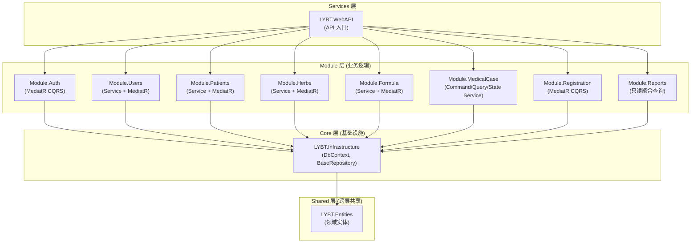
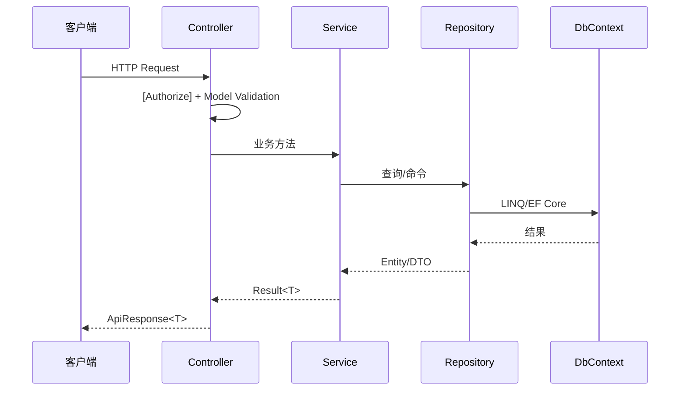

# 服务端架构

## 概述

Server 层采用模块化单体架构: Controller -> Service/MediatR Handler -> Repository -> DbContext，分为 Core (基础设施)、Modules (业务逻辑)、Services (API 入口) 三组，共 8 个业务模块。6 个模块 (Auth/Users/Patients/Herbs/Formula/Registration) 使用 MediatR CQRS，其中 Users/Patients/Herbs/Formula 由 Service 处理简单 CRUD、MediatR 处理复杂命令；MedicalCase 采用 Command/Query/State 三 Service 拆分（无 MediatR）；Reports 为只读聚合查询模块。Prescriptions 模块已于 2026-01-05 移除，处方功能迁移到 MedicalCase 聚合根内。

## 架构图



## 请求生命周期



## Core 层

### LYBT.Entities

领域实体定义，默认采用贫血模型。实际位置 `src/Shared/LYBT.Entities/`（2026-08 实体源统一后移出 Core 层）。

**职责**:
- 定义所有领域实体 (继承 `BaseEntity`)
- 定义领域枚举和值对象
- 无外部依赖，仅引用 .NET BCL

> **例外**: `MedicalCaseModel` 作为唯一 DDD 聚合根，包含域方法 (`Complete()`, `Suspend()`, `SoftDelete()`, `UpdateConsultation()`)，采用充血模型；另有计算属性 `IsLocked / IsActive / IsCompleted`。其他实体保持贫血模型。

**目录结构**:
```
LYBT.Entities/
  Auth/              # AuthSessionModel, SecurityAuditLog
  Common/            # BaseEntity, IAuditableEntity, ISoftDeletable, SystemLog
  Consultations/     # ConsultationModel
  Formulas/          # FormulaModel, FormulaHerbItem
  Herbs/             # HerbModel
  MedicalCases/      # MedicalCaseModel, MedicalCaseAuditLog, MedicalCasePrintLog
  Patients/          # PatientModel
  Prescriptions/     # PrescriptionModel, PrescriptionItem
  Registrations/     # RegistrationModel
  Users/             # ApplicationUser
```

**BaseEntity 通用字段**: Id, CreatedAt, UpdatedAt, CreatedBy, UpdatedBy, RowVersion, IsDeleted。详见 [data-model.md](04-data-model.md) 的 BaseEntity 章节。

### LYBT.Infrastructure

基础设施层，提供数据访问和跨模块服务。

**职责**:
- `AppDbContext` -- EF Core 数据库上下文
- `BaseRepository<T>` -- Repository 基类 (5 个核心方法：GetByIdAsync/AddAsync/UpdateAsync/DeleteAsync/SaveChangesAsync，复杂查询由各模块 Repository 自定义)
- 跨模块服务接口 (ISP 原则，D5-1 设计，位于 `Services/CrossModule/`):
  - `ICrossModuleService` -- 统一接口，替代旧的 `IPatientCrossModuleService`/`IHerbCrossModuleService`/`IUserCrossModuleService`；实现 `CrossModuleService` 委托各域服务
  - `IPatientCrossModuleService` / `IHerbCrossModuleService` / `IUserCrossModuleService` -- 域接口 (旧接口文件保留，由统一接口委托/并存)
  - `IMedicalCaseCrossModuleService` -- 医案域接口 (供 Patients 引用检查)
  - `IRegistrationCrossModuleService` -- 挂号域接口 (供 MedicalCase)
- `IRepository<T>` -- Repository 接口定义
- EF Core 实体配置 (Fluent API)
- 数据库迁移文件

**目录结构**:
```
LYBT.Infrastructure/
  Caching/                   # 缓存
  Configuration/             # 配置
  Constants/                 # PolicyConstants 等常量
  Data/                      # AppDbContext + EF Core Fluent API 配置
  ExceptionHandling/         # IExceptionHandler 等
  Extensions/                # DI 扩展方法
  Interfaces/                # IRepository<T> 等
  Logging/                   # 日志相关
  Migrations/                # EF Core 迁移
  Repositories/              # BaseRepository<T>
  Serialization/             # 序列化
  Services/                  # BaseService + CrossModule/ 跨模块服务
  SharedKernel/              # 共享内核
  Web/                       # BaseApiController / BaseCrudController / BaseClaimsHelper / ControllerBaseExtensions / OperatorAccessor
```

> 错误码枚举位于 `LYBT.Shared.Models/Primitives/ErrorCodes/`：`ErrorCode.cs` (枚举) / `ErrorCategory.cs` / `ErrorMessages.cs` / `ErrorCodeExtensions.cs`。

**BaseRepository 公开方法 (5 个)**: GetByIdAsync / AddAsync / UpdateAsync / DeleteAsync / SaveChangesAsync。复杂查询由各模块 Repository 自定义方法实现。

## Module 层

### 标准目录结构

模块实际存在三种目录形态:

**CQRS 模块** (Auth/Users/Patients/Herbs/Formula/Registration，各模块另有 Controllers/Mappers 等变体):
```
LYBT.Module.{Domain}/
  {Domain}Module.cs            # 模块注册入口
  Application/                 # MediatR Commands/Queries + Handlers/Validators
  Domain/                      # 领域实体、领域事件
  Infrastructure/              # 模块 DbContext、Repository 实现
  Interfaces/                  # I{Entity}Repository / I{Entity}Service 接口
  Services/                    # Service 实现 (trivial CRUD、跨模块服务)
```

**MedicalCase** (Command/Query/State 三 Service 拆分):
```
LYBT.Module.MedicalCase/
  Controllers/ Interfaces/ Mappers/ Repositories/ Services/
```

**Reports** (只读聚合查询):
```
LYBT.Module.Reports/
  Domain/ Infrastructure/ Interfaces/
```

### 模块清单

| 模块 | 架构模式 | 跨模块通信 |
|------|----------|------------|
| Auth | MediatR CQRS | ICrossModuleService |
| Users | Service + MediatR | IUserCrossModuleService（供 MedicalCase/Auth） |
| Patients | Service + MediatR | IMedicalCaseCrossModuleService（引用检查） |
| Herbs | Service + MediatR | IHerbCrossModuleService |
| Formula | Service + MediatR | ICrossModuleService |
| MedicalCase | Service 拆分（Command/Query/State） | IRegistrationCrossModuleService + ICrossModuleService |
| Registration | 纯 MediatR CQRS | IRegistrationCrossModuleService |
| Reports | Service + Repository（只读聚合） | - |

> 🧲 **Sync 模块属 v2.0**（N1 决策 2026-06-28）：v1.0 远程与本地数据孤立，`LYBT.Module.Sync` 不在 v1.0 范围。代码可能保留骨架但不在 v1.0 加载。

### MedicalCase 服务拆分 (Command/Query/State)

MedicalCase 作为系统核心聚合根，业务复杂度高，采用 Command/Query/State 三 Service 拆分（非 MediatR）:

| 接口 | 职责 |
|------|------|
| IMedicalCaseCommandService | 写操作（含 `.Deletion` partial、Prescription 内部操作） |
| IMedicalCaseQueryService | 读操作 |
| IMedicalCaseStateService | 状态变更 |
| IMedicalCaseReferenceRepository | 医案引用检查（供 Patients 等模块） |
| IMedicalCaseRepository | 医案数据访问 |

另有实现类文件（非接口）：`MedicalCaseCrossModuleService` / `MedicalCasePrescriptionService` / `MedicalCaseServiceHelper` / `PrescriptionItemService`。Permission/Audit/Rules 服务已随 A-03 MediatR 简化移除，代码中不存在。

**适用标准**: 读写复杂度差异大、细粒度权限控制、完整审计日志、复杂状态流转。MedicalCase 采用 Service 拆分而非 MediatR（2026-08-02 决策：MediatR 保留用于复杂业务，trivial CRUD 直接注入）。

### Service + MediatR 模式 (其他模块)

标准 CRUD 模块由 Service 处理简单 CRUD，复杂命令/查询通过 MediatR Handler:

```
Controller -> I{Entity}Service -> {Entity}Repository -> DbContext
Controller -> MediatR Command/Query -> Handler -> {Entity}Repository -> DbContext
```

## Services 层 (WebAPI)

### 职责

- HTTP 请求处理和路由
- JWT 认证授权中间件
- 全局异常处理 (IExceptionHandler)
- Serilog 两阶段日志初始化
- 模块注册编排

### Controller 规范

```csharp
// CRUD 控制器: 继承 BaseCrudController，注入 ISender 派发 MediatR 命令/查询
[ApiController]
[ApiVersion("1")]
[Route("api/v{version:apiVersion}/registrations")]
public abstract class BaseRegistrationsController : BaseCrudController
{
    protected BaseRegistrationsController(ISender sender, ILogger logger)
        : base(sender, logger)
    {
    }

    [HttpGet]
    public override async Task<IActionResult> GetList(
        [FromQuery] int page = 1, [FromQuery] int pageSize = 20, CancellationToken ct = default)
    {
        if (ValidatePagination(page, pageSize) is { } error) return error;

        var result = await Sender.Send(new GetRegistrationsQuery(page, pageSize, null, null, null, null, null), ct);
        return SuccessPaged(result, "查询成功");
    }
}

// 只读聚合控制器: 注入 Service 接口 (Reports 示例)
[ApiController]
[ApiVersion("1")]
[Route("api/v{version:apiVersion}/reports")]
[Authorize(Policy = PolicyConstants.DoctorOrAdmin)]
public class ReportsController : BaseApiController
{
    private readonly IReportService _reportService;

    public ReportsController(IReportService reportService, ILogger<ReportsController> logger)
        : base(logger)
    {
        _reportService = reportService;
    }

    [HttpGet("daily/income")]
    public async Task<IActionResult> GetDailyIncome(CancellationToken cancellationToken)
    {
        var dto = await _reportService.GetDailyIncomeAsync(DateTime.Today, DateTime.Today, cancellationToken);
        return Success(dto, "查询成功");
    }
}
```

**规则**:
- Controller 注入 Service 接口，禁止注入 Repository 或 DbContext
- Controller 层零 catch 块，异常由 IExceptionHandler 统一处理
- 使用 `[Authorize]` 控制访问权限

### RESTful API 规范

```
GET    /api/{resource}           # 列表 (分页)
GET    /api/{resource}/{id}      # 详情
POST   /api/{resource}           # 创建
PUT    /api/{resource}/{id}      # 更新
DELETE /api/{resource}/{id}      # 删除
```

### API 版本策略

- **方式**: URL 段版本控制 (`/api/v1/`)
- **当前版本**: v1 (v1.x 无破坏性变更计划)
- **客户端处理**: Desktop `ApiRouter` 为所有请求自动添加 `/api/v1/` 前缀
- **LocalWebAPI**: 相同 `/api/v1/` 前缀，路由模板与远程 WebAPI 一致
- **v2 迁移**: 新 URL 段 `/api/v2/`，v1 向后兼容持续维护
- **版本生命周期**: v(N) 发布后，v(N-1) 废弃期 6 个月

### 统一响应格式

**成功**:
```json
{
  "success": true,
  "data": { ... },
  "message": "操作成功"
}
```

**失败** (RFC 7807 Problem Details):
```json
{
  "type": "https://tools.ietf.org/html/rfc7807",
  "title": "验证失败",
  "status": 400,
  "detail": "患者姓名不能为空",
  "instance": "/api/patients",
  "correlationId": "xxx",
  "errorCode": 30001
}
```

## 依赖注入

### Server 端 DI 注册

```csharp
// Module 注册 (Scoped 生命周期)
services.AddScoped<IPatientService, PatientService>();
services.AddScoped<IPatientRepository, PatientRepository>();

// Mapperly 映射器 (Singleton，无状态)
services.AddSingleton<PatientMapper>();

// FluentValidation 验证器
services.AddScoped<IValidator<PatientInputDto>, PatientInputDtoValidator>();
```

**生命周期规范**:

| 类型 | 生命周期 | 说明 |
|------|----------|------|
| Repository | Scoped | 每请求一个实例，共享 DbContext |
| Service | Scoped | 每请求一个实例 |
| Mapper | Singleton | 编译时生成，无状态 |
| Validator | Scoped | 可能依赖 Scoped 服务 |

### 模块注册入口

每个 Module 提供 `{Domain}Module.cs`，在 `Program.cs` 中调用:

```csharp
// Program.cs
builder.Services.AddAuthModule(builder.Configuration);
builder.Services.AddUsersModule();
builder.Services.AddPatientsModule();
// ...
```

## 异常处理

异常处理的完整架构详见 [06-error-handling.md](06-error-handling.md)，包括异常类型体系、IExceptionHandler 处理器链、错误码体系和 CorrelationId 全链路追踪。

### 错误码体系

5 位数字 MCCEE 格式: 模块 (1位) + 子类别 (2位) + 序号 (2位)

| 模块前缀 | 模块 | 子类别范围 | 场景数 |
|----------|------|-----------|--------|
| 0xxxx | 通用错误 | 000xx | ~5 |
| 1xxxx | 用户/认证 | 101xx~103xx | ~15 |
| 2xxxx | 患者管理 | 200xx~208xx | ~18 |
| 3xxxx | 医案管理 | 301xx~306xx | ~29 |
| 4xxxx | 处方管理 (预留) | - | 当前归入 304xx |
| 5xxxx | 药材管理 | 501xx~503xx | ~15 |
| 6xxxx | 验方管理 | 601xx~603xx | ~17 |
| 8xxxx | 挂号管理 | 801xx~803xx | ~3 |

> **总计**: 90+ 错误场景。错误码完整枚举位于 `LYBT.Shared.Models/Primitives/ErrorCodes/ErrorCode.cs`（分区注释: 0xxxx 通用 / 1xxxx 用户 / 2xxxx 患者 / 3xxxx 医案 / 4xxxx 处方 / 5xxxx 草药 / 6xxxx 配方 / 8xxxx 挂号）。详见各模块 PRD 文档的"错误码"章节和 [11c-error-handling.md](../02-requirements/11c-error-handling.md)。

## Service 层规范

### BaseService 层次结构

> 实际状态 (2026-08-05 核对): `BaseService` 仅提供统一的 `ILogger` 注入，不含 ExecuteAsync/ValidateAsync 能力。

`BaseService` (非泛型) 提供 `ILogger` 注入；`BaseService<T>` 提供类型安全的 Logger。仅 MedicalCase 的 Command/Query/State 三个 Service 继承 `BaseService<MedicalCase>`；其余模块 Service (UserService/PatientService/HerbService/FormulaService 等) 直接实现各自接口，不继承 BaseService。

### 返回值类型

所有 Service 方法统一返回 `Result<T>` (S5 完成后 SyncService 从 `ServiceResult<T>` 迁移到 `Result<T>`):

```csharp
// 成功
return Result<PatientDto>.Success(dto);

// 失败
return Result<PatientDto>.Failure("患者不存在");
```

### 构造函数参数顺序

```
Repository -> Mapper -> Logger -> Validator -> 其他依赖
```

### 错误处理

- Service 层不捕获异常 (异常透传到 IExceptionHandler)
- 业务验证失败返回 `Result.Failure`，不抛异常
- 保留 fire-and-forget 场景的 catch (审计日志等非关键操作)

### FluentValidation 集成

Create/Update 方法在业务逻辑前调用验证。Validator 架构与共享规则见 [08-shared.md](08-shared.md#lybtsharedvalidators-fluentvalidation-验证器)。

### 大型 Service 拆分标准

超过 500 行的 Service 必须拆分为职责单一的子服务:
- Command (Create/Update/Delete)
- Query (Get/List/Search)
- State (状态变更)
- 删除原 Service，Controller 直接注入子服务

## 事务边界模型

> 设计文档: design-deepening-phase3 3.3 节

三级事务模型:

| 级别 | 范围 | 机制 | 典型场景 |
|------|------|------|----------|
| **L1** | 单 Repository | 隐式 `SaveChangesAsync()` | 单实体 CRUD (Patient/Herb/User) |
| **L2** | 聚合根 | 单次 `SaveChangesAsync()` 覆盖多实体 | MedicalCase + Consultation + Prescription + Items 聚合保存 |
| **L3** | 跨聚合 | 显式 `BeginTransactionAsync()` | Sync 批量上传、批量导入 (事务内多次 SaveChanges，失败整体回滚) |

**规则**:
- L1/L2 不需要显式事务 (EF Core SaveChanges 自带隐式事务)
- L3 场景必须使用 `IDbContextTransaction`，确保跨实体原子性
- MedicalCase 聚合保存属于 L2: 单次 SaveChanges 写入 4 层实体

## 模块独立 DbContext

5 个模块拥有独立 DbContext：

- Auth: `AuthDbContext`（AuthSessionRepository 注入）
- Users: `UsersDbContext`
- Herbs: `HerbsDbContext`（HerbRepository 注入）
- Formula: `FormulaDbContext`
- Reports: `ReportsDbContext`（已注册，但 ReportRepository 实际注入 AppDbContext，待清理）

均通过 `ConnectionStringResolver.GetEffectiveConnectionString()` 三级回退获取连接字符串（`Database:ConnectionString` → `ConnectionStrings:DefaultConnection` → `CONNECTION_STRING` 环境变量）。

复用 `AppDbContext` 的 5 个模块：

- Patients: PatientRepository 注入 AppDbContext
- MedicalCase: MedicalCaseRepository 注入 AppDbContext
- Registration: RegistrationRepository 注入 AppDbContext
- Auth: SecurityAuditRepository 注入 AppDbContext
- Herbs: HerbReferenceRepository 注入 AppDbContext

架构测试与此设计相呼应：P02（Repository 必须继承 BaseRepository）对直接注入 DbContext 的模块内 Repository 予以豁免（构造参数含 DbContext 即豁免）；P10（Service 禁止直接注入 AppDbContext）仅约束 Service 层，Repository 不受限。

## 数据库约定

### 命名

- 表名: PascalCase 复数 (如 `MedicalCases`)
- 列名: PascalCase (如 `PatientId`)
- 外键: `{RelatedEntity}Id`

### EF Core 配置

- Fluent API 配置优先于 Data Annotations
- 配置类: `{Entity}Configuration : IEntityTypeConfiguration<Entity>`
- 全局查询过滤器: `IsDeleted == false`
- DateTime 统一使用 UTC

### 实体命名冲突处理

当实体类名与模块命名空间冲突时，使用 using 别名:

| 实体 | 冲突 | 别名 |
|------|------|------|
| Formula | LYBT.Module.Formula 命名空间 | `FormulaEntity` |
| MedicalCase | LYBT.Module.MedicalCase | `MedicalCaseEntity` |

## 缓存策略

Server 端采用 ASP.NET Core OutputCache（标签分组）+ IMemoryCache（高频查询+权限），Desktop 端使用 ApiService GET 缓存。完整策略见 [nfr.md 第 5 章](../02-requirements/12-nfr.md)。

---

## 运维与安全

> 以下为 Server 层特有的运维能力。通用运维架构（敏感数据脱敏、API 请求日志、启动配置验证、安全审计日志、日志清理、启动诊断）详见 [11d-observability.md](../02-requirements/11d-observability.md)。

### Token Family 管理

> 对应 AUTH-D06 (单会话策略) + AUTH-D07 (角色变更即时生效)，详见 [auth.md](../02-requirements/02-auth.md)。

**单会话登录** (AUTH-D06): 同一账号仅允许一台设备登录。新设备登录时，AuthService 撤销该用户所有现有 Token Family (按 FamilyId 批量标记 IsRevoked=true)。旧设备下次请求或刷新 Token 时触发 TokenRevoked → 强制登出。

**角色变更即时生效** (AUTH-D07): 用户角色变更时，UserService 通过 `ICrossModuleAuthService.RevokeAllUserTokensAsync()` 撤销该用户 Token Family，强制重登录。复用单会话的 Token Family 撤销逻辑。

**跨模块 Token 撤销** (ICrossModuleAuthService): ⚠️ **已设计未实现** — 代码中不存在此接口，以下为设计说明，待后续实现。

> **安全风险**：当前用户被删除/禁用、密码变更、角色降级后，旧 Token 仍有效（最长 30 分钟）。建议优先实现此接口。

独立接口 (ISP 原则，不污染 ICrossModuleQueryService)，Auth 模块提供实现，6 个触发场景:

| 场景 | 调用方 | reason |
|------|--------|--------|
| 登录踢出 (AUTH-D06) | AuthService.LoginAsync | NewDeviceLogin |
| 角色变更 (AUTH-D07) | UserService.UpdateRoleAsync | RoleChanged |
| 删除用户 | UserService.DeleteAsync | UserDeleted |
| 重置密码 | UserService.ResetPasswordAsync | PasswordReset |
| 修改密码 | UserService.ChangePasswordAsync | PasswordChanged |
| 禁用用户 | UserService.ToggleStatusAsync | UserDisabled |

**实现要点**:
- RefreshToken 表通过 FamilyId 字段追踪 Token 家族
- 撤销操作为批量 UPDATE: `SET IsRevoked=true WHERE UserId=@userId AND IsRevoked=false` (含 RefreshToken + AutoLoginToken)
- 重放攻击检测: 已使用 (IsUsed=true) 的 RefreshToken 再次提交 → 整个 Family 失效 (ERR-10203 TokenRevoked)
- 延迟踢出 (AUTH-D08): 撤销后旧 AccessToken 最长 30 分钟内仍有效 (JWT 无状态，不引入黑名单)

### 备份服务

> 对应 [NFR-AVAIL-001](../02-requirements/12-nfr.md)。

| 数据库 | 备份方式 | 频率 | 保留期 |
|--------|---------|------|--------|
| SQL Server (远程) | SQL Server Agent 自动全量备份 | 每日 | 30 天 |
| SQL Server LocalDB (本地 LocalWebAPI) | 标准 SQL Server 备份策略 | 按需 | 按需 |

**SQL Server 备份要点**:
- 备份文件命名: `LYBTDB_{yyyyMMdd}.bak`
- 远程模式通过 SQL Server Agent 维护计划配置，不在应用代码中实现
- 本地模式 (LocalWebAPI + SQL Server LocalDB) 使用标准 SQL Server 备份策略，无需手动复制数据库文件
- 恢复优先级: 本地模式降级 (即时) → 从备份还原 (30min 内，对应 RTO) → 重新部署

---

## 架构决策记录

- [ADR-0001: MedicalCase 聚合根](decisions/0001-medicalcase-aggregate-root.md) — MedicalCase 为唯一充血模型，Consultation/Prescription 为内部实体
- [ADR-0004: 用户上下文传递模式](decisions/0004-user-context-propagation.md) — 从 HTTP 请求到 Service/Repository 层的用户信息传递方案
- [ADR-0005: SuperAdmin 归属 Auth 模块](decisions/0005-superadmin-auth-module.md) — SuperAdmin 系统初始化账户的归属与认证流程设计
- [ADR-0008: Token 安全防御性设计](decisions/0008-token-security-defensive-design.md) — Token Family、轮换机制和重放攻击检测策略

## 变更记录

| 日期 | 版本 | 变更内容 |
|------|------|----------|
| 2026-08-05 | v2.3 | **文档与代码全面对齐（14 项）**: 架构模式总述/架构图（Entities 移入 Shared 层、模块标注实际模式）/模块目录结构三形态/模块清单跨模块通信方向/MedicalCase 服务清单（5 接口，删 Permission/Audit/Rules）/Controller 规范示例/新增模块独立 DbContext 小节/错误码表（删 7xxxx、增 8xxxx、枚举位置）/BaseService 实际状态/BaseRepository 5 方法/Entities 位置与目录/错误码枚举位置等 |
| 2026-06-28 | v2.2 | **spec S3 批次2 提炼（707→~530 行）**：BaseRepository 21 方法表改源码链接；缓存策略段（OutputCache/IMemoryCache/失效矩阵）改链接到 nfr.md；Validator 架构改链接到 08-shared.md；US-LOG/CFG/SYS 七段（敏感数据脱敏/API请求日志/启动配置验证/安全审计日志/日志清理/审计清理/Server启动诊断）合并为概览表改链接到 11d-observability.md/11b-configuration.md。变更历史见 git log。 |
| 2026-06-28 | v2.1 | **N1 + 模块对齐**: 模块清单补 Reports（D9 补回 v1.0）; 架构图 Sync→Reports; Sync 标 🧲 v2.0 |
