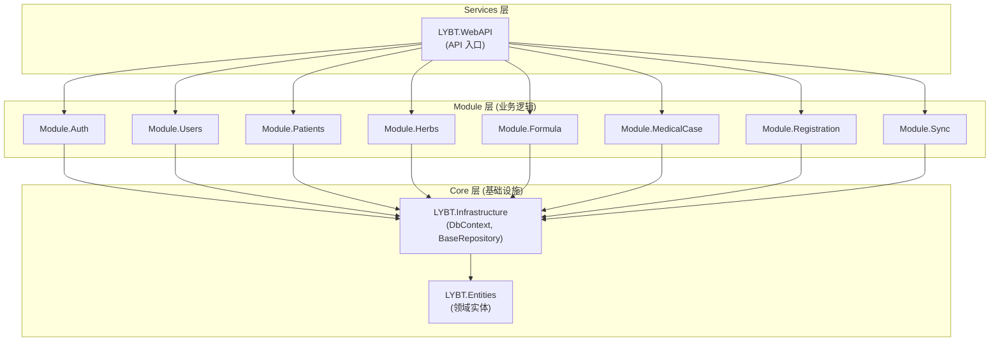

# 服务端架构

## 概述

Server 层采用经典三层架构: Controller -> Service -> Repository -> DbContext。分为 Core (基础设施)、Modules (业务逻辑)、Services (API 入口) 三组。简单模块使用传统三层模式，复杂模块 (MedicalCase) 使用 CQRS 模式。Prescriptions 模块已于 2026-01-05 移除，处方功能迁移到 MedicalCase 聚合根内。

## 架构图



## Core 层

### LYBT.Entities

领域实体定义，默认采用贫血模型。

**职责**:
- 定义所有领域实体 (继承 `BaseEntity`)
- 定义领域枚举和值对象
- 无外部依赖，仅引用 .NET BCL

> **例外**: `MedicalCaseModel` 作为唯一 DDD 聚合根，包含域方法 (`Complete()`, `SaveAsDraft()`, `SoftDelete()`, `UpdateConsultation()`)，采用充血模型。其他实体保持贫血模型。

**目录结构**:
```
LYBT.Entities/
  Auth/              # AuthSession, RefreshToken
  Consultations/     # Consultation
  Formulas/          # Formula, FormulaHerbItem
  Herbs/             # Herb
  Patients/          # Patient
  Prescriptions/     # Prescription, PrescriptionItem
  MedicalCases/      # MedicalCase, MedicalCasePrintLog
  Users/             # User, UserRole 枚举
  Common/            # BaseEntity, 通用枚举
```

**BaseEntity 通用字段**: Id, CreatedAt, UpdatedAt, CreatedBy, UpdatedBy, RowVersion, IsDeleted。详见 [data-model.md](04-data-model.md) 的 BaseEntity 章节。

### LYBT.Infrastructure

基础设施层，提供数据访问和跨模块服务。

**职责**:
- `AppDbContext` -- EF Core 数据库上下文
- `BaseRepository<T>` -- Repository 基类 (21 个公开方法)
- 跨模块服务接口 (ISP 原则，D5-1 设计):
  - `ICrossModuleService` -- 旧统一接口 (标记 `[Obsolete]`，S3 渐进迁移)
  - `IPatientCrossModuleService` -- 患者查询 + 引用检查 (S3 新增)
  - `IHerbCrossModuleService` -- 药材查询 + 引用检查 (S3 新增)
  - `IUserCrossModuleService` -- 用户查询 + 凭证操作 (S3 新增)
  - `ICrossModuleAuthService` -- Token 撤销 (已设计，6 个触发场景)
- `IRepository<T>` -- Repository 接口定义
- EF Core 实体配置 (Fluent API)
- 数据库迁移文件

**目录结构**:
```
LYBT.Infrastructure/
  Data/
    AppDbContext.cs
    Configurations/          # EF Core Fluent API 配置
      Base/                  # BaseEntityConfiguration
      PatientConfiguration.cs
      ...
  Interfaces/
    IRepository.cs
  Repositories/
    BaseRepository.cs        # 标准 CRUD + 分页 + 高级查询
  Services/
    ICrossModuleService.cs
    CrossModuleService.cs
  DependencyInjection/       # DI 扩展方法
  Logging/                   # 日志相关
  Migrations/                # EF Core 迁移
  Validation/                # 验证工具
  Web/
    BaseApiController.cs     # Controller 基类
    ApiErrorCodes.cs         # 错误码定义
```

**BaseRepository 公开方法 (21 个)**:

| 方法 | 说明 |
|------|------|
| `GetByIdAsync(id)` | 按 ID 查询 |
| `GetAllAsync()` | 查询全部 |
| `FindAsync(predicate)` | 条件查询 (简单版) |
| `FindAsync(predicate, orderBy, includes, skip, take)` | 条件查询 (高级版，支持预加载和分页) |
| `SelectAsync(predicate, selector)` | 投影查询 |
| `GetPagedAsync(page, size, keyword)` | 分页查询 (模板方法) |
| `GetPagedAsync(page, size, predicate, orderBy, ascending)` | 高级分页查询 |
| `ExistsAsync(predicate)` | 存在检查 |
| `CountAsync()` | 数量统计 (无条件) |
| `CountAsync(predicate)` | 数量统计 (有条件) |
| `AddAsync(entity)` | 创建 |
| `AddRangeAsync(entities)` | 批量创建 |
| `UpdateAsync(entity)` | 更新 |
| `UpdateRangeAsync(entities)` | 批量更新 |
| `DeleteAsync(id)` | 软删除 |
| `DeleteRangeAsync(predicate)` | 批量软删除 |
| `HardDeleteAsync(id)` | 物理删除 |
| `GetQueryable()` | 获取可查询对象 |
| `GetNoTrackingQueryable()` | 获取不跟踪查询对象 |
| `FromSqlRawAsync(sql, params)` | 原生 SQL 查询 |
| `SaveChangesAsync()` | 保存更改 (含 RowVersion 同步) |

**分页查询模板方法模式**:
子类通过覆盖 `ApplyKeywordFilter` 和 `ApplyDefaultOrdering` 提供定制逻辑，不重写 `GetPagedAsync` 本身。

## Module 层

### 标准目录结构

```
LYBT.Module.{Domain}/
  {Domain}Module.cs            # 模块注册入口
  Repositories/
    {Entity}Repository.cs      # Repository 实现
  Services/
    I{Entity}Service.cs        # Service 接口
    {Entity}Service.cs         # Service 实现
  Mapping/
    {Entity}Mapper.cs          # Mapperly 映射器
  Validators/                  # FluentValidation 验证器 (可选)
```

### 模块清单

| 模块 | 架构模式 | 跨模块通信 | 说明 |
|------|----------|------------|------|
| Auth | 传统三层 | IUserService | JWT 认证、Token 管理 |
| Users | 传统三层 | - | 用户 CRUD、密码管理 |
| Patients | 传统三层 | - | 患者 CRUD、导入导出 |
| Herbs | 传统三层 | - | 药材 CRUD、分类、导入 |
| Formula | 传统三层 | ICrossModuleService | 验方 CRUD、药材绑定 |
| MedicalCase | CQRS | IPatientService | 医案核心，状态机管理 |
| Registration | 传统三层 | - | 挂号管理，队列状态流转 |
| Sync | 传统三层 | - | 数据同步 |

### CQRS 模式 (MedicalCase)

MedicalCase 作为系统核心聚合根，业务复杂度高，采用 CQRS 拆分:

| Service | 职责 | 方法示例 |
|---------|------|----------|
| IMedicalCaseCommandService | 写操作 | CreateAsync, SaveAsync, CreatePrescriptionAsync |
| IMedicalCaseQueryService | 读操作 | GetByIdAsync, GetPagedAsync, SearchAsync |
| IMedicalCaseStateService | 状态变更 | CompleteAsync, SaveDraftAsync, CancelAsync, UpdateStatusAsync |
| IMedicalCasePermissionService | 唯一权限权威 | CanEdit, CanDelete, GetPermissions |
| IMedicalCaseAuditService | 审计日志 | LogAsync, DetectChanges |
| MedicalCaseRules | 无状态策略 | CanCreateNewCase, HasActiveCase, IsValidStatusTransition |
| MedicalCaseServiceHelper | 共享工具 | CloneMedicalCaseForAudit, ValidateAndFetchCreationContextAsync, EnsureCanEdit, ExecuteWithConcurrencyRetryAsync |

**适用标准**: 读写复杂度差异大、细粒度权限控制、完整审计日志、复杂状态流转。

### 传统三层模式 (其他模块)

标准 CRUD 模块使用单一 Service:

```
Controller -> I{Entity}Service -> {Entity}Repository -> DbContext
```

## Services 层 (WebAPI)

### 职责

- HTTP 请求处理和路由
- JWT 认证授权中间件
- 全局异常处理 (IExceptionHandler)
- Serilog 两阶段日志初始化
- 模块注册编排

### Controller 规范

```csharp
[ApiController]
[Route("api/[controller]")]
[Authorize]
public class PatientsController : BaseApiController
{
    private readonly IPatientService _service;

    public PatientsController(IPatientService service)
    {
        _service = service;
    }

    [HttpGet("{id:guid}")]
    public async Task<IActionResult> GetById(Guid id)
    {
        return Ok(await _service.GetByIdAsync(id));
    }
}
```

**规则**:
- Controller 注入 Service 接口，禁止注入 Repository 或 DbContext
- Controller 层零 catch 块，异常由 IExceptionHandler 统一处理
- 使用 `[Authorize]` 控制访问权限

### RESTful API 规范

```
GET    /api/{resource}           # 列表 (分页)
GET    /api/{resource}/{id}      # 详情
POST   /api/{resource}           # 创建
PUT    /api/{resource}/{id}      # 更新
DELETE /api/{resource}/{id}      # 删除
```

### 统一响应格式

**成功**:
```json
{
  "success": true,
  "data": { ... },
  "message": "操作成功"
}
```

**失败** (RFC 7807 Problem Details):
```json
{
  "type": "https://tools.ietf.org/html/rfc7807",
  "title": "验证失败",
  "status": 400,
  "detail": "患者姓名不能为空",
  "instance": "/api/patients",
  "correlationId": "xxx",
  "errorCode": 30001
}
```

## 依赖注入

### Server 端 DI 注册

```csharp
// Module 注册 (Scoped 生命周期)
services.AddScoped<IPatientService, PatientService>();
services.AddScoped<IPatientRepository, PatientRepository>();

// Mapperly 映射器 (Singleton，无状态)
services.AddSingleton<PatientMapper>();

// FluentValidation 验证器
services.AddScoped<IValidator<PatientInputDto>, PatientInputDtoValidator>();
```

**生命周期规范**:

| 类型 | 生命周期 | 说明 |
|------|----------|------|
| Repository | Scoped | 每请求一个实例，共享 DbContext |
| Service | Scoped | 每请求一个实例 |
| Mapper | Singleton | 编译时生成，无状态 |
| Validator | Scoped | 可能依赖 Scoped 服务 |

### 模块注册入口

每个 Module 提供 `{Domain}Module.cs`，在 `Program.cs` 中调用:

```csharp
// Program.cs
builder.Services.AddAuthModule(builder.Configuration);
builder.Services.AddUsersModule();
builder.Services.AddPatientsModule();
// ...
```

## 异常处理

异常处理的完整架构详见 [06-error-handling.md](06-error-handling.md)，包括异常类型体系、IExceptionHandler 处理器链、错误码体系和 CorrelationId 全链路追踪。

### 错误码体系

5 位数字 MCCEE 格式: 模块 (1位) + 子类别 (2位) + 序号 (2位)

| 模块前缀 | 模块 | 子类别范围 | 场景数 |
|----------|------|-----------|--------|
| 0xxxx | 通用错误 | 000xx | ~5 |
| 1xxxx | 用户/认证 | 101xx~103xx | ~15 |
| 2xxxx | 患者管理 | 200xx~208xx | ~18 |
| 3xxxx | 医案管理 | 301xx~306xx | ~29 |
| 4xxxx | 处方管理 (预留) | - | 当前归入 304xx |
| 5xxxx | 药材管理 | 501xx~503xx | ~15 |
| 6xxxx | 验方管理 | 601xx~603xx | ~17 |
| 7xxxx | 数据同步 | 701xx~705xx | ~20 |

> **总计**: 90+ 错误场景。详见各模块 PRD 文档的"错误码"章节和 [error-handling.md](../02-requirements/13-error-handling.md)。

## Service 层规范

### BaseService 层次结构 (D2-1)

> 设计文档: d2-d5-design | 实施: S5

所有 Service 统一继承 BaseService 层次结构:

```
BaseService (非泛型)
  ├── 跨域 Service: AuthService, SyncService
  └── BaseService<T> (泛型，继承 BaseService)
       └── CRUD Service: HerbService, PatientService, FormulaService (A3-07), MedicalCase*
```

| 基类 | 适用场景 | 提供能力 |
|------|----------|---------|
| `BaseService` | 跨域服务 (Auth, Sync) | ExecuteAsync (三层异常处理), ValidateAsync (FluentValidation 封装) |
| `BaseService<T>` | CRUD 实体服务 | 继承 BaseService 全部能力 + 泛型约束 |

**当前状态**: HerbService/PatientService/FormulaService 已继承 (FormulaService 在 Sprint3-Batch4a A3-07 完成迁移)，AuthService/SyncService 待统一 (S5)

### 返回值类型

所有 Service 方法统一返回 `Result<T>` (S5 完成后 SyncService 从 `ServiceResult<T>` 迁移到 `Result<T>`):

```csharp
// 成功
return Result<PatientDto>.Success(dto);

// 失败
return Result<PatientDto>.Failure("患者不存在");
```

### 构造函数参数顺序

```
Repository -> Mapper -> Logger -> Validator -> 其他依赖
```

### 错误处理

- Service 层不捕获异常 (异常透传到 IExceptionHandler)
- 业务验证失败返回 `Result.Failure`，不抛异常
- 使用 `ExecuteAsync<T>()` 包装可能抛异常的操作
- 保留 fire-and-forget 场景的 catch (审计日志等非关键操作)

### FluentValidation 集成

Create/Update 方法在业务逻辑前调用验证:

```csharp
var validationResult = await _validator.ValidateAsync(dto);
if (!validationResult.IsValid)
    return Result<T>.Failure(validationResult.Errors);
```

### Validator 架构与迁移

Validator 原先分散在各业务模块 (`Module.{Entity}/Validators/`) 中，存在重复规则和不一致的问题。当前采用分层迁移策略:

| 层级 | 位置 | 职责 | 示例 |
|------|------|------|------|
| **共享验证规则** | `Shared.Validators/` | 跨模块通用规则 (手机号、身份证、中文姓名等) | `PhoneNumberValidator`, `IdNumberValidator` |
| **模块验证器** | `Module.{Entity}/Validators/` | 模块专属业务规则 (引用共享规则) | `PatientInputDtoValidator` |

**迁移原则**: 2 个以上模块共用的验证规则提取到 `Shared.Validators`；仅单模块使用的规则保留在模块内。模块 Validator 通过组合 (`Include()` / `SetValidator()`) 引用共享规则，避免代码重复。

### 大型 Service 拆分标准

超过 500 行的 Service 必须拆分为职责单一的子服务:
- Command (Create/Update/Delete)
- Query (Get/List/Search)
- State (状态变更)
- 删除原 Service，Controller 直接注入子服务

## 事务边界模型

> 设计文档: design-deepening-phase3 3.3 节

三级事务模型:

| 级别 | 范围 | 机制 | 典型场景 |
|------|------|------|----------|
| **L1** | 单 Repository | 隐式 `SaveChangesAsync()` | 单实体 CRUD (Patient/Herb/User) |
| **L2** | 聚合根 | 单次 `SaveChangesAsync()` 覆盖多实体 | MedicalCase + Consultation + Prescription + Items 聚合保存 |
| **L3** | 跨聚合 | 显式 `BeginTransactionAsync()` | Sync 批量上传、批量导入 (事务内多次 SaveChanges，失败整体回滚) |

**规则**:
- L1/L2 不需要显式事务 (EF Core SaveChanges 自带隐式事务)
- L3 场景必须使用 `IDbContextTransaction`，确保跨实体原子性
- MedicalCase 聚合保存属于 L2: 单次 SaveChanges 写入 4 层实体

## 数据库约定

### 命名

- 表名: PascalCase 复数 (如 `MedicalCases`)
- 列名: PascalCase (如 `PatientId`)
- 外键: `{RelatedEntity}Id`

### EF Core 配置

- Fluent API 配置优先于 Data Annotations
- 配置类: `{Entity}Configuration : IEntityTypeConfiguration<Entity>`
- 全局查询过滤器: `IsDeleted == false`
- DateTime 统一使用 UTC

### 实体命名冲突处理

当实体类名与模块命名空间冲突时，使用 using 别名:

| 实体 | 冲突 | 别名 |
|------|------|------|
| Formula | LYBT.Module.Formula 命名空间 | `FormulaEntity` |
| MedicalCase | LYBT.Module.MedicalCase | `MedicalCaseEntity` |

## 缓存策略

> 详细缓存参数和失效映射见 [nfr.md](../02-requirements/17-nfr.md) 第 5 章。

### Server 端

采用 ASP.NET Core OutputCache 中间件，按标签分组管理:

| 缓存标签 | 过期时间 | 挂载端点 |
|----------|---------|---------|
| `herbs` | 30 分钟 | GET /api/v1/herbs |
| `formulas` | 2 小时 | GET /api/v1/formulas |
| `patients` | 30 分钟 | GET /api/v1/patients |
| `medicalcases` | 20 分钟 | GET /api/v1/medicalcases |
| `permissions` | 10 分钟 | GET /api/v1/users |

**失效策略** (NFR-D07): 写操作成功后调用 `IOutputCacheStore.EvictByTagAsync(tag)` 主动清除。跨模块失效示例: 创建医案同时清除 `medicalcases` + `patients` (患者 LastVisitTime 更新)。

### Server 端 IMemoryCache (业务层)

> 设计文档: design-deepening-phase3 3.3 节

用于高频单实体查询，与 OutputCache (HTTP 层) 互补:

| 用途 | Key 模式 | 过期策略 | 失效时机 |
|------|----------|----------|----------|
| 单实体 GetById | `{entity}:{id}` | 滑动 5 分钟 | Update/Delete 时移除 |
| 用户权限 | `user-perms:{userId}` | 滑动 10 分钟 | 角色变更时移除 |

**失效矩阵 (Tag-based)**:

| 触发操作 | OutputCache 失效 | IMemoryCache 失效 |
|----------|-----------------|-------------------|
| Herb Create/Update/Delete | `herbs` tag | `herb:{id}` |
| Herb BatchToggle/Import | `herbs` tag | 清空 `herb:*` |
| Patient Create/Update/Delete | `patients` tag | `patient:{id}` |
| MedicalCase 任何写操作 | `medicalcases` tag | `medicalcase:{id}` |
| User Update/ToggleStatus | -- | `user-info:{id}` + `user-perms:{id}` |
| Sync Upload | 按实体类型清对应 tag | 清空对应 `{entity}:*` |

### Desktop 端

ApiService GET 缓存 (LRU, 1000 条, 5 分钟过期)。写操作后按模块前缀清除相关 GET 缓存 (`RemoveByPrefix`)。

---

## 运维与安全

### 敏感数据脱敏

> 对应 [FR-LOG-003](../02-requirements/14-logging.md)，敏感数据分级标准见 [nfr.md](../02-requirements/17-nfr.md) NFR-SEC-004。

通过 SensitiveDataMaskingEnricher (Serilog ILogEventEnricher) 在日志写入前自动脱敏，两层保护:

**属性级脱敏**: `[SensitiveData(type, mode)]` 标记实体属性，Serilog 析构时通过 SensitiveDataDestructuringPolicy 自动触发。

**文本级脱敏**: SensitiveDataMasker 正则匹配文本中的密码、Token、连接字符串、Bearer Token，自动替换。

脱敏模式、敏感数据分级映射和字段名检测规则的完整定义详见 [shared.md](08-shared.md) 的 SensitiveDataAttribute 设计章节。

### API 请求日志

> 对应 [FR-LOG-007](../02-requirements/14-logging.md)。

ApiLoggingFilter 实现为 IAsyncActionFilter，全局注册，自动记录所有 Controller Action 执行信息:

**日志格式**:
- Action 开始: `[API] >>> {Action} started. CorrelationId={CorrelationId}` (Information)
- Action 完成: `[API] <<< {Action} completed in {Duration}ms` (Information)
- Action 异常: `[API] !!! {Action} failed after {Duration}ms` (Error)

**参数记录** (Debug 级别):
- 敏感字段名自动检测 (SensitiveDataMasker.IsSensitiveFieldName)
- 复杂对象仅显示类型名 `[{TypeName}]`
- 字符串值截断至 100 字符

CorrelationId 从 HttpContext 中间件获取，自动注入到日志上下文，保证同一请求的所有日志可关联。

### 启动配置验证

> 对应 [FR-CFG-004](../02-requirements/11-configuration.md)。

ProductionConfigurationValidator 在 `ASPNETCORE_ENVIRONMENT=Production` 时启动验证关键配置项:

| 配置项 | 级别 | 验证规则 |
|--------|------|---------|
| ConnectionStrings:DefaultConnection | **Critical** | 必须非空 |
| Lybt:Jwt:SecretKey | **Critical** | 必须非空，Base64 解码后 >= 32 字节 |
| Lybt:DefaultPasswords:SysAdminPassword | Important | 必须非空 |
| Lybt:DefaultPasswords:NewUserPassword | Important | 必须非空 |
| Lybt:Business:SystemAdmin:UserName | Important | 必须非空 |
| Lybt:Business:SystemAdmin:Email | Important | 必须非空，符合 Email 格式 |

**处理策略**: Critical 缺失 → 输出详细错误到控制台 + Fatal 日志 → `Environment.Exit(1)` 阻止启动。Important 缺失 → Warning 日志，允许启动。

**错误输出格式**: 包含配置路径、对应环境变量名、问题描述、修复命令示例。

### 安全审计日志

> 对应 [FR-LOG-002](../02-requirements/14-logging.md)。

**SecurityAuditLog 表结构**:

| 字段 | 类型 | 说明 |
|------|------|------|
| Id | Guid (PK) | 主键 |
| EventType | string(50), Required | Login / Logout / RefreshToken / TokenRevoked / LoginFailed / PasswordChange / UserDisabled |
| UserId | Guid? | 用户 ID (LoginFailed 可能无已知用户) |
| UserType | string(50)? | User / SuperAdmin |
| UserName | string(256)? | 用户名称 |
| IpAddress | string(50)? | 客户端 IP |
| UserAgent | string(500)? | 客户端 UA |
| Success | bool, Required | 操作是否成功 |
| ErrorMessage | string(500)? | 错误消息 |
| Metadata | string? | 扩展元数据 (JSON) |
| CreatedAt | DateTime, Default=UtcNow | 创建时间 |

**写入机制**: IAuditService 接口注入到 AuthService，认证事件触发时调用 `LogAsync(eventType, userId, ...)` 写入。审计日志仅追加，不可修改和删除。

**写入策略**: fire-and-forget 模式，审计写入失败不影响业务操作 (异常隔离)。

### 日志清理服务

> 对应 [FR-LOG-005](../02-requirements/14-logging.md)，保留策略见 [nfr.md](../02-requirements/17-nfr.md) NFR-SEC-005。

LogCleanupService 继承 BackgroundService，定期清理过期系统日志:

| 参数 | 默认值 | 配置节 |
|------|--------|--------|
| 启动延迟 | 5 分钟 | `Lybt:Logging:Cleanup:InitialDelayMinutes` |
| 执行周期 | 24 小时 | `Lybt:Logging:Cleanup:CleanupIntervalHours` |
| 保留天数 | 90 天 | `Lybt:Logging:Cleanup:RetentionDays` |
| 批量大小 | 1000 条 | `Lybt:Logging:Cleanup:BatchSize` |

**关键规则**: **Error/Fatal 级别日志永久保留**，仅清理 Warning 及以下级别。分批删除 (每批 1000 条，批间延迟 100ms)，使用原生 SQL `DELETE TOP (@batchSize) FROM SystemLogs WHERE ...`，避免锁表。

清理失败不影响应用运行 (异常隔离)。可通过配置 `Enabled=false` 完全禁用。

### 审计日志清理服务

> 对应 [FR-LOG-006](../02-requirements/14-logging.md)，保留期限 365 天 (NFR-D04)。

SecurityAuditCleanupService 继承 BackgroundService:

| 参数 | 默认值 | 配置节 |
|------|--------|--------|
| 执行时间 | 每日凌晨 3:00 | 固定 |
| 保留天数 | **365 天** | `Lybt:SecurityAudit:Cleanup:RetentionDays` |
| 批量大小 | 1000 条 | - |

分批删除，清理失败异常隔离。执行日志记录清理条数和截止日期。

> **注意**: 当前代码硬编码 30 天保留，需修改为可配置且默认 365 天以匹配 NFR-SEC-005。

### Server 启动诊断

> 对应 [FR-SYS-008](../02-requirements/15-health-diagnostics.md)。

DatabaseStartupDiagnostics 在 Program.cs 启动阶段自动执行:

**检查项**:
1. 数据库连接 (`CanConnectAsync`)
2. 连接池配置验证

**结果处理**:
- 连接成功: Information 日志 (数据库名称 + 服务器地址 + 连接耗时)
- 连接失败: Error 日志 + 故障排查建议列表:
  - 检查 SQL Server 服务是否启动
  - 检查连接字符串配置
  - 检查网络连通性和防火墙
  - 检查数据库权限

**关键**: 诊断失败**不阻塞应用启动** (降级启动)。与 ProductionConfigurationValidator 的区别: 后者在配置缺失时阻止启动，前者在配置正确但连接失败时允许降级运行。

### Token Family 管理

> 对应 AUTH-D06 (单会话策略) + AUTH-D07 (角色变更即时生效)，详见 [auth.md](../02-requirements/02-auth.md)。

**单会话登录** (AUTH-D06): 同一账号仅允许一台设备登录。新设备登录时，AuthService 撤销该用户所有现有 Token Family (按 FamilyId 批量标记 IsRevoked=true)。旧设备下次请求或刷新 Token 时触发 TokenRevoked → 强制登出。

**角色变更即时生效** (AUTH-D07): 用户角色变更时，UserService 通过 `ICrossModuleAuthService.RevokeAllUserTokensAsync()` 撤销该用户 Token Family，强制重登录。复用单会话的 Token Family 撤销逻辑。

**跨模块 Token 撤销** (ICrossModuleAuthService): 独立接口 (ISP 原则，不污染 ICrossModuleQueryService)，Auth 模块提供实现，6 个触发场景:

| 场景 | 调用方 | reason |
|------|--------|--------|
| 登录踢出 (AUTH-D06) | AuthService.LoginAsync | NewDeviceLogin |
| 角色变更 (AUTH-D07) | UserService.UpdateRoleAsync | RoleChanged |
| 删除用户 | UserService.DeleteAsync | UserDeleted |
| 重置密码 | UserService.ResetPasswordAsync | PasswordReset |
| 修改密码 | UserService.ChangePasswordAsync | PasswordChanged |
| 禁用用户 | UserService.ToggleStatusAsync | UserDisabled |

**实现要点**:
- RefreshToken 表通过 FamilyId 字段追踪 Token 家族
- 撤销操作为批量 UPDATE: `SET IsRevoked=true WHERE UserId=@userId AND IsRevoked=false` (含 RefreshToken + AutoLoginToken)
- 重放攻击检测: 已使用 (IsUsed=true) 的 RefreshToken 再次提交 → 整个 Family 失效 (ERR-10203 TokenRevoked)
- 延迟踢出 (AUTH-D08): 撤销后旧 AccessToken 最长 30 分钟内仍有效 (JWT 无状态，不引入黑名单)

### 备份服务

> 对应 [NFR-AVAIL-001](../02-requirements/17-nfr.md)。

| 数据库 | 备份方式 | 频率 | 保留期 |
|--------|---------|------|--------|
| SQL Server (远程) | SQL Server Agent 自动全量备份 | 每日 | 30 天 |
| SQL Server LocalDB (本地 LocalWebAPI) | 标准 SQL Server 备份策略 | 按需 | 按需 |

**SQL Server 备份要点**:
- 备份文件命名: `LYBTDB_{yyyyMMdd}.bak`
- 远程模式通过 SQL Server Agent 维护计划配置，不在应用代码中实现
- 本地模式 (LocalWebAPI + SQL Server LocalDB) 使用标准 SQL Server 备份策略，无需手动复制数据库文件
- 恢复优先级: 本地模式降级 (即时) → 从备份还原 (30min 内，对应 RTO) → 重新部署

---

## 变更记录

| 日期 | 版本 | 变更内容 |
|------|------|----------|
| 2026-02-10 | v1.0 | 初始版本，从 server-layer-architecture/repository-patterns/service-conventions/error-handling specs 整合 |
| 2026-02-18 | v1.1 | PRD同步: 错误码体系更新为 MCCEE 格式 (模块1位+子类别2位+序号2位)，对齐PRD 90+场景; 新增缓存策略章节 (OutputCache + Desktop，引用 nfr.md) |
| 2026-02-18 | v1.2 | 设计补全: 新增运维与安全章节 -- 敏感数据脱敏 (FR-LOG-003)、API请求日志 (FR-LOG-007)、启动配置验证 (FR-CFG-004)、安全审计日志 (FR-LOG-002)、日志清理服务 (FR-LOG-005)、审计日志清理 (FR-LOG-006)、Server启动诊断 (FR-SYS-008)、Token Family管理 (AUTH-D06/D07)、备份服务 (NFR-AVAIL-001) |
| 2026-02-21 | v1.3 | 深度重构同步: LYBT.Entities 补充 MedicalCaseModel 充血模型例外说明; CQRS 方法示例更新为实际方法签名; 新增 MedicalCaseServiceHelper 共享服务 |
| 2026-02-21 | v1.4 | 模块全面简化: PermissionService 为唯一权限权威，Rules 精简为无状态策略(57行)，ServiceHelper 扩展(重试/权限验证/创建上下文)，ValidationHelper 合并到 Rules |
| 2026-02-22 | v1.5 | **Phase 4 架构修复设计同步 (A2+A3)**: MedicalCasePrintLog 从 Prescriptions/ 迁移到 MedicalCases/ 目录; Token Family 管理新增 ICrossModuleAuthService 独立接口 (ISP) + 6 个撤销场景表 + 延迟踢出说明 |
| 2026-02-23 | v1.6 | 一致性审计: 新增 ICrossModuleService ISP 拆分 (D5-1); 新增 BaseService 层次结构 (D2-1); 新增事务边界模型 L1/L2/L3; 缓存策略补充 IMemoryCache 层 + Tag-based 失效矩阵 |
| 2026-02-26 | v1.7 | Sprint3-Batch5a DOC3: FormulaService BaseService 继承状态更新 (A3-07); 新增 Validator 架构与迁移章节 (Shared.Validators) |
| 2026-02-28 | v1.8 | **PRD 偏差修复**: BaseEntity 补充 UpdatedBy/RowVersion 字段 (PRD-02); BaseRepository 方法列表对齐代码 21 个公开方法 (PRD-03); 移除 Module.Consultation/Prescriptions (PRD-04); 移除不存在的 BaseReadRepository/IReadRepository (PRD-07/08) |
