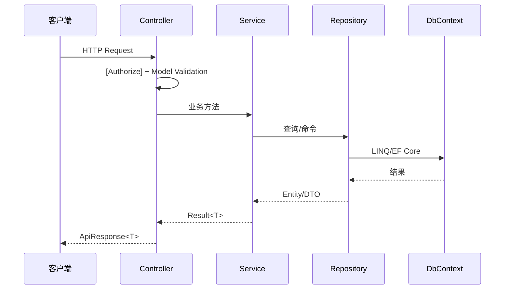

# 服务端架构

## 概述

Server 层采用模块化单体架构: Controller -> Service/MediatR Handler -> Repository -> DbContext，分为 Core (基础设施)、Modules (业务逻辑)、Services (API 入口) 三组，共 8 个业务模块。6 个模块 (Auth/Users/Patients/Herbs/Formula/Registration) 使用 MediatR CQRS，其中 Users/Patients/Herbs/Formula 由 Service 处理简单 CRUD、MediatR 处理复杂命令；MedicalCase 采用 Command/Query/State 三 Service 拆分（无 MediatR）；Reports 为只读聚合查询模块。Prescriptions 模块已于 2026-01-05 移除，处方功能迁移到 MedicalCase 聚合根内。

## 请求生命周期



## Core 层

### LYBT.Entities

领域实体定义，默认采用贫血模型。实际位置 `src/Shared/LYBT.Entities/`（2026-08 实体源统一后移出 Core 层）。

**职责**:
- 定义所有领域实体 (继承 `BaseEntity`)
- 定义领域枚举和值对象
- 无外部依赖，仅引用 .NET BCL

> **例外**: `MedicalCaseModel` 作为唯一 DDD 聚合根，包含域方法 (`Complete()`, `Suspend()`, `SoftDelete()`, `UpdateConsultation()`)，采用充血模型；另有计算属性 `IsLocked / IsActive / IsCompleted`。其他实体保持贫血模型。

**关键目录**: `Auth/`, `Common/` (BaseEntity), `Formulas/`, `Herbs/`, `MedicalCases/`, `Patients/`, `Registrations/`, `Users/`。

**BaseEntity 通用字段**: Id, CreatedAt, UpdatedAt, CreatedBy, UpdatedBy, RowVersion, IsDeleted。详见 [data-model.md](04-data-model.md)。

### LYBT.Infrastructure

基础设施层，提供数据访问和跨模块服务。

**职责**:
- `AppDbContext` — EF Core 数据库上下文
- `BaseRepository<T>` — Repository 基类 (5 个核心方法：GetByIdAsync/AddAsync/UpdateAsync/DeleteAsync/SaveChangesAsync)
- 跨模块服务接口 (ISP 原则，D5-1 设计，位于 `Services/CrossModule/`)：`ICatalogCrossModuleService`、`IPatientCrossModuleService`、`IUserCrossModuleService`、`IMedicalCaseCrossModuleService`、`IRegistrationCrossModuleService`
- `IRepository<T>` — Repository 接口定义
- EF Core 实体配置 (Fluent API)、数据库迁移文件

**关键目录**: `Data/` (AppDbContext + Fluent API), `Repositories/` (BaseRepository), `Services/CrossModule/`, `Web/` (BaseApiController/BaseCrudController)。

> 错误码枚举位于 `LYBT.Shared.Models/Primitives/ErrorCodes/`。

## Module 层

### 模块清单

| 模块 | 架构模式 | 跨模块通信 |
|------|----------|------------|
| Auth | MediatR CQRS | IUserCrossModuleService |
| Users | Service + MediatR | IUserCrossModuleService（供 MedicalCase/Auth） |
| Patients | Service + MediatR | IMedicalCaseCrossModuleService（引用检查） |
| Herbs (Catalog) | Service + MediatR | ICatalogCrossModuleService |
| Formula | Service + MediatR | ICatalogCrossModuleService |
| MedicalCase | Service 拆分（Command/Query/State） | IRegistrationCrossModuleService + ICatalogCrossModuleService |
| Registration | 纯 MediatR CQRS | IRegistrationCrossModuleService |
| Reports | Service + Repository（只读聚合） | - |

> 🧲 **Sync 模块属 v2.0**（N1 决策 2026-06-28）：v1.0 远程与本地数据孤立，`LYBT.Module.Sync` 不在 v1.0 范围。

### 标准目录结构

三种形态:

**CQRS 模块** (Auth/Users/Patients/Herbs/Formula/Registration):
```
LYBT.Module.{Domain}/
  {Domain}Module.cs, Application/, Domain/, Infrastructure/, Interfaces/, Services/
```

**MedicalCase** (Command/Query/State 三 Service 拆分):
```
LYBT.Module.MedicalCases/ — Controllers/ Interfaces/ Mappers/ Repositories/ Services/
```

**Reports** (只读聚合查询):
```
LYBT.Module.Reports/ — Domain/ Infrastructure/ Interfaces/
```

### MedicalCase 服务拆分

作为系统核心聚合根，采用 Command/Query/State 三 Service 拆分（非 MediatR）:

| 接口 | 职责 |
|------|------|
| IMedicalCaseCommandService | 写操作（含 `.Deletion` partial、Prescription 内部操作） |
| IMedicalCaseQueryService | 读操作 |
| IMedicalCaseStateService | 状态变更 |
| IMedicalCaseReferenceRepository | 医案引用检查（供 Patients 等模块） |
| IMedicalCaseRepository | 医案数据访问 |

另有实现类: `MedicalCaseCrossModuleService` / `MedicalCasePrescriptionService` / `MedicalCaseServiceHelper` / `PrescriptionItemService`。Permission/Audit/Rules 服务已随 A-03 MediatR 简化移除。

**适用标准**: 读写复杂度差异大、细粒度权限控制、完整审计日志、复杂状态流转。

### Service + MediatR 模式 (其他模块)

标准 CRUD 模块由 Service 处理简单 CRUD，复杂命令/查询通过 MediatR Handler:
```
Controller -> I{Entity}Service -> {Entity}Repository -> DbContext
Controller -> MediatR Command/Query -> Handler -> {Entity}Repository -> DbContext
```

## Services 层 (WebAPI)

### 职责

- HTTP 请求处理和路由
- JWT 认证授权中间件
- 全局异常处理 (IExceptionHandler)
- Serilog 两阶段日志初始化
- 模块注册编排

### Controller 规范

- Controller 注入 Service 接口，禁止注入 Repository 或 DbContext
- Controller 层零 catch 块，异常由 IExceptionHandler 统一处理
- 使用 `[Authorize]` 控制访问权限

### Controller 继承体系（A-14 文档化，2026-08-07）

三种继承路径:
```
BaseApiController — 独立端点基类
├── BaseCrudController — 标准 CRUD（5个 virtual 方法 + 批量操作模板）
│   ├── PatientsController / HerbsController / FormulasController
│   ├── BaseRegistrationsController → RegistrationsController
│   └── BaseMedicalCasesController → MedicalCasesController (356行)
├── AuthController / HealthController / ReportsController
├── ConfigurationController / DiagnosticsController / DeployController
```

**MediatR + Service 混合注入是有意设计**：查询走 Service 接口（绕过 MediatR 管道，性能更优），命令走 MediatR（经过 ValidationBehavior 验证 + 审计日志）。

### 中间件管道顺序

> 完整实现见 `UnifiedMiddlewareConfiguration.cs`。

```
1. UseExceptionHandler → IExceptionHandler 链; UseStatusCodePages → RFC 7807
2. UseForwardedHeaders / UseCorrelationId / UseSecurityHeaders
3. UseResponseCompression / UseStaticFiles
4. UseRouting → UseCors → UseSerilogRequestLogging → UseRateLimiter
5. UseAuthentication → UseClaimsNormalization → UseAuthorization
6. UseResponseCaching → UseOutputCache
7. MapHealthChecks / MapControllers / MapHub<RegistrationHub>
```

### 统一响应格式

**成功**: `{ "success": true, "data": { ... }, "message": "操作成功" }`

**失败** (RFC 7807 Problem Details): `{ "type": "https://tools.ietf.org/html/rfc7807", "title": "验证失败", "status": 400, "detail": "...", "correlationId": "...", "errorCode": 30001 }`

## 依赖注入

### DI 注册

```csharp
services.AddScoped<IPatientService, PatientService>();   // Service (Scoped)
services.AddScoped<IPatientRepository, PatientRepository>(); // Repository (Scoped)
services.AddSingleton<PatientMapper>();                    // Mapper (Singleton)
services.AddScoped<IValidator<PatientInputDto>, PatientInputDtoValidator>(); // Validator (Scoped)
```

### 模块注册入口

每个 Module 提供 `{Domain}Module.cs`，在 `Program.cs` 中调用: `builder.Services.AddPatientsModule();` 等。

## 异常处理

异常处理的完整架构详见 [06-error-handling.md](06-error-handling.md)，包括异常类型体系、IExceptionHandler 处理器链、错误码体系和 CorrelationId 全链路追踪。

### 错误码体系

5 位数字 MCCEE 格式: 模块 (1位) + 子类别 (2位) + 序号 (2位)。模块前缀: 0xxxx 通用 / 1xxxx 用户/认证 / 2xxxx 患者 / 3xxxx 医案 / 4xxxx 处方(预留) / 5xxxx 药材 / 6xxxx 验方 / 8xxxx 挂号。总计 90+ 错误场景。详见 `LYBT.Shared.Models/Primitives/ErrorCodes/ErrorCode.cs`。

## Service 层规范

### BaseService 层次结构

`BaseService` (非泛型) 提供 `ILogger` 注入；`BaseService<T>` 提供类型安全的 Logger。仅 MedicalCase 的 Command/Query/State 三个 Service 继承 `BaseService<MedicalCase>`；其余模块 Service 直接实现各自接口，不继承 BaseService。

### 返回值类型

所有 Service 方法统一返回 `Result<T>`:
```csharp
return Result<PatientDto>.Success(dto);       // 成功
return Result<PatientDto>.Failure("患者不存在"); // 失败
```

### 错误处理

- Service 层不捕获异常 (异常透传到 IExceptionHandler)
- 业务验证失败返回 `Result.Failure`，不抛异常
- 保留 fire-and-forget 场景的 catch (审计日志等非关键操作)

### FluentValidation 集成

**MediatR Pipeline 自动验证**（6 个 MediatR 模块）: `ValidationBehavior<TRequest, TResponse>` 在 Handler 执行前自动运行验证器，失败抛 `ValidationException` → 400。

**非 MediatR 路径**: MedicalCase 的 Service 拆分手动调用验证；Reports 无需验证。

### 大型 Service 拆分标准

超过 500 行的 Service 拆分为 Command/Query/State 子服务，删除原 Service，Controller 直接注入子服务。

## 事务边界模型

| 级别 | 范围 | 机制 | 典型场景 |
|------|------|------|----------|
| **L1** | 单 Repository | 隐式 `SaveChangesAsync()` | 单实体 CRUD |
| **L2** | 聚合根 | 单次 `SaveChangesAsync()` 覆盖多实体 | MedicalCase 聚合保存 |
| **L3** | 跨聚合 | 显式 `BeginTransactionAsync()` | Sync 批量上传、批量导入 |

- L1/L2 不需要显式事务 (EF Core SaveChanges 自带隐式事务)
- L3 场景必须使用 `IDbContextTransaction`
- MedicalCase 聚合保存属于 L2: 单次 SaveChanges 写入 4 层实体

## SignalR 实时推送（US-REG-008）

> commit `0d8aabb90`（2026-08-06），详见 [ADR-0013](decisions/0013-signalr-realtime-push.md)。

```
Desktop (SignalRClient) ←WebSocket→ MapHub("/hubs/registration")
                                        ↓
                              RegistrationHub → NotificationService
                                        ↓
                    CreateCommandHandler / StartVisitHandler / CancelHandler
```

- **端点**: `/hubs/registration`，`[Authorize(DoctorOrAdmin)]`
- **分组**: 医生通过 `?doctorId={guid}` 连接，按 `doctor-{id}` 分组推送
- **容错**: 推送失败仅记录 Warning，不影响业务主流程
- **降级**: 连接失败自动降级为 15s 轮询，断线按 2/10/30s 间隔重连

## 模块独立 DbContext

4 个模块拥有独立 DbContext: Auth (`AuthDbContext`)、Users (`UsersDbContext`)、Herbs (`HerbsDbContext`)、Formula (`FormulaDbContext`)。均通过 `ConnectionStringResolver.GetEffectiveConnectionString()` 三级回退获取连接字符串。

复用 `AppDbContext` 的模块: Patients、MedicalCase、Registration、Auth (SecurityAuditRepository)、Herbs (HerbReferenceRepository)。

> 架构测试 P02（Repository 必须继承 BaseRepository）对直接注入 DbContext 的模块内 Repository 予以豁免；P10（Service 禁止直接注入 AppDbContext）仅约束 Service 层。

## 数据库约定

- **命名**: 表名 PascalCase 复数，列名 PascalCase，外键 `{RelatedEntity}Id`
- **EF Core**: Fluent API 优先于 Data Annotations；全局查询过滤器 `IsDeleted == false`；DateTime 统一 UTC
- **命名冲突**: 实体类名与模块命名空间冲突时用 `using` 别名 (`FormulaEntity` / `MedicalCaseEntity`)

## 缓存策略

Server 端采用 ASP.NET Core OutputCache（标签分组）+ IMemoryCache（高频查询+权限），Desktop 端使用 ApiService GET 缓存。完整策略见 [nfr.md 第 5 章](../02-requirements/12-nfr.md)。

## 运维与安全

> 通用运维架构详见 [11d-observability.md](../02-requirements/11d-observability.md)。

### Token Family 管理

> 对应 AUTH-D06 (单会话策略) + AUTH-D07 (角色变更即时生效)，详见 [auth.md](../02-requirements/02-auth.md)。

**单会话登录** (AUTH-D06): 新设备登录时撤销该用户所有现有 Token Family。**角色变更即时生效** (AUTH-D07): 角色变更时通过 `IAuthCrossModuleService.RevokeAllUserTokensAsync()` 撤销 Token Family。

**跨模块 Token 撤销** (IAuthCrossModuleService): 6 个触发场景 — 登录踢出/角色变更/删除用户/重置密码/修改密码/禁用用户。

**实现要点**: RefreshToken 通过 FamilyId 追踪 Token 家族；重放攻击检测: 已使用的 RefreshToken 再次提交 → 整个 Family 失效；延迟踢出: 撤销后旧 AccessToken 最长 30 分钟内仍有效。

### 备份服务

> 对应 [NFR-AVAIL-001](../02-requirements/12-nfr.md)。

| 数据库 | 备份方式 | 频率 | 保留期 |
|--------|---------|------|--------|
| SQL Server (远程) | SQL Server Agent 自动全量备份 | 每日 | 30 天 |
| SQL Server LocalDB (本地) | 标准 SQL Server 备份策略 | 按需 | 按需 |

---

## 架构决策记录

- [ADR-0001: MedicalCase 聚合根](decisions/0001-medicalcase-aggregate-root.md) — MedicalCase 为唯一充血模型
- [ADR-0004: 用户上下文传递模式](decisions/0004-user-context-propagation.md)
- [ADR-0005: SuperAdmin 归属 Auth 模块](decisions/0005-superadmin-auth-module.md)
- [ADR-0008: Token 安全防御性设计](decisions/0008-token-security-defensive-design.md)
- MediatR + Service 混合注入（2026-08-07 A-14 评估）— 查询走 Service，命令走 MediatR

## 变更记录

| 版本 | 日期 | 说明 |
|------|------|------|
| v2.4 | 2026-08-07 | WebApi 文档完整性审计修复 |
| v2.3 | 2026-08-05 | 文档与代码全面对齐（14 项） |
| v2.2 | 2026-06-28 | spec S3 批次2 提炼 |
| v2.1 | 2026-06-28 | N1 + 模块对齐 |
