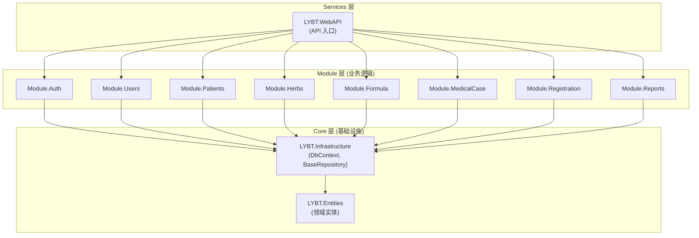
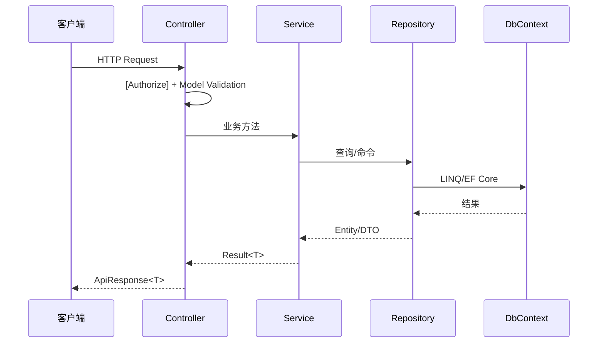

# 服务端架构

## 概述

Server 层采用经典三层架构: Controller -> Service -> Repository -> DbContext。分为 Core (基础设施)、Modules (业务逻辑)、Services (API 入口) 三组。简单模块使用传统三层模式，复杂模块 (MedicalCase) 使用 CQRS 模式。Prescriptions 模块已于 2026-01-05 移除，处方功能迁移到 MedicalCase 聚合根内。

## 架构图



## 请求生命周期



## Core 层

### LYBT.Entities

领域实体定义，默认采用贫血模型。

**职责**:
- 定义所有领域实体 (继承 `BaseEntity`)
- 定义领域枚举和值对象
- 无外部依赖，仅引用 .NET BCL

> **例外**: `MedicalCaseModel` 作为唯一 DDD 聚合根，包含域方法 (`Complete()`, `SaveAsDraft()`, `SoftDelete()`, `UpdateConsultation()`)，采用充血模型。其他实体保持贫血模型。

**目录结构**:
```
LYBT.Entities/
  Auth/              # AuthSession, RefreshToken
  Consultations/     # Consultation
  Formulas/          # Formula, FormulaHerbItem
  Herbs/             # Herb
  Patients/          # Patient
  Prescriptions/     # Prescription, PrescriptionItem
  MedicalCases/      # MedicalCase, MedicalCasePrintLog
  Users/             # User, UserRole 枚举
  Common/            # BaseEntity, 通用枚举
```

**BaseEntity 通用字段**: Id, CreatedAt, UpdatedAt, CreatedBy, UpdatedBy, RowVersion, IsDeleted。详见 [data-model.md](04-data-model.md) 的 BaseEntity 章节。

### LYBT.Infrastructure

基础设施层，提供数据访问和跨模块服务。

**职责**:
- `AppDbContext` -- EF Core 数据库上下文
- `BaseRepository<T>` -- Repository 基类 (21 个公开方法)
- 跨模块服务接口 (ISP 原则，D5-1 设计):
  - `ICrossModuleService` -- 旧统一接口 (标记 `[Obsolete]`，S3 渐进迁移)
  - `IPatientCrossModuleService` -- 患者查询 + 引用检查 (S3 新增)
  - `IHerbCrossModuleService` -- 药材查询 + 引用检查 (S3 新增)
  - `IUserCrossModuleService` -- 用户查询 + 凭证操作 (S3 新增)
  - `ICrossModuleAuthService` -- Token 撤销 (已设计，6 个触发场景)
- `IRepository<T>` -- Repository 接口定义
- EF Core 实体配置 (Fluent API)
- 数据库迁移文件

**目录结构**:
```
LYBT.Infrastructure/
  Data/
    AppDbContext.cs
    Configurations/          # EF Core Fluent API 配置
      Base/                  # BaseEntityConfiguration
      PatientConfiguration.cs
      ...
  Interfaces/
    IRepository.cs
  Repositories/
    BaseRepository.cs        # 标准 CRUD + 分页 + 高级查询
  Services/
    ICrossModuleService.cs
    CrossModuleService.cs
  DependencyInjection/       # DI 扩展方法
  Logging/                   # 日志相关
  Migrations/                # EF Core 迁移
  Validation/                # 验证工具
  Web/
    BaseApiController.cs     # Controller 基类
    ApiErrorCodes.cs         # 错误码定义
```

**BaseRepository 公开方法 (21 个)**: GetByIdAsync / GetAllAsync / FindAsync(简单+高级) / SelectAsync / GetPagedAsync(模板+高级) / ExistsAsync / CountAsync(有无条件) / AddAsync / AddRangeAsync / UpdateAsync / UpdateRangeAsync / DeleteAsync(软) / DeleteRangeAsync / HardDeleteAsync / GetQueryable / GetNoTrackingQueryable / FromSqlRawAsync / SaveChangesAsync。

> 完整方法签名见源码 [`BaseRepository.cs`](../../src/Server/Core/LYBT.Infrastructure/Repositories/BaseRepository.cs)。

**分页查询模板方法模式**:
子类通过覆盖 `ApplyKeywordFilter` 和 `ApplyDefaultOrdering` 提供定制逻辑，不重写 `GetPagedAsync` 本身。

## Module 层

### 标准目录结构

```
LYBT.Module.{Domain}/
  {Domain}Module.cs            # 模块注册入口
  Repositories/
    {Entity}Repository.cs      # Repository 实现
  Services/
    I{Entity}Service.cs        # Service 接口
    {Entity}Service.cs         # Service 实现
  Mapping/
    {Entity}Mapper.cs          # Mapperly 映射器
  Validators/                  # FluentValidation 验证器 (可选)
```

### 模块清单

| 模块 | 架构模式 | 跨模块通信 | 说明 |
|------|----------|------------|------|
| Auth | 传统三层 | IUserService | JWT 认证、Token 管理 |
| Users | 传统三层 | - | 用户 CRUD、密码管理 |
| Patients | 传统三层 | - | 患者 CRUD、导入导出 |
| Herbs | 传统三层 | - | 药材 CRUD、分类、导入 |
| Formula | 传统三层 | ICrossModuleService | 验方 CRUD、药材绑定 |
| MedicalCase | CQRS | IPatientService | 医案核心，状态机管理 |
| Registration | 传统三层 | - | 挂号管理，队列状态流转 |
| Reports | 传统三层 | ICrossModuleService | 报表/历史聚合查询（MC-008/009，D9 补回 v1.0） |

> 🧲 **Sync 模块属 v2.0**（N1 决策 2026-06-28）：v1.0 远程与本地数据孤立，`LYBT.Module.Sync` 不在 v1.0 范围。代码可能保留骨架但不在 v1.0 加载。

### CQRS 模式 (MedicalCase)

MedicalCase 作为系统核心聚合根，业务复杂度高，采用 CQRS 拆分:

| Service | 职责 | 方法示例 |
|---------|------|----------|
| IMedicalCaseCommandService | 写操作 | CreateAsync, SaveAsync, CreatePrescriptionAsync |
| IMedicalCaseQueryService | 读操作 | GetByIdAsync, GetPagedAsync, SearchAsync |
| IMedicalCaseStateService | 状态变更 | CompleteAsync, SaveDraftAsync, CancelAsync, UpdateStatusAsync |
| IMedicalCasePermissionService | 唯一权限权威 | CanEdit, CanDelete, GetPermissions |
| IMedicalCaseAuditService | 审计日志 | LogAsync, DetectChanges |
| MedicalCaseRules | 无状态策略 | CanCreateNewCase, HasActiveCase, IsValidStatusTransition |
| MedicalCaseServiceHelper | 共享工具 | CloneMedicalCaseForAudit, ValidateAndFetchCreationContextAsync, EnsureCanEdit, ExecuteWithConcurrencyRetryAsync |

**适用标准**: 读写复杂度差异大、细粒度权限控制、完整审计日志、复杂状态流转。

### 传统三层模式 (其他模块)

标准 CRUD 模块使用单一 Service:

```
Controller -> I{Entity}Service -> {Entity}Repository -> DbContext
```

## Services 层 (WebAPI)

### 职责

- HTTP 请求处理和路由
- JWT 认证授权中间件
- 全局异常处理 (IExceptionHandler)
- Serilog 两阶段日志初始化
- 模块注册编排

### Controller 规范

```csharp
[ApiController]
[Route("api/[controller]")]
[Authorize]
public class PatientsController : BaseApiController
{
    private readonly IPatientService _service;

    public PatientsController(IPatientService service)
    {
        _service = service;
    }

    [HttpGet("{id:guid}")]
    public async Task<IActionResult> GetById(Guid id)
    {
        return Ok(await _service.GetByIdAsync(id));
    }
}
```

**规则**:
- Controller 注入 Service 接口，禁止注入 Repository 或 DbContext
- Controller 层零 catch 块，异常由 IExceptionHandler 统一处理
- 使用 `[Authorize]` 控制访问权限

### RESTful API 规范

```
GET    /api/{resource}           # 列表 (分页)
GET    /api/{resource}/{id}      # 详情
POST   /api/{resource}           # 创建
PUT    /api/{resource}/{id}      # 更新
DELETE /api/{resource}/{id}      # 删除
```

### API 版本策略

- **方式**: URL 段版本控制 (`/api/v1/`)
- **当前版本**: v1 (v1.x 无破坏性变更计划)
- **客户端处理**: Desktop `ApiRouter` 为所有请求自动添加 `/api/v1/` 前缀
- **LocalWebAPI**: 相同 `/api/v1/` 前缀，路由模板与远程 WebAPI 一致
- **v2 迁移**: 新 URL 段 `/api/v2/`，v1 向后兼容持续维护
- **版本生命周期**: v(N) 发布后，v(N-1) 废弃期 6 个月

### 统一响应格式

**成功**:
```json
{
  "success": true,
  "data": { ... },
  "message": "操作成功"
}
```

**失败** (RFC 7807 Problem Details):
```json
{
  "type": "https://tools.ietf.org/html/rfc7807",
  "title": "验证失败",
  "status": 400,
  "detail": "患者姓名不能为空",
  "instance": "/api/patients",
  "correlationId": "xxx",
  "errorCode": 30001
}
```

## 依赖注入

### Server 端 DI 注册

```csharp
// Module 注册 (Scoped 生命周期)
services.AddScoped<IPatientService, PatientService>();
services.AddScoped<IPatientRepository, PatientRepository>();

// Mapperly 映射器 (Singleton，无状态)
services.AddSingleton<PatientMapper>();

// FluentValidation 验证器
services.AddScoped<IValidator<PatientInputDto>, PatientInputDtoValidator>();
```

**生命周期规范**:

| 类型 | 生命周期 | 说明 |
|------|----------|------|
| Repository | Scoped | 每请求一个实例，共享 DbContext |
| Service | Scoped | 每请求一个实例 |
| Mapper | Singleton | 编译时生成，无状态 |
| Validator | Scoped | 可能依赖 Scoped 服务 |

### 模块注册入口

每个 Module 提供 `{Domain}Module.cs`，在 `Program.cs` 中调用:

```csharp
// Program.cs
builder.Services.AddAuthModule(builder.Configuration);
builder.Services.AddUsersModule();
builder.Services.AddPatientsModule();
// ...
```

## 异常处理

异常处理的完整架构详见 [06-error-handling.md](06-error-handling.md)，包括异常类型体系、IExceptionHandler 处理器链、错误码体系和 CorrelationId 全链路追踪。

### 错误码体系

5 位数字 MCCEE 格式: 模块 (1位) + 子类别 (2位) + 序号 (2位)

| 模块前缀 | 模块 | 子类别范围 | 场景数 |
|----------|------|-----------|--------|
| 0xxxx | 通用错误 | 000xx | ~5 |
| 1xxxx | 用户/认证 | 101xx~103xx | ~15 |
| 2xxxx | 患者管理 | 200xx~208xx | ~18 |
| 3xxxx | 医案管理 | 301xx~306xx | ~29 |
| 4xxxx | 处方管理 (预留) | - | 当前归入 304xx |
| 5xxxx | 药材管理 | 501xx~503xx | ~15 |
| 6xxxx | 验方管理 | 601xx~603xx | ~17 |
| 7xxxx | 数据同步 | 701xx~705xx | ~20 |

> **总计**: 90+ 错误场景。详见各模块 PRD 文档的"错误码"章节和 [11c-error-handling.md](../02-requirements/11c-error-handling.md)。

## Service 层规范

### BaseService 层次结构 (D2-1)

> 设计文档: d2-d5-design | 实施: S5

所有 Service 统一继承 BaseService 层次结构:

```
BaseService (非泛型)
  ├── 跨域 Service: AuthService, SyncService
  └── BaseService<T> (泛型，继承 BaseService)
       └── CRUD Service: HerbService, PatientService, FormulaService (A3-07), MedicalCase*
```

| 基类 | 适用场景 | 提供能力 |
|------|----------|---------|
| `BaseService` | 跨域服务 (Auth, Sync) | ExecuteAsync (三层异常处理), ValidateAsync (FluentValidation 封装) |
| `BaseService<T>` | CRUD 实体服务 | 继承 BaseService 全部能力 + 泛型约束 |

**当前状态**: HerbService/PatientService/FormulaService 已继承 (FormulaService 在 Sprint3-Batch4a A3-07 完成迁移)，AuthService/SyncService 待统一 (S5)

### 返回值类型

所有 Service 方法统一返回 `Result<T>` (S5 完成后 SyncService 从 `ServiceResult<T>` 迁移到 `Result<T>`):

```csharp
// 成功
return Result<PatientDto>.Success(dto);

// 失败
return Result<PatientDto>.Failure("患者不存在");
```

### 构造函数参数顺序

```
Repository -> Mapper -> Logger -> Validator -> 其他依赖
```

### 错误处理

- Service 层不捕获异常 (异常透传到 IExceptionHandler)
- 业务验证失败返回 `Result.Failure`，不抛异常
- 使用 `ExecuteAsync<T>()` 包装可能抛异常的操作
- 保留 fire-and-forget 场景的 catch (审计日志等非关键操作)

### FluentValidation 集成

Create/Update 方法在业务逻辑前调用验证。Validator 架构与共享规则见 [08-shared.md](08-shared.md#lybtsharedvalidators-fluentvalidation-验证器)。

### 大型 Service 拆分标准

超过 500 行的 Service 必须拆分为职责单一的子服务:
- Command (Create/Update/Delete)
- Query (Get/List/Search)
- State (状态变更)
- 删除原 Service，Controller 直接注入子服务

## 事务边界模型

> 设计文档: design-deepening-phase3 3.3 节

三级事务模型:

| 级别 | 范围 | 机制 | 典型场景 |
|------|------|------|----------|
| **L1** | 单 Repository | 隐式 `SaveChangesAsync()` | 单实体 CRUD (Patient/Herb/User) |
| **L2** | 聚合根 | 单次 `SaveChangesAsync()` 覆盖多实体 | MedicalCase + Consultation + Prescription + Items 聚合保存 |
| **L3** | 跨聚合 | 显式 `BeginTransactionAsync()` | Sync 批量上传、批量导入 (事务内多次 SaveChanges，失败整体回滚) |

**规则**:
- L1/L2 不需要显式事务 (EF Core SaveChanges 自带隐式事务)
- L3 场景必须使用 `IDbContextTransaction`，确保跨实体原子性
- MedicalCase 聚合保存属于 L2: 单次 SaveChanges 写入 4 层实体

## 数据库约定

### 命名

- 表名: PascalCase 复数 (如 `MedicalCases`)
- 列名: PascalCase (如 `PatientId`)
- 外键: `{RelatedEntity}Id`

### EF Core 配置

- Fluent API 配置优先于 Data Annotations
- 配置类: `{Entity}Configuration : IEntityTypeConfiguration<Entity>`
- 全局查询过滤器: `IsDeleted == false`
- DateTime 统一使用 UTC

### 实体命名冲突处理

当实体类名与模块命名空间冲突时，使用 using 别名:

| 实体 | 冲突 | 别名 |
|------|------|------|
| Formula | LYBT.Module.Formula 命名空间 | `FormulaEntity` |
| MedicalCase | LYBT.Module.MedicalCase | `MedicalCaseEntity` |

## 缓存策略

Server 端采用 ASP.NET Core OutputCache（标签分组）+ IMemoryCache（高频查询+权限），Desktop 端使用 ApiService GET 缓存。完整策略见 [nfr.md 第 5 章](../02-requirements/12-nfr.md)。

---

## 运维与安全

> 以下为 Server 层特有的运维能力。通用运维架构（敏感数据脱敏、API 请求日志、启动配置验证、安全审计日志、日志清理、启动诊断）详见 [11d-observability.md](../02-requirements/11d-observability.md)。

### Token Family 管理

> 对应 AUTH-D06 (单会话策略) + AUTH-D07 (角色变更即时生效)，详见 [auth.md](../02-requirements/02-auth.md)。

**单会话登录** (AUTH-D06): 同一账号仅允许一台设备登录。新设备登录时，AuthService 撤销该用户所有现有 Token Family (按 FamilyId 批量标记 IsRevoked=true)。旧设备下次请求或刷新 Token 时触发 TokenRevoked → 强制登出。

**角色变更即时生效** (AUTH-D07): 用户角色变更时，UserService 通过 `ICrossModuleAuthService.RevokeAllUserTokensAsync()` 撤销该用户 Token Family，强制重登录。复用单会话的 Token Family 撤销逻辑。

**跨模块 Token 撤销** (ICrossModuleAuthService): 独立接口 (ISP 原则，不污染 ICrossModuleQueryService)，Auth 模块提供实现，6 个触发场景:

| 场景 | 调用方 | reason |
|------|--------|--------|
| 登录踢出 (AUTH-D06) | AuthService.LoginAsync | NewDeviceLogin |
| 角色变更 (AUTH-D07) | UserService.UpdateRoleAsync | RoleChanged |
| 删除用户 | UserService.DeleteAsync | UserDeleted |
| 重置密码 | UserService.ResetPasswordAsync | PasswordReset |
| 修改密码 | UserService.ChangePasswordAsync | PasswordChanged |
| 禁用用户 | UserService.ToggleStatusAsync | UserDisabled |

**实现要点**:
- RefreshToken 表通过 FamilyId 字段追踪 Token 家族
- 撤销操作为批量 UPDATE: `SET IsRevoked=true WHERE UserId=@userId AND IsRevoked=false` (含 RefreshToken + AutoLoginToken)
- 重放攻击检测: 已使用 (IsUsed=true) 的 RefreshToken 再次提交 → 整个 Family 失效 (ERR-10203 TokenRevoked)
- 延迟踢出 (AUTH-D08): 撤销后旧 AccessToken 最长 30 分钟内仍有效 (JWT 无状态，不引入黑名单)

### 备份服务

> 对应 [NFR-AVAIL-001](../02-requirements/12-nfr.md)。

| 数据库 | 备份方式 | 频率 | 保留期 |
|--------|---------|------|--------|
| SQL Server (远程) | SQL Server Agent 自动全量备份 | 每日 | 30 天 |
| SQL Server LocalDB (本地 LocalWebAPI) | 标准 SQL Server 备份策略 | 按需 | 按需 |

**SQL Server 备份要点**:
- 备份文件命名: `LYBTDB_{yyyyMMdd}.bak`
- 远程模式通过 SQL Server Agent 维护计划配置，不在应用代码中实现
- 本地模式 (LocalWebAPI + SQL Server LocalDB) 使用标准 SQL Server 备份策略，无需手动复制数据库文件
- 恢复优先级: 本地模式降级 (即时) → 从备份还原 (30min 内，对应 RTO) → 重新部署

---

## 架构决策记录

- [ADR-0001: MedicalCase 聚合根](decisions/0001-medicalcase-aggregate-root.md) — MedicalCase 为唯一充血模型，Consultation/Prescription 为内部实体
- [ADR-0004: 用户上下文传递模式](decisions/0004-user-context-propagation.md) — 从 HTTP 请求到 Service/Repository 层的用户信息传递方案
- [ADR-0005: SuperAdmin 归属 Auth 模块](decisions/0005-superadmin-auth-module.md) — SuperAdmin 系统初始化账户的归属与认证流程设计
- [ADR-0008: Token 安全防御性设计](decisions/0008-token-security-defensive-design.md) — Token Family、轮换机制和重放攻击检测策略

## 变更记录

| 日期 | 版本 | 变更内容 |
|------|------|----------|
| 2026-06-28 | v2.2 | **spec S3 批次2 提炼（707→~530 行）**：BaseRepository 21 方法表改源码链接；缓存策略段（OutputCache/IMemoryCache/失效矩阵）改链接到 nfr.md；Validator 架构改链接到 08-shared.md；US-LOG/CFG/SYS 七段（敏感数据脱敏/API请求日志/启动配置验证/安全审计日志/日志清理/审计清理/Server启动诊断）合并为概览表改链接到 11d-observability.md/11b-configuration.md。变更历史见 git log。 |
| 2026-06-28 | v2.1 | **N1 + 模块对齐**: 模块清单补 Reports（D9 补回 v1.0）; 架构图 Sync→Reports; Sync 标 🧲 v2.0 |
