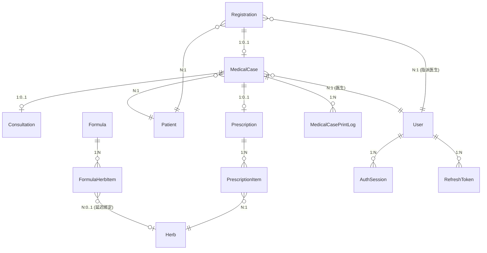

# 数据模型
> 版本: v1.0 | 日期: 2026-08-20

## 概述

系统使用 EF Core 8.0 管理数据模型，所有业务实体继承 `BaseEntity` 基类。MedicalCase 是唯一的 DDD 聚合根，Consultation 和 Prescription 是其内部实体。数据库使用 SQL Server (远程) 或 SQL Server (嵌入式 LocalWebAPI)。

> **2026-08-21 P1-1**：`LYBT.Module.MedicalCase`（单数）为重命名残留，已清理；`MedicalCases`（复数）为唯一 Server 端聚合根模块。

## 实体关系图



## 聚合根边界

```mermaid
graph TB
    subgraph AggregateRoot["MedicalCase 聚合根"]
        MC["MedicalCase<br>(聚合根)"]
        C["Consultation<br>(内部实体, 1:1)"]
        P["Prescription<br>(内部实体, 1:0..1)"]
        PI["PrescriptionItem<br>(内部实体, 1:N)"]
        MCPL["MedicalCasePrintLog<br>(内部实体, 1:N)"]
        MC --- C
        MC --- P
        MC --- MCPL
        P --- PI
    end

    subgraph Independent["独立实体"]
        Patient
        User
        Herb
        Formula
        Registration
    end

    MC -.->|PatientId| Patient
    MC -.->|UserId| User
    PI -.->|HerbId| Herb
    Registration -.->|PatientId| Patient
    Registration -.->|DoctorId| User
    Registration -.->|MedicalCaseId| MC
```text

**规则**: 聚合根内的实体 (Consultation, Prescription) 只能通过 MedicalCase 访问和操作，禁止独立的 Repository。

## BaseEntity 基类

所有业务实体继承此基类:

| 字段 | 类型 | 说明 |
|------|------|------|
| Id | Guid | 主键 |
| CreatedAt | DateTime | 创建时间 (UTC) |
| UpdatedAt | DateTime? | 更新时间 |
| CreatedBy | Guid? | 创建人 |
| UpdatedBy | Guid? | 更新人 |
| RowVersion | byte[]? | 并发控制 (乐观锁) |
| IsDeleted | bool | 软删除标记 |

## 实体定义

## 并发控制策略

所有写操作采用**乐观锁**机制：

- **机制**：`RowVersion` 字段（EF Core `IsRowVersion()`，BaseEntityConfiguration + UserConfiguration 均已配置），每次更新时自动比较
- **冲突处理**：`DbUpdateConcurrencyException` → 抛出 `ConflictException`（HTTP 409）→ 客户端重试或提示用户。P1-17：`MedicalCaseServiceHelper.ExecuteWithConcurrencyRetryAsync` 重试耗尽后转 `ConflictException`（原抛原始 `DbUpdateConcurrencyException` 致 500），Service 层必须转 409
- **审计原子性（P1-19）**：医案更新审计与业务同事务——`AddAuditLogAsync(saveChanges:false)` 先入 ChangeTracker，`UpdateAsync` 单次 SaveChanges 提交（同 `MedicalCaseDbContext`），业务失败则审计同回滚
- **审计绕过红线（P1-6）**：审计表（`SecurityAuditLogs`/`MedicalCaseAuditLogs`）禁止 `ExecuteUpdate/ExecuteDelete/ExecuteSqlRaw` 原始写——必须经 `AppDbContext.SaveXXX` 走 `SetAuditFields` 自动填充（ArchTests `P1_Audit_Tables_No_ExecuteUpdate_ExecuteDelete` 守卫；唯一例外 `LogCleanupService` 清理 SystemLogs，非审计表）
- **批量引用检查（P1-11）**：`BatchCheckHerbReference` 药材名称查询改 `IHerbRepository.GetNamesByIdsAsync`（单次 IN），替代逐 ID `GetByIdAsync`（N+1），并复用 `GetBatchPrescription/FormulaReferenceCountsAsync` 批量计数
- **MedicalCase 聚合根特殊规则**：单活动医案约束（BR-001）+ 乐观锁双重保护
- **软删除**：`IsDeleted=true` 为逻辑删除，查询时自动过滤（全局查询过滤器）

### MedicalCase (医案 -- 聚合根)

| 字段 | 类型 | 必填 | 说明 |
|------|------|------|------|
| PatientId | Guid | 是 | 关联患者 |
| PatientName | string(50) | 是 | 患者姓名 (冗余) |
| UserId | Guid | 是 | 医生 ID |
| DoctorName | string(50) | 是 | 医生姓名 (冗余) |
| CaseNumber | string(50) | 否 | 医案编号 |
| CaseStatus | MedicalCaseStatus | 是 | 状态 (默认 Active) |
| NeedsPrescription | bool? | 否 | 是否需要处方 |
| CompletedAt | DateTime? | 否 | 完成时间 |
| Remark | string(500) | 否 | 备注 |
| PrintVersion | int | 是 | 打印版本号 (默认 1)。医案内容修改后自增，标记需重新打印 |
| LastPrintedAt | DateTime? | 否 | 最后打印时间 |
| PrintCount | int | 是 | 打印次数 (默认 0) |
| IsPrinted | bool | 是 | 是否已打印 (默认 false)。聚合根级打印保护: 为 true 时修改 Consultation 或 Prescription 内容需提供 EditReason (MC-D15) |
| Consultation | Consultation? | - | 导航属性 (1:1) |
| Prescription | Prescription? | - | 导航属性 (1:0..1) |

**计算属性**: IsLocked (`IsCompleted && CompletedAt.Date < Today`), IsActive, IsCompleted, HasPrescription (依赖 PrescriptionId.HasValue，Mapper 必须显式设置)

**DDD 域方法** (聚合根行为):

| 方法 | 说明 |
|------|------|
| `Complete()` | 设置 CaseStatus=Completed + CompletedAt=DateTime.Now |
| `Suspend()` | 设置 CaseStatus=Suspended (MC-D20) |
| `SoftDelete()` | 设置 IsDeleted=true (取消医案) |
| `UpdateConsultation(request)` | 从 ConsultationInputDto 更新 Consultation 子实体字段 |

> MedicalCase 是系统中唯一采用充血模型的实体，状态变更逻辑封装在聚合根域方法中，Service 层委托调用。

### MedicalCase 业务生命周期

**状态机**：`Suspended ↔ Active → Completed`（取消 = 物理删除，无 Cancelled 状态）。

> 完整状态转换矩阵（守卫条件 + 实现位置）、Registration 联动规则、打印保护覆盖层（IsPrinted/PrintVersion/EditReason）见权威文档 [07-medical-cases.md「状态机」「打印保护耦合」](../02-requirements/07-medical-cases.md)。状态枚举值定义见下方 [枚举定义](#枚举定义) 段。

### Consultation (诊断)

共享 MedicalCase 主键 (1:1 关系):

| 字段 | 类型 | 必填 | 说明 |
|------|------|------|------|
| PresentIllness | string(2000) | 否 | 现病史 |
| TongueDiagnosis | string(500) | 否 | 舌诊 |
| PulseDiagnosis | string(500) | 否 | 脉诊 |
| TcmDiagnosis | string(500) | 否 | 中医辨证 |

### Prescription (处方)

| 字段 | 类型 | 必填 | 说明 |
|------|------|------|------|
| MedicalCaseId | Guid | 是 | 外键 |
| PrescriptionNumber | string(20) | 否 | 处方编号 |
| DosageCount | int | 是 | 剂数 (默认 7) |
| Discount | decimal(5,4) | 是 | 折扣 (默认 1.0) |
| Usage | string(500) | 否 | 用法 |
| Advice | string(500) | 否 | 医嘱 |
| ReferencedFormulas | string(500) | 否 | 引用验方 (逗号分隔) |
| Remark | string(500) | 否 | 备注 |

**价格计算公式** (MC-D14):
- Items[i].Amount = UnitPrice x Dosage (单味药小计，PrescriptionItem 计算属性)
- SingleDosePrice = SUM(Items.Amount) (一剂所有药材小计之和，Prescription 计算属性)
- TotalPrice = SingleDosePrice x DosageCount x Discount (最终总价)
- Discount 语义: 1.0=无折扣, 0.9=九折, 0.85=八五折

### PrescriptionItem (处方药材项)

不继承 BaseEntity:

| 字段 | 类型 | 必填 | 说明 |
|------|------|------|------|
| Id | Guid | 是 | 主键 |
| PrescriptionId | Guid | 是 | 外键 |
| HerbId | Guid | 是 | 药材 ID |
| HerbName | string(100) | 是 | 药材名称 (冗余) |
| Dosage | int | 是 | 用量 |
| Unit | string(16) | 是 | 单位 (默认 "g") |
| DecocteMethod | DecocteMethod | 是 | 煎煮方法 |
| UnitPrice | decimal(18,2) | 是 | 单价 |
| Usage | string(200) | 否 | 用法 |
| Remark | string(200) | 否 | 备注 |

### Patient (患者) — v1.0 简化版（7 字段 + BaseEntity 审计）

> **v1.0 简化决策**：文档原 20+ 字段（MaritalStatus/IdType/Address/AllergyHistory/MedicalHistory/BloodType/EmergencyContact*/DisableReason/LastVisitTime/VisitCount 等）已裁剪，仅保留姓名/性别等核心建档字段。裁剪字段延期至 v2.0（见 ADR-2026-08-20-Patient-Simplification，代码 `PatientModel.cs` 为 SSOT）。

| 字段 | 类型 | 必填 | 说明 |
|------|------|------|------|
| Name | string(100) | 是 | 姓名 |
| PinYinCode | string(50) | 否 | 拼音码 (搜索用) |
| Gender | Gender | 是 | 性别 |
| BirthDate | DateTime? | 否 | 出生日期 |
| IdNumber | string(50) | 否 | 身份证号 (敏感, `[SensitiveData(IdentityInfo, Partial)]`) |
| PhoneNumber | string(20) | 否 | 手机号 (敏感, `[SensitiveData(ContactInfo, Partial)]`) |
| Status | CommonStatus | 是 | 状态 (PAT-D05: 禁用主要场景为患者已故; 禁用后禁止创建新医案) |

**基类字段** (BaseEntity): Id, CreatedAt, UpdatedAt, CreatedBy, UpdatedBy, RowVersion, IsDeleted

**计算属性**: Age (从 BirthDate 计算，NotMapped)

### User (用户)

> **实体类型**: `ApplicationUser : IdentityUser<Guid>`（ASP.NET Core Identity 集成，非简单 POCO；详见 `src/Server/Core/LYBT.Entities/Users/ApplicationUser.cs`）

| 字段 | 类型 | 必填 | 说明 |
|------|------|------|------|
| UserName | string(50) | 是 | 用户名（IdentityUser 继承） |
| RealName | string(50) | 是 | 真实姓名 |
| PinYinCode | string(50) | 否 | 拼音码 |
| PhoneNumber | string(20) | 否 | 手机号 |
| Email | string(100) | 否 | 邮箱 |
| Role | UserRole | 是 | 角色 (默认 Doctor) |
| Status | CommonStatus | 是 | 状态 |
| PasswordHash | string(256) | 是 | BCrypt 密码哈希（IdentityUser 基类字段） |
| FailedLoginCount | int | 是 | 登录失败次数 |
| LockoutEnd | DateTime? | 否 | 锁定截止时间 |
| LastLoginTime | DateTime? | 否 | 最后登录时间（用于 IdentitySeedData 重置判断） |
| Remark | string(500) | 否 | 备注 |
| IsSysAdmin | bool | 是 | 运维标记（独立用户非角色，默认 false） |
| RegistrationFee | decimal(10,2) | 是 | 挂号费（默认 0，Admin 设置；2026-08-03 决策：创建挂号时带出，见 08-registration REG-BR-009） |

### Herb (药材)

| 字段 | 类型 | 必填 | 说明 |
|------|------|------|------|
| Name | string(100) | 是 | 药材名称 |
| PinYinCode | string(50) | 否 | 拼音码 |
| Category | string(50) | 否 | 分类 |
| Origin | string(100) | 否 | 产地 |
| Spec | string(100) | 否 | 规格 |
| Unit | string(10) | 是 | 单位 (默认 "克") |
| Price | decimal(18,2) | 是 | 售价 |
| CostPrice | decimal(18,2)? | 否 | 成本价 |
| Effect | string(500) | 否 | 功效 |
| Usage | string(500) | 否 | 用法 |
| Remark | string(500) | 否 | 备注 |
| Status | CommonStatus | 是 | 状态 |

**显示规则** (MC-D07): 禁用药材 (Status=Disabled) 在历史处方中展示时，名称后缀"(已停用)"，如"黄芪(已停用)"。禁用药材仅可查看不可修改剂量，不可添加到新处方中。

### Formula (验方)

| 字段 | 类型 | 必填 | 说明 |
|------|------|------|------|
| Name | string(200) | 是 | 验方名称 |
| Effect | string(500) | 否 | 功效 |
| Indication | string(1000) | 否 | 适应症 |
| Usage | string(500) | 否 | 用法 |
| Property | string(300) | 否 | 性味归经 |
| Status | CommonStatus | 是 | 状态 |
| IsShared | bool | 是 | 是否共享 |
| ValidationStatus | FormulaValidationStatus | 是 | 验证状态 |
| Category | string(50) | 否 | 分类 |
| FormulaType | FormulaType | 是 | 类型 (经典方/经验方) |
| UserId | Guid? | 否 | 创建医生 |

### Registration (挂号记录)

| 字段 | 类型 | 必填 | 说明 |
|------|------|------|------|
| PatientId | Guid | 是 | 关联患者 (FK) |
| DoctorId | Guid | 是 | 指派医生 (FK -> User) |
| MedicalCaseId | Guid? | 否 | 关联医案 (FK, 接诊后填入) |
| Source | RegistrationSource | 是 | 创建来源: Receptionist / Doctor |
| Status | RegistrationStatus | 是 | 状态: Waiting / InProgress / Completed / Cancelled |
| QueueNumber | int | 是 | 排队号（当日序号） |
| RegistrationFee | decimal | 是 | 挂号费（创建时从医生 `RegistrationFee` 快照带出，免号填 0） |

> Registration 继承 BaseEntity (含 Id, CreatedAt, UpdatedAt, CreatedBy, UpdatedBy, RowVersion, IsDeleted)。与 MedicalCase 为 1:0..1 关系: Waiting 状态时无医案，接诊后填入 MedicalCaseId。`RegistrationFee` 为快照字段（2026-08-03 决策，REG-BR-009）：创建时从医生实体带出，后续医生改价不影响已建挂号。

**状态机**:
- `Waiting -> InProgress`: 医生从队列选中（**原子创建 MedicalCase**，2026-08-03「接诊即建」决策，见 [08-registration.md](../02-requirements/08-registration.md)）
- `Waiting -> Cancelled`: 前台手动取消 (REG-BR-001 校验)
- `InProgress -> Completed`: 医案 Completed 时自动跟随
- `InProgress -> Cancelled`: 医案取消（物理删除）时自动取消（2026-08-03 决策：取消即物理删除，无 Cancelled 医案状态）

### FormulaHerbItem (验方药材项)

| 字段 | 类型 | 必填 | 说明 |
|------|------|------|------|
| Id | Guid | 是 | 主键 |
| FormulaId | Guid | 是 | 外键 |
| HerbId | Guid? | 否 | 药材 ID (延迟绑定) |
| OriginalHerbName | string(100) | 否 | 原始药材名 |
| IsValidated | bool | 是 | 是否已验证 |
| HerbName | string(100) | 是 | 药材名称 |
| Dosage | int | 是 | 用量 |
| Unit | string(16) | 是 | 单位 |
| DecocteMethod | DecocteMethod | 是 | 煎煮方法 |
| ProcessingMethod | string(100) | 否 | 炮制方法 |

### AuthSession (认证会话)

| 字段 | 类型 | 必填 | 说明 |
|------|------|------|------|
| Id | Guid | 是 | 主键 |
| UserId | Guid | 是 | 用户 ID |
| TokenHash | string(256) | 是 | Token 哈希 |
| LoginTime | DateTime | 是 | 登录时间 |
| LogoutTime | DateTime? | 否 | 登出时间 |
| ExpiryTime | DateTime | 是 | 过期时间 |
| IpAddress | string(45) | 是 | IP 地址 |
| IsRevoked | bool | 是 | 是否撤销 |

### RefreshToken (刷新令牌)

> 🧲 **v1.0 待实现（D3 B+ 方案）** — RefreshToken 实体当前**不存在于代码中**（`SimplifyDataModel` 迁移曾移除，`AppDbContext` 无 DbSet）。按 D3 B+ 决策（2026-06-28）：Token 族旋转 + 登出撤销 + 审计日志将在 v1.0 补回；重放检测（FamilyId）延后至 v2.0。完整目标字段定义（Token/UserId/UserType/Jti/ExpiresAt/IsRevoked/FamilyId/IsUsed/UsageCount）见 D3 spec。

## 辅助实体概览

以下实体在前述「实体定义」段已有完整字段表，此处仅汇总职责要点：

| 实体 | 类型 | 说明 |
|------|------|------|
| **MedicalCasePrintLog** | 聚合根内部实体 | 🧲 v1.0 待实现（D2 决策：打印保护回写）。记录每次打印操作（PrintType/PrintVersion/PrintedAt/PrintedBy/PrinterName/IsSuccess），用于合规追溯。已打印医案修改后需提供 EditReason (MC-D15) |
| **PrescriptionItem** | Prescription 子实体 | 不继承 BaseEntity（无软删除/审计），随处方整体操作。关键计算：`Amount = UnitPrice × Dosage` |
| **FormulaHerbItem** | Formula 子实体 | N:N 关系，支持延迟绑定（HerbId 可 null，OriginalHerbName 保留原始名称，IsValidated 标记校验状态） |
| **AuthSession** | User 关联实体 | 登录/登出时间、Token 哈希、IP 地址，支持会话撤销（IsRevoked） |
| **RefreshToken** | User 关联实体 | 🧲 v1.0 待实现（D3 B+）。Token 轮换 + 重放检测（FamilyId），重放检测延后至 v2.0 |

## 枚举定义

### MedicalCaseStatus

| 值 | 名称 | 说明 |
|----|------|------|
| 0 | Suspended | 已挂起 (医生暂时离开，稍后继续) |
| 1 | Active | 进行中 |
| 2 | Completed | 已完成 |

> **注意**: `Draft` (原值=0) 已重命名为 `Suspended` (MC-D20)。`Cancelled` (原值=3) 已移除，取消操作统一为物理删除（2026-08-03 决策），无 Cancelled 状态。

### UserRole

| 值 | 名称 | 说明 |
|----|------|------|
| 0 | Receptionist | 前台接待 |
| 1 | Doctor | 医生 |
| 10 | Admin | 管理员 |
| 100 | SuperAdmin | 超级管理员 |

### Gender

| 值 | 名称 | 说明 |
|----|------|------|
| 0 | Unknown | 未知 |
| 1 | Male | 男 |
| 2 | Female | 女 |

### CommonStatus

| 值 | 名称 | 说明 |
|----|------|------|
| 0 | Disabled | 禁用 |
| 1 | Enabled | 启用 |

### DecocteMethod (煎煮方法)

| 值 | 名称 | 说明 |
|----|------|------|
| 0 | Default | 默认 |
| 1 | PreDecoct | 先煎 |
| 2 | PostAdd | 后下 |
| 3 | MeltIn | 烊化 |
| 4 | TakeWithWater | 冲服 |
| 5 | WrapDecoct | 包煎 |
| 6 | SeparateDecoct | 另煎 |

### FormulaValidationStatus

| 值 | 名称 | 说明 |
|----|------|------|
| 0 | Draft | 草稿/未验证 |
| 1 | Validated | 已验证 |

### FormulaType

| 值 | 名称 | 说明 |
|----|------|------|
| 1 | Classic | 经典方 |
| 2 | Experience | 经验方 |

### RegistrationSource

| 值 | 名称 | 说明 |
|----|------|------|
| 0 | Receptionist | 前台挂号 |
| 1 | Doctor | 医生直接看诊 |

### RegistrationStatus

| 值 | 名称 | 说明 |
|----|------|------|
| 0 | Waiting | 等待接诊 |
| 1 | InProgress | 接诊中 |
| 2 | Completed | 已完成 |
| 3 | Cancelled | 已取消 |

## 数据库约定

### 命名规范

| 对象 | 规范 | 示例 |
|------|------|------|
| 表名 | PascalCase 复数 | MedicalCases |
| 列名 | PascalCase | PatientId |
| 外键 | {RelatedEntity}Id | PatientId |
| 索引 | IX_{Table}_{Column} | IX_MedicalCases_PatientId |

### EF Core 配置

- Fluent API 优先于 Data Annotations
- 全局查询过滤器: `entity.HasQueryFilter(e => !e.IsDeleted)`
- DateTime 统一 UTC
- decimal 使用 `HasPrecision(18, 2)` 或 `HasPrecision(5, 4)`

### 索引策略

| 索引名 | 表 | 列 | 类型 | 说明 |
|--------|----|-----|------|------|
| IX_MedicalCases_PatientId | MedicalCases | PatientId | 普通索引 | 按患者查询医案 |
| IX_MedicalCases_UserId | MedicalCases | UserId | 普通索引 | 按医生查询医案 |
| IX_MedicalCases_PatientId_Active | MedicalCases | PatientId | **筛选唯一索引** | BR-001 同一患者单活跃医案约束 (MC-D06) |
| IX_Herbs_Name | Herbs | Name | **筛选唯一索引** | 名称过滤唯一 `[IsDeleted]=0`，允许软删后重建 |
| IX_Formulas_Name | Formulas | Name | **筛选唯一索引** | P1-8 补，过滤唯一 `[IsDeleted]=0`（同 Herb） |
| IX_Patients_IdNumber | Patients | IdNumber | **筛选唯一索引** | P1-20 补，`[IsDeleted]=0 AND [IdNumber] IS NOT NULL` |

## 实体验证约束

### 必填字段（业务规则强制）

| 实体 | 必填字段 | 验证方式 |
|------|----------|----------|
| MedicalCase | PatientId, UserId, CaseStatus | FluentValidation + EF Required |
| Consultation | ChiefComplaint, MedicalHistory, TongueDiagnosis, PulseDiagnosis, SyndromeDifferentiation | FluentValidation（BR-003） |
| Prescription | MedicalCaseId, TotalAmount, UnitPrice | FluentValidation |
| Patient | Name, Gender, Status | FluentValidation |
| Herb | Name, PinyinCode, Price | FluentValidation |
| Formula | Name, FormulaType, ValidationStatus | FluentValidation |

### 唯一性约束

| 约束 | 表 | 列 | 说明 |
|------|-----|-----|------|
| BR-001 | MedicalCases | PatientId + CaseStatus | 同一患者同时只能有 1 个 Active/Suspended 医案 |
| 唯一用户名 | Users | UserName | 系统用户唯一 |
| 身份证去重 | Patients | IdNumber | 同一身份证号不允许重复建档 |

### 格式约束

| 字段 | 格式 | 说明 |
|------|------|------|
| IdNumber | 18 位数字 | 身份证号（可选） |
| PhoneNumber | 11 位数字 | 手机号（可选） |
| CaseNumber | 日期+序号 | 医案编号（自动/手动） |
| Email | 有效邮箱格式 | 可选 |

**BR-001 筛选唯一索引** (MC-D06): 仅对 `CaseStatus IN (Active, Suspended)` 的记录建立唯一索引。EF Core 配置:

```csharp
entity.HasIndex(e => e.PatientId)
    .HasFilter("[CaseStatus] IN (0, 1) AND [IsDeleted] = 0")
    .IsUnique()
    .HasDatabaseName("IX_MedicalCases_PatientId_Active");
```text

> **设计取舍**: NFR 并发用户 1-3 人，并发创建重复草稿概率极低。代码层 BR-001 检查为主，DB 唯一索引为兜底保障。

### 敏感数据 — v1.0 仅 IdNumber/PhoneNumber（Patient 简化后，P1-9 透明加密）

Patient 实体的以下字段标记为敏感数据，日志脱敏 + 落库 AES-GCM 透明加密双层:
- IdNumber (身份证号, `SensitiveData(IdentityInfo, Partial)` + `AesGcmValueConverter`)
- PhoneNumber (手机号, `SensitiveData(ContactInfo, Partial)` + `AesGcmValueConverter`)

> **P1-9（2026-08-21）**：`PatientConfiguration` 对两字段 `HasConversion(new AesGcmValueConverter())`，密钥 `SecurityOptions.AesKey`（Base64 32B），历史明文回退兼容。
> **v1.0 注**：文档原 Address/AllergyHistory/MedicalHistory/EmergencyContactPhone 等敏感字段随 Patient 裁剪延期至 v2.0，代码 `PatientModel.cs:47,55` 仅保留上述两字段。

### 软删除

- 所有继承 BaseEntity 的实体支持软删除
- 通过 `IsDeleted = true` 标记
- 全局查询过滤器自动排除
- 使用 `IgnoreQueryFilters()` 查询已删除记录
- **Identity 全局过滤副作用（P1-7，2026-08-21）**：`ApplicationUser` 同属 `ISoftDeletable`，全局过滤使 `UserManager.FindByIdAsync` 查已删用户返 null；需恢复/引用检查时显式 `IgnoreQueryFilters`（范例 `RestoreUserCommandHandler.cs:42`）
- **系统操作归属（P1-3，2026-08-21）**：非 HTTP 上下文（种子/后台清理）`CreatedBy/UpdatedBy` 归属 `SecurityOptions.SystemUserId`（默认 `00000000-0000-0000-0000-000000000001`）

## 架构决策记录

- [ADR-0001: MedicalCase 聚合根](decisions/0001-medicalcase-aggregate-root.md) — MedicalCase 为唯一充血模型，域方法封装状态变更逻辑

## 变更记录

| 日期 | 版本 | 变更内容 |
|------|------|----------|
| 2026-08-20 | v2.2 | **P0-7 Patient 简化对齐**：Patient 20+ 字段裁剪为 7 字段（Name/PinYinCode/Gender/BirthDate/IdNumber/PhoneNumber/Status + BaseEntity），与 `PatientModel.cs` 代码 SSOT 对齐；敏感数据 Address/AllergyHistory/MedicalHistory 等延期至 v2.0。 |
| 2026-06-28 | v2.1 | **spec S3 批次2 提炼（542→~420 行）**：MedicalCase 业务生命周期状态转换表/Registration 联动/打印保护覆盖层改链接到 07-medical-cases.md（留状态枚举）；辅助实体重复段（MedicalCasePrintLog/PrescriptionItem/FormulaHerbItem/AuthSession+RefreshToken 重复描述）合并为概览表；RefreshToken 字段表（🧲 代码不存在）压成 D3 spec 引用。变更历史见 git log。 |
| 2026-06-28 | v2.0 | **D1/D2/D3 对齐**: RefreshToken 与 MedicalCasePrintLog 实体表保留但整段标 🧲 v1.0 待实现; User 实体描述改为 `ApplicationUser : IdentityUser<Guid>` 并补 IsSysAdmin 字段 |

<!-- P3-5 双标识 SuperAdmin vs IsSysAdmin：前者业务角色，后者运维标识，已在04-permissions.md增双标识说明段 -->

<!-- F3 P3 batch: P3-1-1/1-5/2-6/2-9/3-2 已评估，见 architecture-deep-review P3全表 -->

<!-- F4 P3 batch: P3-3-8/3-9/4-6/4-9/5-2 已评估 -->
