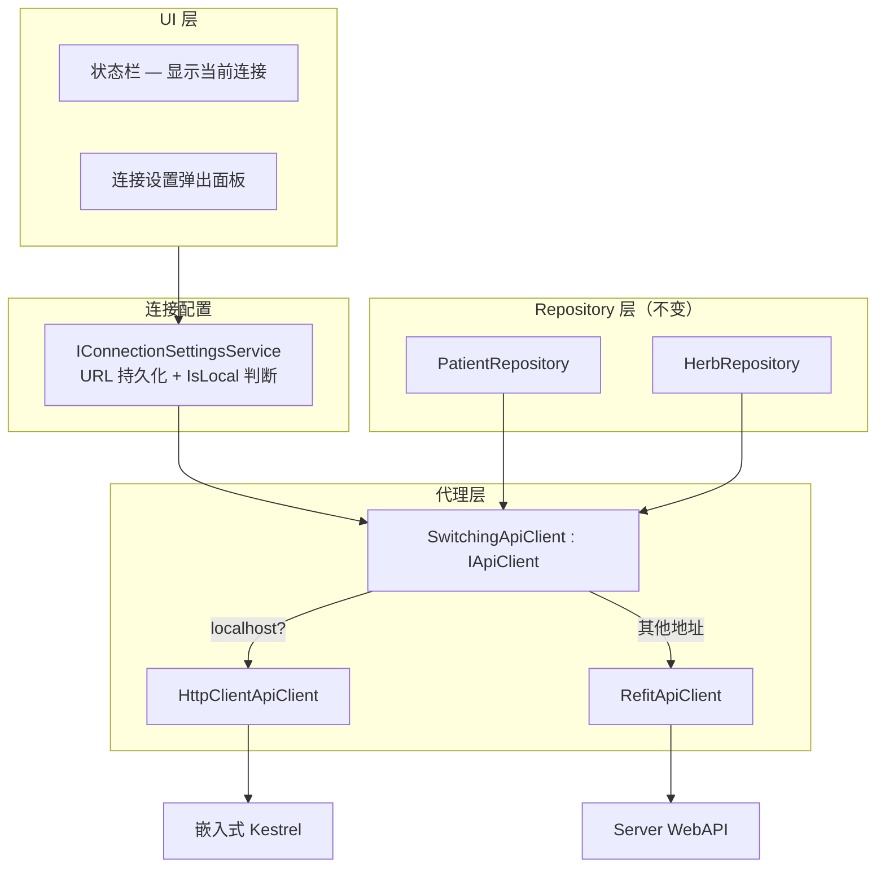
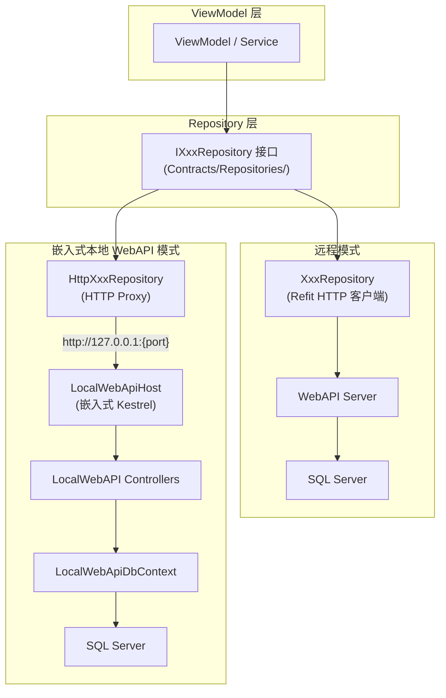
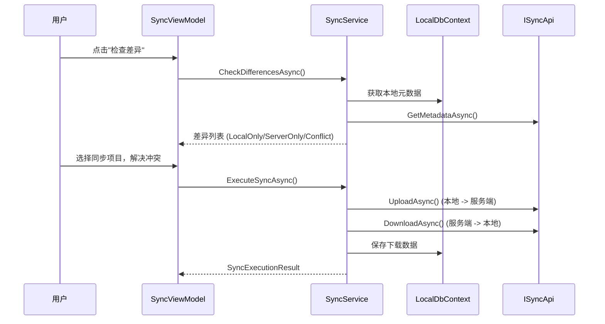

# 双模式架构（Remote WebAPI + LocalWebAPI）

## 概述

系统通过 URL 驱动的方式自动选择连接目标，不需要手动选择"模式"。

| URL 类型 | 客户端实现 | 目标服务 | 数据库 | 适用场景 |
|----------|-----------|---------|--------|----------|
| **非 localhost** | RefitApiClient | Server WebAPI | SQL Server (远程) | 多用户联网环境 |
| **127.0.0.1 / localhost** | HttpClientApiClient | 嵌入式 Kestrel | SQL Server (本地) | 单用户离线 |

用户通过状态栏的"连接设置"弹出面板输入 URL，`SwitchingApiClient` 代理自动路由到对应的底层实现。Repository 层完全无感知。

---

## 设计理由

> 完整决策记录见 [ADR-0009: URL 驱动双模式架构](decisions/0009-url-driven-dual-mode.md)。

### 问题背景

中医诊所管理系统需要同时满足两种部署场景：

1. **多终端联网** — 诊所配备 1-5 台终端（前台+医生），通过局域网连接共享数据
2. **单终端离线** — 偏远地区或网络不稳定环境，需要完全离线工作

### 核心设计选择

| 决策点 | 选择 | 替代方案 | 选择理由 |
|--------|------|----------|----------|
| 本地数据库 | SQL Server LocalDB | SQLite | 与远程 SQL Server 方言完全一致，消除跨数据库 LINQ 行为差异 |
| 本地 API 宿主 | 嵌入式 Kestrel（进程内） | 独立 Windows Service | 单进程部署，无需管理外部服务，适合无 IT 运维的小诊所 |
| 模式切换机制 | URL 驱动（localhost 判断） | ConnectionMode 枚举 + DI 重建 | 零配置切换，用户改 URL 即可，消除运行时状态机竞态 |
| Repository 统一层 | SwitchingApiClient 代理 | 直接注入 DbContext | HTTP 中间件管线（认证/授权/异常/日志）完整复用 |
| 认证复用 | 两端均用 JWT Bearer Token | 本地跳过认证 | Authorization Policy/Claims/中间件完整生效 |
| Controller 分离 | 两套独立 Controller | 共享 Controller 项目 | Server 有完整 3-layer DI，Local 精简 DI，依赖链不同 |
| 本地认证简化 | 1年长效 Token，无 Refresh | 完整 Refresh Token 流程 | 本地单用户 + Mutex 单实例，简化认证降低复杂度 |

### 设计权衡

**接受的代价**：

| 代价 | 理由/缓解 |
|------|----------|
| 本地模式 HTTP 序列化开销 | localhost 回环延迟 <1ms，小诊所数据量（~5000 医案/年）下不可感知 |
| 两套 Controller 代码 | Controller 仅做参数校验 + 调用 Service，核心业务规则在共享层（Entities/Validators/DTOs） |
| 本地 JWT 固定密钥 | 本地单用户场景，Mutex 保证单实例，安全风险可控；后续可 DPAPI 外部化 |
| 端点覆盖需手动对齐 | 当前 ~100%（106 remote vs 112 local），差异为 8 个本地独有便捷端点 |

**获得的收益**：

| 收益 | 说明 |
|------|------|
| 业务代码 100% 复用 | ViewModel/Service/Repository 零改动，完全无感知当前模式 |
| HTTP 管线完整复用 | 认证、授权、异常处理、日志、CorrelationId 两端全部生效 |
| 数据库行为一致 | 两端均为 SQL Server，LINQ 查询/排序/日期/NULL 处理行为完全一致 |
| 部署极简 | Desktop 单进程，LocalWebAPI 随主进程自动启停 |
| 模式切换无感 | URL 变更 → SwitchingApiClient 自动路由，无需重启或重新登录 |

---

## WebAPI vs LocalWebAPI 完整对比

### 共同点

| 维度 | 说明 |
|------|------|
| **Repository 接口** | 完全相同 — 6 个 `IXxxRepository` 接口定义在 `Contracts/Repositories/` |
| **DTO 契约** | 完全相同 — `src/Shared/LYBT.Shared.Models/Contracts/` |
| **实体模型** | 完全相同 — `src/Server/Core/LYBT.Entities/`，LocalWebApiDbContext 复用所有 `IEntityTypeConfiguration` |
| **业务规则** | Validators、BusinessRules 完全共享 |
| **认证机制** | 两端均使用 JWT Bearer Token + 相同 Claims Schema |
| **授权策略** | 相同的 4 个 Policy（AdminOnly / DoctorOrAdmin / PatientAccess / SuperAdminOnly） |
| **EF Core 过滤器** | `IsDeleted` 软删除全局过滤器两端均生效 |
| **异常处理** | 两端均通过 middleware/handler 统一处理，返回相同 ProblemDetails 格式 |

### 不同点

| 维度 | Remote WebAPI | LocalWebAPI | 设计理由 |
|------|--------------|-------------|----------|
| **宿主进程** | 独立 ASP.NET Core 服务 | WPF 进程内嵌 Kestrel（动态端口） | 单进程部署 |
| **URL 前缀** | `/api/v1/`（含版本段） | `/api/`（无版本段） | 本地无版本迁移需求 |
| **序列化** | camelCase（`AddControllers().AddJsonOptions`） | PascalCase（默认） | 历史 Token 兼容 |
| **数据库连接** | 远程 SQL Server（共享） | 本地 SQL Server LocalDB（每机独立） | 数据隔离 |
| **AccessToken** | 30 分钟过期 | 1 年过期 | 本地无 Token 泄露风险 |
| **RefreshToken** | 支持（滑动续期 + Token Family 防重放） | 不支持 | 本地单用户，无需续期 |
| **SecurityAuditLog** | 记录（登录/登出/刷新/锁定） | 不记录 | 本地无审计合规需求 |
| **Rate Limiting** | 5次/60s 登录 + 100次/min API | 不限制 | 本地单用户无限流必要 |
| **CORS** | 配置允许桌面端 origin | 不配置（同源） | localhost 无跨域 |
| **Sync 端点** | 6 个（作为 Sync Server） | 无（本地是唯一数据源） | 本地无需与自己同步 |
| **打印日志** | `POST /print-completed` 写入 `MedicalCasePrintLog` | 不记录 | 本地无服务端审计 |
| **多用户并发** | 支持（乐观锁 + 事务隔离） | 单用户（Mutex 防多开） | 本地无需并发控制 |
| **DI 架构** | 完整 3-layer（Controller→Service→Repository→DbContext） | 精简（Controller→DbContext 直连） | 本地无需抽象层 |
| **配置来源** | appsettings.json + 环境变量 | 嵌入式配置（代码内） | 本地无运维管理 |
| **端点数** | 106 | 112（多 8 个便捷端点） | 本地独有功能增强 |
| **健康检查** | DB 连接 + 版本 + 延迟 | DB 连接 + 磁盘空间 | 本地关注磁盘 |

### LocalWebAPI 独有端点

| 模块 | 端点 | 方法 | 说明 |
|------|------|------|------|
| Formulas | `/api/formulas/{id}/clone` | POST | 克隆验方（含药材组成） |
| Formulas | `/api/formulas/categories` | GET | 获取验方分类列表 |
| Patients | `/api/patients/by-id-number/{idNumber}` | GET | 按身份证号查询患者 |
| Patients | `/api/patients/by-phone/{phone}` | GET | 按手机号查询患者 |
| MedicalCases | `/api/medicalcases/pending` | GET | 获取待处理医案（无处方） |
| MedicalCases | `/api/medicalcases/by-status/{status}` | GET | 按状态查询医案 |
| Diagnostics | `/api/diagnostics/db-info` | GET | 数据库连接信息 + 磁盘空间 |
| Diagnostics | `/api/diagnostics/logs/recent` | GET | 最近日志条目 |

**设计说明**: 这些端点满足本地单用户场景的便捷需求（如快速克隆验方、身份证号查询、系统诊断），不要求远程模式实现。这些查询在远程模式由 Repository 客户端过滤完成。

## URL 驱动切换



## 架构图



## 统一 IApiClient 抽象

所有 Repository 依赖统一的 `IApiClient` 接口，不再区分"远程实现"和"本地实现"。`SwitchingApiClient` 代理根据当前 URL 自动路由。

| 接口 | IApiClient 子接口 | 说明 |
|------|------------------|------|
| IPatientRepository | IApiClient.Patients | CRUD + 批量操作 |
| IHerbRepository | IApiClient.Herbs | CRUD + 批量操作 + 分类查询 |
| IFormulaRepository | IApiClient.Formulas | CRUD + 克隆 + 批量操作 + 分类查询 |
| IMedicalCaseRepository | IApiClient.MedicalCases | CRUD + 状态流转 + 处方 |
| IUserRepository | IApiClient.Users | CRUD + 密码管理 + 批量操作 |
| IRegistrationRepository | IApiClient.Registrations | CRUD + 队列管理 |

DI 注册在 `UnifiedApiClientExtensions.cs` 中完成：始终注册 `SwitchingApiClient` 为 `IApiClient` Singleton。

### SwitchingApiClient 代理

```
SwitchingApiClient : IApiClient
  ├── _remoteApi (RefitApiClient)     ← 非 localhost 时使用
  └── _localApi  (HttpClientApiClient) ← localhost/127.0.0.1 时使用
```

- 每次属性访问（如 `_apiClient.Patients`）实时读取 `IConnectionSettingsService.CurrentUrl`
- URL 变更时自动重建底层客户端
- Repository 层零改动

## 端点覆盖率

| 模块 | Remote 端点 | Local 端点 | 覆盖率 | 差异说明 |
|------|------------|-----------|-------|----------|
| Auth | 5 | 5 | 100% | Local 无 RefreshToken 端点（用长效 Token 替代） |
| Users | 14 | 14 | 100% | — |
| Patients | 12 | 14 | 117% | Local 多 by-id-number, by-phone |
| Herbs | 16 | 17 | 106% | Local 多 categories |
| Formulas | 15 | 17 | 113% | Local 多 clone, categories |
| MedicalCases | 20 | 22 | 110% | Local 多 pending, by-status |
| Registrations | 7 | 9 | 129% | Local 多便捷查询 |
| Sync | 6 | 0 | — | Local 无 Sync（本地是唯一数据源） |
| Diagnostics | 4 | 7 | 175% | Local 多 db-info, logs/recent |
| Configuration | 3 | 4 | 133% | — |
| Health | 3 | 3 | 100% | — |
| **总计** | **106** | **112** | **106%** | Local 多 8 个便捷端点，少 6 个 Sync 端点 |

### 本地模式限制（TBD-01）

部分对服务端有强依赖的功能在本地模式下不可用：

| 功能 | 原因 | 行为 |
|------|------|------|
| Token 刷新 | 本地使用 1 年长效 Token | RefreshToken 端点返回 501 |
| SecurityAuditLog | 本地无审计合规需求 | 查询返回空结果 |
| 自动登录令牌 | 依赖远程中心化存储 | 端点返回 501 |
| 用户同步 | 用户数据不参与同步 | 手动维护 |
| 打印日志 | 本地无服务端审计 | 端点返回空结果 |

---

## LocalWebAPI 架构

### 进程内嵌 Kestrel

LocalWebAPI 是运行在 WPF Desktop 进程内的 ASP.NET Core Kestrel 实例，不是独立服务。

```
LYBT.Desktop.Shell.exe (WPF 主进程)
  ├── WPF UI 线程 (Dispatcher)
  ├── Kestrel 后台线程 (LocalWebApiHost)
  │     └── http://127.0.0.1:{动态端口}/api/...
  │           ├── Controllers (10 个)
  │           ├── LocalWebApiDbContext (SQL Server LocalDB)
  │           └── JWT 认证中间件 (简化版)
  └── Mutex (防多开)
```

**动态端口发现**: 启动时 Kestrel 绑定端口 0（OS 分配），实际端口写入 `IConnectionSettingsService`，SwitchingApiClient 据此路由。

**生命周期**: LocalWebAPI 随 Desktop 主进程启动/停止，无需独立管理。

### 本地认证架构

LocalWebAPI 使用简化版 JWT 认证：

| 维度 | Remote WebAPI | LocalWebAPI |
|------|--------------|-------------|
| 签名密钥 | 配置文件 (appsettings.json) | 固定常量 (`LYBT-LocalWebAPI-Secret-Key-2024`) |
| 签名算法 | HMAC-SHA256 | HMAC-SHA256 |
| AccessToken 有效期 | 30 分钟 | 1 年 |
| RefreshToken | 支持（Token Family 防重放） | 不支持 |
| Claims 结构 | 完全相同 | 完全相同 |
| Authorization Policy | 完全相同（4 个 Policy） | 完全相同 |
| SecurityAuditLog | 记录 | 不记录 |
| Rate Limiting | 5次/60s 登录 | 不限制 |

**设计理由**: 本地模式通过 Mutex 保证单实例运行，无 Token 泄露给其他终端的风险。1 年有效期覆盖典型使用周期，用户无需频繁重新登录。Claims 和 Policy 与远程完全一致，确保 Authorization 逻辑零改动。

### DbContext 架构

`LocalWebApiDbContext` 继承自与 Server 相同的 EF Core 配置：

```csharp
// LocalWebApiDbContext 复用 Server 端所有 IEntityTypeConfiguration
modelBuilder.ApplyConfigurationsFromAssembly(typeof(UserConfiguration).Assembly);
```

| 维度 | Server AppDbContext | LocalWebApiDbContext |
|------|--------------------|--------------------|
| 实体配置 | 完全相同（共享程序集） | 完全相同 |
| 连接字符串 | 远程 SQL Server | LocalDB `(localdb)\MSSQLLocalDB` |
| 数据库名 | LYBTDB | LYBTDB_Local |
| 迁移 | 4 个迁移 | 独立迁移（Database.EnsureCreated） |
| 查询过滤器 | IsDeleted 全局过滤器 | 完全相同 |

> **注**: 原独立文档 `localwebapi/overview.md`、`localwebapi/authentication.md`、`localwebapi/api-endpoints.md` 的内容已合并到本节。原文件保留作为详细参考。

---

## 同步架构

### 同步流程



### SyncService 核心操作

| 操作 | 说明 |
|------|------|
| CheckDifferencesAsync | 比对本地与服务端元数据，分类为 LocalOnly/ServerOnly/Conflict |
| UploadAsync | 序列化本地实体为 JSON，上传到服务端 |
| DownloadAsync | 从服务端下载实体 JSON，存入本地数据库 |
| ExecuteSyncAsync | 完整同步流程: 处理上传列表 + 下载列表 + 冲突解决 |

### 同步依赖顺序

| 顺序 | 下载 (Server->Local) | 上传 (Local->Server) | 原因 |
|------|---------------------|---------------------|------|
| 1 | Herb | Herb | Formula 子项引用 HerbId |
| 2 | Patient | Patient | MedicalCase 引用 PatientId |
| 3 | Formula | Formula | 依赖 Herb 已存在 |
| 4 | MedicalCase | MedicalCase | 聚合级，依赖 Patient + Herb；仅同步 Completed 状态 (SYNC-D01) |

### 支持同步的实体类型

| 实体 | 同步支持 |
|------|----------|
| Herb | 支持 |
| Patient | 支持 |
| Formula | 支持 (含 FormulaHerbItems) |
| MedicalCase | 仅同步 Completed 状态 (SYNC-D01)。聚合级原子同步 |
| User | v1.0 不支持 |

### 冲突解决

| 实体类型 | 策略 | 说明 |
|---------|------|------|
| Herb / Patient / Formula | Server Wins | 自动覆盖 |
| MedicalCase | 手动选择 | 保留冲突对比 UI |

---

## 架构决策记录

- [ADR-0009: URL 驱动双模式架构](decisions/0009-url-driven-dual-mode.md) — 当前决策：嵌入式 Kestrel + URL 驱动切换 + SQL Server LocalDB
- [ADR-0002: 双模式架构](decisions/0002-dual-mode-architecture.md) — 历史决策（已被 ADR-0009 取代）：SQLite + 策略模式 + 运行时 ConnectionMode

### 模块级决策

| 编号 | 决策 | 状态 | 说明 |
|------|------|------|------|
| SYNC-D01 | MedicalCase 同步范围 | 已确认 | 仅同步 Completed 状态 |
| SYNC-D02 | 统一本地/远程数据路径 | **已实施** | 废除 DataSource 抽象层，使用 Repository 双实现 |
| SYNC-D03 | 运行时模式切换 | **已移除** | 被 URL 驱动连接切换替代 (URL-CONN-01) |
| URL-CONN-01 | URL 驱动连接切换 | **已实施** | SwitchingApiClient 代理 + IConnectionSettingsService，用户通过 UI 输入 URL 即时切换 |
| SYNC-D04 | 冲突解决策略 | 已确认 | 简单实体 Server Wins; MedicalCase 手动选择 |
| LOCALWEB-01 | 使用 SQL Server 作为本地数据库 | 已实施 | 与远程模式保持一致，简化数据同步 |
| LOCALWEB-02 | 嵌入 Kestrel 在 WPF 进程内 | 已实施 | 避免独立进程管理复杂度 |
| LOCALWEB-03 | 简化 JWT 认证 (无刷新) | 已实施 | 本地模式无需复杂认证流 |
| LOCALWEB-04 | HTTP Proxy Repository 模式 | 已实施 | 统一 Repository 接口 |
| TBD-01 | 本地模式功能受限范围 | 已确定 | 不可用项: 自动登录/Token刷新/审计日志查询/User同步/服务端API导入导出 |

## 同步协议规范

### Checksum 算法

同步系统使用 SHA256 哈希算法对实体业务字段计算校验和，用于检测本地与服务端的数据差异。

**算法实现**（客户端与服务端完全一致）：

```csharp
private static string ComputeHash(object data)
{
    var json = JsonSerializer.Serialize(data, JsonOptions);
    var bytes = Encoding.UTF8.GetBytes(json);
    var hash = SHA256.HashData(bytes);
    return Convert.ToHexString(hash); // 大写十六进制字符串
}
```

**序列化选项**：

```csharp
new JsonSerializerOptions
{
    PropertyNamingPolicy = JsonNamingPolicy.CamelCase,
    DefaultIgnoreCondition = JsonIgnoreCondition.WhenWritingNull,
    WriteIndented = false
};
```

**各实体包含字段**（仅业务字段，排除审计字段）：

| 实体 | 包含字段 | 排除字段 |
|------|---------|---------|
| **Herb** | `Id`, `Name`, `PinYinCode`, `Category`, `Origin`, `Spec`, `Unit`, `Price`, `CostPrice`, `Effect`, `Usage`, `Remark`, `Status`, `IsDeleted` | `CreatedAt`, `UpdatedAt`, `CreatedBy`, `UpdatedBy`, `RowVersion` |
| **Patient** | `Id`, `Name`, `PinYinCode`, `Gender`, `BirthDate`, `IdNumber`, `PhoneNumber`, `Address`, `AllergyHistory`, `MedicalHistory`, `Status`, `DisableReason`, `IsDeleted` | 同上 |
| **Formula** | `Id`, `Name`, `Category`, `Effect`, `Indication`, `Usage`, `Remark`, `Property`, `Status`, `FormulaType`, `IsDeleted` + `Herbs`（按 `HerbId` 再 `HerbName` 排序，每项含 `HerbId`, `HerbName`, `Dosage`, `Unit`, `Remark`） | 同上 |
| **MedicalCase** | `Id`, `PatientId`, `UserId`, `CaseStatus`, `NeedsPrescription`, `CompletedAt`, `Remark`, `IsDeleted` + 嵌套 `Consultation`（`PresentIllness`, `TongueDiagnosis`, `PulseDiagnosis`, `TcmDiagnosis`）+ 嵌套 `Prescription`（`DosageCount`, `Discount`, `Usage`, `Advice`, `ReferencedFormulas`, `Remark` + `Items` 按 `HerbId` 排序，每项含 `HerbId`, `Dosage`, `Unit`, `DecocteMethod`, `UnitPrice`, `Usage`, `Remark`） | `CaseNumber`, `PrescriptionNumber`, `PatientName`, `DoctorName`, 所有审计字段, 打印字段 |

**确定性保证**：

- Formula 的 `Herbs` 集合按 `HerbId` 再 `HerbName` 排序
- MedicalCase 的 Prescription `Items` 按 `HerbId` 排序
- Null 值在 JSON 序列化时跳过（`JsonIgnoreCondition.WhenWritingNull`）

**代码位置**：`src/Server/Modules/LYBT.Module.Sync/Services/ChecksumHelper.cs`（服务端），`src/Client/Desktop/Core/LYBT.Desktop.LocalData/Helpers/ChecksumHelper.cs`（客户端，逐行一致的副本）。

### 同步元数据模型

**SyncMetadataDto** — 每个可同步实体的元数据：

| 字段 | 类型 | 说明 |
|------|------|------|
| `EntityId` | `Guid` | 实体唯一标识 |
| `Checksum` | `string` | SHA256 大写十六进制哈希 |
| `LastModifiedAt` | `DateTime` | `UpdatedAt ?? CreatedAt` |
| `IsDeleted` | `bool` | 是否已软删除 |
| `EntityName` | `string?` | 显示名称（UI 用） |
| `EntityType` | `string` | `"Herb"` / `"Patient"` / `"Formula"` / `"MedicalCase"` |

**变更检测策略**：Checksum 比对

1. 客户端计算所有本地实体的 Checksum（含软删除记录，使用 `IgnoreQueryFilters()`）
2. 客户端调用 `GET /api/v1/sync/metadata?entityType=X` 获取服务端元数据
3. 以 `EntityId` 为键进行字典比对：
   - **LocalOnly**：仅本地存在 → 需上传
   - **ServerOnly**：仅服务端存在 → 需下载
   - **Modified（冲突）**：两侧均存在但 Checksum 不同 → 需冲突解决
   - **Identical**：两侧 Checksum 相同 → 无需同步

**SyncDiffDto** — 差异记录：

| 字段 | 类型 | 说明 |
|------|------|------|
| `EntityType` | `string` | 实体类型 |
| `EntityId` | `Guid` | 实体 ID |
| `DiffType` | `SyncDiffType` | `LocalOnly` / `ServerOnly` / `Modified` / `Identical` |
| `EntityName` | `string?` | 显示名称 |
| `LocalChecksum` | `string?` | 本地 Checksum |
| `ServerChecksum` | `string?` | 服务端 Checksum |
| `LocalChangedAt` | `DateTime?` | 本地修改时间 |
| `ServerChangedAt` | `DateTime?` | 服务端修改时间 |
| `ChangedFields` | `List<string>?` | 变更字段列表（UI 冲突展示用） |

### 数据序列化格式

**传输格式**：`System.Text.Json`，camelCase 命名策略。

**传输载体**：实体序列化为 **JSON 字符串**（非嵌入 JSON 对象），放置在同步 DTO 的 `List<string>` 集合中：

- `SyncUploadInputDto.Entities` → `List<string>`（每个元素是一个实体的完整 JSON 序列化）
- `SyncDownloadResultDto.Entities` → `List<string>`（同上格式）

**上传流程**：

1. 客户端从 LocalDB 获取实体（`IgnoreQueryFilters()` + `AsNoTracking()`）
2. 序列化：`JsonSerializer.Serialize(entity, JsonOptions)`
3. 以 `List<string>` 发送至 `POST /api/v1/sync/upload`
4. 服务端解析：`JsonDocument.Parse(entityJsonString)` → `json.Deserialize<T>(JsonOptions)`

**下载流程**：

1. 服务端从 DB 获取实体（`AsNoTracking()`）
2. 序列化为 JSON 字符串
3. 以 `List<string>` 在 `SyncDownloadResultDto.Entities` 中返回
4. 客户端反序列化后使用 `CurrentValues.SetValues()` 合并到已有实体，或 `Add()` 新增

**API 通信**：Refit HTTP 客户端，POST 使用 `[Refit.Body]`，GET 使用 `[Refit.Query]`。所有端点返回 `ApiResponse<T>` 包装。

### 实体依赖顺序

同步系统支持 4 种实体类型（`SupportedTypes`：`"Herb"`, `"Patient"`, `"Formula"`, `"MedicalCase"`）。同步按实体类型逐个执行（用户选择类型），依赖顺序如下：

| 顺序 | 实体类型 | 依赖关系 | 说明 |
|------|---------|---------|------|
| 1 | **Herb** | 无依赖 | 基础药材数据 |
| 2 | **Patient** | 无依赖 | 患者数据 |
| 3 | **Formula** | → Herb | `FormulaHerbItem.HerbId` 引用药材 |
| 4 | **MedicalCase** | → Patient, Herb | `PatientId` 引用患者；`PrescriptionItem.HerbId` 引用药材 |

> **注意**：User 实体 v1.0 不参与自动同步，仅手动维护。

**删除时的引用检查**：

| 实体 | 检查逻辑 | 说明 |
|------|---------|------|
| Herb | `IHerbCrossModuleService.CheckHerbReferenceAsync(herbId)` | 被处方引用时拒绝删除 |
| Patient | `IPatientCrossModuleService.CheckPatientReferenceAsync(patientId)` | 有医案记录时拒绝删除 |
| Formula | 无检查 | 始终允许 |
| MedicalCase | 无检查 | 始终允许 |

### 错误恢复协议

#### 同步状态机

```
Idle → CheckingDifferences → ReviewingDifferences → ExecutingSync → Completed
                                                    ↘ Failed
```

| 阶段 | `SyncPhase` 枚举 | 说明 |
|------|------------------|------|
| 空闲 | `Idle` | 初始/完成后 |
| 检查差异 | `CheckingDifferences` | 比对本地与服务端 Checksum |
| 审查差异 | `ReviewingDifferences` | 用户选择同步项、解决冲突 |
| 执行同步 | `ExecutingSync` | 上传 + 下载 + 删除 |
| 完成 | `Completed` | 显示结果摘要 |
| 失败 | `Failed` | 错误分类，可重试 |

#### 错误分类（`SyncErrorClassifier`）

| 异常类型 | 条件 | 分类 | 可重试 |
|---------|------|------|--------|
| `HttpRequestException` | — | `TransientNetwork` | 是 |
| `TaskCanceledException` | — | `TransientNetwork` | 是 |
| `ApiException` | 401 | `AuthExpired` | 是 |
| `ApiException` | 409 | `ConflictChanged` | 是 |
| `ApiException` | 4xx（其他） | `BusinessReject` | 否 |
| 其他 | — | `Unknown` | 否 |

#### 重试机制

1. 每次操作前保存 `SyncRetryDescriptor`（记录 `Action`、`EntityType`、`FailedPhase`）
2. 失败时调用 `HandleWorkflowFailure()`：
   - 分类错误 → 设置 `CanRetry` 标志
   - 切换到 `SyncPhase.Failed`
3. `RetryCommand` 根据 `SyncRetryDescriptor` 重放上一次操作（`CheckDifferences` 或 `ExecuteSync`）

#### 上传部分失败

- 服务端逐条处理实体（每条独立 try-catch）
- 错误逐条收集到 `SyncUploadItemResult`
- 最终统一调用 `SaveChangesAsync()`
- 三个计数器：`successCount`、`conflictCount`、`errorCount`
- **不回滚已成功的条目**：部分成功即持久化

#### 冲突检测（上传时）

- 服务端实体已存在 且 `OverwriteConflicts == false` → 返回 `IsConflict = true`
- 服务端实体已存在 且 `OverwriteConflicts == true` → 使用 `CurrentValues.SetValues(incoming)` 覆盖
- `OverwriteConflicts` 由客户端 `FeatureToggleOptions.OverwriteConflicts` 控制

#### 前置验证

- 认证检查：`SessionManager.IsAuthenticated`
- API 健康检查：`IApiHealthCheckService.CheckHealthAsync(timeout: 5000)` — 服务端不健康时拒绝同步

#### API 端点

| 方法 | 路由 | 用途 | 授权 |
|------|------|------|------|
| GET | `/api/v1/sync/entity-types` | 列出支持的实体类型 | `DoctorOrAdmin` |
| GET | `/api/v1/sync/metadata?entityType=X` | 获取服务端元数据用于比对 | `DoctorOrAdmin` |
| POST | `/api/v1/sync/compare` | 服务端比对（客户端未使用） | `DoctorOrAdmin` |
| POST | `/api/v1/sync/upload` | 上传实体到服务端 | `DoctorOrAdmin` |
| POST | `/api/v1/sync/download` | 从服务端下载实体 | `DoctorOrAdmin` |
| POST | `/api/v1/sync/delete` | 同步软删除（含引用检查） | `DoctorOrAdmin` |

### MedicalCase 聚合同步

MedicalCase 是 DDD 聚合根，同步时作为原子单元处理，包含最多 4 层实体：

```
MedicalCase（根）
├── Consultation（一对一，可选）
└── Prescription（一对一，可选）
    └── PrescriptionItems（一对多）
```

#### 聚合级 Checksum

将所有 4 层合并为单个 SHA256 哈希。字段显式选择，排除派生/计算/显示字段：
- 排除：`CaseNumber`, `PrescriptionNumber`, `PatientName`, `DoctorName`, 审计字段, 打印字段
- `PrescriptionItems` 按 `HerbId` 排序确保确定性
- Null 的 Consultation/Prescription 在序列化时跳过

#### 上传（服务端 `SyncRepository.UpdateMedicalCaseValues`）

```csharp
// 1. 更新根实体标量值
_context.Entry(existing).CurrentValues.SetValues(incoming);

// 2. 更新 Consultation（一对一）
if (incoming.Consultation != null)
{
    if (existing.Consultation != null)
        _context.Entry(existing.Consultation).CurrentValues.SetValues(incoming.Consultation);
    else
        existing.Consultation = incoming.Consultation; // 新增
}

// 3. 更新 Prescription（一对一）+ Items（一对多）
if (incoming.Prescription != null)
{
    if (existing.Prescription != null)
    {
        _context.Entry(existing.Prescription).CurrentValues.SetValues(incoming.Prescription);
        // 删除所有已有 Items，重新添加传入 Items
        _context.RemoveRange(existing.Prescription.Items);
        foreach (var item in incoming.Prescription.Items)
        {
            item.PrescriptionId = existing.Prescription.Id;
            _context.Add(item);
        }
    }
    else
    {
        incoming.Prescription.MedicalCaseId = existing.Id;
        existing.Prescription = incoming.Prescription; // 新增
    }
}
else if (existing.Prescription != null)
{
    // 传入无处方 → 删除已有处方
    _context.RemoveRange(existing.Prescription.Items);
    _context.Remove(existing.Prescription);
    existing.Prescription = null;
}
```

#### 下载（客户端 `SaveMedicalCasesAsync`）

镜像逻辑：反序列化 JSON 字符串为 `MedicalCase` 实体，使用相同模式：
- `CurrentValues.SetValues()` 更新根实体
- 递归处理 Consultation、Prescription、Items
- 处方项采用"先删后增"策略确保无孤立项

#### 查询加载（两端一致）

```csharp
_context.MedicalCases
    .Include(mc => mc.Consultation)
    .Include(mc => mc.Prescription)
        .ThenInclude(p => p!.Items)
    .IgnoreQueryFilters() // 包含软删除记录
    .AsNoTracking()
```

#### 引用完整性

- PrescriptionItems 的 `HerbId` 必须引用已存在的 Herb（通过依赖顺序保证：Herb 先于 MedicalCase 同步）
- MedicalCase 的 `PatientId` 引用已存在的 Patient（通过依赖顺序保证）
- MedicalCase 的 `UserId` 引用 User（v1.0 不同步 User，需手动维护）

#### 孤立项处理

处方项采用**替换策略**：同步时先删除所有已有 `PrescriptionItems`，再添加传入的完整集合。这确保不会出现孤立项，但意味着：
- 本地与服务端的处方项差异以"全量覆盖"方式解决
- 被删除的处方项不会出现在同步结果中

---

## 变更记录

| 日期 | 版本 | 变更内容 |
|------|------|----------|
| 2026-02-10 | v1.0 | 初始版本 |
| 2026-02-22 | v2.0 | 架构演进: 新增 SYNC-D01~D04 决策 |
| 2026-03-08 | v2.1 | LocalDB 迁移: SQLite -> SQL Server |
| 2026-03-09 | v2.2 | v1.0-rc 状态同步 |
| 2026-03-09 | v3.0 | **Sprint 6 完成**: SYNC-D02 DataSource 废除 + SYNC-D03 运行时切换已实施 |
| 2026-04-01 | v4.0 | **LocalWebAPI 覆盖率提升**: 覆盖率从 ~78% 提升至 ~100% |
| 2026-05-01 | v5.0 | **架构简化**: 移除运行时模式切换 (ConnectionMode)、移除遗留 Local 仓储、统一为 Remote + LocalWebAPI 双模式 |
| 2026-06-08 | v6.0 | **URL 驱动连接切换**: 废弃 ApiMode 枚举，引入 SwitchingApiClient 代理 + IConnectionSettingsService，用户通过 UI 输入 URL 即时切换 |
| 2026-06-13 | v6.1 | **同步协议规范**: 新增 Checksum 算法、元数据模型、序列化格式、实体依赖顺序、错误恢复协议、MedicalCase 聚合同步详细文档 |
| 2026-06-13 | v7.0 | **设计合理化重构**: 合并 localwebapi/ 3 个文档，新增设计理由章节、WebAPI vs LocalWebAPI 完整对比矩阵、LocalWebAPI 架构详情（Kestrel/认证/DbContext），关联 ADR-0009 |
