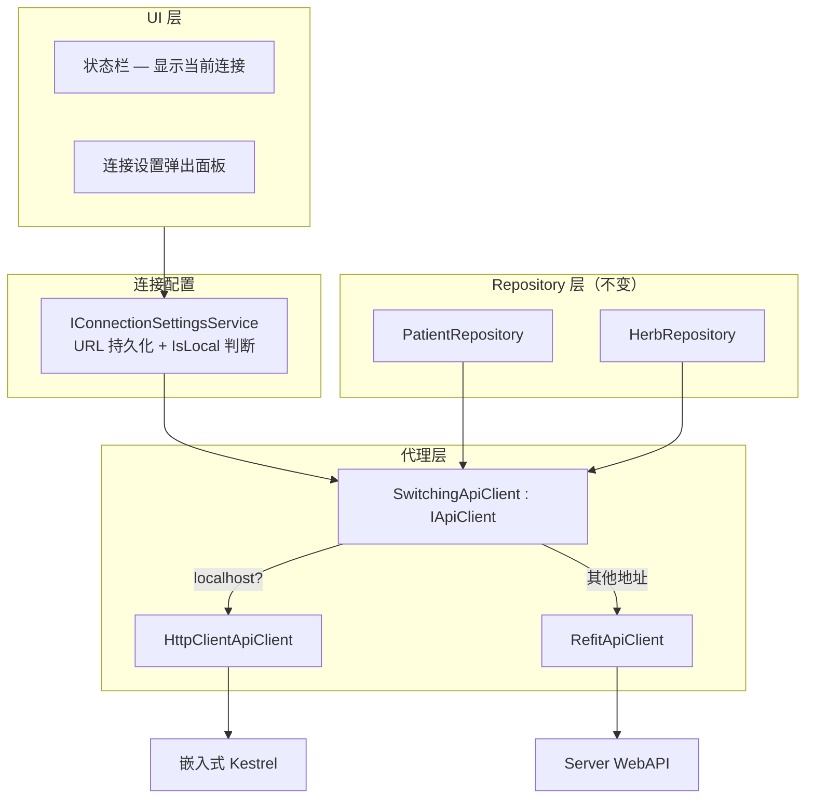
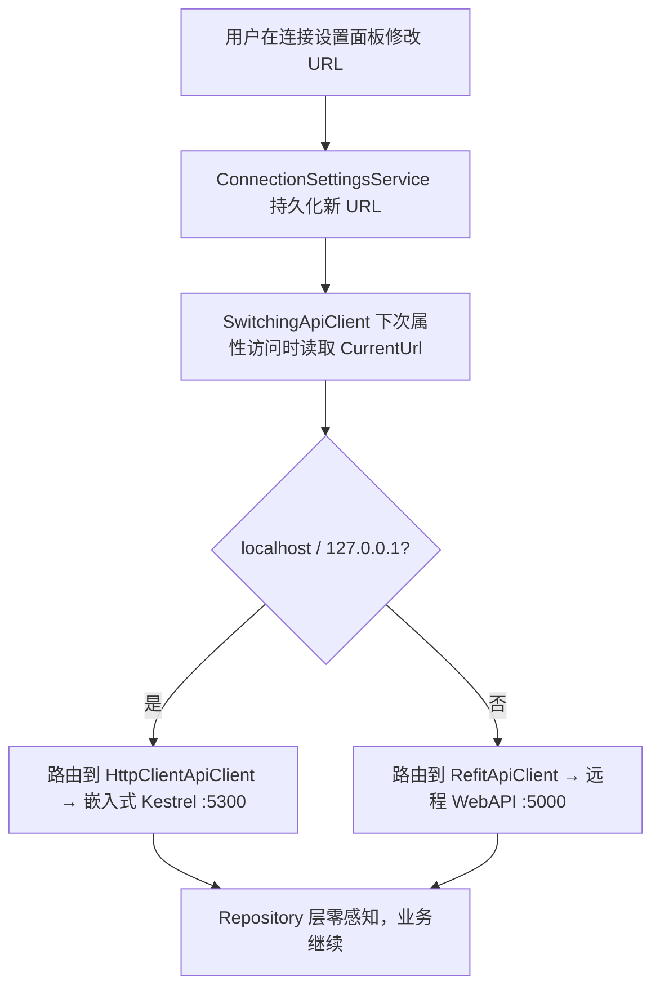

# 双模式架构（Remote WebAPI + LocalWebAPI）

> **N1 决策（2026-06-28，用户确认）**：**v1.0 远程库与本地库数据孤立，不互通**。本地模式定位为"远程故障应急降级"，断网期录入的数据事后手动补录或可丢。**Sync（数据同步）整体延期至 v2.0**，详见 [sync-protocol.md](sync-protocol.md)（v2.0 设计参考）。

## 概述

系统通过 URL 驱动的方式自动选择连接目标，不需要手动选择"模式"。

| URL 类型 | 客户端实现 | 目标服务 | 数据库 | 适用场景 |
|----------|-----------|---------|--------|----------|
| **非 localhost** | RefitApiClient | Server WebAPI | SQL Server (远程) | 多用户联网环境 |
| **127.0.0.1 / localhost** | HttpClientApiClient | 嵌入式 Kestrel（端口 **5300**，见 `EmbeddedLocalWebApiService.cs:17` + `appsettings.json:OfflineMode:LocalApiBaseUrl`） | SQL Server (本地) | 单用户离线 |

用户通过状态栏的"连接设置"弹出面板输入 URL，`SwitchingApiClient` 代理自动路由到对应的底层实现。Repository 层完全无感知。

---

## 设计理由

> 完整决策记录见 [ADR-0009: URL 驱动双模式架构](decisions/0009-url-driven-dual-mode.md)。

### 问题背景

中医诊所管理系统需要同时满足两种部署场景：

1. **多终端联网** — 诊所配备 1-5 台终端（前台+医生），通过局域网连接共享数据
2. **单终端离线** — 偏远地区或网络不稳定环境，需要完全离线工作

### 核心设计选择

| 决策点 | 选择 | 替代方案 | 选择理由 |
|--------|------|----------|----------|
| 本地数据库 | SQL Server LocalDB | SQLite | 与远程 SQL Server 方言完全一致，消除跨数据库 LINQ 行为差异 |
| 本地 API 宿主 | 嵌入式 Kestrel（进程内） | 独立 Windows Service | 单进程部署，无需管理外部服务，适合无 IT 运维的小诊所 |
| 模式切换机制 | URL 驱动（localhost 判断） | ConnectionMode 枚举 + DI 重建 | 零配置切换，用户改 URL 即可，消除运行时状态机竞态 |
| Repository 统一层 | SwitchingApiClient 代理 | 直接注入 DbContext | HTTP 中间件管线（认证/授权/异常/日志）完整复用 |
| 认证复用 | 两端均用 JWT Bearer Token | 本地跳过认证 | Authorization Policy/Claims/中间件完整生效 |
| Controller 分离 | 两套独立 Controller | 共享 Controller 项目 | Server 有完整 3-layer DI，Local 精简 DI，依赖链不同 |
| 本地认证简化 | 1年长效 Token，无 Refresh | 完整 Refresh Token 流程 | 本地单用户 + Mutex 单实例，简化认证降低复杂度 |

### 设计权衡

**接受的代价**：

| 代价 | 理由/缓解 |
|------|----------|
| 本地模式 HTTP 序列化开销 | localhost 回环延迟 <1ms，小诊所数据量（~5000 医案/年）下不可感知 |
| 两套 Controller 代码 | Controller 仅做参数校验 + 调用 Service，核心业务规则在共享层（Entities/Validators/DTOs） |
| 本地 JWT 固定密钥 | 本地单用户场景，Mutex 保证单实例，安全风险可控；后续可 DPAPI 外部化 |
| 端点覆盖需手动对齐 | 当前 ~100%（106 remote vs 112 local），差异为 8 个本地独有便捷端点 |

**获得的收益**：

| 收益 | 说明 |
|------|------|
| 业务代码 100% 复用 | ViewModel/Service/Repository 零改动，完全无感知当前模式 |
| HTTP 管线完整复用 | 认证、授权、异常处理、日志、CorrelationId 两端全部生效 |
| 数据库行为一致 | 两端均为 SQL Server，LINQ 查询/排序/日期/NULL 处理行为完全一致 |
| 部署极简 | Desktop 单进程，LocalWebAPI 随主进程自动启停 |
| 模式切换无感 | URL 变更 → SwitchingApiClient 自动路由，无需重启或重新登录 |

---

## WebAPI vs LocalWebAPI 完整对比

### 共同点

| 维度 | 说明 |
|------|------|
| **Repository 接口** | 完全相同 — 6 个 `IXxxRepository` 接口定义在 `Contracts/Repositories/` |
| **DTO 契约** | 完全相同 — `src/Shared/LYBT.Shared.Models/Contracts/` |
| **实体模型** | 完全相同 — `src/Server/Core/LYBT.Entities/`，LocalWebApiDbContext 复用所有 `IEntityTypeConfiguration` |
| **业务规则** | Validators、BusinessRules 完全共享 |
| **认证机制** | 两端均使用 JWT Bearer Token + 相同 Claims Schema |
| **授权策略** | 相同的 4 个 Policy（`DoctorOrReceptionist` / `DoctorOrAdmin` / `AdminOnly` / `AdminOrSuperAdmin`，见 `PolicyConstants`） |
| **EF Core 过滤器** | `IsDeleted` 软删除全局过滤器两端均生效 |
| **异常处理** | 两端均通过 middleware/handler 统一处理，返回相同 ProblemDetails 格式 |

### 不同点（含认证/DbContext/功能限制合并）

| 维度 | Remote WebAPI | LocalWebAPI | 设计理由 |
|------|--------------|-------------|----------|
| **宿主进程** | 独立 ASP.NET Core 服务 | WPF 进程内嵌 Kestrel（动态端口） | 单进程部署 |
| **URL 前缀** | `/api/v1/`（含版本段） | `/api/`（无版本段） | 本地无版本迁移需求 |
| **序列化** | camelCase（`AddControllers().AddJsonOptions`） | PascalCase（默认） | 历史 Token 兼容 |
| **数据库连接** | 远程 SQL Server（共享） | 本地 SQL Server LocalDB（每机独立） | 数据隔离 |
| **数据库名** | LYBTDB | LYBTDB_Local | — |
| **数据库迁移** | EF Core 迁移 | `Database.EnsureCreated`（独立迁移） | 本地无版本管理 |
| **AccessToken 有效期** | 60 分钟 | 1 年 | 本地无 Token 泄露风险 |
| **RefreshToken** | 支持（滑动续期 + Token Family 防重放） | 不支持 | 本地单用户，无需续期 |
| **JWT 签名密钥** | 配置文件 (appsettings.json) | 固定常量 (`LYBT-LocalWebAPI-Secret-Key-2024`) | 本地无需运维管理 |
| **SecurityAuditLog** | 记录（登录/登出/刷新/锁定） | 不记录 | 本地无审计合规需求 |
| **Rate Limiting** | 5次/60s 登录 + 100次/min API | 不限制 | 本地单用户无限流必要 |
| **CORS** | 配置允许桌面端 origin | 不配置（同源） | localhost 无跨域 |
| **Sync 端点** | 6 个（作为 Sync Server） | 无（本地是唯一数据源） | 本地无需与自己同步 |
| **打印日志** | `POST /print-completed` 写入 `MedicalCasePrintLog` | 不记录 | 本地无服务端审计 |
| **多用户并发** | 支持（乐观锁 + 事务隔离） | 单用户（Mutex 防多开） | 本地无需并发控制 |
| **DI 架构** | 完整 3-layer（Controller→Service→Repository→DbContext） | 精简（Controller→DbContext 直连） | 本地无需抽象层 |
| **配置来源** | appsettings.json + 环境变量 | 嵌入式配置（代码内） | 本地无运维管理 |
| **端点数** | 106 | 112（多 8 个便捷端点） | 本地独有功能增强 |
| **健康检查** | DB 连接 + 版本 + 延迟 | DB 连接 + 磁盘空间 | 本地关注磁盘 |

### LocalWebAPI 独有端点

| 模块 | 端点 | 方法 | 说明 |
|------|------|------|------|
| Formulas | `/api/formulas/{id}/clone` | POST | 克隆验方（含药材组成） |
| Formulas | `/api/formulas/categories` | GET | 获取验方分类列表 |
| Patients | `/api/patients/by-id-number/{idNumber}` | GET | 按身份证号查询患者 |
| Patients | `/api/patients/by-phone/{phone}` | GET | 按手机号查询患者 |
| MedicalCases | `/api/medicalcases/pending` | GET | 获取待处理医案（无处方） |
| MedicalCases | `/api/medicalcases/by-status/{status}` | GET | 按状态查询医案 |
| Diagnostics | `/api/diagnostics/db-info` | GET | 数据库连接信息 + 磁盘空间 |
| Diagnostics | `/api/diagnostics/logs/recent` | GET | 最近日志条目 |

**设计说明**: 这些端点满足本地单用户场景的便捷需求（如快速克隆验方、身份证号查询、系统诊断），不要求远程模式实现。这些查询在远程模式由 Repository 客户端过滤完成。

### 本地模式功能限制（TBD-01）

部分对服务端有强依赖的功能在本地模式下不可用：

| 功能 | 原因 | 行为 |
|------|------|------|
| Token 刷新 | 本地使用 1 年长效 Token | RefreshToken 端点返回 501 |
| SecurityAuditLog | 本地无审计合规需求 | 查询返回空结果 |
| 自动登录令牌 | 依赖远程中心化存储 | 端点返回 501 |
| 用户同步 | 用户数据不参与同步 | 手动维护 |
| 打印日志 | 本地无服务端审计 | 端点返回空结果 |

---

## URL 驱动切换



### 模式切换流程

> 对应 [ADR-0009: URL 驱动双模式架构](decisions/0009-url-driven-dual-mode.md) —— **URL 改即生效，无显式切换动作**。



**关键特性**（ADR-0009）：
- **无切换动作**：用户改 URL → 下次 API 调用自动走新目标，无需重启或重新登录
- **无运行时状态机**：`SwitchingApiClient` 是无状态代理，每次属性访问实时判断
- **无数据迁移**：v1.0 两库孤立（N1 决策），URL 切换不触发任何数据同步

## 统一 IApiClient 抽象

所有 Repository 依赖统一的 `IApiClient` 接口，不再区分"远程实现"和"本地实现"。`SwitchingApiClient` 代理根据当前 URL 自动路由。

| 接口 | IApiClient 子接口 | 说明 |
|------|------------------|------|
| IPatientRepository | IApiClient.Patients | CRUD + 批量操作 |
| IHerbRepository | IApiClient.Herbs | CRUD + 批量操作 + 分类查询 |
| IFormulaRepository | IApiClient.Formulas | CRUD + 克隆 + 批量操作 + 分类查询 |
| IMedicalCaseRepository | IApiClient.MedicalCases | CRUD + 状态流转 + 处方 |
| IUserRepository | IApiClient.Users | CRUD + 密码管理 + 批量操作 |
| IRegistrationRepository | IApiClient.Registrations | CRUD + 队列管理 |

DI 注册在 `UnifiedApiClientExtensions.cs` 中完成：始终注册 `SwitchingApiClient` 为 `IApiClient` Singleton。

### SwitchingApiClient 代理

```
SwitchingApiClient : IApiClient
  ├── _remoteApi (RefitApiClient)     ← 非 localhost 时使用
  └── _localApi  (HttpClientApiClient) ← localhost/127.0.0.1 时使用
```

- 每次属性访问（如 `_apiClient.Patients`）实时读取 `IConnectionSettingsService.CurrentUrl`
- URL 变更时自动重建底层客户端
- Repository 层零改动

## 端点覆盖率

| 模块 | Remote 端点 | Local 端点 | 覆盖率 | 差异说明 |
|------|------------|-----------|-------|----------|
| Auth | 5 | 5 | 100% | Local 无 RefreshToken 端点（用长效 Token 替代） |
| Users | 14 | 14 | 100% | — |
| Patients | 12 | 14 | 117% | Local 多 by-id-number, by-phone |
| Herbs | 16 | 17 | 106% | Local 多 categories |
| Formulas | 15 | 17 | 113% | Local 多 clone, categories |
| MedicalCases | 20 | 22 | 110% | Local 多 pending, by-status |
| Registrations | 7 | 9 | 129% | Local 多便捷查询 |
| Reports | 3 | 3 | 100% | 历史聚合查询（MC-008/009） |
| Sync | 6 | 0 | — | 🧲 v2.0（N1 决策，v1.0 两库孤立） |
| Diagnostics | 4 | 7 | 175% | Local 多 db-info, logs/recent |
| Configuration | 3 | 4 | 133% | — |
| Health | 3 | 3 | 100% | — |
| **总计** | **~108** | **112** | — | Local 多 8 个便捷端点；Sync v2.0 |

---

## LocalWebAPI 架构

### 进程内嵌 Kestrel

LocalWebAPI 是运行在 WPF Desktop 进程内的 ASP.NET Core Kestrel 实例，不是独立服务。

```
LYBT.Desktop.Shell.exe (WPF 主进程)
  ├── WPF UI 线程 (Dispatcher)
  ├── Kestrel 后台线程 (LocalWebApiHost)
  │     └── http://127.0.0.1:{动态端口}/api/...
  │           ├── Controllers (10 个)
  │           ├── LocalWebApiDbContext (SQL Server LocalDB)
  │           └── JWT 认证中间件 (简化版)
  └── Mutex (防多开)
```

**动态端口发现**: 启动时 Kestrel 绑定端口 0（OS 分配），实际端口写入 `IConnectionSettingsService`，SwitchingApiClient 据此路由。

**生命周期**: LocalWebAPI 随 Desktop 主进程启动/停止，无需独立管理。

### DbContext 架构

`LocalWebApiDbContext` 继承自与 Server 相同的 EF Core 配置：

```csharp
// LocalWebApiDbContext 复用 Server 端所有 IEntityTypeConfiguration
modelBuilder.ApplyConfigurationsFromAssembly(typeof(UserConfiguration).Assembly);
```

实体配置完全相同（共享程序集）；查询过滤器（IsDeleted 全局过滤器）完全相同。差异仅在连接字符串（LocalDB `(localdb)\MSSQLLocalDB`）和数据库名（LYBTDB_Local），迁移方式（`Database.EnsureCreated`）。

> **注**: 原独立文档 `localwebapi/overview.md`、`localwebapi/authentication.md`、`localwebapi/api-endpoints.md` 的内容已合并到本文档。原文件保留作为详细参考。

---

## 同步架构（v2.0）

> 🧲 **v2.0 规划** — Sync 整体属 v2.0（N1 决策）。v1.0 远程与本地数据孤立，无同步能力。
>
> **完整同步协议规范**（Checksum 算法、元数据模型、序列化格式、依赖顺序、错误恢复、MedicalCase 聚合同步）已外移至 [sync-protocol.md](sync-protocol.md)。

---

## 架构决策记录

- [ADR-0009: URL 驱动双模式架构](decisions/0009-url-driven-dual-mode.md) — 当前决策：嵌入式 Kestrel + URL 驱动切换 + SQL Server LocalDB
- [ADR-0002: 双模式架构](decisions/0002-dual-mode-architecture.md) — 历史决策（已被 ADR-0009 取代）：SQLite + 策略模式 + 运行时 ConnectionMode

---

## 变更记录

| 日期 | 版本 | 变更内容 |
|------|------|----------|
| 2026-06-28 | v8.0 | **spec S3 批次2 提炼（712→~360 行）**：同步架构 + 同步协议规范（Checksum/元数据/序列化/依赖顺序/错误恢复/MedicalCase 聚合同步/模块级决策）整体外移至 [sync-protocol.md](sync-protocol.md)；WebAPI vs LocalWebAPI 对比矩阵 + 本地认证架构 + DbContext 架构 + 本地模式限制 4 表合 1；N1 横幅简化为链接指向 sync-protocol。变更历史见 git log。 |
| 2026-06-28 | v7.2 | N1 决策对齐：顶部加 N1 横幅；端口统一 5300；模式切换流程图重写为 ADR-0009「URL 改即生效」语义；Policy 数量 2→4 对齐 PolicyConstants。 |
