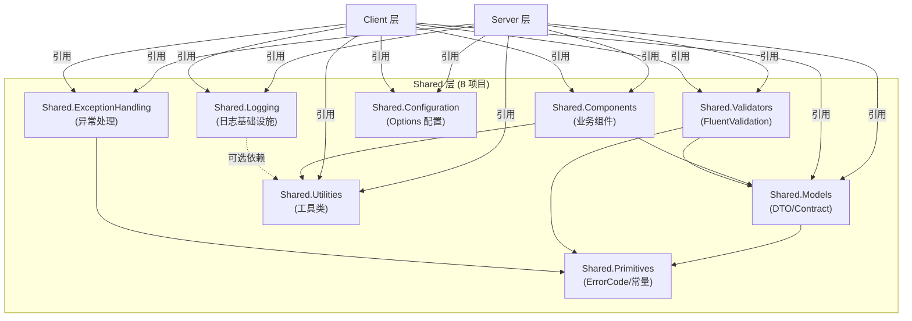

# 共享层架构

## 概述

Shared 层提供 Server 和 Client 两端共享的代码，包括 DTO 定义、工具类、业务组件和日志基础设施。Shared 层不依赖任何 Server 或 Client 项目，仅引用其他 Shared 项目和第三方 NuGet 包。

## 架构图



**依赖规则**:
- Shared 层项目可互相引用
- Server/Client 可引用 Shared
- Shared 禁止引用 Server 或 Client

## LYBT.Shared.Models (DTO 与 Contract)

### 职责

定义所有 API 契约 DTO、共享枚举、通用类型。是 Server/Client 之间的数据传输桥梁。

### 目录结构

```
LYBT.Shared.Models/
  Contracts/               # API 契约 DTO
    Auth/                  # 认证相关 DTO
    Patient/               # 患者 DTO
    MedicalCase/           # 医案 DTO
    Consultation/          # 诊断 DTO
    Prescription/          # 处方 DTO
    Herb/                  # 药材 DTO
    Formula/               # 验方 DTO
    User/                  # 用户 DTO
    Common/                # 跨模块 BasicDto
  Common/                  # 通用类型
    BaseDto.cs             # DTO 基类
    PagedRequest.cs        # 分页请求
    PagedResponse.cs       # 分页响应
    Result.cs              # 统一结果类型
  Enums/                   # 共享枚举
    Gender.cs
    MedicalCaseStatus.cs
    CommonStatus.cs
  Constants/               # 常量
    ErrorCodes.cs
```

### DTO 继承层次

```
BaseDto (Id: Guid)
  TimestampDto (CreatedAt, UpdatedAt)
    StatusDto (IsDeleted)
      AuditDto (CreatedBy, UpdatedBy)
```

| 基类 | 包含字段 | 适用场景 |
|------|----------|----------|
| BaseDto | Id | 仅需主键 |
| TimestampDto | + CreatedAt, UpdatedAt | 需要时间戳 |
| StatusDto | + IsDeleted | 需要软删除状态 |
| AuditDto | + CreatedBy, UpdatedBy | 需要审计信息 |

### DTO 命名规范

| 后缀 | 用途 | 示例 |
|------|------|------|
| `*Dto` | 列表/通用传输 | MedicalCaseDto |
| `*DetailDto` | 详情响应 | MedicalCaseDetailDto |
| `*InputDto` | 创建/更新输入 | PatientInputDto |
| `*CreateDto` | 创建请求 | PrescriptionCreateDto |
| `*Request` | 操作请求 | UpdateMedicalCaseRequest |
| `*BasicDto` | 跨模块轻量传输 | PatientBasicDto |

### 批量操作 DTO

| 命名 | 用途 |
|------|------|
| `{Entity}Batch{Op}InputDto` | 批量操作请求 |
| `{Entity}Batch{Op}ResultDto` | 批量操作响应 |
| `{Entity}ImportItemDto` | 导入单行 |
| `{Entity}ExportItemDto` | 导出单行 |
| `BatchIdsDto` | 通用 ID 列表 |
| `BatchOperationResultDto` | 通用批量结果 |

### DTO 字段选择标准

**ListDto**: 主键 + 名称 + 状态 + 关键业务字段。排除大文本、非必要审计字段。

**DetailDto**: Entity 的全部业务字段 + 状态 + 审计字段。

**BasicDto**: 仅 ICrossModuleService 所需的最少字段。

## LYBT.Shared.Utilities (工具类)

### 职责

提供无状态的通用工具方法，Server/Client 共享。

### 目录结构

```
LYBT.Shared.Utilities/
  Configuration/           # 配置辅助
    ConfigurationHelper.cs
  Security/                # 安全相关
    PasswordHasher.cs      # BCrypt 封装
    JwtHelper.cs           # JWT 辅助
  Text/                    # 文本处理
    PinYinConverter.cs     # 中文转拼音
    StringExtensions.cs    # 字符串扩展
  Helpers/                 # 通用辅助
    DateTimeHelper.cs
```

**约束**: 工具类必须无状态 (纯函数)，不引用任何 LYBT 项目。

## LYBT.Shared.Components (业务组件)

### 职责

提供可被 Server 和 Client 复用的业务逻辑组件。与 Utilities 不同，Components 包含业务逻辑。

### 目录结构

```
LYBT.Shared.Components/
  Interfaces/              # 组件接口
    IHerbItem.cs
  Calculators/             # 计算器
    HerbCalculatorBase.cs
    PrescriptionCalculator.cs
  Validators/              # 业务验证
    HerbValidatorBase.cs
  BusinessRules/           # 共享业务规则
    MedicalCaseBusinessRules.cs
```

### MedicalCaseBusinessRules (计划新增)

> 设计文档: design-deepening-phase3 | design-issues-solutions Issue #4

提取到 Shared 层的纯函数业务规则，供 Server 端和 Local 端共享，解决 Local 模式绕过业务规则的问题:

| 方法 | 用途 | 对应规则 |
|------|------|----------|
| `CanCreateNewCase(statuses)` | 检查患者是否可新建医案 | BR-001 (单活跃医案约束) |
| `HasActiveCase(statuses)` | 检查患者是否存在活跃医案 | BR-001 |
| `IsValidStatusTransition(from, to)` | 状态转换合法性验证 | FR-MC-006~008 状态机矩阵 |

**当前状态**: 待实施 (S5)。Server 端 `MedicalCaseRules` 将简化为 thin wrapper 委托给此类。

**约束**: 可引用 Shared.Models 和 Shared.Utilities，禁止引用 Server/Client。

## LYBT.Shared.Logging (日志基础设施)

### 职责

提供跨前后端的统一日志能力，基于 Serilog。

### 目录结构

```
LYBT.Shared.Logging/
  Abstractions/            # 接口定义
  Configuration/           # 配置类
  Enrichers/               # Serilog Enrichers
  Masking/                 # 敏感数据脱敏
  Management/              # 日志管理 (级别控制)
  Extensions/              # DI 扩展方法
```

### Serilog 架构

#### 两阶段启动

Serilog 在 Server 和 Desktop 两端均采用两阶段初始化，确保 DI 容器就绪前的启动错误也能被捕获:

1. **CreateBootstrapLogger()** — 最小化配置的引导日志器，在 `Program.cs` 最早期创建，捕获 DI 容器构建前的启动异常 (配置文件缺失、程序集加载失败等)
2. **DI 构建日志器** — 从 `appsettings.json` 读取完整配置，通过 `logger.ReadFrom.Configuration(hostBuilderContext.Configuration)` 构建，替换引导日志器

```csharp
// Program.cs 两阶段模式
Log.Logger = new LoggerConfiguration()
    .CreateBootstrapLogger();          // 阶段1: 引导日志器

// ... build DI container ...

builder.Host.UseSerilog((context, logger) =>
    logger.ReadFrom.Configuration(context.Configuration));  // 阶段2: 完整配置
```

#### Sink 配置

| 端 | Sink | 说明 |
|----|------|------|
| Server | Console | 开发调试，结构化 JSON 输出 |
| Server | File (rolling) | 持久化日志文件 |
| Server | MSSqlServer | SecurityAuditLog 写入数据库 |
| Desktop | Console | 开发调试 |
| Desktop | File (rolling) | 持久化日志文件 |

#### 日志文件布局

| 参数 | 值 |
|------|-----|
| 路径 | `logs/lybt-{Date}.log` |
| 滚动 | 每日 (rolling) |
| 保留 | 365 天 (可配置) |
| 输出模板 | `{Timestamp:HH:mm:ss} [{Level:u3}] {SourceContext} | {Message:lj}{NewLine}{Exception}` |

#### 敏感数据脱敏

PatientModel 属性标记 `[SensitiveData]` 特性后，Serilog 析构时通过 `SensitiveDataDestructuringPolicy` 自动脱敏:

| 字段 | 脱敏示例 | MaskingMode |
|------|----------|-------------|
| PhoneNumber | `138****1234` | Partial |
| IdNumber | `310***********1234` | Partial |
| Address | `[已隐藏]` | Full |
| AllergyHistory | `[REDACTED:A1B2C3D4]` | Hash |

> 脱敏模式定义见 [SensitiveDataAttribute 设计](#sensitivedataattribute-设计) 章节。

## LYBT.Shared.Primitives (错误码与基础类型)

### 职责

定义系统级基础类型，包括统一错误码 (ErrorCode)、错误消息映射 (ErrorMessages)、验证常量 (ValidationConstants)。是所有模块共享的最底层依赖。

### 目录结构

```
LYBT.Shared.Primitives/
  ErrorCodes/              # 统一错误码体系
    ErrorCode.cs           # MCCEE 错误码枚举 (M=模块, CC=子类别, EE=序号)
    ErrorMessages.cs       # 错误码到用户友好消息的映射
    ErrorCategory.cs       # 错误分类
    ErrorCodeExtensions.cs # 错误码扩展方法
  Validation/              # 验证常量
    ValidationConstants.cs # 全局验证常量 (字符串长度、数值范围等)
```

### 错误码分区

| 分区 | 模块 | 示例 |
|------|------|------|
| 0xxxx | 通用错误 | Unknown, NotFound, ValidationFailed |
| 1xxxx | 用户/认证 (Users/Auth) | UserNotFound, AuthInvalidCredentials |
| 2xxxx | 患者 (Patients) | PatientNotFound, PatientPhoneDuplicate |
| 3xxxx | 医案 (MedicalCase) | McActiveCaseExists, McInvalidStatusTransition |
| 4xxxx | 处方 (Prescriptions) | PrescriptionNotFound |
| 5xxxx | 药材 (Herbs) | HerbNotFound, HerbNameExists |
| 6xxxx | 验方 (Formula) | FormulaNotFound, FormulaNoPermission |
| 7xxxx | 同步 (Sync) | SyncDataConflict, SyncFailed |

**约束**: 零依赖，不引用任何其他 LYBT 项目。

## LYBT.Shared.Validators (FluentValidation 验证器)

### 职责

集中管理从各业务模块提取的 FluentValidation 验证器和共享业务规则验证器，Server/Client 双端复用。

### 目录结构

```
LYBT.Shared.Validators/
  Auth/                    # 认证验证器
    LoginRequestValidator.cs
    SuperAdminLoginRequestValidator.cs
    ChangePasswordRequestValidator.cs
  Consultation/            # 诊断验证器
    ConsultationInputDtoValidator.cs
  Prescriptions/           # 处方验证器
    PrescriptionInputDtoValidator.cs
  MedicalCase/             # 医案验证器
    MedicalCaseInputDtoValidator.cs
  Patients/                # 患者验证器
    PatientInputDtoValidator.cs
  Users/                   # 用户验证器
    UserInputDtoValidator.cs
  Herbs/                   # 药材验证器
    HerbInputDtoValidator.cs
  Formula/                 # 验方验证器
    FormulaInputDtoValidator.cs
  BusinessRules/           # 共享业务规则
    IBusinessRuleValidator.cs
    BaseBusinessRuleValidator.cs
    MedicalCaseBusinessRules.cs
    PatientBusinessRuleValidator.cs
    UserBusinessRuleValidator.cs
    PrescriptionBusinessRuleValidator.cs
    ValidationContext.cs
```

**约束**: 引用 Shared.Models 和 Shared.Primitives (ValidationConstants)，禁止引用 Server/Client。

## LYBT.Shared.ExceptionHandling (异常处理)

### 职责

提供统一的异常层次结构、ProblemDetails 工厂和双端 (Server/Desktop) 异常处理器。所有业务异常继承 `AppException`，携带 `ErrorCode` 用于结构化错误响应。

### 目录结构

```
LYBT.Shared.ExceptionHandling/
  Exceptions/              # 异常类层次
    Base/
      AppException.cs      # 基类 (携带 ErrorCode)
    Business/
      BusinessException.cs # 业务异常
      ValidationException.cs
      NotFoundException.cs
      ConflictException.cs
    Security/
      UnauthorizedException.cs
    External/
      ApiException.cs      # 外部 API 调用异常
    Factory/
      ExceptionFactory.cs  # 异常工厂
  Handlers/                # 异常处理器
    Server/
      BusinessExceptionHandler.cs
      SystemExceptionHandler.cs
    Desktop/
      DesktopExceptionHandler.cs
      IDesktopExceptionHandler.cs
      ExceptionSeverity.cs
  ProblemDetails/          # RFC 7807 ProblemDetails
    ProblemDetailsFactory.cs
    ProblemDetailsExtensions.cs
    ClientProblemDetails.cs
  Mappers/                 # 错误消息映射
    IErrorMessageMapper.cs
    ExceptionMessageMapper.cs
    ConfigurableErrorMessageMapper.cs
    ClientErrorMessageMapper.cs
    ExceptionSeverityMapper.cs
  Extensions/              # DI 扩展
    ServiceCollectionExtensions.cs
    ApplicationBuilderExtensions.cs
```

### 异常继承层次

```
Exception
  AppException (ErrorCode, HttpStatusCode)
    BusinessException (400)
      ValidationException (400)
      NotFoundException (404)
      ConflictException (409)
    UnauthorizedException (401)
    ApiException (502/503)
```

**约束**: 引用 Shared.Primitives (ErrorCode)，禁止引用 Server/Client 具体实现。

## LYBT.Shared.Configuration (配置选项)

### 职责

集中管理所有 Options 类和配置绑定扩展，Server/Client 通过 `IOptions<T>` 模式消费。包含配置验证器确保启动时配置合法。

### 目录结构

```
LYBT.Shared.Configuration/
  Options/
    Common/
      JwtOptions.cs        # JWT 配置 (双端共享)
    Server/
      DatabaseOptions.cs   # 数据库连接配置
      SecurityOptions.cs   # 安全策略
      SessionOptions.cs    # 会话管理
      LoggingOptions.cs    # 日志配置
      SystemAdminOptions.cs # 系统管理员初始化
      DefaultPasswordOptions.cs # 默认密码策略
      MemoryCacheOptions.cs # 缓存配置
      SwaggerOptions.cs    # Swagger 配置
      JsonOptions.cs       # JSON 序列化配置
    Client/
      ApiClientOptions.cs  # API 客户端配置 (BaseUrl, Timeout)
      ClientSessionOptions.cs # 客户端会话配置
      FeatureToggleOptions.cs # 功能开关
      ClinicSettingsOptions.cs # 诊所设置
      PrescriptionOptions.cs # 处方默认值
      SyncOptions.cs       # 数据同步配置
  Validation/              # 配置验证器 (IValidateOptions<T> 实现)
    JwtOptionsValidator.cs
    DatabaseOptionsValidator.cs
    SecurityOptionsValidator.cs
  Extensions/              # DI 绑定扩展
    ServerConfigurationExtensions.cs
    ClientConfigurationExtensions.cs
```

> 详细的配置架构说明 (验证管道、环境分层、热更新策略) 请参见 [configuration.md](07-configuration.md)。

**约束**: 引用 Microsoft.Extensions.Options，禁止引用业务逻辑。

## SensitiveDataAttribute 设计

> 位于 `LYBT.Shared.Logging.Masking` 命名空间

`[SensitiveData]` 特性用于标记需要日志脱敏的属性。`SensitiveDataMasker` 在序列化和日志输出时自动检测该特性并应用脱敏规则。

### 使用方式

```csharp
[SensitiveData(SensitiveDataType.ContactInfo, MaskingMode = MaskingMode.Partial)]
public string PhoneNumber { get; set; }
```

### 脱敏模式 (MaskingMode)

| 模式 | 说明 | 示例 |
|------|------|------|
| Default | 中间位用 * 替代 | `张**` / `abc****xyz` |
| Partial | 显示前后几位，按数据类型智能处理 | 手机号: `138****1234`，身份证: `110***********1234` |
| Full | 完全隐藏 | `[已隐藏]` |
| Hash | SHA256 短哈希标识 | `[REDACTED:A1B2C3D4]` |

### 数据类型 (SensitiveDataType)

| 类型 | 说明 | 典型字段 |
|------|------|----------|
| PersonalInfo | 个人信息 | 姓名、地址 |
| MedicalInfo | 医疗信息 | 过敏史、病史 |
| ContactInfo | 联系信息 | 手机号、邮箱 |
| IdentityInfo | 身份信息 | 身份证号 |
| FinancialInfo | 财务信息 | 银行卡号 |

### 脱敏层次

- **属性级**: `SensitiveDataMasker.MaskObject()` 反射检测 `[SensitiveData]` 特性
- **文本级**: `SensitiveDataMasker.SanitizeText()` 正则匹配密码、Token、连接字符串等
- **Serilog 集成**: `SensitiveDataDestructuringPolicy` 在 Serilog 解构时自动脱敏

## 验证规则一致性

### 三层验证体系

```
Entity (DataAnnotations)
  DTO (DataAnnotations)
    DetailModel (DataAnnotations)
      FluentValidator (Server 端)
```

**规则**:
- 三层使用相同的 `ValidationConstants` 常量
- 必填字段: Entity `[Required]` = DTO `[Required]` = FluentValidation `NotEmpty()`
- 可空字段: 使用 `if (value.HasValue && ...)` 模式，不要求必填
- 字符串长度: 统一引用 `ValidationConstants.NameMaxLength` 等常量

### ValidationConstants 位置

`LYBT.Shared.Primitives.Validation.ValidationConstants` -- 所有验证常量的唯一来源。

## Mapperly 映射规范

### 概述

基于 **Mapperly 4.3.1** 的编译时 source-generator 映射，零运行时反射。项目内共 23 个 Mapper 类，分布在 Server 和 Client 两端。

| 层 | Mapper 数量 | 位置 |
|----|------------|------|
| Server 模块 | 6 | `src/Server/Modules/LYBT.Module.*/Mapping/` |
| Client LocalData | 6 | `src/Client/Desktop/Core/LYBT.Desktop.LocalData/Mappers/` |
| Client Desktop 模块 | 10 | `src/Client/Desktop/Modules/LYBT.Desktop.*/Mappers/` |
| Client 内联 | 1 | `PatientRepository.cs` 内 `PatientListToDetailMapper` |

### 映射约定

#### Mapper 属性配置

```csharp
// Server 端: Target 策略 (只映射目标属性, 未匹配源不报错)
[Mapper(RequiredMappingStrategy = RequiredMappingStrategy.Target)]

// Client LocalData: 默认 Both 策略 (源和目标都必须匹配)
[Mapper]

// Client Desktop 模块: Target 策略 (与 Server 一致)
[Mapper(RequiredMappingStrategy = RequiredMappingStrategy.Target)]

// 特殊: 深度克隆
[Mapper(UseDeepCloning = true)]
```

#### 标准方法命名

| 方法 | 签名模式 | 说明 |
|------|----------|------|
| `ToListDto` | `Entity → ListDto` | 列表映射 (基础字段) |
| `ToListDtos` | `List<Entity> → List<ListDto>` | 列表批量映射 |
| `ToDetailDto` | `Entity → DetailDto` | 详情映射 (全字段) |
| `ToDetailDtos` | `List<Entity> → List<DetailDto>` | 详情批量映射 |
| `ToEntity` | `InputDto → Entity` | 创建映射 |
| `UpdateEntity` | `(InputDto dto, Entity entity) → void` | 更新映射 (映射到已有实例) |
| `ToEntityFromImport` | `ImportItemDto → Entity` | Excel 导入映射 (忽略更多目标字段) |

#### 常用特性

| 特性 | 用途 |
|------|------|
| `[MapperIgnoreSource]` | 忽略源属性 (不参与映射) |
| `[MapperIgnoreTarget]` | 忽略目标属性 (由 Service 或计算填充) |
| `[MapProperty]` | 属性重命名映射 |
| `[UserMapping(Default = false)]` | 手写方法, 禁止自动生成 |

### Server 端映射模式

#### 1. Core 映射: Entity → DTO

每个实体对应一个 Mapper 类, 提供 `ToListDto` / `ToDetailDto` / `ToEntity` / `UpdateEntity` 方法。

**实体 → 列表 DTO**: 仅映射基础字段, 忽略计算字段和导航属性。

**实体 → 详情 DTO**: 映射全部业务字段, 忽略需要 Service 层计算的字段。

**输入 DTO → 实体**: 忽略所有审计字段 (`CreatedAt`/`UpdatedAt`/`CreatedBy`/`UpdatedBy`)、主键 (`Id`)、状态字段和计算字段。

#### 2. Enrich 映射: 聚合根导航属性填充

MedicalCase 是聚合根, 其 `ToDetailDto` 需要 Consultation 和 Prescription 的导航数据。采用 **Core + Enrich** 模式:

```csharp
// 生成器生成的基础映射 (忽略导航属性)
public partial MedicalCaseDetailDto ToDetailDto(MedicalCase entity);

// 手写 Enrich 方法, 标记 UserMapping 禁止自动生成
[UserMapping(Default = false)]
public MedicalCaseDetailDto MapToMedicalCaseDetailDto(MedicalCase entity)
{
    var dto = ToDetailDto(entity);
    // 填充导航属性: CaseNumber, Diagnosis, Consultation, Prescription
    dto.ConsultationId = entity.Consultation?.Id;
    dto.PrescriptionId = entity.Prescription is { IsDeleted: false }
        ? entity.Prescription.Id : null;
    // ... 嵌套 DTO 映射
    return dto;
}
```

#### 3. 已知特殊处理

| 实体 | 属性 | 处理方式 |
|------|------|----------|
| MedicalCase | `HasPrescription` | 计算属性 (`Prescription != null && !IsDeleted`), Mapper 忽略, Service 显式设置 |
| Formula | `Indication → Indications` | `MapProperty` 重命名 (单数→复数) |
| MedicalCase | `Consultation.Id → MedicalCaseId` | `MapProperty` 跨实体 ID 映射 |
| Formula | `HerbCount`, `TotalPrice` | 计算字段, Mapper 忽略, Service 计算 |
| Patient | `Age` | 计算属性 (从 BirthDate), Mapper 忽略 |

### Client Desktop 模块映射模式

#### 1. DTO → UI Model (BindableBase)

Desktop 模块的 Mapper 将 DTO 映射为 WPF 绑定用的 ItemModel:

```csharp
// FormulaMapper: FormulaDetailDto → FormulaItem
// PatientMapper: PatientDetailDto → PatientItem (带 IsSelected, DisplayText 等 UI 状态)
```

#### 2. IsShared ↔ IsPersonal 布尔反转 (Formula 模块)

Formula 的 DTO 使用 `IsShared`, 而 UI Model 使用 `IsPersonal`, 语义相反:

```csharp
// DTO → Item: Mapper 忽略两边属性, 手动反转
item.IsPersonal = !dto.IsShared;

// Item → DTO: 反向同理
dto.IsShared = !item.IsPersonal;
```

此模式出现在 `FormulaMapper`、`FormulaDetailModelMapper`、`FormulaHerbItemMapper` 中, 共 4 处映射方向。

#### 3. DTO → DTO 转换

`PatientListToDetailMapper` 将 `PatientListDto` 映射为 `PatientDetailDto`, 用于客户端仅持有列表数据时构造详情视图。

### Client LocalData 映射模式

LocalData Mapper 映射 LocalDB 实体到共享 DTO, 使用默认 `Both` 策略。MedicalCase 同样采用 **Core + Enrich** 模式:

```csharp
// 生成器方法 (忽略导航属性)
public partial MedicalCaseDetailDto ToDetailDtoCore(MedicalCase entity);

// 手写 Enrich 包装
public MedicalCaseDetailDto ToDetailDto(MedicalCase entity)
{
    var dto = ToDetailDtoCore(entity);
    // 填充 ConsultationId, PrescriptionId, Diagnosis, 嵌套 DTO
    return dto;
}
```

### DI 注册

| 模式 | 适用范围 | 说明 |
|------|----------|------|
| `new()` 直接实例化 | 大多数 Mapper | Mapperly 生成无状态代码, 无需 DI |
| `AddSingleton<T>()` | MedicalCaseMapper (Server) | 已注册但部分 Service 仍用 `new()` |

Server 端 Mapper 使用 `new()` 内联实例化 (UserMapper, PatientMapper, HerbMapper, FormulaMapper, RegistrationMapper)。

Client 端所有 Mapper 均使用 `new()` 内联实例化。

> 注: Mapperly 生成的是无状态 partial class, `new()` 实例化安全且高效, DI 注册非必需。

### 已知陷阱

| 陷阱 | 说明 | 影响文件 |
|------|------|----------|
| HasPrescription | 从 `PrescriptionId.HasValue` 计算, Mapper 必须忽略并由 Service 显式设置 | MedicalCaseMapper, LocalMedicalCaseMapper |
| Boolean 反转 | Formula `IsShared`/`IsPersonal` 语义相反, 必须手写映射 | FormulaMapper (Desktop), FormulaDetailModelMapper |
| DateTime | 所有 DateTime 存储 UTC, 显示转换在 ViewModel 层 | 全局 |
| Nullable 引用类型 | Mapperly 尊重可空性标注, 不匹配时需显式处理 | 全局 |
| Audit 字段 | `CreatedAt`/`UpdatedAt` 等在 `ToEntity`/`UpdateEntity` 中必须忽略 | 所有 Mapper |
| 未使用 Mapper | Desktop `PatientMapper` (Patients 模块) 未被任何代码实例化 | LYBT.Desktop.Patients/Mappers/ |

## 变更记录

| 日期 | 版本 | 变更内容 |
|------|------|----------|
| 2026-02-10 | v1.0 | 初始版本，从 shared-layer-architecture/dto-architecture specs 整合 |
| 2026-02-23 | v1.1 | 一致性审计: 新增 MedicalCaseBusinessRules 组件文档 (设计来源: design-deepening-phase3 + design-issues-solutions #4) |
| 2026-02-26 | v1.2 | DOC3-03: 补全 4 个缺失 Shared 项目文档 (Primitives/Validators/ExceptionHandling/Configuration)；DOC3-13: 新增 SensitiveDataAttribute 设计章节 |
| 2026-06-13 | v1.3 | **Serilog 架构**: 扩展 Logging 章节 — 两阶段启动、Sink 配置、日志文件布局、敏感数据脱敏示例 |
| 2026-06-13 | v1.4 | 新增 Mapperly 映射规范章节: 23 个 Mapper 类的约定、Server/Client 映射模式、Core+Enrich 模式、已知陷阱 |
