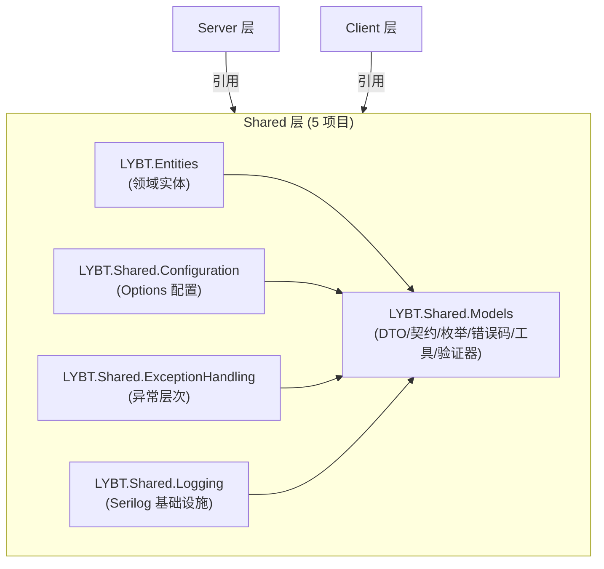

# 共享层架构
> 版本: v1.0 | 日期: 2026-08-20

> **v1.6（2026-08-08）**：按实际 5 项目结构重写（原文档声称 8 项目，实际 5 项目，Primitives/Utilities/Components/Validators 已坍缩为 `LYBT.Shared.Models` 内文件夹）。结构审计依据：A-16 结构审计报告（compose 过程报告，已归档删除）。

## 概述

Shared 层提供 Server 和 Client 两端共享的代码，共 **5 个项目**。Shared 层不依赖任何 Server 或 Client 项目，仅引用其他 Shared 项目和第三方 NuGet 包。

## 项目清单（实际 5 项目）

| 项目 | 位置 | 职责 | 项目引用 |
|------|------|------|----------|
| **LYBT.Shared.Models** | `src/Shared/LYBT.Shared.Models/` | DTO/契约、枚举、错误码、工具类、验证器、脱敏特性（原 8 项目设计坍缩于此，见下文「内部逻辑分层」） | 零依赖（叶子节点） |
| **LYBT.Entities** | `src/Shared/LYBT.Entities/` | 领域实体（贫血模型，MedicalCaseModel 为唯一充血聚合根） | → Shared.Models |
| **LYBT.Shared.Configuration** | `src/Shared/LYBT.Shared.Configuration/` | Options 配置类 + 验证器 + ConnectionStringResolver | → Shared.Models |
| **LYBT.Shared.ExceptionHandling** | `src/Shared/LYBT.Shared.ExceptionHandling/` | 异常层次（AppException 体系） | → Shared.Models |
| **LYBT.Shared.Logging** | `src/Shared/LYBT.Shared.Logging/` | Serilog 基础设施（Enrichers/Masking/Management/CorrelationId Provider） | → Shared.Models |

## 架构图



**依赖规则**:
- `LYBT.Shared.Models` 为叶子节点，不引用任何其他 LYBT 项目
- Entities/Configuration/ExceptionHandling/Logging 均可引用 Shared.Models，互相之间不引用
- Server/Client 可引用 Shared，禁止反向引用

## 内部逻辑分层（历史 8 项目设计的坍缩）

原设计文档声称 Primitives/Utilities/Components/Validators 为独立项目，实际实现中全部坍缩为 `LYBT.Shared.Models` 内文件夹（逻辑分层，非物理隔离）：

| 原独立项目设计 | 实际位置 | 说明 |
|---------------|---------|------|
| Primitives | `LYBT.Shared.Models/Primitives/` | 零依赖底层（ErrorCode/ValidationConstants） |
| Utilities | `LYBT.Shared.Models/Utilities/` | 无状态工具类（实际仅 4 文件） |
| Components | —（从未建立） | MedicalCaseBusinessRules 已实现在 `Validators/BusinessRules/` |
| Validators | `LYBT.Shared.Models/Validators/` | FluentValidation 验证器 |

> **推论**: 原「Primitives 零依赖可编译期强制」等物理隔离约束在当前 5 项目结构下**不可编译期强制**，仅能靠约定维持。如需恢复物理边界需再拆分项目（P2 候选项，本批次不动）。

## LYBT.Shared.Models

### 目录结构（代码实际定义）

```
LYBT.Shared.Models/
  Attributes/                # 脱敏特性
    SensitiveDataAttribute.cs
  Contracts/                 # API 契约 DTO（按领域分目录）
    Auth/                    # 登录/Token/会话
    Common/                  # ApiResponse/Result/PagedResult/OperationResultDto 等跨模块类型
    Consultation/            # 辨证 DTO
    Diagnostics/             # 日志级别/调试模式
    Formula/                 # 验方 DTO
    Health/                  # 健康检查
    Herbs/                   # 药材 DTO + IHerbItem
    MedicalCase/             # 医案 DTO
    Patients/                # 患者 DTO
    Prescriptions/           # 处方 DTO
    Registration/            # 挂号 DTO
    Reports/                 # 报表 DTO
    Users/                   # 用户 DTO
  DTOs/                      # 辅助 DTO
    Users/UserBasicDto.cs
  Enums/                     # 共享枚举（12 个文件：Gender/HerbRole/MedicalCaseEnums/RegistrationEnums 等）
  Extensions/                # DtoConversionExtensions.cs
  Primitives/                # 错误码 + 验证常量
    ErrorCodes/              # ErrorCode.cs / ErrorCategory.cs / ErrorMessages.cs / ErrorCodeExtensions.cs
    Validation/              # ValidationConstants.cs
    UserConstants.cs
  Utilities/                 # 无状态工具类（实际 4 文件）
    Extensions/ServiceCollection/CacheExtensions.cs
    Security/PasswordHelper.cs
    Security/PasswordPolicyValidator.cs
    Text/PinYinHelper.cs
  Validators/                # FluentValidation 验证器
    Auth/                    # LoginRequestValidator.cs
    BusinessRules/           # MedicalCaseBusinessRules.cs
    Formula/Herbs/MedicalCase/Patients/Prescriptions/
```

> **纠错（D2）**: 原文档声称 Utilities 含 `ConfigurationHelper/PasswordHasher/JwtHelper/PinYinConverter/StringExtensions/DateTimeHelper` — **全部不存在**。实际仅 4 文件：`CacheExtensions` / `PasswordHelper` / `PasswordPolicyValidator` / `PinYinHelper`。`PasswordHelper` 为 BCrypt 残留工具类（运行时密码哈希已统一 Identity PBKDF2，见 [00-architecture-summary.md](00-architecture-summary.md)）。

### 契约类型（Contracts/Common）

实际通用类型（非原文档声称的 BaseDto/TimestampDto/StatusDto/AuditDto 继承链，该链不存在）：

| 类型 | 用途 |
|------|------|
| `Result<T>` / `Result` | 领域操作结果（非 HTTP 响应） |
| `ApiResponse<T>` | HTTP 统一响应包装 |
| `PagedResult<T>` | 分页响应 |
| `OperationResultDto` | 批量操作结果 |
| `ImportResultDto : BatchOperationResultDto` | 导入结果（继承批量操作结果） |
| `BatchDeleteInputDto` | 批量删除请求 |
| `HealthCheckResponse` / `HealthStatusDto` | 健康检查 |
| `HerbBasicDto` / `PatientBasicDto` | 跨模块轻量传输 |
| `IAuditable` / `IEntityInputDto` | 接口契约（审计/输入提取 ID） |

### DTO 命名规范

| 后缀 | 用途 | 示例 |
|------|------|------|
| `*Dto` | 列表/通用传输 | MedicalCaseListDto |
| `*DetailDto` | 详情响应 | MedicalCaseDetailDto |
| `*InputDto` | 创建/更新输入 | PatientInputDto |
| `*Request` | 操作请求 | UpdateMedicalCaseRequest |
| `*BasicDto` | 跨模块轻量传输 | PatientBasicDto |
| `{Entity}Batch{Op}InputDto` | 批量操作请求 | PatientBatchImportInputDto |

**ListDto/DetailDto 字段选择标准**（约定，非强约束）：
- **ListDto**: 主键 + 名称 + 状态 + 关键业务字段。排除大文本、非必要审计字段。
- **DetailDto**: Entity 的全部业务字段 + 状态 + 审计字段。
- **BasicDto**: 仅跨模块域接口（`IXxxCrossModuleService`）所需的最少字段。

## LYBT.Entities

### 职责

领域实体定义，默认贫血模型。是 Server 与 LocalWebAPI 共用的唯一实体源。

> **例外**: `MedicalCaseModel` 作为唯一 DDD 聚合根，包含域方法 (`Complete()`, `Suspend()`, `SoftDelete()`, `UpdateConsultation()`)，采用充血模型；另有计算属性 `IsLocked / IsActive / IsCompleted`。其他实体保持贫血模型。

### 目录结构

```
LYBT.Entities/
  Auth/              # AuthSessionModel, SecurityAuditLog
  Common/            # BaseEntity, IAuditableEntity, ISoftDeletable, SystemLog
  Consultations/     # ConsultationModel
  Formulas/          # FormulaModel, FormulaHerbItem
  Herbs/             # HerbModel
  MedicalCases/      # MedicalCaseModel, MedicalCaseAuditLog, MedicalCasePrintLog
  Patients/          # PatientModel
  Prescriptions/     # PrescriptionModel, PrescriptionItem
  Registrations/     # RegistrationModel
  Users/             # ApplicationUser
```

**BaseEntity 通用字段**: Id, CreatedAt, UpdatedAt, CreatedBy, UpdatedBy, RowVersion, IsDeleted。详见 [04-data-model.md](04-data-model.md) 的 BaseEntity 章节。

## LYBT.Shared.Configuration

### 职责

集中管理所有 Options 类和配置绑定扩展，Server/Client 通过 `IOptions<T>` 模式消费。包含配置验证器确保启动时配置合法。

### 目录结构（代码实际定义）

```text
LYBT.Shared.Configuration/
  ConnectionStringResolver.cs    # 三级回退（Database:ConnectionString → ConnectionStrings:DefaultConnection → CONNECTION_STRING 环境变量）
  Extensions/
    ClientConfigurationExtensions.cs
    ServerConfigurationExtensions.cs
  Options/
    Common/
      JwtOptions.cs              # JWT 配置（双端共享）
    Server/                      # 12 个 Server Options
      AppInfoOptions / CorsOptions / DatabaseOptions / DefaultPasswordOptions / DesktopUpdateOptions
      LocalJwtOptions / LoggingOptions / MemoryCacheOptions / SecurityOptions / SessionOptions
      SwaggerOptions / SystemAdminOptions
    Client/                      # 6 个 Client Options
      ApiClientOptions / CardReaderOptions / ClientSessionOptions / ClinicSettingsOptions
      FeatureToggleOptions / OfflineModeOptions
  Validation/                    # 配置验证器（IValidateOptions<T> 实现）
    DatabaseOptionsValidator.cs / JwtOptionsValidator.cs / LocalJwtOptionsValidator.cs / SecurityOptionsValidator.cs
```

> 详细的配置架构说明 (验证管道、环境分层、热更新策略) 请参见 [07-configuration.md](07-configuration.md)。

**约束**: 引用 Microsoft.Extensions.Options，禁止引用业务逻辑。

## LYBT.Shared.ExceptionHandling

### 职责

提供统一的异常层次结构。所有业务异常继承 `AppException`，携带 `ErrorCode` 用于结构化错误响应。

### 目录结构（代码实际定义）

```
LYBT.Shared.ExceptionHandling/
  Exceptions/
    Base/
      AppException.cs            # 基类（携带 ErrorCode）
    Business/
      BusinessException.cs       # 业务异常 (400)
      ValidationException.cs     # 验证异常 (400)
      NotFoundException.cs       # 未找到 (404)
      ConflictException.cs       # 冲突 (409)
    Security/
      UnauthorizedException.cs   # 未授权 (401)
    External/
      ApiException.cs            # 外部 API 调用异常 (502/503)
```

### 异常继承层次

```
Exception
  AppException (ErrorCode, HttpStatusCode)
    BusinessException (400)
      ValidationException (400)
      NotFoundException (404)
      ConflictException (409)
    UnauthorizedException (401)
    ApiException (502/503)
```

> **注**: 原文档声称的 Handlers/ProblemDetails/Mappers/Extensions 等目录（Server/Desktop 异常处理器、ProblemDetails 工厂、错误消息映射）**代码中不存在** — 异常处理由 [03-server.md](03-server.md) 的 `IExceptionHandler`（LYBT.Infrastructure/ExceptionHandling/）+ WebAPI 中间件统一完成。

**约束**: 引用 Shared.Models (ErrorCode)，禁止引用 Server/Client 具体实现。

## LYBT.Shared.Logging

### 职责

提供跨前后端的统一日志能力，基于 Serilog。含 CorrelationId Provider（双端各自单机制）、敏感数据脱敏、日志级别管理。

### 目录结构（代码实际定义）

```
LYBT.Shared.Logging/
  Abstractions/
    ICorrelationIdProvider.cs        # 接口
    ActivityCorrelationIdProvider.cs # Desktop 使用（Activity.Current）
  Enrichers/
    CorrelationIdEnricher.cs         # Serilog Enricher
  Extensions/
    LoggerConfigurationExtensions.cs # Serilog 两阶段启动辅助
    ServiceCollectionExtensions.cs   # DI 注册
  Management/
    DebugModeInfo.cs
    LoggingLevelManager.cs           # 日志级别控制
  Masking/
    SensitiveDataDestructuringPolicy.cs
    SensitiveDataMasker.cs
```

> **注**: `AsyncLocalCorrelationIdProvider.cs` 已于 A-18 P1-3 删除（`AddAsyncLocalCorrelationIdProvider` 全仓 0 调用点，死代码）。CorrelationId 现状：Server 走 `CorrelationIdMiddleware`（W3C traceparent），Desktop 走 `ActivityCorrelationIdProvider` — 双端各自端内单机制，跨端不强制统一。

### Serilog 架构

#### 两阶段启动

Serilog 在 Server 和 Desktop 两端均采用两阶段初始化，确保 DI 容器就绪前的启动错误也能被捕获:

1. **CreateBootstrapLogger()** — 最小化配置的引导日志器，在 `Program.cs` 最早期创建，捕获 DI 容器构建前的启动异常
2. **DI 构建日志器** — 从 `appsettings.json` 读取完整配置，通过 `logger.ReadFrom.Configuration(hostBuilderContext.Configuration)` 构建，替换引导日志器

```csharp
// Program.cs 两阶段模式
Log.Logger = new LoggerConfiguration()
    .CreateBootstrapLogger();          // 阶段1: 引导日志器

// ... build DI container ...

builder.Host.UseSerilog((context, logger) =>
    logger.ReadFrom.Configuration(context.Configuration));  // 阶段2: 完整配置
```

#### Sink 配置

| 端 | Sink | 说明 |
|----|------|------|
| Server | Console | 开发调试，结构化 JSON 输出 |
| Server | File (rolling) | 持久化日志文件 |
| Server | MSSqlServer | SecurityAuditLog 写入数据库 |
| Desktop | Console | 开发调试 |
| Desktop | File (rolling) | 持久化日志文件 |

#### 日志文件布局

| 参数 | 值 |
|------|-----|
| 路径 | `logs/lybt-{Date}.log` |
| 滚动 | 每日 (rolling) |
| 保留 | 365 天 (可配置) |
| 输出模板 | `{Timestamp:HH:mm:ss} [{Level:u3}] {SourceContext} \| {Message:lj}{NewLine}{Exception}` |

#### 敏感数据脱敏

`PatientModel` 属性标记 `[SensitiveData]` 特性后，Serilog 析构时通过 `SensitiveDataDestructuringPolicy` 自动脱敏（`SensitiveDataAttribute` 定义于 `LYBT.Shared.Models/Attributes/`，命名空间 `LYBT.Shared.Models.Attributes`；`SensitiveDataMasker`/`SensitiveDataDestructuringPolicy` 位于 `LYBT.Shared.Logging/Masking/`，命名空间 `LYBT.Shared.Logging.Masking`）。

## SensitiveDataAttribute 设计

> 位于 `LYBT.Shared.Models.Attributes` 命名空间（`src/Shared/LYBT.Shared.Models/Attributes/SensitiveDataAttribute.cs`）。本节为脱敏规范的**权威定义**，[03-server.md](03-server.md) 和 [11d-observability.md](../02-requirements/11d-observability.md) 以链接引用本文。

`[SensitiveData]` 特性用于标记需要日志脱敏的属性。`SensitiveDataMasker` 在序列化和日志输出时自动检测该特性并应用脱敏规则。

### 使用方式

```csharp
[SensitiveData(SensitiveDataType.ContactInfo, MaskingMode = MaskingMode.Partial)]
public string PhoneNumber { get; set; }
```text

### 脱敏模式 (MaskingMode)

| 模式 | 说明 | 示例 |
|------|------|------|
| Default | 中间位用 * 替代 | `张**` / `abc****xyz` |
| Partial | 显示前后几位，按数据类型智能处理 | 手机号: `138****1234`，身份证: `110***********1234` |
| Full | 完全隐藏 | `[已隐藏]` |
| Hash | SHA256 短哈希标识 | `[REDACTED:A1B2C3D4]` |

### 分级 ↔ 脱敏映射（G-02 补写，2026-08-04）

> 分级权威定义见 [12-nfr.md NFR-SEC-004](../02-requirements/12-nfr.md)；本表为**分级 → MaskingMode 的显式映射**，实施时以此为准。

| 分级 | 示例字段 | MaskingMode | 说明 |
|------|---------|-------------|------|
| L1-高敏感 | IdNumber, PhoneNumber | `Partial` | 保留前3后4 |
| L2-一般敏感（个人） | Address, AllergyHistory, MedicalHistory | `Full`（Address）/ `Hash`（AllergyHistory） | 按字段特性选择 |
| L2-一般敏感（医疗） | TcmDiagnosis, PresentIllness, TongueDiagnosis, PulseDiagnosis | 不记录到日志（无 MaskingMode） | 日志排除，而非脱敏 |
| L3-普通 | Name, Gender, BirthDate, HerbName | 无（正常记录） | 不标记 `[SensitiveData]` |

### 数据类型 (SensitiveDataType)

| 类型 | 说明 | 典型字段 |
|------|------|----------|
| PersonalInfo | 个人信息 | 姓名、地址 |
| MedicalInfo | 医疗信息 | 过敏史、病史 |
| ContactInfo | 联系信息 | 手机号、邮箱 |
| IdentityInfo | 身份信息 | 身份证号 |
| FinancialInfo | 财务信息 | 银行卡号 |

### 脱敏层次

- **属性级**: `SensitiveDataMasker.MaskObject()` 反射检测 `[SensitiveData]` 特性
- **文本级**: `SensitiveDataMasker.SanitizeText()` 正则匹配密码、Token、连接字符串等
- **Serilog 集成**: `SensitiveDataDestructuringPolicy` 在 Serilog 解构时自动脱敏

> 敏感数据分级标准（L1-高敏感/L2-一般敏感/L3-普通）见 [nfr.md NFR-SEC-004](../02-requirements/12-nfr.md)。

## 验证规则一致性

### 三层验证体系

```
Entity (DataAnnotations)
  DTO (DataAnnotations)
    DetailModel (DataAnnotations)
      FluentValidator (Server 端)
```text

**规则**:
- 三层使用相同的 `ValidationConstants` 常量
- 必填字段: Entity `[Required]` = DTO `[Required]` = FluentValidation `NotEmpty()`
- 可空字段: 使用 `if (value.HasValue && ...)` 模式，不要求必填
- 字符串长度: 统一引用 `ValidationConstants.NameMaxLength` 等常量

### ValidationConstants 位置

`LYBT.Shared.Models.Primitives.Validation.ValidationConstants` — 所有验证常量的唯一来源。

## Mapperly 映射规范

基于 **Mapperly 4.3.1** 的编译时 source-generator 映射，零运行时反射。项目内共 **13 个** Mapper 类（Server 3 + Desktop 9 + 内联 1；原文档声称 23 已修正，LocalData 项目不存在故无 LocalData Mapper）：

| 层 | Mapper 数量 | 位置 |
|----|------------|------|
| Server 模块（Mapperly） | 3 | `LYBT.Module.Registration/Mappers/RegistrationMapper.cs`、`LYBT.Module.MedicalCases/Mappers/MedicalCaseMapper.cs`、`LYBT.Module.Auth/Application/Mappers/AuthUserMapper.cs` |
| Server 模块（手写静态类，A-18 P1-4 已转 Mapperly） | 4 | `LYBT.Module.{Formula,Herbs,Patients,Users}/Application/Mappers/*Mapper.cs` |
| Client Desktop 模块 | 9 | `src/Client/Desktop/Modules/LYBT.Desktop.*/Mappers/` |
| Client 内联 | 1 | `PatientRepository.cs` 内 `PatientListToDetailMapper` |

> **映射约定（属性配置/方法命名/特性使用）、Server/Client 映射模式、Core+Enrich 模式、DI 注册、已知陷阱（HasPrescription/Boolean 反转/Audit 字段等）的完整规范** 已外移到 [15-mapperly.md](15-mapperly.md)。本层仅保留 Mapper 数量与位置概览。

## 变更记录

| 日期 | 版本 | 变更内容 |
|------|------|----------|
| 2026-08-08 | v1.6 | **按实际 5 项目结构重写（A-18 P1-7）**：8 项目声明 → 5 项目（Primitives/Utilities/Components/Validators 坍缩为 Shared.Models 内文件夹）；Utilities 清单纠错（实际 4 文件：CacheExtensions/PasswordHelper/PasswordPolicyValidator/PinYinHelper，ConfigurationHelper/PasswordHasher/JwtHelper 不存在）；删虚构 DTO 继承链（BaseDto/TimestampDto/StatusDto/AuditDto 不存在）；ExceptionHandling 目录纠正（仅 Exceptions/，无 Handlers/ProblemDetails/Mappers）；Configuration 目录按代码实际 Options 清单重写；Mapperly 数量 23→13（LocalData 项目不存在）；MedicalCaseBusinessRules「待实施」→ 已实现（Validators/BusinessRules/） |
| 2026-06-28 | v1.5 | **spec S3 批次2 提炼（659→~470 行）**：Mapperly 映射规范整体外移至 [15-mapperly.md](15-mapperly.md)（约定/Server/Client 模式/Core+Enrich/DI/陷阱）；SensitiveDataAttribute 详细定义外移至 [03-server.md](03-server.md)（与运行时使用处合并）。本文件保留 8 个 Shared 项目结构 + Mapper 数量/位置概览 + SensitiveData 特性声明位置。变更历史见 git log。 |
| 2026-06-13 | v1.4 | 新增 Mapperly 映射规范章节: 23 个 Mapper 类的约定、Server/Client 映射模式、Core+Enrich 模式、已知陷阱 |
| 2026-06-13 | v1.3 | **Serilog 架构**: 扩展 Logging 章节 — 两阶段启动、Sink 配置、日志文件布局、敏感数据脱敏示例 |
| 2026-02-26 | v1.2 | DOC3-03: 补全 4 个缺失 Shared 项目文档 (Primitives/Validators/ExceptionHandling/Configuration)；DOC3-13: 新增 SensitiveDataAttribute 设计章节 |
| 2026-02-23 | v1.1 | 一致性审计: 新增 MedicalCaseBusinessRules 组件文档 (设计来源: design-deepening-phase3 + design-issues-solutions #4) |
| 2026-02-10 | v1.0 | 初始版本，从 shared-layer-architecture/dto-architecture specs 整合 |

<!-- P3-3 PagedResult双定义：Contracts/Common/PagedResult vs Desktop.Contracts/Results/PaginatedResult 已在08-shared.md标注“Entities可依赖Shared.Models枚举是例外”，分页模型双定义待v2统一 -->

<!-- F3 P3 batch: P3-1-1/1-5/2-6/2-9/3-2 已评估，见 architecture-deep-review P3全表 -->

<!-- F4 P3 batch: P3-3-8/3-9/4-6/4-9/5-2 已评估 -->

<!-- F5 P3 batch: P3-5-5/5-6/6-2/6-6/6-7 已评估 -->

<!-- F6 P3 batch: P3-7-... 已评估 -->
