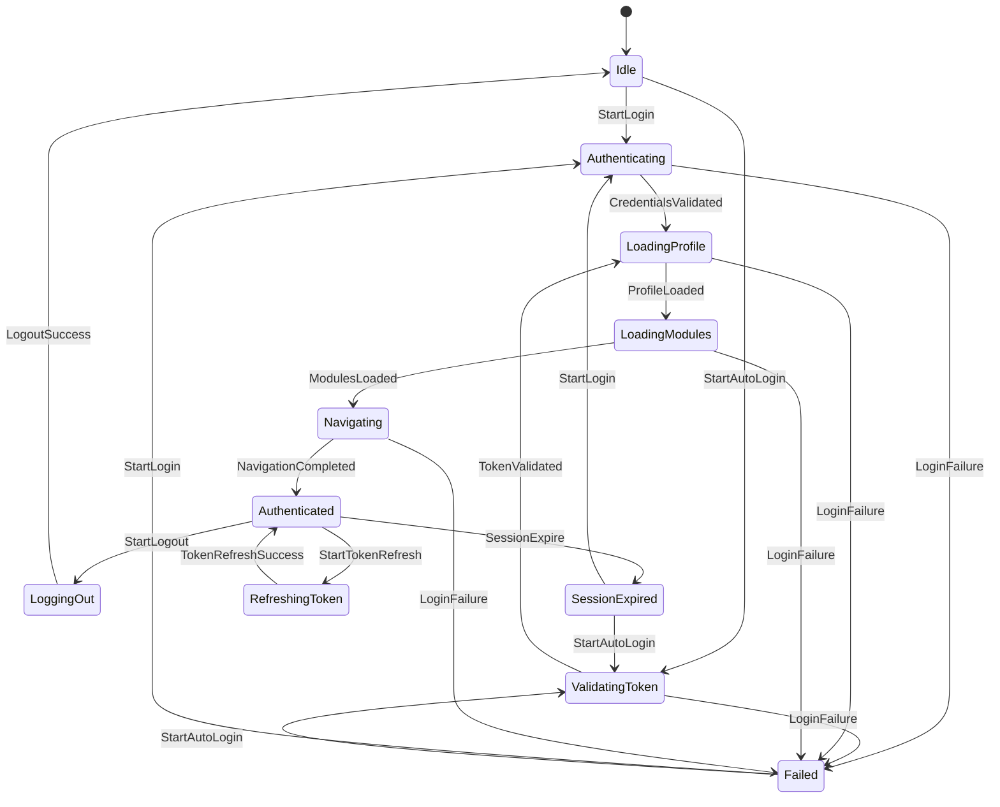
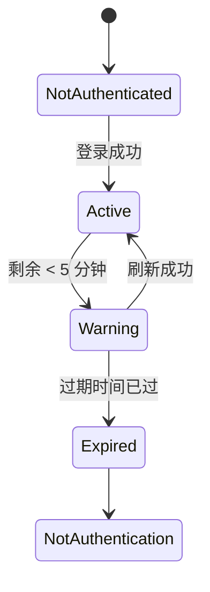

# 安全架构

## 1. 概述

> **Token Family 管理已实现**（`e2cedf6a2`，2026-08-06）：族旋转 + 登出撤销 + 安全审计日志均已在 v1.0 补回；重放检测（FamilyId/IsUsed）延后至 v2.0。安全架构覆盖 Server（ASP.NET Core WebAPI）和 Client（WPF Desktop）两端，确保认证、授权、Token 生命周期管理的完整性和一致性。

核心安全组件分布：

| 组件 | 位置 | 职责 | 状态 |
|------|------|------|------|
| AuthenticationServiceCollectionExtensions | `LYBT.WebAPI/Extensions/` | JWT 认证中间件、授权策略注册 | ✅ |
| JwtService | `LYBT.Module.Auth/Services/` | JWT Token 生成与验证 | ✅ |
| AuthService | `LYBT.Module.Auth/Services/` | 登录/登出/凭据验证 | ✅ |
| TokenManagementService | `LYBT.Module.Auth/Services/` | Token 刷新、轮换、Family 撤销 | ✅ v1.0 已实现（`e2cedf6a2`） |
| SecurityAuditService | `LYBT.Module.Auth/Services/` | 安全审计日志 | ✅ v1.0 已实现（`e2cedf6a2`） |
| SecurityHeadersMiddleware | `LYBT.WebAPI/Middleware/` | 安全响应头 | ✅ |
| ClaimsNormalizationMiddleware | `LYBT.WebAPI/Middleware/` | Claims 格式标准化 | ✅ |
| AuthenticationStateMachine | `LYBT.Desktop.Foundation/Security/` | 桌面端认证状态机 | ✅ |
| TokenLifecycleService | `LYBT.Desktop.Foundation/Security/` | 桌面端 Token 生命周期管理 | ✅ |
| TokenStorageService | `LYBT.Desktop.Foundation/Security/` | Token 内存安全存储 | ✅ |

## 2. 认证流程

### 2.1 远程模式登录流程

> 完整登录流程（用户故事、验收标准、双模式差异）详见 [02-auth.md](../02-requirements/02-auth.md) US-AUTH-001/002/003/009/010/012/013。

关键安全约束：

- **密码存储**: BCrypt (WorkFactor=12)，支持 hash 自动升级
- **错误信息统一**: 不区分"用户不存在"和"密码错误"，防止用户枚举
- **账户锁定**: 默认 5 次失败后锁定 15 分钟（`SecurityOptions.AccountLockout`）
- **旧会话清理**: 新登录时撤销该用户所有旧 RefreshToken 和 AutoLoginToken
- **速率限制**: 登录端点基于 IP 固定窗口限流，5 次/60 秒

### 安全基线约束

| 约束 | 值 | 强制 | 说明 |
|------|-----|:---:|------|
| Password WorkFactor | 12 | 是 | BCrypt 代价因子，不可降低 |
| AccessToken 过期 | 配置驱动（base 480/Dev 60/Prod 30 分钟） | 是 | `JwtOptions.AccessTokenExpirationMinutes` |
| RefreshToken 有效期 | 7 天（滑动过期） | 是 | `JwtOptions.RefreshTokenExpirationDays` |
| 登录失败锁定 | 5 次/15 分钟 | 是 | 可配置，生产环境不可禁用 |
| 登录速率限制 | 5 次/60 秒/IP | 是 | 防暴力破解 |
| 旧会话清理 | 新登录时 | 是 | 防止 Token 泄漏后持续有效 |
| DPAPI 加密 | Desktop 端 Token 存储 | 是 | Windows DPAPI 加密本地 Token |
| HTTPS | 生产环境必须 | 是 | 本地模式可选 HTTP |

### 2.2 本地模式认证

本地模式 (LocalWebAPI) 使用独立的 JWT 签名密钥，但保持相同的 Claim 结构和策略体系。本地模式通过 `LocalTokenValidator` 在客户端本地验证 Token，无需网络往返。

### 2.3 Token 生命周期

> 🧲 **本节描述的目标设计中，RefreshToken / AutoLoginToken / Token 族旋转属 D3 B+ 方案**：族旋转 + 登出撤销 + 审计日志将在 v1.0 补回；重放检测（FamilyId）与 AutoLoginToken 延后至 v2.0。当前代码仅签发 AccessToken（无 RefreshToken 实体）。下表为**目标设计**。

系统使用双 Token 机制：

| Token 类型 | 有效期 | 存储 | 用途 |
|-----------|--------|------|------|
| AccessToken (JWT) | 配置驱动（base 480 分钟） | Client 内存 | API 请求授权 |
| RefreshToken | 7 天滑动 + 30 天绝对过期 | Server 数据库 | 无感刷新 AccessToken |
| AutoLoginToken | 长期（可撤销） | Client DPAPI 加密 | 自动登录（RememberMe） |

#### Refresh Token 轮换流程

> 🧲 **v1.0 待实现（D3 B+）** — 流程依赖 RefreshToken 实体与 TokenManagementService，当前均未实现。

```mermaid
sequenceDiagram
    participant D as Desktop
    participant S as Server

    D->>S: POST /api/v1/auth/refresh { refreshToken }

    Note over S: 1. 查询 RefreshToken 记录
    Note over S: 2. 检查 IsUsed → 重放攻击检测
    alt IsUsed=true (重放攻击)
        Note over S: 撤销整个 Family
        S-->>D: 401 "检测到安全威胁"
    else IsUsed=false
        Note over S: 3. 验证有效性 (IsRevoked/IsDeleted/Expired)
        Note over S: 4. 标记旧 Token 为 IsUsed
        Note over S: 5. 生成新 AccessToken + RefreshToken
        Note over S: 6. 新 Token 继承 FamilyId
        S-->>D: 200 { newToken, newRefresh }
    end
```text

#### Token Family 机制

> 🧲 **v2.0 规划** — FamilyId 重放检测属 D3 B+ 方案的 v2.0 部分；v1.0 仅补回 Token 族旋转与撤销。

每次登录创建一个新的 `FamilyId`。同一会话内的所有 RefreshToken 共享 FamilyId。Token 轮换时新 Token 继承 FamilyId。当检测到已使用的 Token 再次被提交（`IsUsed=true`），系统撤销该 FamilyId 下的所有 Token，防止 Token 被盗用。

参见 [ADR-0008](decisions/0008-token-security-defensive-design.md)。

## 3. JWT Claims Schema

| Claim | 类型 | ClaimType 常量 | 描述 |
|-------|------|---------------|------|
| `sub` / `nameid` | Guid | `ClaimTypes.NameIdentifier` / `JwtRegisteredClaimNames.Sub` | 用户 ID |
| `unique_name` / `name` | string | `ClaimTypes.Name` / `JwtRegisteredClaimNames.UniqueName` | 用户名 |
| `role` | string | `ClaimTypes.Role` | 角色名称 (SuperAdmin/Admin/Doctor/Receptionist) |
| `user_type` | string | 自定义 | "superadmin" 或 "user"（区分双轨认证） |
| `jti` | Guid | `JwtRegisteredClaimNames.Jti` | Token 唯一标识 |
| `iat` | long | `JwtRegisteredClaimNames.Iat` | Token 签发时间 (Unix 秒) |

`ClaimsNormalizationMiddleware` 在每次请求时确保 Claim 格式统一，补全多种别名格式（如 `sub`/`nameid`/`NameIdentifier` 三种形式共存），兼容不同 JWT 库的 Claim 解析习惯。

## 4. 授权策略

系统在 `PolicyConstants`（`src/Server/Core/LYBT.Infrastructure/Constants/PolicyConstants.cs`）中定义 **7 项**授权策略，通过 `RequireRole()` 声明式配置：

| Policy | 常量 | 满足条件的角色 | 典型用途 |
|--------|------|--------------|----------|
| `DoctorOrReceptionist` | `PolicyConstants.DoctorOrReceptionist` | SuperAdmin, Admin, Doctor, Receptionist | 药材、验方（**目标态**，见 §下方 D7 待对齐注） |
| `DoctorOrAdmin` | `PolicyConstants.DoctorOrAdmin` | SuperAdmin, Admin, Doctor | 医案列表/详情、报表 |
| `DoctorOrAdminOrReceptionist` | `PolicyConstants.DoctorOrAdminOrReceptionist` | SuperAdmin, Admin, Doctor, Receptionist | **患者 CRUD、挂号、医案创建**（代码当前最常用策略） |
| `DoctorOnly` | `PolicyConstants.DoctorOnly` | SuperAdmin, Admin, Doctor | 医案创建、处方打印（操作级） |
| `AdminOrSuperAdmin` | `PolicyConstants.AdminOrSuperAdmin` | SuperAdmin, Admin | 用户管理、系统配置、诊断工具、患者删除/禁用 |
| `AdminBusinessOnly` | `PolicyConstants.AdminBusinessOnly` | SuperAdmin, Admin | 纯管理业务操作（不含诊断） |
| `SysAdminOnly` | `PolicyConstants.SysAdminOnly` | SuperAdmin | 配置中心、重启等系统运维端点 |

> ⚠️ **D7 权限对齐待办**（详见 [04-permissions.md](../01-product/04-permissions.md) P0-P2 修复项）：以下模块**代码当前为 `DoctorOrAdminOrReceptionist`/`DoctorOrReceptionist`，待按 2026-08-03 四连决策做操作级细分** —— 患者删除/禁用 → `AdminOrSuperAdmin`；药材/验方 GET 不含前台；挂号创建/取消仅前台、接诊/QuickVisit 仅 Doctor；医案创建 → `DoctorOnly`（已存在于 PolicyConstants，部分端点已使用，待全面对齐）。

角色层次（隐含权限继承）：

```text
SuperAdmin → Admin → Doctor → Receptionist
```

### 策略配置

```csharp
// AuthenticationServiceCollectionExtensions.cs
options.FallbackPolicy = 要求认证用户;  // 默认所有端点需要认证
options.AddPolicy(PolicyConstants.AdminBusinessOnly,     RequireRole("SuperAdmin", "Admin"));
options.AddPolicy(PolicyConstants.DoctorOnly,           RequireRole("SuperAdmin", "Admin", "Doctor"));
options.AddPolicy(PolicyConstants.DoctorOrAdmin,        RequireRole("SuperAdmin", "Admin", "Doctor"));
options.AddPolicy(PolicyConstants.AdminOrSuperAdmin,    RequireRole("SuperAdmin", "Admin"));
options.AddPolicy(PolicyConstants.SysAdminOnly,         RequireRole("SuperAdmin"));
options.AddPolicy(PolicyConstants.DoctorOrReceptionist, RequireRole("SuperAdmin", "Admin", "Doctor", "Receptionist"));
options.AddPolicy(PolicyConstants.DoctorOrAdminOrReceptionist, RequireRole("SuperAdmin", "Admin", "Doctor", "Receptionist"));
```

### 默认安全策略

- **FallbackPolicy**: 要求所有端点默认认证（`RequireAuthenticatedUser`）
- **显式豁免**: `AllowAnonymous` 标注的端点（login、logout、refresh、health）
- **Swagger 不受影响**: Swagger 中间件在 UseRouting 之前，不经过授权管道

## 5. 桌面端认证状态机

桌面端使用转换表驱动的 `AuthenticationStateMachine`，线程安全，通过 Prism PubSubEvent 跨模块通知状态变更。

### 状态定义



### AuthState 枚举

| 状态 | 描述 | 可触发事件 |
|------|------|-----------|
| `Idle` | 未认证 | StartLogin, StartAutoLogin |
| `Authenticating` | 验证凭证中 | CredentialsValidated, LoginFailure, Reset |
| `ValidatingToken` | 验证 Token 中（自动登录） | TokenValidated, LoginFailure, Reset |
| `LoadingProfile` | 加载用户信息 | ProfileLoaded, LoginFailure, Reset |
| `LoadingModules` | 加载业务模块 | ModulesLoaded, LoginFailure, Reset |
| `Navigating` | 导航到主界面 | NavigationCompleted, LoginFailure, Reset |
| `Authenticated` | 已认证 | StartLogout, SessionExpire, StartTokenRefresh |
| `Failed` | 登录失败 | StartLogin, StartAutoLogin, Reset |
| `LoggingOut` | 登出中 | LogoutSuccess, LogoutFailure, Reset |
| `SessionExpired` | 会话过期 | StartLogin, StartAutoLogin, Reset |
| `RefreshingToken` | Token 刷新中 | TokenRefreshSuccess, TokenRefreshFailure, Reset |

### Token 生命周期状态

`TokenLifecycleService` 独立管理 Token 过期监控：



| 状态 | 描述 | 触发条件 |
|------|------|---------|
| `NotAuthenticated` | 无 Token | 初始/登出 |
| `Active` | Token 有效 | 登录成功 |
| `Warning` | 即将过期 | 剩余 < 5 分钟 |
| `Expired` | 已过期 | Token 过期时间已过 |

定时器每 30 秒检查 Token 状态。进入 Warning 时自动尝试 `TryRefreshTokenAsync`。

### Token 存储

`TokenStorageService` 采用进程内存存储（非磁盘持久化），满足医疗系统合规要求：

- 每次启动必须输入密码
- 多人共享工作站安全（进程结束即清除）
- 不存在磁盘残留 Token 的风险

## 6. Policy-to-Endpoint Matrix

> **注意**：以下矩阵反映代码实际策略（2026-08-19 审计）。控制器不存在的章节已删除；药材/验方由 `CatalogController` 统一管理。完整权限矩阵见 [04-permissions.md](../01-product/04-permissions.md)。

### AuthController (`/api/v1/auth`)

| 端点 | 方法 | Policy | 备注 |
|------|------|--------|------|
| `/login` | POST | AllowAnonymous | RateLimiting("Login") |
| `/auto-login` | POST | AllowAnonymous | RateLimiting("Login") |
| `/logout` | POST | AllowAnonymous | 允许过期 Token 访问 |
| `/refresh` | POST | AllowAnonymous | Token 轮换 |
| `/validate` | GET | FallbackPolicy (需认证) | 验证 Bearer Token |

### UsersController (`/api/v1/users`)

| 端点 | Policy | 备注 |
|------|--------|------|
| 类级别 | FallbackPolicy (需认证) | 控制器无类级 Policy |
| `GET /` | AdminOrSuperAdmin | 用户列表 |
| `GET /{id}` | AdminOrSuperAdmin | 用户详情 |
| `POST /` | AdminOrSuperAdmin | 创建用户 |
| `PUT /{id}` | AdminOrSuperAdmin | 更新用户 |
| `DELETE /{id}` | AdminOrSuperAdmin | 删除用户 |
| `PUT /{id}/password` | AdminOrSuperAdmin | 重置密码 |
| `PUT /{id}/role` | AdminOrSuperAdmin | 角色变更 |
| `PUT /{id}/status` | AdminOrSuperAdmin | 启用/禁用 |
| `PUT /{id}/profile` | AdminOrSuperAdmin | 个人信息 |

### PatientsController (`/api/v1/patients`)

> 权限对齐见 [04-permissions.md](../01-product/04-permissions.md)；代码实际策略以控制器 `[Authorize]` 属性为准。

| 端点 | Policy | 备注 |
|------|--------|------|
| 类级别 | DoctorOrAdminOrReceptionist | 代码实际 |
| GET / GET /{id} | DoctorOrReceptionist | 分页列表/详情 |
| POST / | DoctorOrReceptionist | 新增患者 |
| PUT /{id} | DoctorOrReceptionist | 更新患者 |
| DELETE /{id} | DoctorOrReceptionist | 软删除（目标态 AdminOrSuperAdmin，P0-5 待修） |
| POST /{id}/toggle-status | AdminOrSuperAdmin | 启用/禁用 |
| POST /{id}/restore | AdminOrSuperAdmin | 恢复已删除患者 |

### MedicalCasesController (`/api/v1/medicalcases`)

| 端点 | Policy | 备注 |
|------|--------|------|
| 类级别 | DoctorOrAdmin | 代码实际 |
| `GET /` / `GET /{id}` | DoctorOrAdmin | 列表/详情 |
| `POST /` | DoctorOnly | 医案创建（操作级） |
| `PUT /{id}` | DoctorOrAdmin | 更新医案 |
| `DELETE /{id}` | DoctorOrAdmin | 删除医案 |
| `POST /batch-delete` | DoctorOrAdmin | 批量删除 |
| `PUT /{id}/prescription-flag` | DoctorOrAdmin | 处方标记 |
| `PUT /{id}/print-completed` | DoctorOnly | 打印完成（操作级） |
| `PUT /{id}/status` | DoctorOrAdmin | 状态变更 |
| `PUT /{id}/close` | AdminOrSuperAdmin | 关闭医案 |
| `PUT /{id}/suspend` | DoctorOrAdmin | 挂起医案 |
| `PUT /{id}/cancel` | DoctorOrAdmin | 取消医案 |

### CatalogController (`/api/v1/herbs`, `/api/v1/formulas`)

> 药材与验方由 `CatalogController` 统一管理，无独立 HerbsController/FormulasController。

| 端点 | Policy | 备注 |
|------|--------|------|
| 类级别 | DoctorOrAdmin | 代码实际 |
| `GET /` / `GET /{id}` | DoctorOrAdmin | 列表/详情 |
| `POST /` | AdminOrSuperAdmin | 创建药材/验方 |
| `PUT /{id}` | AdminOrSuperAdmin | 更新药材/验方 |
| `DELETE /{id}` | AdminOrSuperAdmin | 删除药材/验方 |
| `POST /batch-delete` | AdminOrSuperAdmin | 批量删除 |
| `POST /import-template` | AdminOrSuperAdmin | 下载导入模板 |
| `GET /export` | AdminOrSuperAdmin | 导出 |
| `GET /export-all` | AdminOrSuperAdmin | 全量导出 |

### RegistrationsController (`/api/v1/registrations`)

| 端点 | Policy | 备注 |
|------|--------|------|
| 类级别 | DoctorOrAdminOrReceptionist | 代码实际 |
| `POST /` | DoctorOrReceptionist | 挂号创建 |
| `PUT /{id}/start-visit` | DoctorOnly | 接诊（操作级） |
| `PUT /{id}/cancel` | DoctorOrReceptionist | 取消挂号 |

### ReportsController (`/api/v1/reports`)

> 报表端点策略继承类级别 FallbackPolicy（需认证），具体操作级策略见控制器代码。

### 其他端点

| Controller | Policy | 备注 |
|------------|--------|------|
| `ConfigurationController` | AdminOrSuperAdmin / SysAdminOnly | 配置管理（操作级区分） |
| `DeployController` | SysAdminOnly | 部署控制 |
| `DiagnosticsController` | AdminOrSuperAdmin | 诊断工具 |
| `HealthController` | AllowAnonymous | 健康检查 |
| `DownloadController` | FallbackPolicy (需认证) | 文件下载 |

## 7. 安全考虑

> **v1.0 实现范围**（D3 决策 2026-06-28）：补 Token 族旋转 + 登录限流 + 登出撤销 + 安全审计日志。重放检测标 v2.0。

### 7.1 Token 重放检测 (Token Family)

> 🧲 **v2.0 规划** —— 依赖 RefreshToken 实体的 `FamilyId` / `IsUsed` 字段，当前均未实现。v1.0（D3 B+）仅补回 Token 族旋转 + 登出撤销；重放检测延后至 v2.0。

系统通过 Token Family 机制检测 RefreshToken 盗用（**目标设计**，保留作为补回依据）：

1. 每次登录创建新的 `FamilyId`
2. Token 轮换时旧 Token 标记 `IsUsed=true`，新 Token 继承 `FamilyId`
3. 如果已使用的 Token 再次被提交，系统判定为重放攻击
4. 撤销该 Family 下的所有 Token，强制用户重新登录

详见 `RefreshToken.IsReplayAttack` 属性和 `TokenManagementService.RefreshTokenAsync` 中的检测逻辑。

### 7.2 安全响应头

`SecurityHeadersMiddleware` 为所有响应添加安全头：

| Header | 值 | 用途 |
|--------|---|------|
| `X-Content-Type-Options` | `nosniff` | 防止 MIME 嗅探 |
| `X-Frame-Options` | `DENY` | 防止点击劫持 |
| `X-XSS-Protection` | `1; mode=block` | XSS 过滤（旧浏览器） |
| `Referrer-Policy` | `strict-origin-when-cross-origin` | 控制引用信息 |
| `Permissions-Policy` | `camera=(), microphone=(), geolocation=()` | 限制浏览器功能 |
| `Content-Security-Policy` | 严格策略（生产）/ 仅报告（开发） | 防 XSS |
| `Strict-Transport-Security` | `max-age=31536000; includeSubDomains; preload` | 强制 HTTPS（仅生产） |

生产环境 CSP 策略禁止 `unsafe-inline`、`unsafe-eval`，要求 `trusted-types`。

### 7.3 CORS

系统使用 ASP.NET Core 内建 CORS 支持。由于桌面端为 WPF 应用（非浏览器），CORS 主要用于开发和 Swagger UI。生产环境中 API 仅接受桌面客户端请求。

### 7.4 HTTPS 执行

- 生产环境通过 `Strict-Transport-Security` 头强制 HTTPS
- CSP 策略包含 `upgrade-insecure-requests` 和 `block-all-mixed-content`
- JWT 配置 `RequireSignedTokens = true`，拒绝未签名 Token

### 7.5 速率限制

| 策略 | 限制 | 适用范围 |
|------|------|---------| 
| Login | 详见 [02-auth.md](../02-requirements/02-auth.md) US-AUTH-003/013 | 登录端点（远程/本地限流策略各自定义） |
| ApiCalls | 100 次/分钟/IP | 全局 API 调用 |

速率限制通过 `Security:RateLimiting:Enabled` 配置项控制，开发/测试环境可设为 `false` 禁用。被限制时返回 429 状态码和结构化错误响应 (`ErrorCode.RateLimitExceeded`)。

### 7.6 JWT 密钥安全

- 密钥最小长度 32 字符（`JwtOptions.SecretKey` + `JwtService.ValidateSecretKeyStrength()`）
- 生产环境禁止使用已知默认密钥
- 生产环境密钥必须通过 `JWT_SECRET` 环境变量或 `Jwt:SecretKey` 配置注入
- HMAC-SHA256 签名算法

### 7.7 密码安全

- BCrypt 哈希 (WorkFactor=12)
- 登录成功时自动升级旧版 hash（`PasswordHelper.VerifyPassword` 返回 `NewHashedPassword`）
- 账户锁定: 默认 5 次失败后锁定 15 分钟（`SecurityOptions.AccountLockout`）

### 7.8 安全审计

> 完整安全审计事件类型与用户故事详见 [02-auth.md](../02-requirements/02-auth.md) US-AUTH-007。

审计事件类型、记录字段与保留策略详见 [02-auth.md](../02-requirements/02-auth.md) US-AUTH-007。

**存储与清理（G-02 补写，2026-08-04）**：
- **存储位置**：`SecurityAuditLogs` 表（`AppDbContext.cs:74`），与业务数据同库。字段：`Id/EventType/UserId/UserType/UserName/IpAddress/UserAgent/Success/ErrorMessage/Metadata/CreatedAt`（11 字段，`InitialCreate.cs:154`）；索引 `IX_SecurityAuditLogs_EventType_CreatedAt`、`IX_SecurityAuditLogs_UserId_CreatedAt`。
- **保留策略**：`SecurityOptions.AuditRetentionDays`（默认 365），后台任务按 `CreatedAt < now-365d` 批量清理（`SecurityAuditService` 待实现，D3 v1.0 补回）。
- **写入点**：登录成功/失败、令牌撤销、限流触发、权限拒绝等安全事件（`SecurityAuditService.RecordAsync`）。
- **查询入口**：管理端审计日志页（Admin/SuperAdmin）。

## 8. 决策记录

| ID | 决策 | 原因 |
|----|------|------|
| [ADR-0005](decisions/0005-superadmin-auth-module.md) | ~~双轨认证 (AdminSecrets + Users)~~ 已废弃 | SuperAdmin 迁移到 Users 表，AdminSecrets 已移除 |
| [ADR-0008](decisions/0008-token-security-defensive-design.md) | Token Family 防御性设计 | RefreshToken 轮换 + Family 撤销检测盗用 |
| Issue #1864 | 客户端 JWT 自验证 | Desktop 端本地解析 JWT，移除对 Server 验证 API 的依赖 |
| Issue #1907 | Token 内存存储 | 医疗系统合规：进程结束自动清除，不留磁盘痕迹 |
| Issue #1732 | FallbackPolicy 全局认证 | 默认安全：所有端点需认证，显式豁免仅需 AllowAnonymous |
| Sprint3-A3-08 | SecurityHeadersMiddleware | 统一添加安全响应头，防护 XSS/点击劫持/MIME 嗅探 |

---

## 变更记录

| 日期 | 版本 | 描述 | 作者 |
|------|------|------|------|
| 2026-06-13 | 1.0 | 初始创建：完整安全架构文档 | AI |
| 2026-06-25 | 1.1 | **Mermaid 图表替换**: 登录流程、Token 轮换流程 ASCII 时序图替换为 Mermaid sequence diagram; 认证状态机、Token 生命周期 ASCII 图替换为 Mermaid state diagram | AI |
| 2026-06-28 | 1.2 | **D3 B+ 对齐**: RefreshToken/TokenManagementService/FamilyId 体系标注 🧲 v1.0 待实现（重放检测 v2.0）; 授权策略对齐 PolicyConstants 实有 4 项（含 DoctorOrAdmin/AdminOnly，无 DoctorOnly）; 加 D7 待对齐注 | AI |
