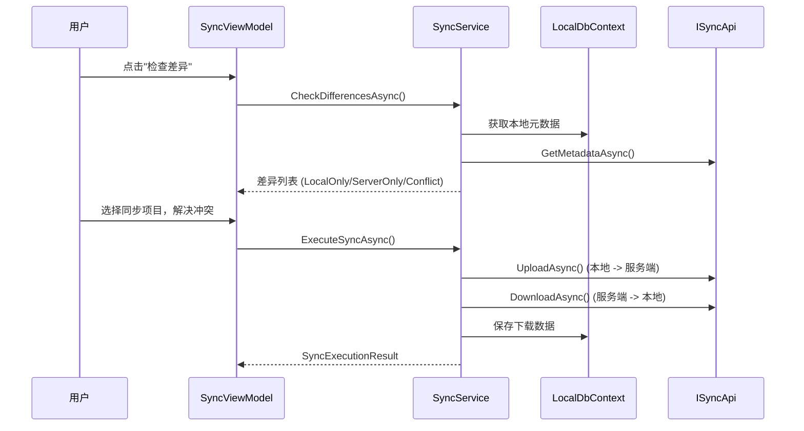

# 同步协议规范（v2.0 规划）

> 🧲 **v2.0 规划** — 本文档整体属 v2.0（N1 决策 2026-06-28：v1.0 远程与本地数据孤立）。下方内容为 v2.0 设计参考，v1.0 不实现。
>
> **关联**：
> - 双模式架构概述：[05-dual-mode.md](05-dual-mode.md)
> - 同步 API 端点参考：[../04-api-reference/09-sync.md](../04-api-reference/09-sync.md)
> - 同步 UI（SyncPhase FSM / 冲突解决）：[02-desktop.md「同步 UI 架构」](02-desktop.md#同步-ui-架构)
> - Sync 模块需求故事：[../02-requirements/09-sync.md](../02-requirements/09-sync.md)（v2.0）

---

## 同步流程



### SyncService 核心操作

| 操作 | 说明 |
|------|------|
| CheckDifferencesAsync | 比对本地与服务端元数据，分类为 LocalOnly/ServerOnly/Conflict |
| UploadAsync | 序列化本地实体为 JSON，上传到服务端 |
| DownloadAsync | 从服务端下载实体 JSON，存入本地数据库 |
| ExecuteSyncAsync | 完整同步流程: 处理上传列表 + 下载列表 + 冲突解决 |

### 同步依赖顺序

| 顺序 | 下载 (Server->Local) | 上传 (Local->Server) | 原因 |
|------|---------------------|---------------------|------|
| 1 | Herb | Herb | Formula 子项引用 HerbId |
| 2 | Patient | Patient | MedicalCase 引用 PatientId |
| 3 | Formula | Formula | 依赖 Herb 已存在 |
| 4 | MedicalCase | MedicalCase | 聚合级，依赖 Patient + Herb；仅同步 Completed 状态 (SYNC-D01) |

### 支持同步的实体类型

| 实体 | 同步支持 |
|------|----------|
| Herb | 支持 |
| Patient | 支持 |
| Formula | 支持 (含 FormulaHerbItems) |
| MedicalCase | 仅同步 Completed 状态 (SYNC-D01)。聚合级原子同步 |
| User | v1.0 不支持 |

### 冲突解决

| 实体类型 | 策略 | 说明 |
|---------|------|------|
| Herb / Patient / Formula | Server Wins | 自动覆盖 |
| MedicalCase | 手动选择 | 保留冲突对比 UI |

---

## Checksum 算法

同步系统使用 SHA256 哈希算法对实体业务字段计算校验和，用于检测本地与服务端的数据差异。

**算法实现**（客户端与服务端完全一致）：

```csharp
private static string ComputeHash(object data)
{
    var json = JsonSerializer.Serialize(data, JsonOptions);
    var bytes = Encoding.UTF8.GetBytes(json);
    var hash = SHA256.HashData(bytes);
    return Convert.ToHexString(hash); // 大写十六进制字符串
}
```

**序列化选项**：

```csharp
new JsonSerializerOptions
{
    PropertyNamingPolicy = JsonNamingPolicy.CamelCase,
    DefaultIgnoreCondition = JsonIgnoreCondition.WhenWritingNull,
    WriteIndented = false
};
```

**各实体包含字段**（仅业务字段，排除审计字段）：

| 实体 | 包含字段 | 排除字段 |
|------|---------|---------|
| **Herb** | `Id`, `Name`, `PinYinCode`, `Category`, `Origin`, `Spec`, `Unit`, `Price`, `CostPrice`, `Effect`, `Usage`, `Remark`, `Status`, `IsDeleted` | `CreatedAt`, `UpdatedAt`, `CreatedBy`, `UpdatedBy`, `RowVersion` |
| **Patient** | `Id`, `Name`, `PinYinCode`, `Gender`, `BirthDate`, `IdNumber`, `PhoneNumber`, `Address`, `AllergyHistory`, `MedicalHistory`, `Status`, `DisableReason`, `IsDeleted` | 同上 |
| **Formula** | `Id`, `Name`, `Category`, `Effect`, `Indication`, `Usage`, `Remark`, `Property`, `Status`, `FormulaType`, `IsDeleted` + `Herbs`（按 `HerbId` 再 `HerbName` 排序，每项含 `HerbId`, `HerbName`, `Dosage`, `Unit`, `Remark`） | 同上 |
| **MedicalCase** | `Id`, `PatientId`, `UserId`, `CaseStatus`, `NeedsPrescription`, `CompletedAt`, `Remark`, `IsDeleted` + 嵌套 `Consultation`（`PresentIllness`, `TongueDiagnosis`, `PulseDiagnosis`, `TcmDiagnosis`）+ 嵌套 `Prescription`（`DosageCount`, `Discount`, `Usage`, `Advice`, `ReferencedFormulas`, `Remark` + `Items` 按 `HerbId` 排序，每项含 `HerbId`, `Dosage`, `Unit`, `DecocteMethod`, `UnitPrice`, `Usage`, `Remark`） | `CaseNumber`, `PrescriptionNumber`, `PatientName`, `DoctorName`, 所有审计字段, 打印字段 |

**确定性保证**：

- Formula 的 `Herbs` 集合按 `HerbId` 再 `HerbName` 排序
- MedicalCase 的 Prescription `Items` 按 `HerbId` 排序
- Null 值在 JSON 序列化时跳过（`JsonIgnoreCondition.WhenWritingNull`）

**代码位置**：`src/Server/Modules/LYBT.Module.Sync/Services/ChecksumHelper.cs`（服务端），`src/Client/Desktop/Core/LYBT.Desktop.LocalData/Helpers/ChecksumHelper.cs`（客户端，逐行一致的副本）。

---

## 同步元数据模型

**SyncMetadataDto** — 每个可同步实体的元数据：

| 字段 | 类型 | 说明 |
|------|------|------|
| `EntityId` | `Guid` | 实体唯一标识 |
| `Checksum` | `string` | SHA256 大写十六进制哈希 |
| `LastModifiedAt` | `DateTime` | `UpdatedAt ?? CreatedAt` |
| `IsDeleted` | `bool` | 是否已软删除 |
| `EntityName` | `string?` | 显示名称（UI 用） |
| `EntityType` | `string` | `"Herb"` / `"Patient"` / `"Formula"` / `"MedicalCase"` |

**变更检测策略**：Checksum 比对

1. 客户端计算所有本地实体的 Checksum（含软删除记录，使用 `IgnoreQueryFilters()`）
2. 客户端调用 `GET /api/v1/sync/metadata?entityType=X` 获取服务端元数据
3. 以 `EntityId` 为键进行字典比对：
   - **LocalOnly**：仅本地存在 → 需上传
   - **ServerOnly**：仅服务端存在 → 需下载
   - **Modified（冲突）**：两侧均存在但 Checksum 不同 → 需冲突解决
   - **Identical**：两侧 Checksum 相同 → 无需同步

**SyncDiffDto** — 差异记录：

| 字段 | 类型 | 说明 |
|------|------|------|
| `EntityType` | `string` | 实体类型 |
| `EntityId` | `Guid` | 实体 ID |
| `DiffType` | `SyncDiffType` | `LocalOnly` / `ServerOnly` / `Modified` / `Identical` |
| `EntityName` | `string?` | 显示名称 |
| `LocalChecksum` | `string?` | 本地 Checksum |
| `ServerChecksum` | `string?` | 服务端 Checksum |
| `LocalChangedAt` | `DateTime?` | 本地修改时间 |
| `ServerChangedAt` | `DateTime?` | 服务端修改时间 |
| `ChangedFields` | `List<string>?` | 变更字段列表（UI 冲突展示用） |

---

## 数据序列化格式

**传输格式**：`System.Text.Json`，camelCase 命名策略。

**传输载体**：实体序列化为 **JSON 字符串**（非嵌入 JSON 对象），放置在同步 DTO 的 `List<string>` 集合中：

- `SyncUploadInputDto.Entities` → `List<string>`（每个元素是一个实体的完整 JSON 序列化）
- `SyncDownloadResultDto.Entities` → `List<string>`（同上格式）

**上传流程**：

1. 客户端从 LocalDB 获取实体（`IgnoreQueryFilters()` + `AsNoTracking()`）
2. 序列化：`JsonSerializer.Serialize(entity, JsonOptions)`
3. 以 `List<string>` 发送至 `POST /api/v1/sync/upload`
4. 服务端解析：`JsonDocument.Parse(entityJsonString)` → `json.Deserialize<T>(JsonOptions)`

**下载流程**：

1. 服务端从 DB 获取实体（`AsNoTracking()`）
2. 序列化为 JSON 字符串
3. 以 `List<string>` 在 `SyncDownloadResultDto.Entities` 中返回
4. 客户端反序列化后使用 `CurrentValues.SetValues()` 合并到已有实体，或 `Add()` 新增

**API 通信**：Refit HTTP 客户端，POST 使用 `[Refit.Body]`，GET 使用 `[Refit.Query]`。所有端点返回 `ApiResponse<T>` 包装。

---

## 实体依赖顺序

同步系统支持 4 种实体类型（`SupportedTypes`：`"Herb"`, `"Patient"`, `"Formula"`, `"MedicalCase"`）。同步按实体类型逐个执行（用户选择类型），依赖顺序如下：

| 顺序 | 实体类型 | 依赖关系 | 说明 |
|------|---------|---------|------|
| 1 | **Herb** | 无依赖 | 基础药材数据 |
| 2 | **Patient** | 无依赖 | 患者数据 |
| 3 | **Formula** | → Herb | `FormulaHerbItem.HerbId` 引用药材 |
| 4 | **MedicalCase** | → Patient, Herb | `PatientId` 引用患者；`PrescriptionItem.HerbId` 引用药材 |

> **注意**：User 实体 v1.0 不参与自动同步，仅手动维护。

**删除时的引用检查**：

| 实体 | 检查逻辑 | 说明 |
|------|---------|------|
| Herb | `IHerbCrossModuleService.CheckHerbReferenceAsync(herbId)` | 被处方引用时拒绝删除 |
| Patient | `IPatientCrossModuleService.CheckPatientReferenceAsync(patientId)` | 有医案记录时拒绝删除 |
| Formula | 无检查 | 始终允许 |
| MedicalCase | 无检查 | 始终允许 |

---

## 错误恢复协议

### 同步状态机

```
Idle → CheckingDifferences → ReviewingDifferences → ExecutingSync → Completed
                                                    ↘ Failed
```

| 阶段 | `SyncPhase` 枚举 | 说明 |
|------|------------------|------|
| 空闲 | `Idle` | 初始/完成后 |
| 检查差异 | `CheckingDifferences` | 比对本地与服务端 Checksum |
| 审查差异 | `ReviewingDifferences` | 用户选择同步项、解决冲突 |
| 执行同步 | `ExecutingSync` | 上传 + 下载 + 删除 |
| 完成 | `Completed` | 显示结果摘要 |
| 失败 | `Failed` | 错误分类，可重试 |

### 错误分类（`SyncErrorClassifier`）

| 异常类型 | 条件 | 分类 | 可重试 |
|---------|------|------|--------|
| `HttpRequestException` | — | `TransientNetwork` | 是 |
| `TaskCanceledException` | — | `TransientNetwork` | 是 |
| `ApiException` | 401 | `AuthExpired` | 是 |
| `ApiException` | 409 | `ConflictChanged` | 是 |
| `ApiException` | 4xx（其他） | `BusinessReject` | 否 |
| 其他 | — | `Unknown` | 否 |

### 重试机制

1. 每次操作前保存 `SyncRetryDescriptor`（记录 `Action`、`EntityType`、`FailedPhase`）
2. 失败时调用 `HandleWorkflowFailure()`：
   - 分类错误 → 设置 `CanRetry` 标志
   - 切换到 `SyncPhase.Failed`
3. `RetryCommand` 根据 `SyncRetryDescriptor` 重放上一次操作（`CheckDifferences` 或 `ExecuteSync`）

### 上传部分失败

- 服务端逐条处理实体（每条独立 try-catch）
- 错误逐条收集到 `SyncUploadItemResult`
- 最终统一调用 `SaveChangesAsync()`
- 三个计数器：`successCount`、`conflictCount`、`errorCount`
- **不回滚已成功的条目**：部分成功即持久化

### 冲突检测（上传时）

- 服务端实体已存在 且 `OverwriteConflicts == false` → 返回 `IsConflict = true`
- 服务端实体已存在 且 `OverwriteConflicts == true` → 使用 `CurrentValues.SetValues(incoming)` 覆盖
- `OverwriteConflicts` 由客户端 `FeatureToggleOptions.OverwriteConflicts` 控制

### 前置验证

- 认证检查：`SessionManager.IsAuthenticated`
- API 健康检查：`IApiHealthCheckService.CheckHealthAsync(timeout: 5000)` — 服务端不健康时拒绝同步

### API 端点

| 方法 | 路由 | 用途 | 授权 |
|------|------|------|------|
| GET | `/api/v1/sync/entity-types` | 列出支持的实体类型 | `DoctorOrReceptionist` |
| GET | `/api/v1/sync/metadata?entityType=X` | 获取服务端元数据用于比对 | `DoctorOrReceptionist` |
| POST | `/api/v1/sync/compare` | 服务端比对（客户端未使用） | `DoctorOrReceptionist` |
| POST | `/api/v1/sync/upload` | 上传实体到服务端 | `DoctorOrReceptionist` |
| POST | `/api/v1/sync/download` | 从服务端下载实体 | `DoctorOrReceptionist` |
| POST | `/api/v1/sync/delete` | 同步软删除（含引用检查） | `DoctorOrReceptionist` |

---

## MedicalCase 聚合同步

MedicalCase 是 DDD 聚合根，同步时作为原子单元处理，包含最多 4 层实体：

```
MedicalCase（根）
├── Consultation（一对一，可选）
└── Prescription（一对一，可选）
    └── PrescriptionItems（一对多）
```

### 聚合级 Checksum

将所有 4 层合并为单个 SHA256 哈希。字段显式选择，排除派生/计算/显示字段：
- 排除：`CaseNumber`, `PrescriptionNumber`, `PatientName`, `DoctorName`, 审计字段, 打印字段
- `PrescriptionItems` 按 `HerbId` 排序确保确定性
- Null 的 Consultation/Prescription 在序列化时跳过

### 上传（服务端 `SyncRepository.UpdateMedicalCaseValues`）

```csharp
// 1. 更新根实体标量值
_context.Entry(existing).CurrentValues.SetValues(incoming);

// 2. 更新 Consultation（一对一）
if (incoming.Consultation != null)
{
    if (existing.Consultation != null)
        _context.Entry(existing.Consultation).CurrentValues.SetValues(incoming.Consultation);
    else
        existing.Consultation = incoming.Consultation; // 新增
}

// 3. 更新 Prescription（一对一）+ Items（一对多）
if (incoming.Prescription != null)
{
    if (existing.Prescription != null)
    {
        _context.Entry(existing.Prescription).CurrentValues.SetValues(incoming.Prescription);
        // 删除所有已有 Items，重新添加传入 Items
        _context.RemoveRange(existing.Prescription.Items);
        foreach (var item in incoming.Prescription.Items)
        {
            item.PrescriptionId = existing.Prescription.Id;
            _context.Add(item);
        }
    }
    else
    {
        incoming.Prescription.MedicalCaseId = existing.Id;
        existing.Prescription = incoming.Prescription; // 新增
    }
}
else if (existing.Prescription != null)
{
    // 传入无处方 → 删除已有处方
    _context.RemoveRange(existing.Prescription.Items);
    _context.Remove(existing.Prescription);
    existing.Prescription = null;
}
```

### 下载（客户端 `SaveMedicalCasesAsync`）

镜像逻辑：反序列化 JSON 字符串为 `MedicalCase` 实体，使用相同模式：
- `CurrentValues.SetValues()` 更新根实体
- 递归处理 Consultation、Prescription、Items
- 处方项采用"先删后增"策略确保无孤立项

### 查询加载（两端一致）

```csharp
_context.MedicalCases
    .Include(mc => mc.Consultation)
    .Include(mc => mc.Prescription)
        .ThenInclude(p => p!.Items)
    .IgnoreQueryFilters() // 包含软删除记录
    .AsNoTracking()
```

### 引用完整性

- PrescriptionItems 的 `HerbId` 必须引用已存在的 Herb（通过依赖顺序保证：Herb 先于 MedicalCase 同步）
- MedicalCase 的 `PatientId` 引用已存在的 Patient（通过依赖顺序保证）
- MedicalCase 的 `UserId` 引用 User（v1.0 不同步 User，需手动维护）

### 孤立项处理

处方项采用**替换策略**：同步时先删除所有已有 `PrescriptionItems`，再添加传入的完整集合。这确保不会出现孤立项，但意味着：
- 本地与服务端的处方项差异以"全量覆盖"方式解决
- 被删除的处方项不会出现在同步结果中

---

## 模块级决策

| 编号 | 决策 | 状态 | 说明 |
|------|------|------|------|
| SYNC-D01 | MedicalCase 同步范围 | 已确认 | 仅同步 Completed 状态 |
| SYNC-D02 | 统一本地/远程数据路径 | **已实施** | 废除 DataSource 抽象层，使用 Repository 双实现 |
| SYNC-D03 | 运行时模式切换 | **已移除** | 被 URL 驱动连接切换替代 (URL-CONN-01) |
| URL-CONN-01 | URL 驱动连接切换 | **已实施** | SwitchingApiClient 代理 + IConnectionSettingsService，用户通过 UI 输入 URL 即时切换 |
| SYNC-D04 | 冲突解决策略 | 已确认 | 简单实体 Server Wins; MedicalCase 手动选择 |

---

## 变更记录

| 日期 | 版本 | 变更内容 |
|------|------|----------|
| 2026-06-28 | v1.0 | **从 05-dual-mode.md 外移**：同步架构 + 同步协议规范（Checksum/元数据/序列化/依赖顺序/错误恢复/MedicalCase 聚合同步）整体迁移为独立 v2.0 文档（spec S3 批次2）。05-dual-mode.md 留概述 + 指向本文档。 |
