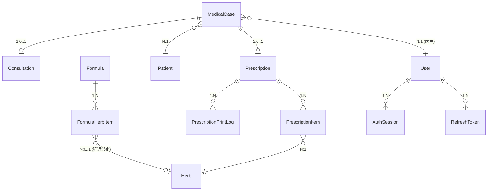
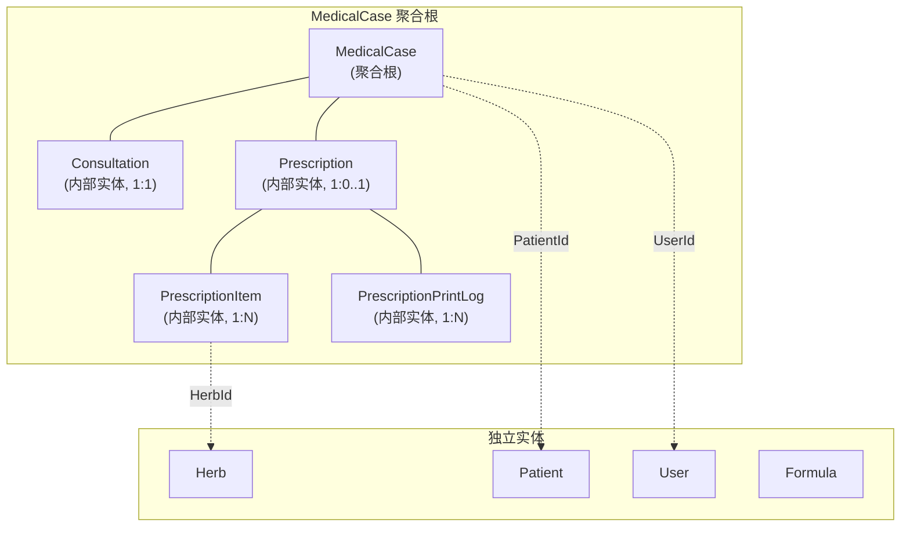

# 数据模型

## 概述

系统使用 EF Core 8.0 管理数据模型，所有业务实体继承 `BaseEntity` 基类。MedicalCase 是唯一的 DDD 聚合根，Consultation 和 Prescription 是其内部实体。数据库使用 SQL Server (远程) 或 SQLite (本地)。

## 实体关系图

## 聚合根边界

**规则**: 聚合根内的实体 (Consultation, Prescription) 只能通过 MedicalCase 访问和操作，禁止独立的 Repository。

## BaseEntity 基类

所有业务实体继承此基类:

| 字段 | 类型 | 说明 |
|------|------|------|
| Id | Guid | 主键 |
| CreatedAt | DateTime | 创建时间 (UTC) |
| UpdatedAt | DateTime? | 更新时间 |
| CreatedBy | Guid? | 创建人 |
| UpdatedBy | Guid? | 更新人 |
| RowVersion | byte[]? | 并发控制 (乐观锁) |
| IsDeleted | bool | 软删除标记 |

## 实体定义

### MedicalCase (医案 -- 聚合根)

| 字段 | 类型 | 必填 | 说明 |
|------|------|------|------|
| PatientId | Guid | 是 | 关联患者 |
| PatientName | string(50) | 是 | 患者姓名 (冗余) |
| UserId | Guid | 是 | 医生 ID |
| DoctorName | string(50) | 是 | 医生姓名 (冗余) |
| CaseNumber | string(50) | 否 | 医案编号 |
| CaseStatus | MedicalCaseStatus | 是 | 状态 (默认 Active) |
| NeedsPrescription | bool? | 否 | 是否需要处方 |
| CompletedAt | DateTime? | 否 | 完成时间 |
| Remark | string(500) | 否 | 备注 |
| Consultation | Consultation? | - | 导航属性 (1:1) |
| Prescription | Prescription? | - | 导航属性 (1:0..1) |

**计算属性**: IsLocked (跨日锁定), IsActive, IsCompleted

### Consultation (诊断)

共享 MedicalCase 主键 (1:1 关系):

| 字段 | 类型 | 必填 | 说明 |
|------|------|------|------|
| PresentIllness | string(2000) | 否 | 现病史 |
| TongueDiagnosis | string(500) | 否 | 舌诊 |
| PulseDiagnosis | string(500) | 否 | 脉诊 |
| TcmDiagnosis | string(500) | 否 | 中医辨证 |

### Prescription (处方)

| 字段 | 类型 | 必填 | 说明 |
|------|------|------|------|
| MedicalCaseId | Guid | 是 | 外键 |
| PrescriptionNumber | string(20) | 否 | 处方编号 |
| DosageCount | int | 是 | 剂数 (默认 7) |
| Discount | decimal(5,4) | 是 | 折扣 (默认 1.0) |
| Usage | string(500) | 否 | 用法 |
| Advice | string(500) | 否 | 医嘱 |
| ReferencedFormulas | string(500) | 否 | 引用验方 (逗号分隔) |
| Remark | string(500) | 否 | 备注 |
| PrintVersion | int | 是 | 打印版本 (默认 1) |
| LastPrintedAt | DateTime? | 否 | 最后打印时间 |
| PrintCount | int | 是 | 打印次数 |
| IsPrinted | bool | 是 | 是否已打印 |

### PrescriptionItem (处方药材项)

不继承 BaseEntity:

| 字段 | 类型 | 必填 | 说明 |
|------|------|------|------|
| Id | Guid | 是 | 主键 |
| PrescriptionId | Guid | 是 | 外键 |
| HerbId | Guid | 是 | 药材 ID |
| HerbName | string(100) | 是 | 药材名称 (冗余) |
| Dosage | int | 是 | 用量 |
| Unit | string(16) | 是 | 单位 (默认 "g") |
| DecocteMethod | DecocteMethod | 是 | 煎煮方法 |
| UnitPrice | decimal(18,2) | 是 | 单价 |
| Usage | string(200) | 否 | 用法 |
| Remark | string(200) | 否 | 备注 |

### Patient (患者)

| 字段 | 类型 | 必填 | 说明 |
|------|------|------|------|
| Name | string(100) | 是 | 姓名 |
| PinYinCode | string(50) | 否 | 拼音码 (搜索用) |
| Gender | Gender | 是 | 性别 |
| MaritalStatus | int | 是 | 婚姻状况 |
| BirthDate | DateTime? | 否 | 出生日期 |
| IdNumber | string(50) | 否 | 身份证号 (敏感) |
| PhoneNumber | string(20) | 否 | 手机号 (敏感) |
| Address | string(256) | 否 | 地址 (敏感) |
| AllergyHistory | string(500) | 否 | 过敏史 (敏感) |
| MedicalHistory | string(1000) | 否 | 病史 (敏感) |
| BloodType | int | 是 | 血型 |
| Status | CommonStatus | 是 | 状态 |
| LastVisitTime | DateTime? | 否 | 最后就诊 |
| VisitCount | int | 是 | 就诊次数 |

**计算属性**: Age (从 BirthDate 计算，NotMapped)

### User (用户)

| 字段 | 类型 | 必填 | 说明 |
|------|------|------|------|
| UserName | string(50) | 是 | 用户名 |
| RealName | string(50) | 是 | 真实姓名 |
| PinYinCode | string(50) | 否 | 拼音码 |
| PhoneNumber | string(20) | 否 | 手机号 |
| Email | string(100) | 否 | 邮箱 |
| Role | UserRole | 是 | 角色 (默认 Doctor) |
| Status | CommonStatus | 是 | 状态 |
| PasswordHash | string(256) | 是 | BCrypt 密码哈希 |
| FailedLoginCount | int | 是 | 登录失败次数 |
| LockoutEnd | DateTime? | 否 | 锁定截止时间 |
| LastLoginTime | DateTime? | 否 | 最后登录时间 |
| Remark | string(500) | 否 | 备注 |

### Herb (药材)

| 字段 | 类型 | 必填 | 说明 |
|------|------|------|------|
| Name | string(100) | 是 | 药材名称 |
| PinYinCode | string(50) | 否 | 拼音码 |
| Category | string(50) | 否 | 分类 |
| Origin | string(100) | 否 | 产地 |
| Spec | string(100) | 否 | 规格 |
| Unit | string(10) | 是 | 单位 (默认 "克") |
| Price | decimal(18,2) | 是 | 售价 |
| CostPrice | decimal(18,2)? | 否 | 成本价 |
| Effect | string(500) | 否 | 功效 |
| Usage | string(500) | 否 | 用法 |
| Status | CommonStatus | 是 | 状态 |

### Formula (验方)

| 字段 | 类型 | 必填 | 说明 |
|------|------|------|------|
| Name | string(200) | 是 | 验方名称 |
| Effect | string(500) | 否 | 功效 |
| Indication | string(1000) | 否 | 适应症 |
| Usage | string(500) | 否 | 用法 |
| Property | string(300) | 否 | 性味归经 |
| Status | CommonStatus | 是 | 状态 |
| IsShared | bool | 是 | 是否共享 |
| ValidationStatus | FormulaValidationStatus | 是 | 验证状态 |
| Category | string(50) | 否 | 分类 |
| FormulaType | FormulaType | 是 | 类型 (经典方/经验方) |
| UserId | Guid? | 否 | 创建医生 |

### FormulaHerbItem (验方药材项)

| 字段 | 类型 | 必填 | 说明 |
|------|------|------|------|
| Id | Guid | 是 | 主键 |
| FormulaId | Guid | 是 | 外键 |
| HerbId | Guid? | 否 | 药材 ID (延迟绑定) |
| OriginalHerbName | string(100) | 否 | 原始药材名 |
| IsValidated | bool | 是 | 是否已验证 |
| HerbName | string(100) | 是 | 药材名称 |
| Dosage | int | 是 | 用量 |
| Unit | string(16) | 是 | 单位 |
| DecocteMethod | DecocteMethod | 是 | 煎煮方法 |
| ProcessingMethod | string(100) | 否 | 炮制方法 |

### AuthSession (认证会话)

| 字段 | 类型 | 必填 | 说明 |
|------|------|------|------|
| Id | Guid | 是 | 主键 |
| UserId | Guid | 是 | 用户 ID |
| TokenHash | string(256) | 是 | Token 哈希 |
| LoginTime | DateTime | 是 | 登录时间 |
| LogoutTime | DateTime? | 否 | 登出时间 |
| ExpiryTime | DateTime | 是 | 过期时间 |
| IpAddress | string(45) | 是 | IP 地址 |
| IsRevoked | bool | 是 | 是否撤销 |

### RefreshToken (刷新令牌)

| 字段 | 类型 | 必填 | 说明 |
|------|------|------|------|
| Token | string(512) | 是 | 令牌值 |
| UserId | Guid | 是 | 用户 ID |
| UserType | string(50) | 是 | 用户类型 |
| Jti | string(128) | 是 | JWT ID |
| ExpiresAt | DateTime | 是 | 过期时间 |
| IsRevoked | bool | 是 | 是否撤销 |
| FamilyId | string(128) | 否 | Token 族 (重放检测) |
| IsUsed | bool | 是 | 是否已使用 |
| UsageCount | int | 是 | 使用次数 |

## 枚举定义

### MedicalCaseStatus

| 值 | 名称 | 说明 |
|----|------|------|
| 0 | Draft | 草稿/暂存 |
| 1 | Active | 进行中 |
| 2 | Completed | 已完成 |
| 3 | Cancelled | 已取消 |

### UserRole

| 值 | 名称 | 说明 |
|----|------|------|
| 0 | Receptionist | 前台接待 |
| 1 | Doctor | 医生 |
| 10 | Admin | 管理员 |
| 100 | SuperAdmin | 超级管理员 |

### Gender

| 值 | 名称 | 说明 |
|----|------|------|
| 0 | Unknown | 未知 |
| 1 | Male | 男 |
| 2 | Female | 女 |

### CommonStatus

| 值 | 名称 | 说明 |
|----|------|------|
| 0 | Disabled | 禁用 |
| 1 | Enabled | 启用 |

### DecocteMethod (煎煮方法)

| 值 | 名称 | 说明 |
|----|------|------|
| 0 | Default | 默认 |
| 1 | PreDecoct | 先煎 |
| 2 | PostAdd | 后下 |
| 3 | MeltIn | 烊化 |
| 4 | TakeWithWater | 冲服 |
| 5 | WrapDecoct | 包煎 |
| 6 | SeparateDecoct | 另煎 |

### FormulaValidationStatus

| 值 | 名称 | 说明 |
|----|------|------|
| 0 | Draft | 草稿/未验证 |
| 1 | Validated | 已验证 |

### FormulaType

| 值 | 名称 | 说明 |
|----|------|------|
| 1 | Classic | 经典方 |
| 2 | Experience | 经验方 |

## 数据库约定

### 命名规范

| 对象 | 规范 | 示例 |
|------|------|------|
| 表名 | PascalCase 复数 | MedicalCases |
| 列名 | PascalCase | PatientId |
| 外键 | {RelatedEntity}Id | PatientId |
| 索引 | IX_{Table}_{Column} | IX_MedicalCases_PatientId |

### EF Core 配置

- Fluent API 优先于 Data Annotations
- 全局查询过滤器: `entity.HasQueryFilter(e => !e.IsDeleted)`
- DateTime 统一 UTC
- decimal 使用 `HasPrecision(18, 2)` 或 `HasPrecision(5, 4)`

### 敏感数据

Patient 实体的以下字段标记为敏感数据，日志和序列化时脱敏:
- IdNumber (身份证号)
- PhoneNumber (手机号)
- Address (地址)
- AllergyHistory (过敏史)
- MedicalHistory (病史)

### 软删除

- 所有继承 BaseEntity 的实体支持软删除
- 通过 `IsDeleted = true` 标记
- 全局查询过滤器自动排除
- 使用 `IgnoreQueryFilters()` 查询已删除记录

## 变更记录

| 日期 | 版本 | 变更内容 |
|------|------|----------|
| 2026-02-10 | v1.0 | 初始版本，从 LYBT.Entities 代码逆向工程 |
