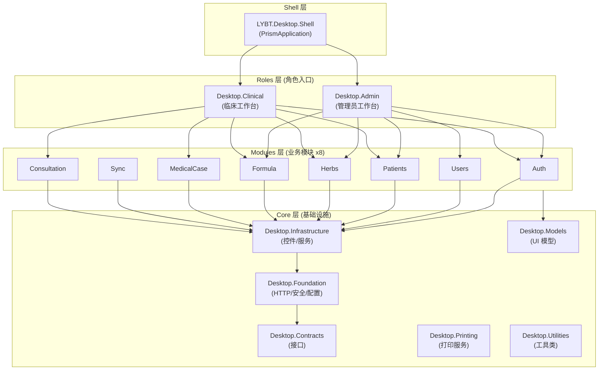

# 桌面端架构

## 概述

桌面端采用 WPF + Prism 9.0 MVVM 架构，共 16 个项目，分为 Core (基础设施)、Modules (业务模块)、Roles (角色入口)、Shell (应用外壳) 四层。通过 DryIoc DI 容器管理依赖，使用 Prism Region 机制实现模块间导航。

## 架构图



## Core 层 (6 个项目)

| 项目 | 职责 | 主要内容 |
|------|------|----------|
| LYBT.Desktop.Contracts | 接口定义 | IApi 接口 (Refit)、IDataSource 接口、IService 接口 |
| LYBT.Desktop.Foundation | 基础设施 | HTTP 客户端、缓存、安全、配置、日志、ConnectionMode |
| LYBT.Desktop.Infrastructure | WPF 服务 | DialogService、NavigationService、控件、转换器、主题 |
| LYBT.Desktop.Models | 客户端模型 | ViewState、Item 模型、事件模型 |
| LYBT.Desktop.Printing | 打印服务 | A5 处方打印模板、打印预览 |
| LYBT.Desktop.Utilities | 工具类库 | 通用辅助方法 |

**依赖方向**: Shell -> Roles -> Modules -> Infrastructure -> Foundation -> Contracts

## Modules 层 (8 个业务模块)

### 标准目录结构

```
LYBT.Desktop.{Domain}/
  {Domain}Module.cs              # Prism 模块注册 (IModule)
  Data/                          # 数据访问层
    I{Entity}Repository.cs       # Repository 接口
    {Entity}Repository.cs        # Repository 实现
    I{Entity}DataManager.cs      # DataManager 接口 (聚合根)
    {Entity}DataManager.cs       # DataManager 实现
  Models/                        # UI 模型
    {Entity}DetailModel.cs       # 可编辑的 Master-Detail 模型
    Items/
      {Entity}Item.cs            # 只读列表项模型
  Views/                         # XAML 视图
    Controls/                    # 可复用业务控件
    Dialogs/                     # 弹窗视图
  ViewModels/                    # ViewModel
    Components/                  # ViewModel 组件 (>500行时拆分)
    Dialogs/                     # 弹窗 ViewModel
  Services/                      # 客户端服务 (可选)
```

### 模块类型

| 类型 | 数据访问层 | 典型模块 | 说明 |
|------|-----------|----------|------|
| 独立实体 | Repository | Patients, Herbs, Users | 标准 CRUD |
| 聚合根 | Repository + DataManager | MedicalCase, Formula | 管理子实体 |
| 从属实体 | CommandHandler | Consultation | 通过父聚合操作 |

### 模块清单

| 模块 | 角色台 | 说明 |
|------|--------|------|
| Auth | Admin + Clinical | 登录、Token 管理 |
| Users | Admin | 用户 CRUD、密码管理 |
| Patients | Admin + Clinical | 患者 CRUD、导入导出 |
| Herbs | Admin + Clinical | 药材 CRUD、分类 |
| Formula | Admin + Clinical | 验方 CRUD、药材绑定 |
| MedicalCase | Clinical | 医案核心 (含处方) |
| Consultation | Clinical | 诊断编辑 |
| Sync | Clinical | 数据同步 (本地模式) |

## Roles 层 (2 个角色入口)

### Admin (管理员工作台)

- **包含模块**: Auth, Users, Patients, Herbs, Formula
- **核心功能**: 用户管理、数据维护、系统配置

### Clinical (临床工作台)

- **包含模块**: Auth, Patients, MedicalCase, Consultation, Herbs, Formula, Sync
- **核心功能**: 诊疗流程、开方、处方打印

### 视图分离原则 (ARCH-010)

| 类型 | 位置 | 职责 |
|------|------|------|
| 页面视图 (View) | Roles/*/Views/ | 页面布局、导航、角色操作 |
| 控件 (Control) | Modules/*/Controls/ | 可复用业务组件 |
| 对话框 (Dialog) | Modules/*/Dialogs/ | 模态交互 |

**模式**: 角色台创建薄包装 View，引用业务模块的 Control。业务逻辑在 Control 层，角色特定 UI 在 View 层。

## Shell 层

应用入口，负责:
- 应用启动和初始化 (PrismApplication)
- 主窗口和 Region 定义
- 模块加载编排 (ConfigureModuleCatalog)
- 全局异常处理
- 连接模式配置 (Remote/Local)

## ViewModel 基类体系

### 核心基类 (5 个)

```
ObservableObject (CommunityToolkit.Mvvm)
  CoreViewModelBase             # 最小核心: IsBusy, Logger, EventAggregator
    NavigableViewModelBase      # 导航: INavigationAware, IRegionMemberLifetime
      ValidatingViewModelBase   # 验证: INotifyDataErrorInfo
      PageViewModelBase         # 主页面: PageTitle, RefreshCommand
    DialogViewModelBase         # 对话框: IDialogAware
```

| 基类 | 用途 | 关键功能 |
|------|------|----------|
| CoreViewModelBase | 最小核心 | IsBusy, Logger, EventAggregator |
| NavigableViewModelBase | 导航支持 | OnNavigatedTo/From, IRegionMemberLifetime |
| DialogViewModelBase | 对话框 | IDialogAware, RequestClose |
| ValidatingViewModelBase | 表单验证 | INotifyDataErrorInfo |
| PageViewModelBase | 主内容页 | PageTitle, RefreshCommand |

### Item 类 (列表项模型)

Item 类继承 Prism `BindableBase` (Mapperly 兼容性要求)，使用显式属性定义。

### ViewModel 大小限制

- 简单 ViewModel: <= 200 行
- 中型 ViewModel: <= 400 行
- 复杂 ViewModel: <= 600 行 (配合 Components 拆分)
- 超过 500 行: 必须拆分

## Components 分层模式

大型 ViewModel 拆分为 Coordinator + Components:

```
ViewModels/
  {Feature}ViewModel.cs              # 协调器 (绑定 + 导航)
  Components/
    {Feature}DataManager.cs          # 数据加载、缓存
    {Feature}CommandHandler.cs       # CRUD 命令
    {Feature}Validator.cs            # 业务验证
    {Feature}Calculator.cs           # 计算逻辑 (可选)
```

| Component 类型 | 职责 | 必需性 |
|----------------|------|--------|
| CommandHandler | CRUD/批量操作 | 推荐 |
| DataManager | 数据加载、保存、导入导出 | 推荐 |
| Validator | 业务验证 | 推荐 |
| Calculator | 计算逻辑 | 可选 |
| Coordinator | 跨组件协调 | 可选 |
| StateMachine | 状态管理 | 可选 |

## 模块注册规范

### DI 生命周期

| 类型 | 生命周期 | 注册方式 |
|------|----------|----------|
| Repository | Singleton | `RegisterSingleton<IRepo, Repo>()` |
| DataManager | Scoped | `RegisterScoped<IDM, DM>()` |
| CommandHandler | Transient | `Register<ICH, CH>()` |
| ViewModel | Transient | `Register<VM>()` |
| View 导航 | - | `RegisterForNavigation<View>()` |
| Dialog | - | `RegisterDialog<Dialog, DialogVM>()` |

### 注册示例

```csharp
public class PatientsModule : IModule
{
    public void OnInitialized(IContainerProvider containerProvider) { }

    public void RegisterTypes(IContainerRegistry containerRegistry)
    {
        containerRegistry.RegisterSingleton<IPatientsRepository, PatientsRepository>();
        containerRegistry.Register<PatientListViewModel>();
        containerRegistry.RegisterForNavigation<PatientListView>();
    }
}
```

## Data 层组件职责

| 组件 | 职责 | 说明 |
|------|------|------|
| Repository | API 调用封装 | 调用 IApi 接口，返回 DTO |
| DataManager | 聚合状态管理 | 子实体协调、脏数据追踪、并发控制 |
| CommandHandler | 命令执行 | 委托父聚合 DataManager |

## 命令模式

使用 CommunityToolkit.Mvvm 源生成器:

```csharp
[RelayCommand(CanExecute = nameof(CanSave))]
private async Task SaveAsync()
{
    await ExecuteWithErrorHandlingAsync(async () =>
    {
        await _service.SaveAsync(CurrentItem);
        HasUnsavedChanges = false;
    }, "保存失败");
}

private bool CanSave() => !IsBusy && !HasErrors;
```

## 导航模式

- **Region 导航**: `IRegionManager.RequestNavigate(regionName, viewName, params)`
- **参数传递**: `NavigationParameters` 类型安全提取
- **导航确认**: `IConfirmNavigationRequest` (未保存数据提示)
- **事件通信**: `IEventAggregator` + `EventSubscriptionManager` 自动生命周期管理

## 可复用业务控件

Modules 层中提取的可复用 UI 组件，采用独立 ViewModel + 事件驱动模式。

### HerbListControl (药材列表编辑器)

**位置**: `Modules/LYBT.Desktop.Herbs/Controls/HerbList/`
**使用场景**: 处方药材编辑 (MedicalCase)、验方药材编辑 (Formula)

| 职责 | 说明 |
|------|------|
| 药材项管理 | 增删移动药材项 (ObservableCollection) |
| 重复检测 | 检测相同药材重复添加，支持合并策略 (DuplicateDosageStrategy) |
| 数据转换 | LoadFromDto / ToDto 与 PrescriptionItemDto 互转 |
| 空槽管理 | 自动创建空槽 (RequestNewSlot, GetNextEmptySlotIndex) |

**关键接口**:
- `ListChanged` 事件: 药材列表变更通知
- `Validate()`: 全部项验证
- `CanAddHerb(herbId)`: 重复检查

### HerbItemControl (单味药材编辑器)

**位置**: `Modules/LYBT.Desktop.Herbs/Controls/HerbItem/`
**使用场景**: HerbListControl 内部子组件

| 职责 | 说明 |
|------|------|
| 药材选择 | 下拉自动补全 (AllHerbs -> FilteredHerbs -> SelectedHerb) |
| 剂量验证 | 实时验证剂量有效性 (IsDosageValid, ValidationMessage) |
| 煎法选择 | DecocteMethod 枚举选择 |
| 状态判断 | IsEmpty (未选择药材), IsValid (已选择且剂量有效) |

**关键接口**:
- `ItemChanged` 事件: 单项变更通知
- `LoadFromDto(PrescriptionItemDto)` / `ToDto()`: 数据转换

---

## 业务弹窗

所有业务弹窗继承 `DialogViewModelBase`，通过 `IDialogService.ShowDialog` 调用。

| 弹窗 | 位置 | 用途 | 基类 |
|------|------|------|------|
| FormulaImportDialog | Modules/MedicalCase/Dialogs | 从验方库导入药材到处方 | DialogViewModelBase |
| HistoryCopyDialog | Modules/MedicalCase/Dialogs | 从历史医案复制处方 | DialogViewModelBase |
| UnsavedChangesDialog | Modules/MedicalCase/Dialogs | 未保存修改确认 (保存/放弃/取消) | ObservableObject |
| SyncConflictDialog | Modules/Sync/ViewModels | 同步冲突逐条处理 | DialogViewModelBase |
| UnfinishedCaseDialog | Core/Infrastructure/ViewModels | 未完成医案处理 (继续/新建/关闭) | ObservableObject |

### FormulaImportDialog

从验方库中搜索和选择验方，将验方中的药材导入到当前处方。

**交互流程**: 分类筛选 -> 关键词搜索 -> 选择验方 -> 预览药材列表 -> 确认导入

**关键属性**: SearchText, SelectedCategory, FilteredFormulas, SelectedFormula, SelectedFormulaHerbs

### HistoryCopyDialog

从患者历史医案中选择处方进行复制。

**交互流程**: 选择患者 -> 时间范围筛选 -> 选择医案 -> 预览处方药材 -> 确认复制

**关键属性**: PatientName, FilteredCases, SelectedCase, SelectedPrescriptionItems, IsShowingAllPatients

### SyncConflictDialog

逐条处理本地-服务端数据冲突。

**交互流程**: 查看冲突详情 -> 选择策略 (保留本地/使用服务端/跳过) -> 下一条 -> 全部处理完成

**关键命令**: UseLocalCommand, UseServerCommand, SkipCommand, UseAllLocalCommand, UseAllServerCommand

---

## CardReader 集成

**位置**: `Core/LYBT.Desktop.CardReader/`

身份证读卡器硬件集成模块，通过策略模式支持多厂商设备。

### 架构

```
PatientMasterDetailViewModel
    |-- ReadCardCommand
        |-- IPatientCardReaderIntegration
            |-- FindPatientByIdNumberAsync (按身份证号查患者)
            |-- QuickCreatePatientAsync (快速创建)
            |-- FindOrCreatePatientAsync (查找或创建)
            |-- GetPatientDetailByIdAsync (获取患者详情)
                |-- ICardReader
                    |-- ConnectAsync / DisconnectAsync
                    |-- ReadCardAsync -> CardReadResult
                    |-- DetectCardAsync
```

### 接口

| 接口 | 职责 |
|------|------|
| ICardReader | 硬件层: 设备连接、读卡、探测，包含 Name/Vendor/Model 设备信息 |
| IPatientCardReaderIntegration | 业务层: 患者匹配、创建、数据映射、患者详情获取 |

### 事件

| 事件 | 触发时机 |
|------|----------|
| ConnectionStateChanged | 读卡器连接/断开 |
| CardDetected | 检测到卡片插入 |
| CardReaderIntegrationEventType | 集成结果 (PatientFound/PatientNotFound/PatientCreated/ReadFailed) |

需求详见 [card-reader.md](../02-requirements/card-reader.md)。

---

## 变更记录

| 日期 | 版本 | 变更内容 |
|------|------|----------|
| 2026-02-10 | v1.1 | 新增可复用业务控件、业务弹窗、CardReader 集成章节 |
| 2026-02-10 | v1.0 | 初始版本，从 client-layer-architecture/desktop-architecture/viewmodel-conventions specs 整合 |
