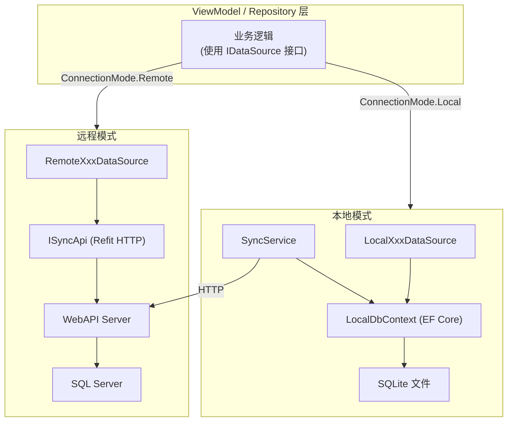
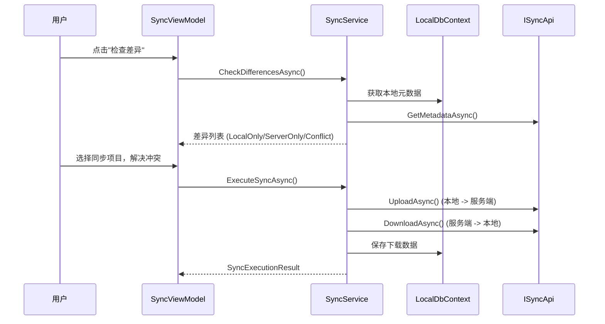

# 双模式架构

## 概述

系统支持远程模式 (Remote) 和本地模式 (Local) 两种运行模式。远程模式通过 HTTP API 连接 SQL Server 数据库，本地模式直接使用 SQLite 本地数据库。两种模式通过策略模式 (Strategy Pattern) 实现，共享相同的 IDataSource 接口，业务层完全无感知。

## 架构对比图



## 核心机制: 策略模式

### ConnectionMode 枚举

```csharp
// LYBT.Desktop.Foundation.Application.ConnectionMode
public enum ConnectionMode
{
    Remote,  // WebAPI 服务器连接
    Local    // SQLite 本地数据库
}
```

### DI 注册切换

```csharp
// Shell/Extensions/DataSourceRegistrationExtensions.cs
public static void RegisterDataSources(
    this IContainerRegistry containerRegistry,
    ConnectionMode mode)
{
    if (mode == ConnectionMode.Remote)
    {
        containerRegistry.Register<IPatientDataSource, RemotePatientDataSource>();
        containerRegistry.Register<IHerbDataSource, RemoteHerbDataSource>();
        // ...
    }
    else
    {
        containerRegistry.RegisterSingleton<LocalDbContext>(...);
        containerRegistry.Register<IPatientDataSource, LocalPatientDataSource>();
        containerRegistry.Register<IHerbDataSource, LocalHerbDataSource>();
        containerRegistry.Register<ISyncService, SyncService>();
        // ...
    }
}
```

**关键**: 同一个 IDataSource 接口，不同实现。业务层代码零修改。

### 配置读取

```json
// appsettings.json
{
  "ConnectionMode": "Local"
}
```

启动时从 `IConfiguration["ConnectionMode"]` 读取，默认 Remote。

## 模式对比

| 维度 | 远程模式 (Remote) | 本地模式 (Local) |
|------|-------------------|------------------|
| **数据库** | SQL Server (远程) | SQLite (本地文件) |
| **数据链路** | ViewModel -> IDataSource -> HTTP API -> Controller -> Service -> Repository -> SQL Server | ViewModel -> IDataSource -> LocalDbContext -> SQLite |
| **DataSource 实现** | RemoteXxxDataSource (Refit HTTP 客户端) | LocalXxxDataSource (EF Core 直连) |
| **认证方式** | JWT Token (服务端验证) | LocalAuthService (BCrypt 本地验证) |
| **多用户** | 支持 (服务端管理) | 单用户 |
| **数据同步** | 不需要 | SyncService (双向同步) |
| **离线支持** | 不支持 | 完全离线 |
| **数据库位置** | 远程服务器 | `%APPDATA%\LYBTZYZS\lybtzyzs.db` |
| **切换方式** | 修改 appsettings.json 后重启 | 修改 appsettings.json 后重启 |

## 本地数据访问层 (LocalData)

### LocalDbContext

SQLite 实现的 EF Core DbContext:

- 管理全部实体 DbSet: Patients, Users, Herbs, Formulas, MedicalCases, Consultations, Prescriptions
- 软删除全局查询过滤器 (IsDeleted = false)
- SQLite 适配: 忽略 RowVersion、decimal 转 double
- 自动审计字段管理 (CreatedAt, UpdatedAt, CreatedBy)

### Local DataSource 实现

每个实体都有对应的 LocalDataSource:

| 类 | 说明 |
|----|------|
| LocalPatientDataSource | 患者 CRUD、搜索、批量删除、导入导出 |
| LocalHerbDataSource | 药材 CRUD、分类、启用/禁用 |
| LocalFormulaDataSource | 验方 CRUD、克隆、药材绑定 |
| LocalUserDataSource | 用户 CRUD、密码管理、登录追踪 |
| LocalMedicalCaseDataSource | 医案聚合根、含详情查询、状态管理 |

**共同特征**:
- 实现 ILogger 注入，日志带 `[LocalDataSource]` 前缀
- 读操作使用 `AsNoTracking()` 优化
- 支持软删除 (IsDeleted)
- 与远程 DataSource 实现相同的 IDataSource 接口

### 本地认证

`LocalAuthService` 提供本地模式认证:
- BCrypt 密码验证
- 账户锁定: 5 次失败后锁定 15 分钟
- 禁用账户检查
- LastLoginTime 追踪

### 数据库初始化

`DatabaseInitializer`:
- 数据库路径: `%APPDATA%\LYBTZYZS\lybtzyzs.db`
- 首次运行自动创建数据库
- 加载种子数据 (SeedData)

## 同步架构

### 同步流程



### SyncService 核心操作

| 操作 | 说明 |
|------|------|
| CheckDifferencesAsync | 比对本地与服务端元数据，分类为 LocalOnly/ServerOnly/Conflict |
| UploadAsync | 序列化本地实体为 JSON，上传到服务端 |
| DownloadAsync | 从服务端下载实体 JSON，存入本地 SQLite |
| ExecuteSyncAsync | 完整同步流程: 处理上传列表 + 下载列表 + 冲突解决 |

### Checksum 比对

使用 SHA256 哈希检测数据变更:
- 排除审计字段 (CreatedAt, UpdatedAt 等)
- 仅对比业务字段
- FormulaChecksum 包含排序后的 FormulaHerbItems
- 使用一致的 JSON 序列化 (CamelCase, 忽略 null)

### 支持同步的实体类型

| 实体 | 同步支持 |
|------|----------|
| Herb | 支持 |
| Patient | 支持 |
| Formula | 支持 (含 FormulaHerbItems) |
| MedicalCase | v1.0 不支持 (聚合根复杂度高，需多表级联)。v2.0 规划 |
| User | v1.0 不支持 (低频变更 + 密码安全)。缓解: 初始化时下载，人员变更后重新初始化 |

### 冲突解决

冲突发生在同一实体在本地和服务端都被修改时。用户通过 SyncViewModel 界面:
1. 查看 ConflictItems 列表
2. 为每个冲突选择保留版本 (本地 / 服务端)
3. 未解决的冲突被跳过

## 模式切换流程

### 切换步骤 (手动)

1. 关闭应用
2. 编辑 `appsettings.json`: `"ConnectionMode": "Remote"` 或 `"Local"`
3. 重启应用
4. DI 容器根据配置注册对应的 DataSource 实现

### 首次进入本地模式

1. DatabaseInitializer 检查 SQLite 文件是否存在
2. 不存在则创建数据库，加载种子数据
3. 用户可通过 Sync 模块从服务端下载初始数据

## 决策记录

| 编号 | 问题 | 影响范围 | 状态 |
|------|------|----------|------|
| TBD-01 | 本地模式功能受限范围 | 已确定 | 已确定: 不可用项: 自动登录 / Token刷新 / 审计日志查询 / MedicalCase同步 / User同步 / 服务端API导入导出 |
| TBD-02 | 数据同步冲突解决策略 | 已确定 | 已确定: 手动逐条选择 (保留本地 / 使用服务端 / 跳过)。SyncConflictDialog 已实现 |
| TBD-03 | MedicalCase 同步支持 | v2.0 规划 | v2.0 规划: 需设计聚合根级 Checksum + 级联冲突解决方案 |

## 变更记录

| 日期 | 版本 | 变更内容 |
|------|------|----------|
| 2026-02-10 | v1.0 | 初始版本，从代码逆向工程和 sync 模块分析整合 |
