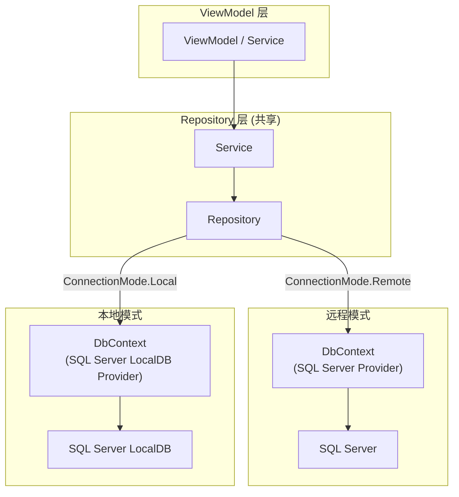
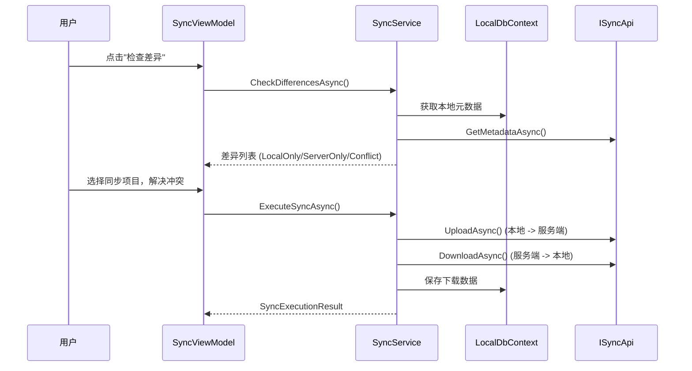

# 双模式架构

## 概述

系统支持远程模式 (Remote) 和本地模式 (Local) 两种运行模式。远程模式通过 HTTP API 连接 SQL Server 数据库，本地模式使用 SQL Server LocalDB 本地数据库。

**目标架构 (SYNC-D02)**: 两种模式共享 Service/Repository 层代码，仅 DbContext Provider 连接字符串不同 (远程 SQL Server vs 本地 SQL Server LocalDB)。当前代码处于过渡态 (DataSource 策略模式)，将在 Sprint 4 迁移到目标架构。

## 目标架构 (SYNC-D02: 统一数据路径)

> 决策日期: 2026-02-22 | 状态: 已确认，待实施 (Sprint 4)

### 设计原则

废除 IDataSource 抽象层，本地模式与远程模式共享同一套 Service/Repository 代码，仅在最底层切换 DbContext 的数据库连接。参考业界标准: Simple EMR 等同类系统。

### 架构图



### 核心变更

| 维度 | 过渡态 (当前) | 目标态 (SYNC-D02) |
|------|---------------|-------------------|
| **抽象层** | IDataSource 接口 + Remote/Local 双实现 | 无额外抽象，直接用 Repository |
| **业务逻辑** | Local DataSource 重复实现业务规则 | Service/Repository 代码共享，零重复 |
| **DI 切换** | 注册不同 DataSource 实现 | 注册不同 DbContext 连接字符串 |
| **模式切换** | 重启应用 | 运行时软重启 (SYNC-D03) |
| **维护成本** | 每个功能需写 Remote + Local 两套 | 只写一套，自动适配双模式 |

### 迁移策略

1. 将 LocalDbContext 的 Entity 配置与 Server 端 DbContext 对齐
2. Repository 层注入 DbContext 接口 (或通过 Provider 切换连接字符串)
3. 删除 IDataSource 接口族和全部 Remote/Local DataSource 实现
4. 保留 LocalAuthService (本地认证独立逻辑)
5. SyncService 直接操作 Repository，不再依赖 DataSource

## 相关架构决策 (SYNC-D01~D04)

| 编号 | 决策 | 说明 |
|------|------|------|
| **SYNC-D01** | 仅同步 Completed 医案 | Draft/Suspended 状态不同步到服务器 |
| **SYNC-D02** | 统一本地/远程数据路径 | 共享 Service/Repository 层，仅 DbContext Provider 不同。废除 DataSource 策略模式 |
| **SYNC-D03** | 运行时切换 + 软重启 | 替换 DI 中 DbContext Provider + 导航回首页。参考 Outlook Cached Exchange Mode |
| **SYNC-D04** | 分层冲突策略 | 简单实体 (Herb/Patient/Formula) Server Wins 自动覆盖; MedicalCase 保留手动选择 |

---

## 当前实现 (过渡态: DataSource 策略模式)

> 以下描述当前代码的实际状态，将在 Sprint 4 迁移到目标架构后删除此章节。

### ConnectionMode 枚举

```csharp
// LYBT.Desktop.Foundation.Application.ConnectionMode
public enum ConnectionMode
{
    Remote,  // WebAPI 服务器连接
    Local    // SQL Server LocalDB 本地数据库
}
```

### DI 注册切换

```csharp
// Shell/Extensions/DataSourceRegistrationExtensions.cs
public static void RegisterDataSources(
    this IContainerRegistry containerRegistry,
    ConnectionMode mode)
{
    if (mode == ConnectionMode.Remote)
    {
        containerRegistry.Register<IPatientDataSource, RemotePatientDataSource>();
        containerRegistry.Register<IHerbDataSource, RemoteHerbDataSource>();
        // ...
    }
    else
    {
        containerRegistry.RegisterSingleton<LocalDbContext>(...);
        containerRegistry.Register<IPatientDataSource, LocalPatientDataSource>();
        containerRegistry.Register<IHerbDataSource, LocalHerbDataSource>();
        containerRegistry.Register<ISyncService, SyncService>();
        // ...
    }
}
```

### 模式对比

| 维度 | 远程模式 (Remote) | 本地模式 (Local) |
|------|-------------------|------------------|
| **数据库** | SQL Server (远程) | SQL Server LocalDB (本地) |
| **数据链路** | ViewModel -> IDataSource -> HTTP API -> Controller -> Service -> Repository -> SQL Server | ViewModel -> IDataSource -> LocalDbContext -> SQL Server LocalDB |
| **DataSource 实现** | RemoteXxxDataSource (Refit HTTP 客户端) | LocalXxxDataSource (EF Core 直连) |
| **认证方式** | JWT Token (服务端验证) | LocalAuthService (BCrypt 本地验证) |
| **多用户** | 支持 (服务端管理) | 单用户 |
| **数据同步** | 不需要 | SyncService (双向同步) |
| **离线支持** | 不支持 | 完全离线 |
| **数据库位置** | 远程服务器 | SQL Server LocalDB 实例 `(localdb)\MSSQLLocalDB`，数据库 `LYBTZYZS_Local` |
| **切换方式** | 修改 appsettings.json 后重启 | 修改 appsettings.json 后重启 |

### Local DataSource 实现

每个实体都有对应的 LocalDataSource (待迁移后删除):

| 类 | 说明 |
|----|------|
| LocalPatientDataSource | 患者 CRUD、搜索、批量删除、导入导出 |
| LocalHerbDataSource | 药材 CRUD、分类、启用/禁用 |
| LocalFormulaDataSource | 验方 CRUD、克隆、药材绑定 |
| LocalUserDataSource | 用户 CRUD、密码管理、登录追踪 |
| LocalMedicalCaseDataSource | 医案聚合根、含详情查询、状态管理 |

### DataSource 接口层次

```
IDataSourceBase<TDetail, TInput>  (泛型基接口, LYBT.Desktop.Contracts.DataSources)
  ├── IPatientDataSource
  ├── IHerbDataSource
  ├── IFormulaDataSource
  ├── IMedicalCaseDataSource
  └── IUserDataSource
```

基接口定义 5 个标准 CRUD 方法:
- `GetByIdAsync(Guid id, CancellationToken ct)` -> `Task<TDetail?>`
- `GetPagedAsync(int page, int pageSize, string? keyword, CancellationToken ct)` -> `Task<(List<TDetail>, int)>`
- `CreateAsync(TInput input, CancellationToken ct)` -> `Task<TDetail>`
- `UpdateAsync(TInput input, CancellationToken ct)` -> `Task<TDetail>`
- `DeleteAsync(Guid id, CancellationToken ct)` -> `Task<bool>`

实体接口继承基接口并追加领域特定方法 (如 BatchDelete, ToggleStatus, Search 等)。

### Remote vs Local 实现对应表

| 接口 | Remote 实现 | Local 实现 |
|------|------------|-----------|
| IPatientDataSource | RemotePatientDataSource | LocalPatientDataSource |
| IHerbDataSource | RemoteHerbDataSource | LocalHerbDataSource |
| IFormulaDataSource | RemoteFormulaDataSource | LocalFormulaDataSource |
| IMedicalCaseDataSource | RemoteMedicalCaseDataSource | LocalMedicalCaseDataSource |
| IUserDataSource | RemoteUserDataSource | LocalUserDataSource |

- Remote 实现位于 `LYBT.Desktop.Infrastructure/DataSources/Remote/`，依赖 Refit API 客户端
- Local 实现位于 `LYBT.Desktop.LocalData/DataSources/`，依赖 LocalDbContext (SQL Server LocalDB)
- 所有实现均为 Transient 生命周期

### DI 注册切换详情

`DataSourceRegistrationExtensions.RegisterDataSources(mode)` 根据 ConnectionMode 枚举注册:
- **Remote**: 注册 5 个 RemoteXxxDataSource (Transient)
- **Local**: 注册 LocalDbContext + DatabaseInitializer + LocalAuthService + SyncService + 5 个 LocalXxxDataSource
- **共享**: ICurrentUserProvider (SessionBasedCurrentUserProvider, Singleton)

> SYNC-D02 计划废除整个 IDataSource 抽象层，改为共享 Service/Repository + DbContext Provider 切换。

---

## 本地数据访问层 (LocalData)

### LocalDbContext

SQL Server LocalDB 实现的 EF Core DbContext:

- 管理全部实体 DbSet: Patients, Users, Herbs, Formulas, MedicalCases, Consultations, Prescriptions
- 软删除全局查询过滤器 (IsDeleted = false)
- SQL Server 原生支持 RowVersion、decimal，无需适配代码
- 自动审计字段管理 (CreatedAt, UpdatedAt, CreatedBy)

### 本地认证

`LocalAuthService` 提供本地模式认证 (迁移后保留):
- BCrypt 密码验证
- 账户锁定: 5 次失败后锁定 15 分钟
- 禁用账户检查
- LastLoginTime 追踪

### 数据库初始化

`DatabaseInitializer`:
- 使用 SQL Server LocalDB，EnsureCreatedAsync 自动创建数据库
- 连接字符串配置: `appsettings.json` 的 `LocalConnectionString` (默认: `(localdb)\MSSQLLocalDB`)
- 加载种子数据 (SeedData)

### 配置

```json
// appsettings.json
{
  "ConnectionMode": "Local"
}
```

启动时从 `IConfiguration["ConnectionMode"]` 读取，默认 Remote。

## 同步架构

### 同步流程



### SyncService 核心操作

| 操作 | 说明 |
|------|------|
| CheckDifferencesAsync | 比对本地与服务端元数据，分类为 LocalOnly/ServerOnly/Conflict |
| UploadAsync | 序列化本地实体为 JSON，上传到服务端 |
| DownloadAsync | 从服务端下载实体 JSON，存入本地数据库 |
| ExecuteSyncAsync | 完整同步流程: 处理上传列表 + 下载列表 + 冲突解决 |

### 端到端调用链

```
Desktop SyncViewModel
  -> ISyncService (Desktop Contracts, LYBT.Desktop.Contracts.Services)
    -> SyncService (LocalData 实现, LYBT.Desktop.LocalData.Services)
      -> LocalDbContext (本地元数据读写)
      -> ISyncApi (Refit HTTP, LYBT.Desktop.Contracts.Api)
        -> SyncController (Server WebAPI, /api/v1/sync)
          -> ISyncService (Module.Sync 接口, LYBT.Module.Sync.Interfaces)
            -> SyncService (Module.Sync 实现, LYBT.Module.Sync.Services)
              -> AppDbContext (服务器数据库)
              -> IHerbCrossModuleService (删除前引用检查)
              -> IPatientCrossModuleService (删除前引用检查)
```

Desktop 和 Server 各有独立的 ISyncService 接口 (同名不同命名空间):
- Desktop: `LYBT.Desktop.Contracts.Services.ISyncService` -- 面向 ViewModel，按 entityType 字符串分派
- Server: `LYBT.Module.Sync.Interfaces.ISyncService` -- 面向 Controller，接收 DTO 输入

### 跨模块依赖

| 依赖来源 | 被依赖接口 | 实现类 | 用途 |
|---------|-----------|--------|------|
| Module.Sync | IHerbCrossModuleService | CrossModuleService | 删除前检查 PrescriptionItem 引用 |
| Module.Sync | IPatientCrossModuleService | CrossModuleService | 删除前检查 MedicalCase 引用 |

CrossModuleService 定义在 `LYBT.Infrastructure/Services/CrossModuleQueryService.cs`，实现 ISP 四接口 (IPatientCrossModuleService, IHerbCrossModuleService, IUserCrossModuleService, ICrossModuleAuthService)。

### 同步依赖顺序

参照约束决定同步顺序 (当前支持的 SupportedTypes: Herb, Patient, Formula):

| 顺序 | 下载 (Server->Local) | 上传 (Local->Server) | 原因 |
|------|---------------------|---------------------|------|
| 1 | Herb | Herb | Formula 子项引用 HerbId |
| 2 | Patient | Patient | MedicalCase 引用 PatientId |
| 3 | Formula | Formula | 依赖 Herb 已存在 |
| (未实现) | MedicalCase | MedicalCase | 聚合级，依赖 Patient + Herb |

### 基础数据 vs 聚合同步

| 维度 | 基础数据 (Herb/Patient/Formula) | MedicalCase 聚合 (未启用) |
|------|-------------------------------|--------------------------|
| 子集合 | 无 / FormulaHerbItem (1层) | Consultation + Prescription + PrescriptionItems (3层) |
| Checksum | 扁平字段 / 2层 | 4层聚合，PrescriptionItems 按 HerbId 排序 |
| 上传处理 | SetValues 覆盖 / RemoveRange+Add | 需处理共享主键 (Consultation.Id = MedicalCase.Id) |
| 状态约束 | 无 | 仅 Completed 可同步 (SYNC-D01) |
| 冲突策略 | Server Wins 自动覆盖 | 手动选择 (SYNC-D04) |

### Checksum 比对

使用 SHA256 哈希检测数据变更:
- 排除审计字段 (CreatedAt, UpdatedAt 等)
- 仅对比业务字段
- FormulaChecksum 包含排序后的 FormulaHerbItems
- 使用一致的 JSON 序列化 (CamelCase, 忽略 null)

### 支持同步的实体类型

| 实体 | 同步支持 |
|------|----------|
| Herb | 支持 |
| Patient | 支持 |
| Formula | 支持 (含 FormulaHerbItems) |
| MedicalCase | 仅同步 Completed 状态 (SYNC-D01)。聚合级原子同步，含 Consultation + Prescription + PrescriptionItems。详见 [sync.md](../02-requirements/sync.md) |
| User | v1.0 不支持 (低频变更 + 密码安全)。缓解: 初始化时下载，人员变更后重新初始化 |

### MedicalCase 同步设计

MedicalCase 作为系统核心聚合根，采用聚合级原子同步方案。详细设计见 [sync.md](../02-requirements/sync.md) MedicalCase 同步设计章节。

**核心场景**: 医生外出看诊离线工作流 -- 出诊前同步基础数据，离线创建医案，返回后上传。

**同步粒度**: 以 DDD 聚合为单位，整个聚合 (MedicalCase + Consultation + Prescription + PrescriptionItems) 作为一个 JSON 对象传输，Server 端使用单事务写入，任何一部分失败整体回滚。

**依赖顺序**: 系统自动强制编排 -- Herb 同步 -> Patient 同步 (含 IdCardNumber 去重) -> MedicalCase 同步。用户无需关心依赖顺序。

**患者去重**: 本地新建患者上传时，Server 按 IdCardNumber 检查。已存在则返回 Server 端 PatientId，客户端自动重映射关联 MedicalCase 的 PatientId。

**编号重分配**: CaseNumber 和 PrescriptionNumber 在上传后由 Server 重新分配，保持全局唯一序列。实体 Id (GUID) 保留不变。

**打印字段排除**: MedicalCase.IsPrinted、MedicalCase.PrintVersion、MedicalCase.PrintCount、MedicalCase.LastPrintedAt、MedicalCasePrintLog 不参与同步。打印是本地行为，每台设备独立记录。

**Checksum 计算**: 聚合级哈希，合并 MedicalCase + Consultation + Prescription + PrescriptionItems 四层业务字段。排除可变编号、冗余名称、审计字段和打印字段。PrescriptionItems 按 HerbId 排序保证哈希确定性。

**同步状态约束 (SYNC-D01)**:

| 医案状态 | 上传 | 下载 | 说明 |
|---------|------|------|------|
| Active | 不同步 | 不同步 | 正在诊疗中，应先完成再同步 |
| Suspended | 不同步 | 不同步 | 已挂起，应先完成或取消再同步 |
| Completed | 可以 | 可以 | 已存在的 Completed 不可被覆盖 |

**冲突解决 (SYNC-D04)**:

| 实体类型 | 策略 | 说明 |
|---------|------|------|
| Herb / Patient / Formula | Server Wins | 自动覆盖，无冲突 UI |
| MedicalCase | 手动选择 | 保留冲突对比 UI，用户逐条确认 |

### 冲突解决

**MedicalCase 特有冲突规则**:
- **BR-001 冲突**: SYNC-D01 约束仅同步 Completed 状态医案，Active/Suspended 不参与同步，因此 BR-001 (同一患者单活跃医案) 在同步场景下不会触发冲突。上传的 Completed 医案不受此规则限制
- **已锁定医案**: 已完成且已锁定的 Completed 医案不可通过同步覆盖 (ERR-70304)
- **变更字段检测**: 跨整个聚合 (诊断 + 处方 + 药材明细) 检测差异字段，冲突解决 UI 使用左右对比布局 + 差异高亮

## 模式切换流程

### 目标: 运行时软重启 (SYNC-D03)

> 决策日期: 2026-02-22 | 状态: 已确认，待实施 (Sprint 4)

参考 Outlook Cached Exchange Mode:
1. 用户在设置中切换 ConnectionMode
2. 应用替换 DI 中 DbContext 连接字符串 (远程 SQL Server <-> 本地 SQL Server LocalDB)
3. 自动导航回首页
4. 无需重启应用

### 当前: 手动重启 (过渡态)

1. 关闭应用
2. 编辑 `appsettings.json`: `"ConnectionMode": "Remote"` 或 `"Local"`
3. 重启应用
4. DI 容器根据配置注册对应的 DataSource 实现

### 首次进入本地模式

1. DatabaseInitializer 通过 EnsureCreatedAsync 创建 LocalDB 数据库（如不存在）
2. 加载种子数据（admin 默认账户）
3. 用户可通过 Sync 模块从服务端下载初始数据

## 决策记录

| 编号 | 问题 | 状态 | 说明 |
|------|------|------|------|
| SYNC-D01 | MedicalCase 同步范围 | 已确认 | 仅同步 Completed 状态，Active/Suspended 不同步 (Draft 已替换为 Suspended, MC-D20) |
| SYNC-D02 | 统一本地/远程数据路径 | 已确认，待实施 | 废除 DataSource 策略模式，共享 Service/Repository 层，仅 DbContext 连接字符串不同。LocalDB 迁移已完成 (Sprint 2) |
| SYNC-D03 | 运行时模式切换 | 已确认，待实施 | 软重启方案，替换 DI 中 DbContext 连接字符串 + 导航回首页 |
| SYNC-D04 | 冲突解决策略 | 已确认 | 简单实体 Server Wins; MedicalCase 手动选择 |
| TBD-01 | 本地模式功能受限范围 | 已确定 | 不可用项: 自动登录 / Token刷新 / 审计日志查询 / User同步 / 服务端API导入导出。不活跃超时: 15 分钟 (可配置)。见 [auth.md](../02-requirements/auth.md) FR-AUTH-006 |

## 变更记录

| 日期 | 版本 | 变更内容 |
|------|------|----------|
| 2026-02-10 | v1.0 | 初始版本，从代码逆向工程和 sync 模块分析整合 |
| 2026-02-18 | v1.1 | PRD同步: MedicalCase 同步从 v2.0 规划更新为已确定，新增 MedicalCase 同步设计章节 |
| 2026-02-19 | v1.2 | TBD-01 补充本地模式不活跃超时时间 (15分钟，可配置) |
| 2026-02-22 | v2.0 | **架构演进**: 新增 SYNC-D01~D04 决策，标注目标架构 (统一数据路径) 和当前过渡态，重组文档结构 |
| 2026-03-08 | v2.1 | **LocalDB 迁移**: Local 模式从 SQLite 迁移到 SQL Server LocalDB，删除 IgnoreRowVersion/ApplyDecimalConversion 适配代码 |
