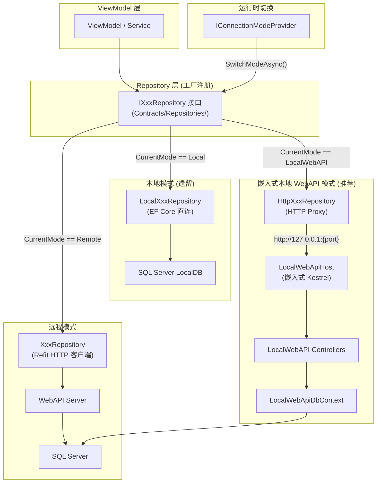
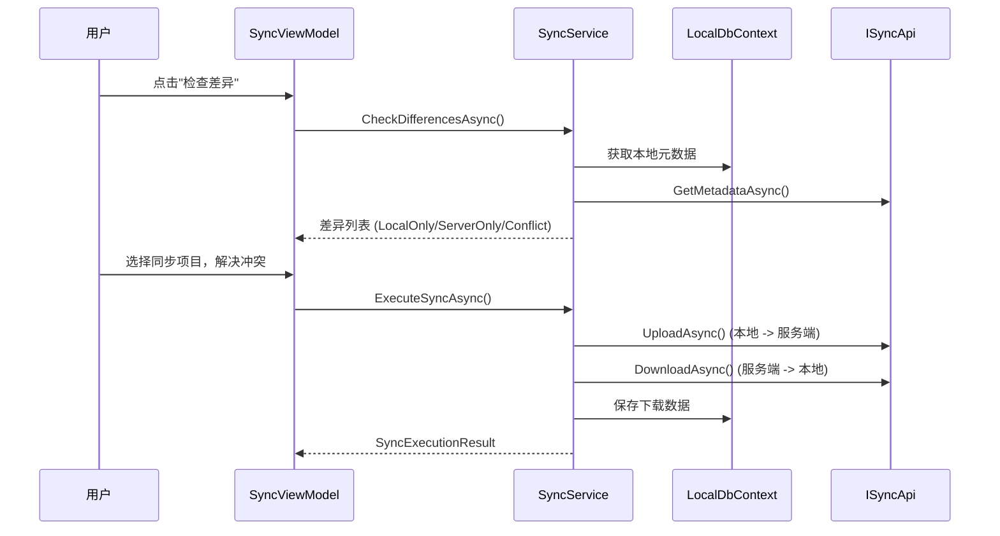

# 双模式架构

## 概述

系统支持远程模式 (Remote) 和本地模式 (Local) 两种运行模式，支持运行时切换（无需重启应用）。

| 模式 | 数据链路 | 数据库 | 适用场景 |
|------|----------|--------|----------|
| **Remote** | Refit HTTP → Server WebAPI | SQL Server (远程) | 多用户联网环境 |
| **Local** | HTTP → 嵌入式 Kestrel | SQL Server (当前实现) | 单用户离线 |

**本地模式实现变更**: 本地模式从 SQL Server LocalDB + EF Core 直连 改为 嵌入式 Kestrel WebAPI + SQL Server。优势：统一数据访问层（远程/本地共用 Repository 接口）、降低维护成本（不再维护 6 对 LocalRepository 实现）。

**当前架构**: Factory + Dual Repository 模式（Remote 实现 + LocalWebAPI Proxy 实现）。运行时模式切换已实现 (SYNC-D03)。

## 架构图



## 核心机制

### IConnectionModeProvider

运行时模式管理核心接口，位于 `Contracts/Services/IConnectionModeProvider.cs`:

| 成员 | 说明 |
|------|------|
| `CurrentMode` | 当前连接模式 (Remote/Local) |
| `IsLocalMode` | 是否本地模式 |
| `SwitchModeAsync(mode, ct)` | 运行时切换模式 |
| `IsSwitching` | 是否正在切换中 |
| `ModeChanged` | 模式变更事件 |

### 工厂注册 (DI)

`DataSourceRegistrationExtensions.cs` 使用工厂模式注册 Repository:

- 两套基础设施 (LocalDbContext + HTTP Client) **始终注册**
- 6 个 Repository 以工厂方式注册: resolve 时根据 `IConnectionModeProvider.CurrentMode` 选择远程或本地实现
- Singleton 服务不直接注入 Repository，避免模式切换后持有旧实例

### Repository 三实现

| 接口 | 远程实现 (Refit HTTP) | 本地实现 (EF Core) | LocalWebAPI 实现 (HTTP Proxy) |
|------|----------------------|-------------------|------------------------------|
| IPatientRepository | PatientRepository | LocalPatientRepository | HttpPatientRepository |
| IHerbRepository | HerbRepository | LocalHerbRepository | HttpHerbRepository |
| IFormulaRepository | FormulaRepository | LocalFormulaRepository | HttpFormulaRepository |
| IMedicalCaseRepository | MedicalCaseRepository | LocalMedicalCaseRepository | HttpMedicalCaseRepository |
| IUserRepository | UserRepository | LocalUserRepository | HttpUserRepository |
| IRegistrationRepository | RegistrationRepository | LocalRegistrationRepository | HttpRegistrationRepository |

## 本地模式功能覆盖率 (Coverage)

| 模块 | 远程端点 (Remote) | 本地端点 (Local) | 覆盖率 |
|------|-----------------|-----------------|-------|
| Auth | 5 | 5 | 100% |
| Users | 14 | 14 | 100% |
| Patients | 11 | 11 | 100% |
| Herbs | 17 | 17 | 100% |
| Formulas | 15 | 15 | 100% |
| MedicalCases | 19 | 19 | 100% |
| Registrations | 7 | 7 | 100% |
| Sync | 6 | 6 | 100% |
| Diagnostics | 4 | 4 | 100% |
| Configuration | 1 | 1 | 100% |
| Health | 3 | 3 | 100% |
| **总计** | **~102** | **~102** | **~100%** |

## 本地模式功能覆盖 (Phase 4 更新)

### 概述
本地模式功能覆盖率从 Phase 1 的 31% 提升至 **~78%**。Phase 4 重点完善了核心业务流程在离线环境下的闭环，确保医生在无网络连接时仍能完成完整的接诊工作。

### 关键新增功能
- **MedicalCase 完整工作流**: 支持本地创建、编辑、挂号关联、四诊单项保存、处方保存。
- **批量操作**: 支持药材、患者、验方的批量导入/导出 (Excel)。
- **诊断工具**: 本地模式支持诊断一致性检查、数据库完整性验证。
- **用户管理**: 本地模式支持基础用户增删改查（用于单机多医生轮班）。

### 限制与排除 (TBD-01)
部分对服务端有强依赖的功能在本地模式下不可用，调用时返回 `501 Not Implemented` 或空结果：
- **Token 刷新**: 本地模式使用长效 Token (1年)，不支持 Refresh Token 轮换。
- **审计日志查询**: 本地暂不持久化系统级审计日志。
- **自动登录令牌同步**: 自动登录依赖远程中心化存储。
- **用户同步**: 用户数据不参与双向同步，仅手动维护。

### 架构特性
- **Direct DbContext**: 为了极致性能，本地模式部分复杂查询绕过 Service 层直连 `LocalWebApiDbContext`。
- **宽松权限控制**: 本地模式下角色权限验证被简化，默认当前登录用户拥有全部本地操作权限。

---

### 运行时切换流程 (SYNC-D03)

`ConnectionModeProvider.SwitchModeAsync()` 七步流程:

1. **ActiveConsultation 检查** -- 如有活跃医案，阻断切换
2. **ModeSwitchValidator 验证** -- 检查未完成医案 + 数据库可用性
3. **Region 清理** -- 清除 Prism Region 内容 + 导航历史
4. **切换模式** -- 更新 `CurrentMode`
5. **数据库初始化** -- Local 模式: EnsureCreatedAsync + SeedData
6. **LocalWebAPI 生命周期管理** -- LocalWebAPI 模式: 启动 LocalWebApiHost (Kestrel + SQL Server); 从 LocalWebAPI 切出时: 停止 LocalWebApiHost
7. **通知 + 导航** -- 触发 `ModeChanged` 事件，导航首页

UI 实现:
- `SidebarControl` 模式切换按钮 (swap_horiz 图标)
- `MainWindow` 半透明遮罩层 (IsSwitchingMode 绑定)
- 切换前显示确认对话框

### 模式对比

| 维度 | 远程模式 (Remote) | 本地模式 (Local) | 嵌入式 WebAPI (LocalWebAPI) |
|------|-------------------|------------------|---------------------------|
| **数据库** | SQL Server (远程) | SQL Server LocalDB (本地) | SQL Server (本地) |
| **数据链路** | ViewModel → Repository → Refit HTTP → Server → SQL Server | ViewModel → LocalRepository → LocalDbContext → LocalDB | ViewModel → HttpRepository → Kestrel → LocalWebApiDbContext → SQL Server |
| **认证方式** | JWT Token (服务端验证) | LocalAuthService (BCrypt 本地验证) | JWT Token (嵌入式 Kestrel 验证) |
| **多用户** | 支持 (服务端管理) | 单用户 | 单用户 |
| **数据同步** | 不需要 | SyncService (双向同步) | SyncService (双向同步) |
| **离线支持** | 不支持 | 完全离线 | 完全离线 |
| **部署复杂度** | 需要服务端 | 需要 LocalDB 安装 | 需要 SQL Server |
| **内存占用** | 低 | 中 (LocalDB 进程) | 中 (Kestrel 进程内) |
| **切换方式** | 运行时 SidebarControl 切换按钮 | 运行时 SidebarControl 切换按钮 | 运行时 SidebarControl 切换按钮 |

## 相关架构决策 (SYNC-D01~D04)

| 编号 | 决策 | 状态 | 说明 |
|------|------|------|------|
| **SYNC-D01** | 仅同步 Completed 医案 | 已确认 | Draft/Suspended 状态不同步到服务器 |
| **SYNC-D02** | 统一本地/远程数据路径 | **已实施 (Sprint 6)** | 废除 DataSource 抽象层，改为 Factory + Dual Repository |
| **SYNC-D03** | 运行时切换 + 软重启 | **已实施 (Sprint 6)** | IConnectionModeProvider 五步切换，SidebarControl UI |
| **SYNC-D04** | 分层冲突策略 | 已确认 | 简单实体 Server Wins; MedicalCase 手动选择 |

---

## LocalWebAPI 架构 (新增)

### 概述

LocalWebAPI 是在 WPF 桌面进程内嵌入的 ASP.NET Core Kestrel WebAPI 服务器。它使用 SQL Server 作为本地数据库，通过 HTTP 接口为桌面客户端提供数据访问能力。

**设计目标**:
- 统一数据访问层：远程/本地模式共用同一套 Repository 接口
- 简化部署：使用 SQL Server，与远程模式保持一致
- 降低维护成本：减少 6 对 LocalRepository 实现，改为 6 个 HTTP Proxy Repository

### 项目结构

```
src/Client/Desktop/LocalWebAPI/
├── LYBT.LocalWebAPI.csproj          # 项目文件 (Microsoft.NET.Sdk.Web, net8.0)
├── LocalWebApiProgram.cs            # WebAPI 入口 (CreateBuilder/CreateApplication/InitializeDatabaseAsync)
├── LocalWebApiHost.cs               # Kestrel 生命周期管理器 (StartAsync/StopAsync)
├── Auth/
│   └── LocalJwtConfig.cs            # JWT 认证配置 (HMAC-SHA256, 1年有效期)
├── Controllers/
│   ├── AuthController.cs            # 登录端点
│   ├── UsersController.cs           # 用户 CRUD
│   ├── PatientsController.cs        # 患者 CRUD
│   ├── HerbsController.cs           # 药材 CRUD
│   ├── FormulasController.cs        # 验方 CRUD
│   ├── RegistrationsController.cs   # 挂号 CRUD
│   ├── MedicalCasesController.cs    # 医案 CRUD
│   └── HealthController.cs          # 健康检查
├── Data/
│   ├── LocalWebApiDbContext.cs      # EF Core DbContext (SQL Server)
│   └── LocalWebApiSeedData.cs       # 种子数据初始化
└── Repositories/
    ├── HttpPatientRepository.cs     # HTTP Proxy Repository
    ├── HttpUserRepository.cs
    ├── HttpHerbRepository.cs
    ├── HttpFormulaRepository.cs
    ├── HttpRegistrationRepository.cs
    └── HttpMedicalCaseRepository.cs
```

### 核心组件

**LocalWebApiHost** - Kestrel 生命周期管理器:
- `StartAsync()`: 创建数据库目录 → 构建 WebApplication → 配置动态端口 (port 0) → 初始化数据库 → 启动 Kestrel → 捕获实际端口
- `StopAsync()`: 取消令牌 → 等待运行任务完成 (5s 超时) → 释放资源
- 线程安全：使用 lock 防止并发 Start/Stop
- 幂等性：重复调用 StartAsync 不会重复启动

**LocalWebApiDbContext** - SQL Server 数据库上下文:
- 复用 Server 端的实体配置 (ApplyConfigurationsFromAssembly)
- 自动应用全局查询过滤器 (IsDeleted)
- 支持 SQL Server 数据类型和约束

**HTTP Proxy Repository** - 数据访问代理:
- 实现与 Remote/Local 相同的 Repository 接口
- 通过 HttpClient 调用 LocalWebAPI 端点
- 使用 System.Text.Json 序列化/反序列化 (PascalCase)
- 不支持的端点返回 null 并记录警告日志

### 动态端口发现

LocalWebAPI 使用端口 0 (OS 自动分配可用端口)，启动后通过 `IServerAddressesFeature` 获取实际绑定端口：

```csharp
var addressFeature = _app.ServerFeatures.Get<IServerAddressesFeature>();
var first = addressFeature.Addresses.First();
Port = new Uri(first).Port;
```

HTTP Proxy Repository 通过 `LocalWebApiHost.Port` 动态构建 BaseAddress。

### 认证简化

LocalWebAPI 使用简化的 JWT 认证：
- HMAC-SHA256 签名密钥 (固定 secret)
- Token 有效期 1 年 (无需刷新)
- 无外部认证提供者
- 无 Refresh Token 轮换

### DI 集成

`DataSourceRegistrationExtensions.RegisterRepositoryFactories()` 现在使用三模式工厂：

```csharp
containerRegistry.Register<IPatientRepository>(resolver =>
{
    var mode = resolver.Resolve<IConnectionModeProvider>().CurrentMode;
    return mode switch
    {
        ConnectionMode.Remote => new PatientRepository(...),
        ConnectionMode.Local => new LocalPatientRepository(...),
        ConnectionMode.LocalWebAPI => new HttpPatientRepository(CreateLocalWebApiHttpClient(resolver), ...),
    };
});
```

`LocalWebApiHost` 注册为 Singleton，由 `ConnectionModeProvider.SwitchModeAsync()` 负责启动/停止。

### 配置

```json
// appsettings.json
{
  "ConnectionMode": "Remote"  // 可选: Remote, Local, LocalWebAPI
}
```

启动时从 `IConfiguration["ConnectionMode"]` 读取初始模式。运行时可通过 UI 切换。

### 决策记录

| 编号 | 决策 | 状态 | 说明 |
|------|------|------|------|
| LOCALWEB-01 | 使用 SQL Server 作为本地数据库 | 已实施 | 与远程模式保持一致，简化数据同步 |
| LOCALWEB-02 | 嵌入 Kestrel 在 WPF 进程内 | 已实施 | 避免独立进程管理复杂度 |
| LOCALWEB-03 | 简化 JWT 认证 (无刷新) | 已实施 | 本地模式无需复杂认证流 |
| LOCALWEB-04 | HTTP Proxy Repository 模式 | 已实施 | 统一 Repository 接口 |

### LocalDbContext

SQL Server LocalDB 实现的 EF Core DbContext:

- 管理全部实体 DbSet: Patients, Users, Herbs, Formulas, MedicalCases, Consultations, Prescriptions
- 软删除全局查询过滤器 (IsDeleted = false)
- SQL Server 原生支持 RowVersion、decimal，无需适配代码
- 自动审计字段管理 (CreatedAt, UpdatedAt, CreatedBy)

### 本地认证

`LocalAuthService` 提供本地模式认证:
- BCrypt 密码验证
- 账户锁定: 5 次失败后锁定 15 分钟
- 禁用账户检查
- LastLoginTime 追踪

### 数据库初始化

`DatabaseInitializer`:
- 使用 SQL Server LocalDB，EnsureCreatedAsync 自动创建数据库
- 连接字符串配置: `appsettings.json` 的 `LocalConnectionString` (默认: `(localdb)\MSSQLLocalDB`)
- 加载种子数据 (SeedData)

### 配置

```json
// appsettings.json
{
  "ConnectionMode": "Remote"
}
```

启动时从 `IConfiguration["ConnectionMode"]` 读取初始模式，默认 Remote。运行时可通过 UI 切换。

## 同步架构

### 同步流程



### SyncService 核心操作

| 操作 | 说明 |
|------|------|
| CheckDifferencesAsync | 比对本地与服务端元数据，分类为 LocalOnly/ServerOnly/Conflict |
| UploadAsync | 序列化本地实体为 JSON，上传到服务端 |
| DownloadAsync | 从服务端下载实体 JSON，存入本地数据库 |
| ExecuteSyncAsync | 完整同步流程: 处理上传列表 + 下载列表 + 冲突解决 |

### 端到端调用链

```
Desktop SyncViewModel
  -> ISyncService (Desktop Contracts, LYBT.Desktop.Contracts.Services)
    -> SyncService (LocalData 实现, LYBT.Desktop.LocalData.Services)
      -> LocalDbContext (本地元数据读写)
      -> ISyncApi (Refit HTTP, LYBT.Desktop.Contracts.Api)
        -> SyncController (Server WebAPI, /api/v1/sync)
          -> ISyncService (Module.Sync 接口, LYBT.Module.Sync.Interfaces)
            -> SyncService (Module.Sync 实现, LYBT.Module.Sync.Services)
              -> AppDbContext (服务器数据库)
              -> IHerbCrossModuleService (删除前引用检查)
              -> IPatientCrossModuleService (删除前引用检查)
```

### 同步依赖顺序

| 顺序 | 下载 (Server->Local) | 上传 (Local->Server) | 原因 |
|------|---------------------|---------------------|------|
| 1 | Herb | Herb | Formula 子项引用 HerbId |
| 2 | Patient | Patient | MedicalCase 引用 PatientId |
| 3 | Formula | Formula | 依赖 Herb 已存在 |
| (未实现) | MedicalCase | MedicalCase | 聚合级，依赖 Patient + Herb |

### 支持同步的实体类型

| 实体 | 同步支持 |
|------|----------|
| Herb | 支持 |
| Patient | 支持 |
| Formula | 支持 (含 FormulaHerbItems) |
| MedicalCase | 仅同步 Completed 状态 (SYNC-D01)。聚合级原子同步 |
| User | v1.0 不支持 |

### 冲突解决

| 实体类型 | 策略 | 说明 |
|---------|------|------|
| Herb / Patient / Formula | Server Wins | 自动覆盖 |
| MedicalCase | 手动选择 | 保留冲突对比 UI |

## 决策记录

| 编号 | 决策 | 状态 | 说明 |
|------|------|------|------|
| SYNC-D01 | MedicalCase 同步范围 | 已确认 | 仅同步 Completed 状态 |
| SYNC-D02 | 统一本地/远程数据路径 | **已实施** | Sprint 6 废除 DataSource，改为 Factory + Dual Repository |
| SYNC-D03 | 运行时模式切换 | **已实施** | Sprint 6 实现 IConnectionModeProvider 五步切换 |
| SYNC-D04 | 冲突解决策略 | 已确认 | 简单实体 Server Wins; MedicalCase 手动选择 |
| LOCALWEB-01 | 使用 SQL Server 作为本地数据库 | 已实施 | 与远程模式保持一致，简化数据同步 |
| LOCALWEB-02 | 嵌入 Kestrel 在 WPF 进程内 | 已实施 | 避免独立进程管理复杂度 |
| LOCALWEB-03 | 简化 JWT 认证 (无刷新) | 已实施 | 本地模式无需复杂认证流 |
| LOCALWEB-04 | HTTP Proxy Repository 模式 | 已实施 | 统一 Repository 接口 |
| TBD-01 | 本地模式功能受限范围 | 已确定 | 不可用项: 自动登录/Token刷新/审计日志查询/User同步/服务端API导入导出 |

## 变更记录

| 日期 | 版本 | 变更内容 |
|------|------|----------|
| 2026-02-10 | v1.0 | 初始版本 |
| 2026-02-22 | v2.0 | 架构演进: 新增 SYNC-D01~D04 决策 |
| 2026-03-08 | v2.1 | LocalDB 迁移: SQLite -> SQL Server |
| 2026-03-09 | v2.2 | v1.0-rc 状态同步 |
| 2026-03-09 | v3.0 | **Sprint 6 完成**: SYNC-D02 DataSource 废除 + SYNC-D03 运行时切换已实施。删除过渡态章节，更新为当前架构 |
| 2026-07-01 | v4.0 | **LocalWebAPI 覆盖率提升**: 覆盖率从 ~78% 提升至 ~100%。修复 HttpRegistrationRepository 3 个存根方法。 |
