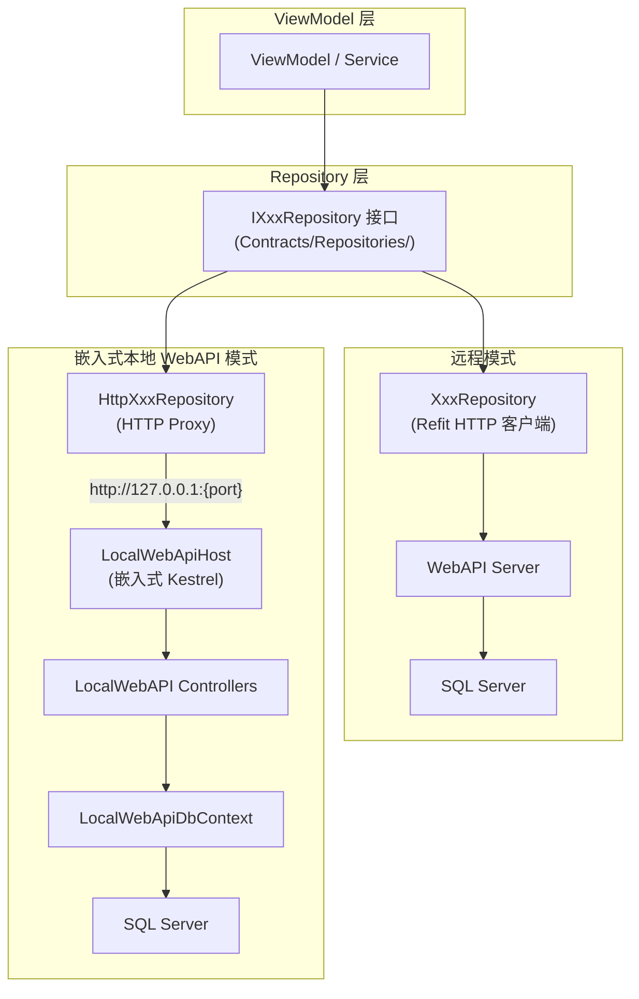
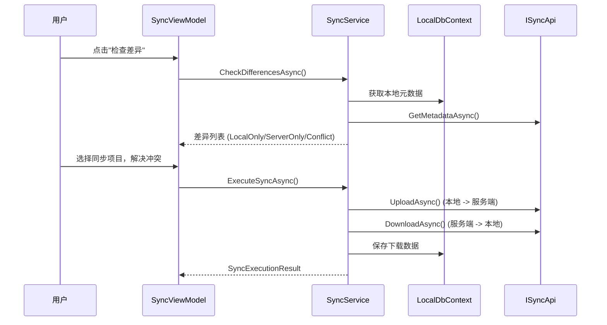

# 双模式架构

## 概述

系统支持远程模式 (Remote) 和本地模式 (LocalWebAPI) 两种运行模式。

| 模式 | 数据链路 | 数据库 | 适用场景 |
|------|----------|--------|----------|
| **Remote** | Refit HTTP → Server WebAPI | SQL Server (远程) | 多用户联网环境 |
| **LocalWebAPI** | HTTP → 嵌入式 Kestrel | SQL Server (本地) | 单用户离线 |

两种模式共享同一套 Repository 接口和 Service 层代码，仅数据访问链路不同。

## 架构图



## Repository 双实现

| 接口 | 远程实现 (Refit HTTP) | 本地实现 (HTTP Proxy) |
|------|----------------------|----------------------|
| IPatientRepository | PatientRepository | HttpPatientRepository |
| IHerbRepository | HerbRepository | HttpHerbRepository |
| IFormulaRepository | FormulaRepository | HttpFormulaRepository |
| IMedicalCaseRepository | MedicalCaseRepository | HttpMedicalCaseRepository |
| IUserRepository | UserRepository | HttpUserRepository |
| IRegistrationRepository | RegistrationRepository | HttpRegistrationRepository |

DI 注册在 `DataSourceRegistrationExtensions.cs` 中完成，根据配置选择对应的 Repository 实现。

## 本地模式功能覆盖率

| 模块 | 远程端点 (Remote) | 本地端点 (LocalWebAPI) | 覆盖率 |
|------|-----------------|----------------------|-------|
| Auth | 5 | 5 | 100% |
| Users | 14 | 14 | 100% |
| Patients | 11 | 11 | 100% |
| Herbs | 17 | 17 | 100% |
| Formulas | 15 | 15 | 100% |
| MedicalCases | 19 | 19 | 100% |
| Registrations | 7 | 7 | 100% |
| Sync | 6 | 6 | 100% |
| Diagnostics | 4 | 4 | 100% |
| Configuration | 1 | 1 | 100% |
| Health | 3 | 3 | 100% |
| **总计** | **~102** | **~102** | **~100%** |

### 本地模式独有端点

部分端点仅在 LocalWebAPI 模式下可用，用于增强离线使用体验：

| 模块 | 端点 | 方法 | 说明 |
|------|------|------|------|
| Formulas | /api/formulas/{id}/clone | POST | 克隆验方（含药材组成） |
| Formulas | /api/formulas/categories | GET | 获取验方分类列表 |
| Patients | /api/patients/by-id-number/{idNumber} | GET | 按身份证号查询患者 |
| MedicalCases | /api/medicalcases/pending | GET | 获取待处理医案（无处方） |
| MedicalCases | /api/medicalcases/by-status/{status} | GET | 按状态查询医案 |
| Diagnostics | /api/diagnostics/db-info | GET | 数据库连接信息 |
| Diagnostics | /api/diagnostics/version | GET | 程序集版本信息 |
| Diagnostics | /api/diagnostics/logs/recent | GET | 最近日志 |

**设计说明**: 这些端点满足本地单用户场景下的便捷需求（如快速克隆验方、身份证号查询、系统诊断），不要求远程模式实现。

### 限制与排除 (TBD-01)

部分对服务端有强依赖的功能在本地模式下不可用，调用时返回 `501 Not Implemented` 或空结果：
- **Token 刷新**: 本地模式使用长效 Token (1年)，不支持 Refresh Token 轮换。
- **审计日志查询**: 本地暂不持久化系统级审计日志。
- **自动登录令牌同步**: 自动登录依赖远程中心化存储。
- **用户同步**: 用户数据不参与双向同步，仅手动维护。

---

## LocalWebAPI 架构

### 概述

LocalWebAPI 是在 WPF 桌面进程内嵌入的 ASP.NET Core Kestrel WebAPI 服务器。它使用 SQL Server 作为本地数据库，通过 HTTP 接口为桌面客户端提供数据访问能力。

**设计目标**:
- 统一数据访问层：远程/本地模式共用同一套 Repository 接口
- 简化部署：使用 SQL Server，与远程模式保持一致
- 降低维护成本：减少 LocalRepository 实现，改为 HTTP Proxy Repository

### 项目结构

```
src/Client/Desktop/LocalWebAPI/
├── LYBT.LocalWebAPI.csproj          # 项目文件 (Microsoft.NET.Sdk.Web, net8.0)
├── LocalWebApiProgram.cs            # WebAPI 入口 (CreateBuilder/CreateApplication/InitializeDatabaseAsync)
├── LocalWebApiHost.cs               # Kestrel 生命周期管理器 (StartAsync/StopAsync)
├── Auth/
│   └── LocalJwtConfig.cs            # JWT 认证配置 (HMAC-SHA256, 1年有效期)
├── Controllers/
│   ├── AuthController.cs            # 登录端点
│   ├── UsersController.cs           # 用户 CRUD
│   ├── PatientsController.cs        # 患者 CRUD
│   ├── HerbsController.cs           # 药材 CRUD
│   ├── FormulasController.cs        # 验方 CRUD
│   ├── RegistrationsController.cs   # 挂号 CRUD
│   ├── MedicalCasesController.cs    # 医案 CRUD
│   └── HealthController.cs          # 健康检查
├── Data/
│   ├── LocalWebApiDbContext.cs      # EF Core DbContext (SQL Server)
│   └── LocalWebApiSeedData.cs       # 种子数据初始化
└── Repositories/
    ├── HttpPatientRepository.cs     # HTTP Proxy Repository
    ├── HttpUserRepository.cs
    ├── HttpHerbRepository.cs
    ├── HttpFormulaRepository.cs
    ├── HttpRegistrationRepository.cs
    └── HttpMedicalCaseRepository.cs
```

### 核心组件

**LocalWebApiHost** - Kestrel 生命周期管理器:
- `StartAsync()`: 创建数据库目录 → 构建 WebApplication → 配置动态端口 (port 0) → 初始化数据库 → 启动 Kestrel → 捕获实际端口
- `StopAsync()`: 取消令牌 → 等待运行任务完成 (5s 超时) → 释放资源
- 线程安全：使用 lock 防止并发 Start/Stop
- 幂等性：重复调用 StartAsync 不会重复启动

**LocalWebApiDbContext** - SQL Server 数据库上下文:
- 复用 Server 端的实体配置 (ApplyConfigurationsFromAssembly)
- 自动应用全局查询过滤器 (IsDeleted)
- 支持 SQL Server 数据类型和约束

**HTTP Proxy Repository** - 数据访问代理:
- 实现与 Remote 相同的 Repository 接口
- 通过 HttpClient 调用 LocalWebAPI 端点
- 使用 System.Text.Json 序列化/反序列化 (PascalCase)
- 不支持的端点返回 null 并记录警告日志

### 动态端口发现

LocalWebAPI 使用端口 0 (OS 自动分配可用端口)，启动后通过 `IServerAddressesFeature` 获取实际绑定端口：

```csharp
var addressFeature = _app.ServerFeatures.Get<IServerAddressesFeature>();
var first = addressFeature.Addresses.First();
Port = new Uri(first).Port;
```

HTTP Proxy Repository 通过 `LocalWebApiHost.Port` 动态构建 BaseAddress。

### 认证简化

LocalWebAPI 使用简化的 JWT 认证：
- HMAC-SHA256 签名密钥 (固定 secret)
- Token 有效期 1 年 (无需刷新)
- 无外部认证提供者
- 无 Refresh Token 轮换

---

## 同步架构

### 同步流程



### SyncService 核心操作

| 操作 | 说明 |
|------|------|
| CheckDifferencesAsync | 比对本地与服务端元数据，分类为 LocalOnly/ServerOnly/Conflict |
| UploadAsync | 序列化本地实体为 JSON，上传到服务端 |
| DownloadAsync | 从服务端下载实体 JSON，存入本地数据库 |
| ExecuteSyncAsync | 完整同步流程: 处理上传列表 + 下载列表 + 冲突解决 |

### 同步依赖顺序

| 顺序 | 下载 (Server->Local) | 上传 (Local->Server) | 原因 |
|------|---------------------|---------------------|------|
| 1 | Herb | Herb | Formula 子项引用 HerbId |
| 2 | Patient | Patient | MedicalCase 引用 PatientId |
| 3 | Formula | Formula | 依赖 Herb 已存在 |
| (未实现) | MedicalCase | MedicalCase | 聚合级，依赖 Patient + Herb |

### 支持同步的实体类型

| 实体 | 同步支持 |
|------|----------|
| Herb | 支持 |
| Patient | 支持 |
| Formula | 支持 (含 FormulaHerbItems) |
| MedicalCase | 仅同步 Completed 状态 (SYNC-D01)。聚合级原子同步 |
| User | v1.0 不支持 |

### 冲突解决

| 实体类型 | 策略 | 说明 |
|---------|------|------|
| Herb / Patient / Formula | Server Wins | 自动覆盖 |
| MedicalCase | 手动选择 | 保留冲突对比 UI |

---

## 架构决策记录

| 编号 | 决策 | 状态 | 说明 |
|------|------|------|------|
| SYNC-D01 | MedicalCase 同步范围 | 已确认 | 仅同步 Completed 状态 |
| SYNC-D02 | 统一本地/远程数据路径 | **已实施** | 废除 DataSource 抽象层，使用 Repository 双实现 |
| SYNC-D03 | 运行时模式切换 | **已移除** | 早期实现运行时切换，后因架构简化移除 |
| SYNC-D04 | 冲突解决策略 | 已确认 | 简单实体 Server Wins; MedicalCase 手动选择 |
| LOCALWEB-01 | 使用 SQL Server 作为本地数据库 | 已实施 | 与远程模式保持一致，简化数据同步 |
| LOCALWEB-02 | 嵌入 Kestrel 在 WPF 进程内 | 已实施 | 避免独立进程管理复杂度 |
| LOCALWEB-03 | 简化 JWT 认证 (无刷新) | 已实施 | 本地模式无需复杂认证流 |
| LOCALWEB-04 | HTTP Proxy Repository 模式 | 已实施 | 统一 Repository 接口 |
| TBD-01 | 本地模式功能受限范围 | 已确定 | 不可用项: 自动登录/Token刷新/审计日志查询/User同步/服务端API导入导出 |

## 变更记录

| 日期 | 版本 | 变更内容 |
|------|------|----------|
| 2026-02-10 | v1.0 | 初始版本 |
| 2026-02-22 | v2.0 | 架构演进: 新增 SYNC-D01~D04 决策 |
| 2026-03-08 | v2.1 | LocalDB 迁移: SQLite -> SQL Server |
| 2026-03-09 | v2.2 | v1.0-rc 状态同步 |
| 2026-03-09 | v3.0 | **Sprint 6 完成**: SYNC-D02 DataSource 废除 + SYNC-D03 运行时切换已实施 |
| 2026-07-01 | v4.0 | **LocalWebAPI 覆盖率提升**: 覆盖率从 ~78% 提升至 ~100% |
| 2026-05-01 | v5.0 | **架构简化**: 移除运行时模式切换 (ConnectionMode)、移除遗留 Local 仓储、统一为 Remote + LocalWebAPI 双模式 |
