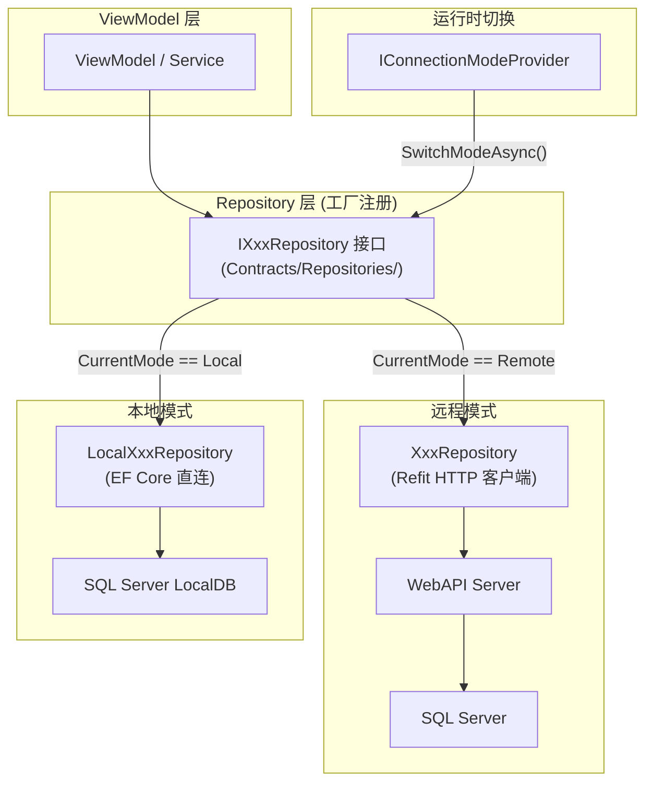
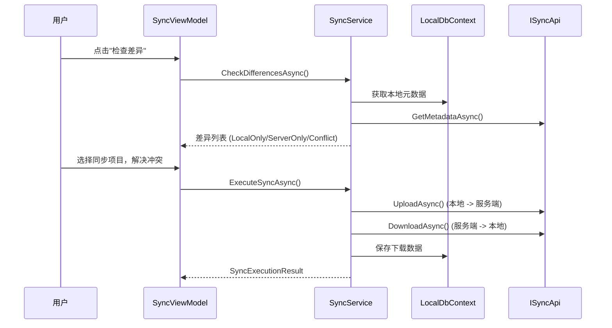

# 双模式架构

## 概述

系统支持远程模式 (Remote) 和本地模式 (Local) 两种运行模式，支持运行时切换 (无需重启应用)。远程模式通过 HTTP API 连接 SQL Server 数据库，本地模式使用 SQL Server LocalDB 本地数据库。

**当前架构 (Sprint 6 已实施)**: DataSource 抽象层已废除 (SYNC-D02)，改为 Factory + Dual Repository 模式。运行时模式切换已实现 (SYNC-D03)。

## 架构图



## 核心机制

### IConnectionModeProvider

运行时模式管理核心接口，位于 `Contracts/Services/IConnectionModeProvider.cs`:

| 成员 | 说明 |
|------|------|
| `CurrentMode` | 当前连接模式 (Remote/Local) |
| `IsLocalMode` | 是否本地模式 |
| `SwitchModeAsync(mode, ct)` | 运行时切换模式 |
| `IsSwitching` | 是否正在切换中 |
| `ModeChanged` | 模式变更事件 |

### 工厂注册 (DI)

`DataSourceRegistrationExtensions.cs` 使用工厂模式注册 Repository:

- 两套基础设施 (LocalDbContext + HTTP Client) **始终注册**
- 6 个 Repository 以工厂方式注册: resolve 时根据 `IConnectionModeProvider.CurrentMode` 选择远程或本地实现
- Singleton 服务不直接注入 Repository，避免模式切换后持有旧实例

### Repository 双实现

| 接口 | 远程实现 (Refit HTTP) | 本地实现 (EF Core) |
|------|----------------------|-------------------|
| IPatientRepository | PatientRepository | LocalPatientRepository |
| IHerbRepository | HerbRepository | LocalHerbRepository |
| IFormulaRepository | FormulaRepository | LocalFormulaRepository |
| IMedicalCaseRepository | MedicalCaseRepository | LocalMedicalCaseRepository |
| IUserRepository | UserRepository | LocalUserRepository |
| IRegistrationRepository | RegistrationRepository | LocalRegistrationRepository |

- 远程实现位于各模块 `Repositories/` 目录，依赖 Refit API 客户端
- 本地实现位于 `LYBT.Desktop.LocalData/Repositories/`，依赖 LocalDbContext

### 运行时切换流程 (SYNC-D03)

`ConnectionModeProvider.SwitchModeAsync()` 五步流程:

1. **ActiveConsultation 检查** -- 如有活跃医案，阻断切换
2. **ModeSwitchValidator 验证** -- 检查未完成医案 + LocalDB 可用性
3. **Region 清理** -- 清除 Prism Region 内容 + 导航历史
4. **切换模式** -- 更新 `CurrentMode`，触发 `ModeChanged` 事件
5. **导航首页** -- 回到初始界面

UI 实现:
- `SidebarControl` 模式切换按钮 (swap_horiz 图标)
- `MainWindow` 半透明遮罩层 (IsSwitchingMode 绑定)
- 切换前显示确认对话框

### 模式对比

| 维度 | 远程模式 (Remote) | 本地模式 (Local) |
|------|-------------------|------------------|
| **数据库** | SQL Server (远程) | SQL Server LocalDB (本地) |
| **数据链路** | ViewModel -> Repository -> Refit HTTP -> Server -> SQL Server | ViewModel -> LocalRepository -> LocalDbContext -> LocalDB |
| **认证方式** | JWT Token (服务端验证) | LocalAuthService (BCrypt 本地验证) |
| **多用户** | 支持 (服务端管理) | 单用户 |
| **数据同步** | 不需要 | SyncService (双向同步) |
| **离线支持** | 不支持 | 完全离线 |
| **切换方式** | 运行时 SidebarControl 切换按钮 | 运行时 SidebarControl 切换按钮 |

## 相关架构决策 (SYNC-D01~D04)

| 编号 | 决策 | 状态 | 说明 |
|------|------|------|------|
| **SYNC-D01** | 仅同步 Completed 医案 | 已确认 | Draft/Suspended 状态不同步到服务器 |
| **SYNC-D02** | 统一本地/远程数据路径 | **已实施 (Sprint 6)** | 废除 DataSource 抽象层，改为 Factory + Dual Repository |
| **SYNC-D03** | 运行时切换 + 软重启 | **已实施 (Sprint 6)** | IConnectionModeProvider 五步切换，SidebarControl UI |
| **SYNC-D04** | 分层冲突策略 | 已确认 | 简单实体 Server Wins; MedicalCase 手动选择 |

---

## 本地数据访问层 (LocalData)

### LocalDbContext

SQL Server LocalDB 实现的 EF Core DbContext:

- 管理全部实体 DbSet: Patients, Users, Herbs, Formulas, MedicalCases, Consultations, Prescriptions
- 软删除全局查询过滤器 (IsDeleted = false)
- SQL Server 原生支持 RowVersion、decimal，无需适配代码
- 自动审计字段管理 (CreatedAt, UpdatedAt, CreatedBy)

### 本地认证

`LocalAuthService` 提供本地模式认证:
- BCrypt 密码验证
- 账户锁定: 5 次失败后锁定 15 分钟
- 禁用账户检查
- LastLoginTime 追踪

### 数据库初始化

`DatabaseInitializer`:
- 使用 SQL Server LocalDB，EnsureCreatedAsync 自动创建数据库
- 连接字符串配置: `appsettings.json` 的 `LocalConnectionString` (默认: `(localdb)\MSSQLLocalDB`)
- 加载种子数据 (SeedData)

### 配置

```json
// appsettings.json
{
  "ConnectionMode": "Remote"
}
```

启动时从 `IConfiguration["ConnectionMode"]` 读取初始模式，默认 Remote。运行时可通过 UI 切换。

## 同步架构

### 同步流程



### SyncService 核心操作

| 操作 | 说明 |
|------|------|
| CheckDifferencesAsync | 比对本地与服务端元数据，分类为 LocalOnly/ServerOnly/Conflict |
| UploadAsync | 序列化本地实体为 JSON，上传到服务端 |
| DownloadAsync | 从服务端下载实体 JSON，存入本地数据库 |
| ExecuteSyncAsync | 完整同步流程: 处理上传列表 + 下载列表 + 冲突解决 |

### 端到端调用链

```
Desktop SyncViewModel
  -> ISyncService (Desktop Contracts, LYBT.Desktop.Contracts.Services)
    -> SyncService (LocalData 实现, LYBT.Desktop.LocalData.Services)
      -> LocalDbContext (本地元数据读写)
      -> ISyncApi (Refit HTTP, LYBT.Desktop.Contracts.Api)
        -> SyncController (Server WebAPI, /api/v1/sync)
          -> ISyncService (Module.Sync 接口, LYBT.Module.Sync.Interfaces)
            -> SyncService (Module.Sync 实现, LYBT.Module.Sync.Services)
              -> AppDbContext (服务器数据库)
              -> IHerbCrossModuleService (删除前引用检查)
              -> IPatientCrossModuleService (删除前引用检查)
```

### 同步依赖顺序

| 顺序 | 下载 (Server->Local) | 上传 (Local->Server) | 原因 |
|------|---------------------|---------------------|------|
| 1 | Herb | Herb | Formula 子项引用 HerbId |
| 2 | Patient | Patient | MedicalCase 引用 PatientId |
| 3 | Formula | Formula | 依赖 Herb 已存在 |
| (未实现) | MedicalCase | MedicalCase | 聚合级，依赖 Patient + Herb |

### 支持同步的实体类型

| 实体 | 同步支持 |
|------|----------|
| Herb | 支持 |
| Patient | 支持 |
| Formula | 支持 (含 FormulaHerbItems) |
| MedicalCase | 仅同步 Completed 状态 (SYNC-D01)。聚合级原子同步 |
| User | v1.0 不支持 |

### 冲突解决

| 实体类型 | 策略 | 说明 |
|---------|------|------|
| Herb / Patient / Formula | Server Wins | 自动覆盖 |
| MedicalCase | 手动选择 | 保留冲突对比 UI |

## 决策记录

| 编号 | 问题 | 状态 | 说明 |
|------|------|------|------|
| SYNC-D01 | MedicalCase 同步范围 | 已确认 | 仅同步 Completed 状态 |
| SYNC-D02 | 统一本地/远程数据路径 | **已实施** | Sprint 6 废除 DataSource，改为 Factory + Dual Repository |
| SYNC-D03 | 运行时模式切换 | **已实施** | Sprint 6 实现 IConnectionModeProvider 五步切换 |
| SYNC-D04 | 冲突解决策略 | 已确认 | 简单实体 Server Wins; MedicalCase 手动选择 |
| TBD-01 | 本地模式功能受限范围 | 已确定 | 不可用项: 自动登录/Token刷新/审计日志查询/User同步/服务端API导入导出 |

## 变更记录

| 日期 | 版本 | 变更内容 |
|------|------|----------|
| 2026-02-10 | v1.0 | 初始版本 |
| 2026-02-22 | v2.0 | 架构演进: 新增 SYNC-D01~D04 决策 |
| 2026-03-08 | v2.1 | LocalDB 迁移: SQLite -> SQL Server LocalDB |
| 2026-03-09 | v2.2 | v1.0-rc 状态同步 |
| 2026-03-09 | v3.0 | **Sprint 6 完成**: SYNC-D02 DataSource 废除 + SYNC-D03 运行时切换已实施。删除过渡态章节，更新为当前架构 |
