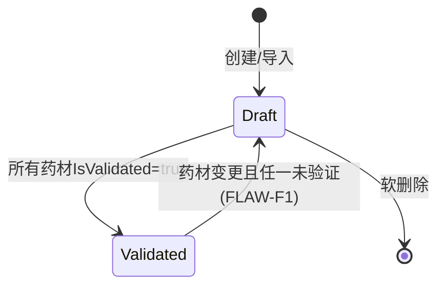

# Formulas 模块设计

> v1.0 | 2026-06-28

## 模块概述

Formulas 管理中医经验方：CRUD、验证状态机(Draft↔Validated)、药材延迟绑定、共享机制。

**职责边界**：验方全生命周期（创建→验证→共享→编辑→删除）

## 接口契约

| 端点 | Service | 权限 | 关键功能 |
|------|---------|------|----------|
| GET /formulas | GetPagedAsync | DoctorOrAdmin | 分页查询 |
| GET /formulas/{id} | GetByIdAsync | DoctorOrAdmin | 验方详情 |
| POST /formulas | CreateAsync | Doctor(仅自己) | Draft初始状态 |
| PUT /formulas/{id} | UpdateAsync | Doctor(仅自己) | 状态重新评估 |
| DELETE /formulas/{id} | SoftDeleteAsync | Doctor(仅自己) | |
| POST /formulas/pending | GetPendingValidationAsync | Doctor | 待验证列表 |
| POST /formulas/{fid}/herbs/{hid}/validate | ValidateHerbAsync | Doctor | 药材验证绑定 |

## 状态机

## 关键业务规则

| 规则 | 约束 | US |
|------|------|-----|
| FLAW-F1 | 药材增删改触发状态重评估 | US-FORM-010 |
| 延迟绑定 | 导入时药材名称可暂不关联系统药材库 | US-FORM-006 |
| 共享机制 | 验方可在医生间共享(Validated状态) | US-FORM-004 |
| 归属检查 | Doctor仅操作自己创建的验方 | US-FORM-003 |

## 异常处理

| 场景 | 异常 | HTTP |
|------|------|:---:|
| 药材验证失败 | BusinessException(400) | 400 |
| 归属越权 | ForbiddenException(403) | 403 |
