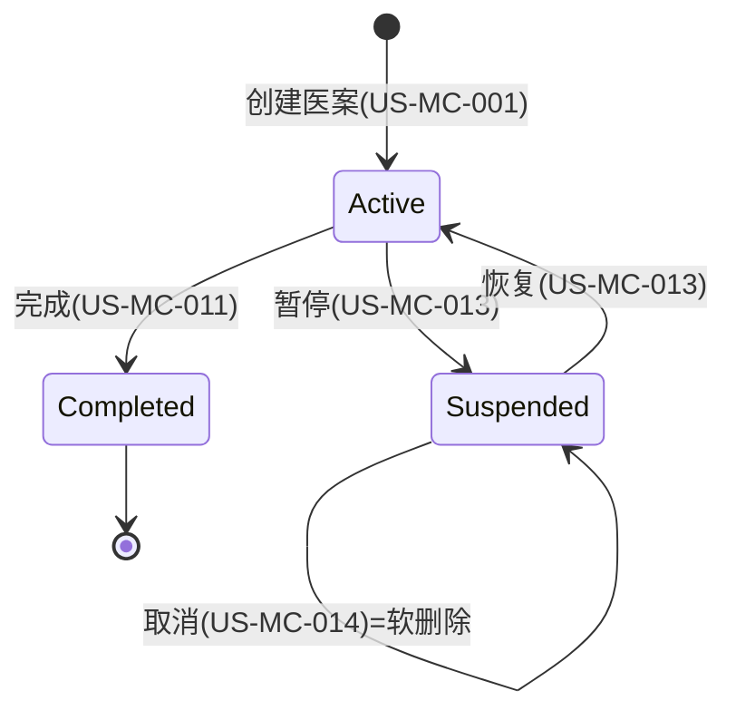

# MedicalCase 模块设计

> v1.0 | 2026-06-28

## 模块概述

MedicalCase 是系统唯一的 DDD 聚合根，承载诊疗流程核心：医案管理、诊断(Consultation)、处方(Prescription)。采用 CQRS 模式拆分读写操作。

**职责边界**：医案全生命周期管理（创建→诊断→开方→打印→完成/暂停/取消）

**依赖关系**：
- 上游：Registration（挂号→就诊触发）、Auth（JWT 认证）
- 下游：Patients（患者查询）、Herbs（药材引用）、Formulas（验方导入）、Printing（处方打印）、Reports（历史聚合）

## 接口契约

### Service 接口

| 接口 | 职责 | 关键方法 |
|------|------|----------|
| `IMedicalCaseCommandService` | 写操作 | CreateAsync, SaveAsync, CreatePrescriptionAsync |
| `IMedicalCaseQueryService` | 读操作 | GetByIdAsync, GetPagedAsync, SearchAsync |
| `IMedicalCaseStateService` | 状态流转 | CompleteAsync, SuspendAsync, CancelAsync, UpdateStatusAsync |
| `IMedicalCasePermissionService` | 权限控制 | CanEdit, CanDelete, GetPermissions |
| `IMedicalCaseAuditService` | 审计日志 | LogAsync, DetectChanges（🧲 v1.0 待实现 D1） |

### API 端点映射

| 端点 | Service 方法 | 权限 |
|------|-------------|------|
| POST /medicalcases | CreateAsync | Doctor only |
| PUT /medicalcases/{id} | SaveAsync (聚合保存) | Doctor(自己的) |
| PUT /medicalcases/{id}/status | UpdateStatusAsync | Doctor(自己的) |
| PUT /medicalcases/{id}/suspend | SuspendAsync | Doctor(自己的) |
| PUT /medicalcases/{id}/cancel | CancelAsync | Doctor(自己的) |
| DELETE /medicalcases/{id} | SoftDeleteAsync | Doctor(自己的) |
| GET /medicalcases | GetPagedAsync | Doctor(自己的)/Admin(全部) |
| GET /medicalcases/{id} | GetByIdAsync | Doctor(自己的)/Admin(全部) |

## 状态机



**约束**：同一患者同一时间只能有 1 个 Active/Suspended 医案（BR-001，筛选唯一索引）。

## 数据流

### 远程模式首诊流程
```
1. Receptionist -> Registration.Create (挂号)
2. SignalR -> Doctor 工作台 (推送通知)
3. Doctor -> Registration.StartVisit (原子创建 MC+Reg)
4. Doctor -> MedicalCase.Save (望闻问切)
5. Doctor -> MedicalCase.Save (开方)
6. Doctor -> MedicalCase.Complete (完成)
7. Doctor -> PrintService (打印)
8. Doctor -> PrintCompleted (回写)
```

### 本地模式直接看诊
```
1. Doctor -> Patient.Create/Select (选/建患者)
2. Doctor -> MedicalCase.Create (直接开医案，无挂号)
3. Doctor -> MedicalCase.Save (诊断)
4. Doctor -> MedicalCase.Save (开方)
5. Doctor -> MedicalCase.Complete
6. Doctor -> PrintService
```

## 异常处理

| 场景 | 异常类型 | HTTP | 处理 | 实现状态 |
|------|----------|:---:|------|:---:|
| BR-001 违反(单活跃) | ConflictException | 409 | 提示用户选择现有医案 | ✅ |
| BR-003 必填校验 | ValidationException | 400 | 返回字段级错误 | ✅ |
| 并发冲突 | ConflictException | 409 | RowVersion 乐观锁 | ✅ |
| 打印后编辑(需 EditReason) | BusinessException | 400 | 要求提供编辑原因 | ✅ |
| 审计日志写入失败 | AuditException | 500 | 业务操作正常完成，审计失败记录到独立日志 | 🧲 v1.0 待实现(D1) |
| SignalR 推送失败 | 无异常 | 200 | 操作成功但推送失败时静默降级，不影响业务 | ✅ |

**异常传播路径**：MedicalCase 操作异常遵循 `06-error-handling.md` 规范——Service 层抛出 `AppException` 子类 → `BusinessExceptionHandler` 捕获 → 转换为 `ApiResponse` (Warning 日志) → 返回标准错误响应。

## 业务规则

| 规则 | 约束 | US |
|------|------|-----|
| BR-001 | 同一患者同一时间 1 个 Active/Suspended | US-MC-010 |
| BR-003 | Consultation 5 字段必填(主诉/病史/舌诊/脉诊/辨证) | US-MC-002 |
| 打印保护 | IsPrinted=true 时修改需 EditReason | US-PRINT-004 |
| 聚合保存 | Consultation+Prescription 原子写入 | US-MC-002 |
| 历史聚合 | 跨医案查询(MC-008/009) | US-MC-008/009 |

## 模块交互

| 依赖模块 | 交互方式 | 场景 |
|----------|----------|------|
| Registration | IPatientService | 挂号→就诊触发创建 |
| Patients | IPatientCrossModuleService | 患者基本信息查询 |
| Herbs | IHerbCrossModuleService | 药材引用检查 |
| Formulas | IFormulaService | 验方导入 |
| Printing | PrescriptionPrintService | 处方打印 |
| Reports | IReportsService | 历史聚合查询 |
| Auth | GetOperator() | 操作员审计 |
