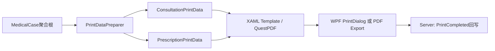

# Printing 模块设计

> v1.0 | 2026-06-28

## 模块概述

Printing 提供处方打印能力：双引擎渲染(WPF FixedDocument + QuestPDF PDF导出)、4套模板(A5/A4×首页/续页)、打印保护状态管理。

**职责边界**：处方打印全链路（模板渲染→打印预览→PDF导出→打印回写）

## 渲染管线

## 关键业务规则

| 规则 | 约束 | US |
|------|------|-----|
| 打印保护 | IsPrinted=true时修改需EditReason | US-PRINT-004 |
| 版本控制 | 每次打印PrintVersion++ | US-PRINT-004 |
| 模板选择 | A5/A4可选 | US-PRINT-001 |
| PDF导出 | QuestPDF生成 | US-PRINT-003 |
| 打印回写 | 打印完成后更新服务端IsPrinted/PrintCount/LastPrintedAt | US-PRINT-004 |
