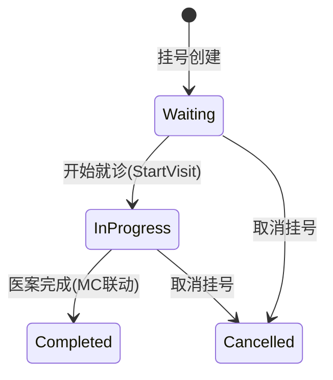

# Registration 模块设计

> v1.0 | 2026-06-28

## 模块概述

Registration 管理患者挂号、候诊队列、就诊接诊。支持双模式（远程/本地）+ SignalR 实时推送（远程）+ QuickVisit 急诊通道。

**职责边界**：挂号全生命周期（创建→排队→接诊→完成/取消）

**依赖关系**：
- 上游：Auth（JWT）、Patients（患者查询）
- 下游：MedicalCase（触发创建）、SignalR（推送通知）

## 接口契约

### Service 接口

| 接口 | 关键方法 |
|------|----------|
| `IRegistrationService` | CreateAsync, StartVisitAsync, CancelAsync, GetQueueAsync, QuickVisitAsync |

### API 端点映射

| 端点 | Service 方法 | 权限 | 模式 |
|------|-------------|------|------|
| POST /registrations | CreateAsync | DoctorOrReceptionist | 远程 |
| POST /registrations/quick-visit | QuickVisitAsync | Doctor only | 远程+本地 |
| GET /registrations/{id} | GetByIdAsync | DoctorOrReceptionist | 远程+本地 |
| GET /registrations | GetPagedAsync | DoctorOrReceptionist | 远程+本地 |
| GET /registrations/queue | GetQueueAsync | DoctorOrReceptionist | 远程(有推送)+本地(轮询) |
| PUT /registrations/{id}/start | StartVisitAsync | DoctorOrReceptionist | 远程+本地 |
| PUT /registrations/{id}/cancel | CancelAsync | DoctorOrReceptionist | 远程+本地 |

## 状态机



## 双模式工作流

### 远程模式
```
1. Receptionist.Create → Waiting → SignalR推送 → Doctor工作台
2. Doctor.StartVisit → 原子创建 MedicalCase(Active)+Registration(InProgress) → 医案编辑
3. 医案完成/取消 → Registration自动回写状态
```

### 本地模式
- **默认无前台用户**：医生直接 QuickVisit（跳过 Registration）
- **有前台用户**：前台挂号→医生从队列选患者→StartVisit
- **无 SignalR**：队列刷新靠轮询(US-REG-004)

## 异常处理

| 场景 | 异常 | HTTP | 修复状态 |
|------|------|:---:|:---:|
| StartVisit 不创建医案 | 待修复：原子事务创建 MC(Active)+Reg(InProgress)+返回 MedicalCaseId | - | ⚠️ D8 代码待修 |
| 挂号冲突 | ConflictException | 409 | ✅ |
| QuickVisit 权限 | ForbiddenException | 403 | ✅ |
| 本地模式队列轮询 | 无异常，GetQueue 返回空列表 | 200 | ✅ |

**D8 修复方向**（待代码实施）：`StartVisitAsync` 改为原子事务——先创建 `MedicalCase(Active)`，再更新 `Registration.Status=InProgress`，返回 `MedicalCaseId`（非 RegistrationId）。依赖 BR-001 单活跃约束校验。

**QuickVisit 现状**：`RegistrationsController.QuickVisitAsync`(line 44-94) 已有完整实现（原子创建 Registration+MedicalCase），仅 Desktop 端接线未完成。API 层非死代码，需在 Desktop 层激活调用。

## 业务规则

| 规则 | 约束 | US |
|------|------|-----|
| 原子创建 | StartVisit 原子创建 Registration(InProgress)+MedicalCase(Active) | US-REG-005 |
| 医案联动 | MC Complete/Cancel → Registration 自动回写 | US-REG-007 |
| QuickVisit | 医生直接挂号+看诊(原子操作) | US-REG-002 |
| SignalR | 远程模式新挂号→推送(仅远程) | US-REG-008 |

## 模块交互

| 模块 | 方式 | 场景 |
|------|------|------|
| MedicalCase | CreateMedicalCase | StartVisit 触发医案创建 |
| Auth | GetOperator() | 操作员记录 |
| Patients | 查询患者 | 挂号时查询 |
| SignalR Hub | PublishAsync | 新挂号/状态变更推送 |
