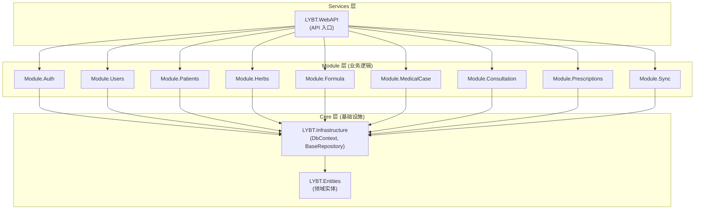
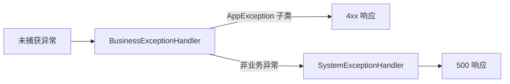

# 服务端架构

## 概述

Server 层采用经典三层架构: Controller -> Service -> Repository -> DbContext。共 13 个项目，分为 Core (基础设施)、Modules (业务逻辑)、Services (API 入口) 三组。简单模块使用传统三层模式，复杂模块 (MedicalCase) 使用 CQRS 模式。

## 架构图



## Core 层

### LYBT.Entities

领域实体定义，采用贫血模型 (无业务逻辑)。

**职责**:
- 定义所有领域实体 (继承 `BaseEntity`)
- 定义领域枚举和值对象
- 无外部依赖，仅引用 .NET BCL

**目录结构**:
```
LYBT.Entities/
  Auth/              # AuthSession, RefreshToken
  Consultations/     # Consultation
  Formulas/          # Formula, FormulaHerbItem
  Herbs/             # Herb
  MedicalCases/      # MedicalCase
  Patients/          # Patient
  Prescriptions/     # Prescription, PrescriptionItem, PrescriptionPrintLog
  Users/             # User, UserRole 枚举
  Common/            # BaseEntity, 通用枚举
```

**BaseEntity 通用字段**:

| 字段 | 类型 | 说明 |
|------|------|------|
| Id | Guid | 主键 |
| CreatedAt | DateTime | 创建时间 (UTC) |
| UpdatedAt | DateTime | 更新时间 (UTC) |
| CreatedBy | Guid? | 创建人 |
| IsDeleted | bool | 软删除标记 |

### LYBT.Infrastructure

基础设施层，提供数据访问和跨模块服务。

**职责**:
- `AppDbContext` -- EF Core 数据库上下文
- `BaseRepository<T>` -- Repository 基类 (14 个标准方法)
- `BaseReadRepository<T>` -- 只读 Repository 基类
- `ICrossModuleQueryService` -- 跨模块查询服务
- `IRepository<T>` / `IReadRepository<T>` -- Repository 接口定义
- EF Core 实体配置 (Fluent API)
- 数据库迁移文件

**目录结构**:
```
LYBT.Infrastructure/
  Data/
    AppDbContext.cs
    Configurations/          # EF Core Fluent API 配置
      Base/                  # BaseEntityConfiguration
      PatientConfiguration.cs
      ...
  Interfaces/
    IRepository.cs
    IReadRepository.cs
  Repositories/
    BaseRepository.cs        # 标准 CRUD + 分页
    BaseReadRepository.cs    # 只读查询
  Services/
    ICrossModuleQueryService.cs
    CrossModuleQueryService.cs
  DependencyInjection/       # DI 扩展方法
  Logging/                   # 日志相关
  Migrations/                # EF Core 迁移
  Validation/                # 验证工具
  Web/
    BaseApiController.cs     # Controller 基类
    ApiErrorCodes.cs         # 错误码定义
```

**BaseRepository 标准方法**:

| 方法 | 说明 |
|------|------|
| `GetByIdAsync(id)` | 按 ID 查询 |
| `GetPagedAsync(page, size, keyword)` | 分页查询 (模板方法) |
| `GetAllAsync()` | 查询全部 |
| `CreateAsync(entity)` | 创建 |
| `UpdateAsync(entity)` | 更新 |
| `DeleteAsync(id)` | 软删除 |
| `HardDeleteAsync(id)` | 物理删除 |
| `RestoreAsync(id)` | 恢复软删除 |
| `ExistsAsync(id)` | 存在检查 |
| `CountAsync()` | 数量统计 |

**分页查询模板方法模式**:
子类通过覆盖 `ApplyKeywordFilter` 和 `ApplyDefaultOrdering` 提供定制逻辑，不重写 `GetPagedAsync` 本身。

## Module 层

### 标准目录结构

```
LYBT.Module.{Domain}/
  {Domain}Module.cs            # 模块注册入口
  Repositories/
    {Entity}Repository.cs      # Repository 实现
  Services/
    I{Entity}Service.cs        # Service 接口
    {Entity}Service.cs         # Service 实现
  Mapping/
    {Entity}Mapper.cs          # Mapperly 映射器
  Validators/                  # FluentValidation 验证器 (可选)
```

### 模块清单

| 模块 | 架构模式 | 跨模块通信 | 说明 |
|------|----------|------------|------|
| Auth | 传统三层 | IUserService | JWT 认证、Token 管理 |
| Users | 传统三层 | - | 用户 CRUD、密码管理 |
| Patients | 传统三层 | - | 患者 CRUD、导入导出 |
| Herbs | 传统三层 | - | 药材 CRUD、分类、导入 |
| Formula | 传统三层 | ICrossModuleQueryService | 验方 CRUD、药材绑定 |
| MedicalCase | CQRS | IPatientService | 医案核心，状态机管理 |
| Consultation | 传统三层 | - | 诊断数据 (只读 Repository) |
| Prescriptions | 传统三层 | ICrossModuleQueryService | 处方数据 |
| Sync | 传统三层 | - | 数据同步 |

### CQRS 模式 (MedicalCase)

MedicalCase 作为系统核心聚合根，业务复杂度高，采用 CQRS 拆分:

| Service | 职责 | 方法示例 |
|---------|------|----------|
| IMedicalCaseCommandService | 写操作 | Create, Update, Delete |
| IMedicalCaseQueryService | 读操作 | GetById, GetPaged, Search |
| IMedicalCaseStateService | 状态变更 | Submit, Archive, Revert |
| IMedicalCasePermissionService | 权限检查 | CanEdit, CanDelete |
| IMedicalCaseAuditService | 审计日志 | LogCreate, LogUpdate |

**适用标准**: 读写复杂度差异大、细粒度权限控制、完整审计日志、复杂状态流转。

### 传统三层模式 (其他模块)

标准 CRUD 模块使用单一 Service:

```
Controller -> I{Entity}Service -> {Entity}Repository -> DbContext
```

## Services 层 (WebAPI)

### 职责

- HTTP 请求处理和路由
- JWT 认证授权中间件
- 全局异常处理 (IExceptionHandler)
- Serilog 两阶段日志初始化
- 模块注册编排

### Controller 规范

```csharp
[ApiController]
[Route("api/[controller]")]
[Authorize]
public class PatientsController : BaseApiController
{
    private readonly IPatientService _service;

    public PatientsController(IPatientService service)
    {
        _service = service;
    }

    [HttpGet("{id:guid}")]
    public async Task<IActionResult> GetById(Guid id)
    {
        return Ok(await _service.GetByIdAsync(id));
    }
}
```

**规则**:
- Controller 注入 Service 接口，禁止注入 Repository 或 DbContext
- Controller 层零 catch 块，异常由 IExceptionHandler 统一处理
- 使用 `[Authorize]` 控制访问权限

### RESTful API 规范

```
GET    /api/{resource}           # 列表 (分页)
GET    /api/{resource}/{id}      # 详情
POST   /api/{resource}           # 创建
PUT    /api/{resource}/{id}      # 更新
DELETE /api/{resource}/{id}      # 删除
```

### 统一响应格式

**成功**:
```json
{
  "success": true,
  "data": { ... },
  "message": "操作成功"
}
```

**失败** (RFC 7807 Problem Details):
```json
{
  "type": "https://tools.ietf.org/html/rfc7807",
  "title": "验证失败",
  "status": 400,
  "detail": "患者姓名不能为空",
  "instance": "/api/patients",
  "correlationId": "xxx",
  "errorCode": 30001
}
```

## 依赖注入

### Server 端 DI 注册

```csharp
// Module 注册 (Scoped 生命周期)
services.AddScoped<IPatientService, PatientService>();
services.AddScoped<IPatientRepository, PatientRepository>();

// Mapperly 映射器 (Singleton，无状态)
services.AddSingleton<PatientMapper>();

// FluentValidation 验证器
services.AddScoped<IValidator<PatientInputDto>, PatientInputDtoValidator>();
```

**生命周期规范**:

| 类型 | 生命周期 | 说明 |
|------|----------|------|
| Repository | Scoped | 每请求一个实例，共享 DbContext |
| Service | Scoped | 每请求一个实例 |
| Mapper | Singleton | 编译时生成，无状态 |
| Validator | Scoped | 可能依赖 Scoped 服务 |

### 模块注册入口

每个 Module 提供 `{Domain}Module.cs`，在 `Program.cs` 中调用:

```csharp
// Program.cs
builder.Services.AddAuthModule(builder.Configuration);
builder.Services.AddUsersModule();
builder.Services.AddPatientsModule();
// ...
```

## 异常处理

### IExceptionHandler 处理器链



| 处理器 | 处理类型 | HTTP 状态码 | 日志级别 |
|--------|----------|-------------|----------|
| BusinessExceptionHandler | AppException 及子类 | 400/401/404/409 | Warning |
| SystemExceptionHandler | 所有其他异常 | 500 | Error (含堆栈) |

### 错误码体系

5 位数字格式: 模块 (2位) + 具体错误 (3位)

| 模块前缀 | 模块 |
|----------|------|
| 00xxx | 通用错误 |
| 10xxx | Auth |
| 20xxx | Users |
| 30xxx | Patients |
| 40xxx | MedicalCase |
| 50xxx | Consultation |
| 60xxx | Prescriptions |
| 70xxx | Herbs/Formula |

### 异常类型

| 异常 | HTTP | 说明 |
|------|------|------|
| ValidationException | 400 | 输入验证失败 |
| UnauthorizedException | 401 | 授权失败 |
| NotFoundException | 404 | 资源未找到 |
| ConflictException | 409 | 并发冲突 |
| AppException | 400 | 通用业务异常 |

## Service 层规范

### 返回值类型

所有 Service 方法统一返回 `Result<T>`:

```csharp
// 成功
return Result<PatientDto>.Success(dto);

// 失败
return Result<PatientDto>.Failure("患者不存在");
```

### 构造函数参数顺序

```
Repository -> Mapper -> Logger -> Validator -> 其他依赖
```

### 错误处理

- Service 层不捕获异常 (异常透传到 IExceptionHandler)
- 业务验证失败返回 `Result.Failure`，不抛异常
- 使用 `ExecuteAsync<T>()` 包装可能抛异常的操作
- 保留 fire-and-forget 场景的 catch (审计日志等非关键操作)

### FluentValidation 集成

Create/Update 方法在业务逻辑前调用验证:

```csharp
var validationResult = await _validator.ValidateAsync(dto);
if (!validationResult.IsValid)
    return Result<T>.Failure(validationResult.Errors);
```

### 大型 Service 拆分标准

超过 500 行的 Service 必须拆分为职责单一的子服务:
- Command (Create/Update/Delete)
- Query (Get/List/Search)
- State (状态变更)
- 删除原 Service，Controller 直接注入子服务

## 数据库约定

### 命名

- 表名: PascalCase 复数 (如 `MedicalCases`)
- 列名: PascalCase (如 `PatientId`)
- 外键: `{RelatedEntity}Id`

### EF Core 配置

- Fluent API 配置优先于 Data Annotations
- 配置类: `{Entity}Configuration : IEntityTypeConfiguration<Entity>`
- 全局查询过滤器: `IsDeleted == false`
- DateTime 统一使用 UTC

### 实体命名冲突处理

当实体类名与模块命名空间冲突时，使用 using 别名:

| 实体 | 冲突 | 别名 |
|------|------|------|
| Formula | LYBT.Module.Formula 命名空间 | `FormulaEntity` |
| Consultation | LYBT.Module.Consultation | `ConsultationEntity` |
| MedicalCase | LYBT.Module.MedicalCase | `MedicalCaseEntity` |

## 变更记录

| 日期 | 版本 | 变更内容 |
|------|------|----------|
| 2026-02-10 | v1.0 | 初始版本，从 server-layer-architecture/repository-patterns/service-conventions/error-handling specs 整合 |
