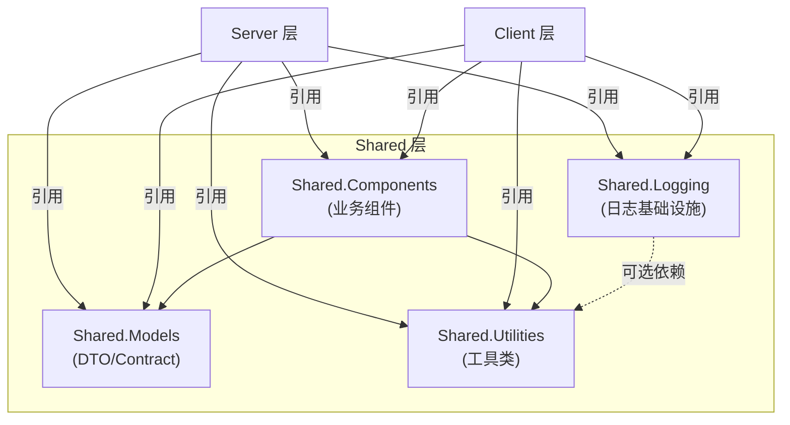

# 共享层架构

## 概述

Shared 层提供 Server 和 Client 两端共享的代码，包括 DTO 定义、工具类、业务组件和日志基础设施。Shared 层不依赖任何 Server 或 Client 项目，仅引用其他 Shared 项目和第三方 NuGet 包。

## 架构图



**依赖规则**:
- Shared 层项目可互相引用
- Server/Client 可引用 Shared
- Shared 禁止引用 Server 或 Client

## LYBT.Shared.Models (DTO 与 Contract)

### 职责

定义所有 API 契约 DTO、共享枚举、通用类型。是 Server/Client 之间的数据传输桥梁。

### 目录结构

```
LYBT.Shared.Models/
  Contracts/               # API 契约 DTO
    Auth/                  # 认证相关 DTO
    Patient/               # 患者 DTO
    MedicalCase/           # 医案 DTO
    Consultation/          # 诊断 DTO
    Prescription/          # 处方 DTO
    Herb/                  # 药材 DTO
    Formula/               # 验方 DTO
    User/                  # 用户 DTO
    Common/                # 跨模块 BasicDto
  Common/                  # 通用类型
    BaseDto.cs             # DTO 基类
    PagedRequest.cs        # 分页请求
    PagedResponse.cs       # 分页响应
    Result.cs              # 统一结果类型
  Enums/                   # 共享枚举
    Gender.cs
    MedicalCaseStatus.cs
    CommonStatus.cs
  Constants/               # 常量
    ErrorCodes.cs
```

### DTO 继承层次

```
BaseDto (Id: Guid)
  TimestampDto (CreatedAt, UpdatedAt)
    StatusDto (IsDeleted)
      AuditDto (CreatedBy, UpdatedBy)
```

| 基类 | 包含字段 | 适用场景 |
|------|----------|----------|
| BaseDto | Id | 仅需主键 |
| TimestampDto | + CreatedAt, UpdatedAt | 需要时间戳 |
| StatusDto | + IsDeleted | 需要软删除状态 |
| AuditDto | + CreatedBy, UpdatedBy | 需要审计信息 |

### DTO 命名规范

| 后缀 | 用途 | 示例 |
|------|------|------|
| `*Dto` | 列表/通用传输 | MedicalCaseDto |
| `*DetailDto` | 详情响应 | MedicalCaseDetailDto |
| `*InputDto` | 创建/更新输入 | PatientInputDto |
| `*CreateDto` | 创建请求 | PrescriptionCreateDto |
| `*Request` | 操作请求 | UpdateMedicalCaseRequest |
| `*BasicDto` | 跨模块轻量传输 | PatientBasicDto |

### 批量操作 DTO

| 命名 | 用途 |
|------|------|
| `{Entity}Batch{Op}InputDto` | 批量操作请求 |
| `{Entity}Batch{Op}ResultDto` | 批量操作响应 |
| `{Entity}ImportItemDto` | 导入单行 |
| `{Entity}ExportItemDto` | 导出单行 |
| `BatchIdsDto` | 通用 ID 列表 |
| `BatchOperationResultDto` | 通用批量结果 |

### DTO 字段选择标准

**ListDto**: 主键 + 名称 + 状态 + 关键业务字段。排除大文本、非必要审计字段。

**DetailDto**: Entity 的全部业务字段 + 状态 + 审计字段。

**BasicDto**: 仅 ICrossModuleService 所需的最少字段。

## LYBT.Shared.Utilities (工具类)

### 职责

提供无状态的通用工具方法，Server/Client 共享。

### 目录结构

```
LYBT.Shared.Utilities/
  Configuration/           # 配置辅助
    ConfigurationHelper.cs
  Security/                # 安全相关
    PasswordHasher.cs      # BCrypt 封装
    JwtHelper.cs           # JWT 辅助
  Text/                    # 文本处理
    PinYinConverter.cs     # 中文转拼音
    StringExtensions.cs    # 字符串扩展
  Helpers/                 # 通用辅助
    DateTimeHelper.cs
```

**约束**: 工具类必须无状态 (纯函数)，不引用任何 LYBT 项目。

## LYBT.Shared.Components (业务组件)

### 职责

提供可被 Server 和 Client 复用的业务逻辑组件。与 Utilities 不同，Components 包含业务逻辑。

### 目录结构

```
LYBT.Shared.Components/
  Interfaces/              # 组件接口
    IHerbItem.cs
  Calculators/             # 计算器
    HerbCalculatorBase.cs
    PrescriptionCalculator.cs
  Validators/              # 业务验证
    HerbValidatorBase.cs
  BusinessRules/           # 共享业务规则
    MedicalCaseBusinessRules.cs
```

### MedicalCaseBusinessRules (计划新增)

> 设计文档: [design-deepening-phase3](../plans/2026-02-22-design-deepening-phase3.md) | [design-issues-solutions](../plans/2026-02-21-design-issues-solutions.md) Issue #4

提取到 Shared 层的纯函数业务规则，供 Server 端和 Local 端共享，解决 Local 模式绕过业务规则的问题:

| 方法 | 用途 | 对应规则 |
|------|------|----------|
| `CanCreateNewCase(statuses)` | 检查患者是否可新建医案 | BR-001 (单活跃医案约束) |
| `HasActiveCase(statuses)` | 检查患者是否存在活跃医案 | BR-001 |
| `IsValidStatusTransition(from, to)` | 状态转换合法性验证 | FR-MC-006~008 状态机矩阵 |

**当前状态**: 待实施 (S5)。Server 端 `MedicalCaseRules` 将简化为 thin wrapper 委托给此类。

**约束**: 可引用 Shared.Models 和 Shared.Utilities，禁止引用 Server/Client。

## LYBT.Shared.Logging (日志基础设施)

### 职责

提供跨前后端的统一日志能力，基于 Serilog。

### 目录结构

```
LYBT.Shared.Logging/
  Abstractions/            # 接口定义
  Configuration/           # 配置类
  Enrichers/               # Serilog Enrichers
  Masking/                 # 敏感数据脱敏
  Management/              # 日志管理 (级别控制)
  Extensions/              # DI 扩展方法
```

## 验证规则一致性

### 三层验证体系

```
Entity (DataAnnotations)
  DTO (DataAnnotations)
    DetailModel (DataAnnotations)
      FluentValidator (Server 端)
```

**规则**:
- 三层使用相同的 `ValidationConstants` 常量
- 必填字段: Entity `[Required]` = DTO `[Required]` = FluentValidation `NotEmpty()`
- 可空字段: 使用 `if (value.HasValue && ...)` 模式，不要求必填
- 字符串长度: 统一引用 `ValidationConstants.NameMaxLength` 等常量

### ValidationConstants 位置

`LYBT.Shared.Primitives.Validation.ValidationConstants` -- 所有验证常量的唯一来源。

## 变更记录

| 日期 | 版本 | 变更内容 |
|------|------|----------|
| 2026-02-10 | v1.0 | 初始版本，从 shared-layer-architecture/dto-architecture specs 整合 |
| 2026-02-23 | v1.1 | 一致性审计: 新增 MedicalCaseBusinessRules 组件文档 (设计来源: design-deepening-phase3 + design-issues-solutions #4) |
