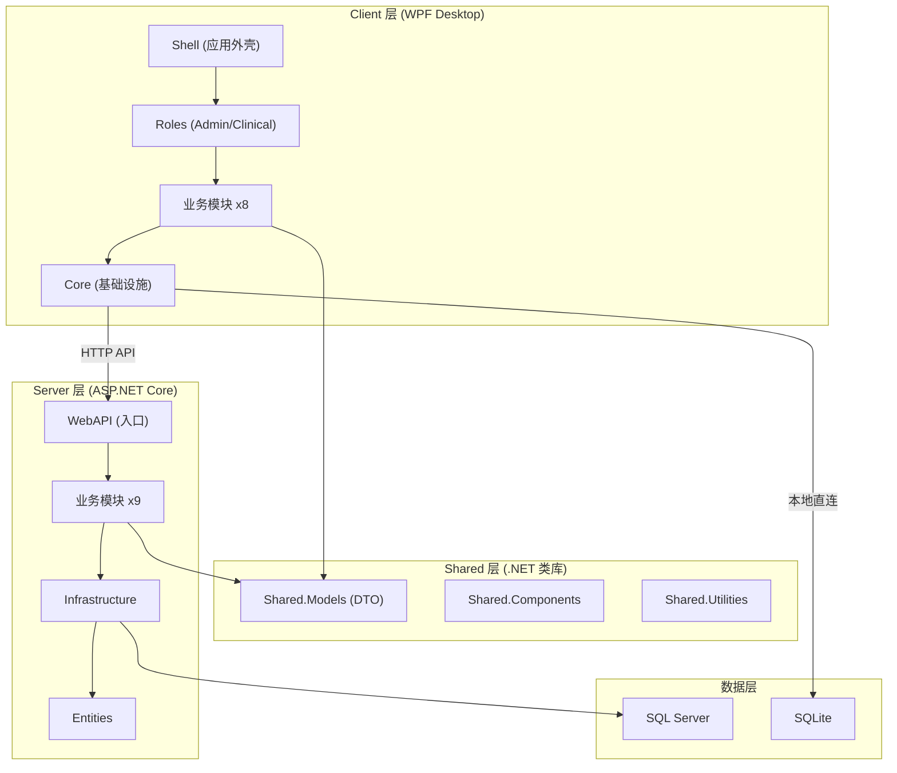
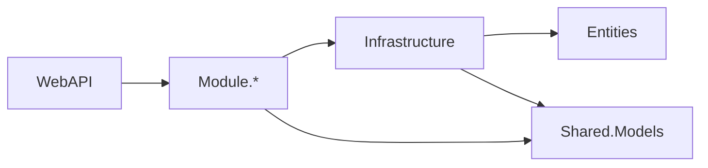
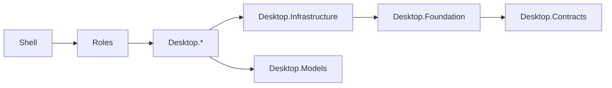
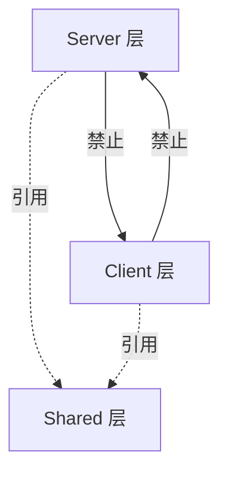
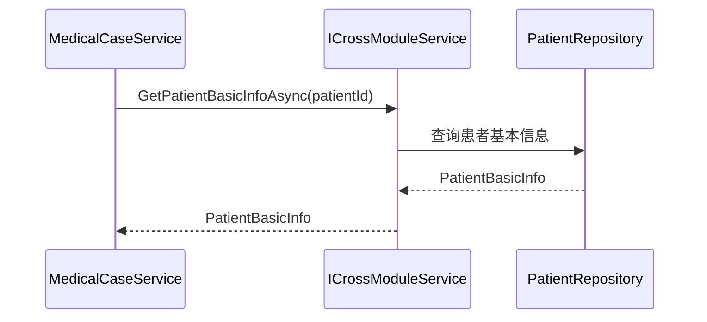

# 系统架构总览

## 概述

凌隐宝堂中医诊所管理系统采用 Server/Shared/Client 三层架构。Server 层提供 RESTful API 服务，Client 层为 WPF 桌面应用，Shared 层提供两端共享的 DTO、工具类和组件。系统支持远程 (SQL Server) 和本地 (SQLite) 双模式运行，两种模式共享 Service/Repository 层代码，仅 DbContext Provider 不同。详见 [dual-mode.md](dual-mode.md)。

## 系统架构图



## 解决方案结构

```
LYBTZYZS/
src/
  Client/Desktop/                    # WPF 桌面客户端
    Core/                            # 核心库 (8个项目)
      LYBT.Desktop.Contracts/        # 接口定义
      LYBT.Desktop.Foundation/       # 基础设施 (配置、网络、安全)
      LYBT.Desktop.Infrastructure/   # 通用服务、控件
      LYBT.Desktop.Models/           # 客户端模型
      LYBT.Desktop.Printing/         # 打印服务
      LYBT.Desktop.Utilities/        # 工具类库
      LYBT.Desktop.LocalData/        # 本地数据访问 (SQLite)
      LYBT.Desktop.CardReader/       # 身份证读卡器硬件集成
    Modules/                         # 业务模块 (8个)
      LYBT.Desktop.Auth/             # 认证
      LYBT.Desktop.Consultation/     # 诊断
      LYBT.Desktop.Formula/          # 验方
      LYBT.Desktop.Herbs/            # 药材
      LYBT.Desktop.MedicalCase/      # 医案 (含处方)
      LYBT.Desktop.Patients/         # 患者
      LYBT.Desktop.Sync/             # 数据同步
      LYBT.Desktop.Users/            # 用户
    Roles/                           # 角色入口
      LYBT.Desktop.Admin/            # 管理员端
      LYBT.Desktop.Clinical/         # 临床端
    Shell/
      LYBT.Desktop.Shell/            # 应用外壳

  Server/                            # 后端服务
    Core/                            # 核心层 (2个项目)
      LYBT.Entities/                 # 领域实体 (贫血模型)
      LYBT.Infrastructure/           # 基础设施 (DbContext, Repository基类)
    Modules/                         # 业务模块 (9个)
      LYBT.Module.Auth/
      LYBT.Module.Consultation/      # 空壳模块(已废弃，保留以兼容系统加载)
      LYBT.Module.Formula/
      LYBT.Module.Herbs/
      LYBT.Module.MedicalCase/
      LYBT.Module.Patients/
      LYBT.Module.Prescriptions/     # 空壳模块(已废弃，保留以兼容系统加载)
      LYBT.Module.Sync/
      LYBT.Module.Users/
    Services/
      LYBT.WebAPI/                   # Web API 入口

  Shared/                            # 共享库 (3个核心 + 5个工具)
    LYBT.Shared.Components/          # 共享UI组件
    LYBT.Shared.Models/              # DTO、Contract
    LYBT.Shared.Utilities/           # 工具类
    LYBT.Shared.Logging/             # 统一日志抽象
    LYBT.Shared.Validators/          # 共享验证规则 (从 Module Validators 迁移)
    LYBT.Shared.Configuration/       # 共享配置模型
    LYBT.Shared.Primitives/          # 基础类型和常量
    LYBT.Shared.ExceptionHandling/   # 统一异常类型定义

tests/                               # 测试 (5个主项目 + 4个辅助项目)
    LYBT.Tests.Unit/                 # Server 端单元测试 (592 tests)
    LYBT.Tests.Desktop.Unit/         # Desktop 端单元测试 (633 tests)
    LYBT.Tests.Architecture/         # 架构守护测试 (60 tests)
    LYBT.Tests.Server.Integration/   # Server 集成测试 (146 tests)
    LYBT.Tests.Desktop.Integration/  # Desktop 集成测试 (24 tests)
    BenchmarkTests/
      LYBT.QueryLayer.Benchmarks/    # 查询层性能基准 (BenchmarkDotNet)
    PerformanceTests/
      LYBT.Server.PerformanceTests/  # Server 性能测试 (批量操作等)
    CompatibilityTests/
      LYBT.Server.CompatibilityTests/ # 向后兼容性验证
    TestConfiguration/
      LYBT.Tests.Configuration/      # 共享测试基础设施 (TestDbContext, Fixtures)
docs/                                # 文档
openspec/                            # OpenSpec 规范 (将废弃)
```

**项目总数**: 约 40+ 个项目

## 依赖方向

### Server 层依赖



**规则**:
- WebAPI -> Modules -> Infrastructure -> Entities (单向)
- 所有层可引用 Shared.Models
- Module 之间禁止直接依赖，跨模块通过 ICrossModuleService 通信

### Client 层依赖



**规则**:
- Shell -> Roles -> Modules -> Infrastructure -> Foundation -> Contracts (单向)
- 业务模块之间禁止直接依赖

### 跨层依赖



**铁律**:
- Server 和 Client 之间只通过 HTTP API 通信，禁止项目引用
- Shared 层不引用 Server 或 Client 层
- 所有依赖方向必须单向，禁止循环引用

## 模块通信

### Server 端跨模块通信



- 使用跨模块服务接口 (ISP 原则，按域拆分):
  - `IPatientCrossModuleService` -- 患者查询 + 引用检查
  - `IHerbCrossModuleService` -- 药材查询 + 引用检查
  - `IUserCrossModuleService` -- 用户查询 + 凭证操作
  - `ICrossModuleAuthService` -- Token 撤销 (独立接口，6 个触发场景)
- 旧 `ICrossModuleService` 标记 `[Obsolete]`，渐进迁移到域专用接口 (S3 实施，详见 [d2-d5-design](../plans/2026-02-22-d2-d5-design-patterns-dependencies.md))
- 禁止直接注入其他模块的 Repository
- 返回轻量级 BasicInfo DTO

### Client 端模块通信

- 使用 Prism `IEventAggregator` 发布/订阅事件
- 使用 `IRegionManager` 进行导航
- 禁止模块间直接引用

## 项目命名规范

| 层级 | 前缀 | 示例 |
|------|------|------|
| Server Core | `LYBT.` | LYBT.Entities, LYBT.Infrastructure |
| Server Module | `LYBT.Module.` | LYBT.Module.Patients |
| Server Service | `LYBT.` | LYBT.WebAPI |
| Shared | `LYBT.Shared.` | LYBT.Shared.Models |
| Client Core | `LYBT.Desktop.` | LYBT.Desktop.Foundation |
| Client Module | `LYBT.Desktop.` | LYBT.Desktop.Patients |
| Client Role | `LYBT.Desktop.` | LYBT.Desktop.Clinical |
| Client Shell | `LYBT.Desktop.` | LYBT.Desktop.Shell |

## 变更记录

| 日期 | 版本 | 变更内容 |
|------|------|----------|
| 2026-02-10 | v1.0 | 初始版本，从 project-architecture spec 整合 |
| 2026-02-26 | v1.1 | Sprint3-Batch5a DOC3: 标注 Consultation/Prescriptions 空壳模块; 项目数更新为 40+; 新增 Desktop.LocalData/CardReader; 新增 Shared 工具项目 (Logging/Validators/Configuration/Primitives/ExceptionHandling) |
| 2026-02-26 | v1.2 | DOC3-15: 工具层 4 个辅助项目文档化 (Benchmarks/PerformanceTests/CompatibilityTests/TestConfiguration); tests/ 主项目列表展开 |
