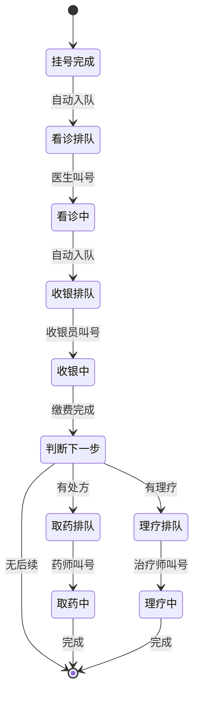

# 统一排队系统设计方案

**文档版本**: v1.0.0  
**创建日期**: 2025-08-06  
**模块名称**: Queueing  
**设计理念**: 统一管理诊所所有排队场景

---

## 📋 设计背景

传统诊所系统中，各个环节的排队独立管理，导致：
- 代码重复
- 患者体验割裂
- 难以实现智能调度
- 无法全局监控

本方案采用**统一排队管理系统**，将所有排队场景整合到一个模块中管理。

## 🏗️ 系统架构

### 核心实体设计

```csharp
/// <summary>
/// 排队记录实体
/// </summary>
public class QueueingModel
{
    /// <summary>排队ID</summary>
    public Guid Id { get; set; }
    
    /// <summary>患者ID</summary>
    public Guid PatientId { get; set; }
    
    /// <summary>医疗案例ID</summary>
    public Guid MedicalCaseId { get; set; }
    
    /// <summary>排队类型</summary>
    public QueueType QueueType { get; set; }
    
    /// <summary>排队目标（医生ID/窗口ID/治疗室ID等）</summary>
    public Guid? TargetId { get; set; }
    
    /// <summary>目标名称（医生姓名/窗口名称等）</summary>
    public string? TargetName { get; set; }
    
    /// <summary>排队号码</summary>
    public string QueueNumber { get; set; }
    
    /// <summary>状态</summary>
    public QueueStatus Status { get; set; }
    
    /// <summary>优先级（0-普通，1-优先，2-VIP，3-急诊）</summary>
    public int Priority { get; set; } = 0;
    
    /// <summary>预计等待时间（分钟）</summary>
    public int? EstimatedWaitTime { get; set; }
    
    /// <summary>入队时间</summary>
    public DateTime EnqueueTime { get; set; }
    
    /// <summary>叫号时间</summary>
    public DateTime? CallTime { get; set; }
    
    /// <summary>开始服务时间</summary>
    public DateTime? ServiceStartTime { get; set; }
    
    /// <summary>结束服务时间</summary>
    public DateTime? ServiceEndTime { get; set; }
    
    /// <summary>备注</summary>
    public string? Remark { get; set; }
}
```

### 枚举定义

```csharp
/// <summary>
/// 排队类型
/// </summary>
public enum QueueType
{
    /// <summary>看诊排队</summary>
    Consultation = 1,
    
    /// <summary>收银排队</summary>
    Payment = 2,
    
    /// <summary>取药排队</summary>
    Pharmacy = 3,
    
    /// <summary>理疗排队</summary>
    Therapy = 4,
    
    /// <summary>复诊排队</summary>
    Recheck = 5,
    
    /// <summary>检查排队</summary>
    Examination = 6
}

/// <summary>
/// 排队状态
/// </summary>
public enum QueueStatus
{
    /// <summary>等待中</summary>
    Waiting = 1,
    
    /// <summary>已叫号</summary>
    Called = 2,
    
    /// <summary>服务中</summary>
    InService = 3,
    
    /// <summary>已完成</summary>
    Completed = 4,
    
    /// <summary>已取消</summary>
    Cancelled = 5,
    
    /// <summary>已过期</summary>
    Expired = 6,
    
    /// <summary>已跳过</summary>
    Skipped = 7
}
```

## 🔄 业务流程

### 患者就诊全流程



### 排队号生成规则

```csharp
public class QueueNumberGenerator
{
    /// <summary>
    /// 生成排队号
    /// </summary>
    public string GenerateQueueNumber(QueueType type, DateTime date)
    {
        // 格式：类型前缀 + 日期 + 序号
        // 例如：A001（看诊）、B001（收银）、C001（取药）、D001（理疗）
        
        string prefix = type switch
        {
            QueueType.Consultation => "A",
            QueueType.Payment => "B",
            QueueType.Pharmacy => "C",
            QueueType.Therapy => "D",
            QueueType.Recheck => "E",
            QueueType.Examination => "F",
            _ => "Z"
        };
        
        // 获取当天该类型的序号
        int sequence = GetNextSequence(type, date);
        
        return $"{prefix}{sequence:D3}";
    }
}
```

## 💼 服务层设计

### 基础排队服务

```csharp
public interface IQueueingService
{
    // 入队
    Task<QueueingModel> EnqueueAsync(EnqueueRequest request);
    
    // 叫号
    Task<bool> CallNumberAsync(Guid queueId);
    
    // 开始服务
    Task<bool> StartServiceAsync(Guid queueId);
    
    // 完成服务
    Task<bool> CompleteServiceAsync(Guid queueId);
    
    // 取消排队
    Task<bool> CancelQueueAsync(Guid queueId, string reason);
    
    // 获取等待队列
    Task<List<QueueingModel>> GetWaitingQueuesAsync(QueueType type, Guid? targetId = null);
    
    // 获取我的排队
    Task<List<QueueingModel>> GetMyQueuesAsync(Guid patientId);
    
    // 获取排队统计
    Task<QueueStatistics> GetStatisticsAsync(QueueType type);
}
```

### 智能流转服务

```csharp
public interface IQueueFlowService
{
    /// <summary>
    /// 自动流转到下一个队列
    /// </summary>
    Task<QueueingModel?> AutoTransferAsync(Guid medicalCaseId, QueueType fromType);
    
    /// <summary>
    /// 批量入队（如：一个患者同时需要取药和理疗）
    /// </summary>
    Task<List<QueueingModel>> BatchEnqueueAsync(Guid medicalCaseId, List<QueueType> types);
    
    /// <summary>
    /// 智能分配（根据各窗口/医生的繁忙程度）
    /// </summary>
    Task<Guid?> SmartAssignTargetAsync(QueueType type);
}
```

## 🎯 实现策略

### MVP版本（第一阶段）

**功能范围**：
1. 基础的入队、叫号、完成功能
2. 简单的排队列表显示
3. 手动流转（完成一个环节后手动加入下一队列）

**实现重点**：
```csharp
public class BasicQueueingService : IQueueingService
{
    public async Task<QueueingModel> EnqueueAsync(EnqueueRequest request)
    {
        var queue = new QueueingModel
        {
            PatientId = request.PatientId,
            MedicalCaseId = request.MedicalCaseId,
            QueueType = request.QueueType,
            QueueNumber = GenerateQueueNumber(request.QueueType),
            Status = QueueStatus.Waiting,
            Priority = request.Priority ?? 0,
            EnqueueTime = DateTime.Now
        };
        
        return await _repository.AddAsync(queue);
    }
    
    public async Task<bool> CallNumberAsync(Guid queueId)
    {
        var queue = await _repository.GetByIdAsync(queueId);
        if (queue == null || queue.Status != QueueStatus.Waiting)
            return false;
            
        queue.Status = QueueStatus.Called;
        queue.CallTime = DateTime.Now;
        
        // TODO: 发送叫号通知（语音、显示屏等）
        
        return await _repository.UpdateAsync(queue);
    }
}
```

### 优化版本（第二阶段）

**新增功能**：
1. 自动流转
2. 优先级管理
3. 预计等待时间计算
4. 叫号提醒

**关键实现**：
```csharp
public class SmartQueueingService : BasicQueueingService, IQueueFlowService
{
    public async Task<QueueingModel?> AutoTransferAsync(Guid medicalCaseId, QueueType fromType)
    {
        var medicalCase = await _medicalCaseService.GetByIdAsync(medicalCaseId);
        
        // 智能判断下一个队列
        var nextType = DetermineNextQueue(medicalCase, fromType);
        
        if (nextType.HasValue)
        {
            return await EnqueueAsync(new EnqueueRequest
            {
                PatientId = medicalCase.PatientId,
                MedicalCaseId = medicalCaseId,
                QueueType = nextType.Value,
                Priority = CalculatePriority(medicalCase)
            });
        }
        
        return null;
    }
    
    private QueueType? DetermineNextQueue(MedicalCaseModel medicalCase, QueueType currentType)
    {
        return currentType switch
        {
            QueueType.Consultation => QueueType.Payment,
            QueueType.Payment when HasPrescription(medicalCase) => QueueType.Pharmacy,
            QueueType.Payment when HasTherapy(medicalCase) => QueueType.Therapy,
            _ => null
        };
    }
}
```

### 完整版本（第三阶段）

**高级功能**：
1. 多窗口负载均衡
2. VIP通道
3. 预约优先
4. 实时大屏显示
5. 微信通知

## 📊 API接口设计

### 排队管理接口

```csharp
[ApiController]
[Route("api/v1/[controller]")]
public class QueueingController : BaseController
{
    /// <summary>
    /// 患者入队
    /// </summary>
    [HttpPost("enqueue")]
    public async Task<IActionResult> Enqueue([FromBody] EnqueueRequest request)
    {
        var result = await _queueingService.EnqueueAsync(request);
        return Ok(result);
    }
    
    /// <summary>
    /// 叫号
    /// </summary>
    [HttpPost("{id}/call")]
    [Authorize(Roles = "Doctor,Nurse,Cashier,Pharmacist")]
    public async Task<IActionResult> CallNumber(Guid id)
    {
        var result = await _queueingService.CallNumberAsync(id);
        return Ok(new { success = result });
    }
    
    /// <summary>
    /// 获取当前排队列表
    /// </summary>
    [HttpGet("list")]
    public async Task<IActionResult> GetQueueList([FromQuery] QueueType type, [FromQuery] Guid? targetId)
    {
        var result = await _queueingService.GetWaitingQueuesAsync(type, targetId);
        return Ok(result);
    }
    
    /// <summary>
    /// 获取排队大屏数据
    /// </summary>
    [HttpGet("display")]
    public async Task<IActionResult> GetDisplayData([FromQuery] QueueType type)
    {
        var data = new
        {
            WaitingList = await _queueingService.GetWaitingQueuesAsync(type),
            CurrentServing = await _queueingService.GetServingQueuesAsync(type),
            Statistics = await _queueingService.GetStatisticsAsync(type)
        };
        return Ok(data);
    }
}
```

## 🖥️ 前端展示

### 患者端显示
- 我的排队号码
- 当前排队位置
- 预计等待时间
- 排队进度跟踪

### 医护端显示
- 待服务队列
- 一键叫号
- 服务计时
- 队列统计

### 大屏显示
- 当前叫号
- 等待人数
- 各窗口状态
- 滚动播报

## 📈 效益分析

### 技术效益
1. **代码复用**：一套排队逻辑服务所有场景
2. **易于维护**：集中管理，统一升级
3. **扩展性强**：轻松添加新的排队类型

### 业务效益
1. **提升效率**：自动流转减少等待
2. **改善体验**：患者全程可追踪
3. **数据分析**：全局排队数据支持运营优化

### 实施难度
- **技术难度**：⭐⭐⭐（中等）
- **实施周期**：3-5天（MVP版本）
- **维护成本**：低

## ✅ 实施建议

1. **第一步**：实现基础排队功能，手动流转
2. **第二步**：加入自动流转逻辑
3. **第三步**：优化用户体验，加入通知提醒
4. **第四步**：实现智能调度和负载均衡

---

**结论**：统一排队系统不仅技术可行，而且能显著提升诊所运营效率和患者就诊体验，建议作为核心基础设施优先实现。