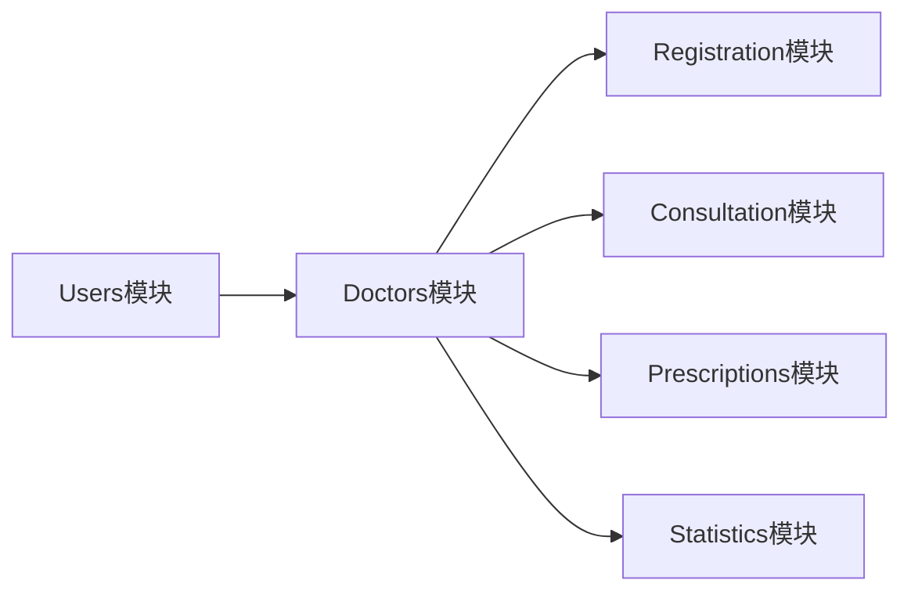

# Doctors模块实现总结

## 模块概述

Doctors模块是凌隐宝堂中医诊所系统的核心业务模块之一，负责管理医生信息、排班计划、专长管理等功能。该模块为挂号、就诊、处方等业务提供医生相关的基础数据支撑。

## 实现状态

✅ **已完成**

## 核心功能

### 1. 医生基础管理（CRUD）
- ✅ 医生信息的增删改查
- ✅ 医生与用户账号关联
- ✅ 医生状态管理（在职、休假、离职）
- ✅ 按专长、姓名、证书号搜索医生
- ✅ 分页查询支持

### 2. 排班管理功能
- ✅ 周排班模板设置
- ✅ 单个排班的增删改查
- ✅ 按日期查询排班医生
- ✅ 获取可预约时段
- ✅ 排班复制功能
- ✅ 批量排班设置

### 3. 专长管理功能
- ✅ 医生专长信息维护
- ✅ 擅长疾病管理
- ✅ 学历、职称、工作年限管理
- ✅ 学术成就、获奖情况记录
- ✅ 按专长/疾病搜索医生

### 4. 统计与评价
- ✅ 医生工作量统计
- ✅ 患者评价管理
- ✅ 医生排行榜（接诊量、评分等）
- ✅ 满意度统计

## 技术实现

### 数据模型扩展

```csharp
// DoctorModel 新增字段
public class DoctorModel {
    // 排班相关
    public string? Title { get; set; }           // 职称
    public string? Department { get; set; }       // 科室
    public int MaxPatientsPerDay { get; set; }   // 日最大接诊量
    public bool AcceptAppointment { get; set; }   // 是否接受预约
    
    // 专长相关
    public string? SpecializedDiseases { get; set; }  // 擅长疾病（JSON）
    public int? YearsOfExperience { get; set; }       // 工作年限
    public string? Education { get; set; }            // 学历
    public string? GraduateSchool { get; set; }       // 毕业院校
    
    // 统计相关
    public int TotalPatientCount { get; set; }        // 总接诊人次
    public double AverageConsultationMinutes { get; set; } // 平均就诊时长
    public decimal? Rating { get; set; }              // 评分
    public int RatingCount { get; set; }              // 评价数量
    
    // 照片
    public string? PhotoUrl { get; set; }             // 医生照片
}
```

### 新增模型

```csharp
// 医生排班模型
public class DoctorScheduleModel {
    public Guid Id { get; set; }
    public Guid DoctorId { get; set; }
    public int DayOfWeek { get; set; }        // 1-7
    public TimeSlot TimeSlot { get; set; }    // 上午/下午/晚上
    public TimeSpan StartTime { get; set; }   // 开始时间
    public TimeSpan EndTime { get; set; }     // 结束时间
    public int MaxPatients { get; set; }      // 最大接诊量
    public bool IsActive { get; set; }        // 是否启用
}
```

### 服务层实现

```csharp
public class DoctorService : IDoctorService {
    // 基础CRUD
    Task<DoctorDetailDto?> GetByIdAsync(Guid id, UserRole currentUserRole);
    Task<DoctorDetailDto?> CreateAsync(DoctorCreateDto dto, Guid operatorId, string operatorName);
    Task<DoctorDetailDto?> UpdateAsync(Guid id, DoctorUpdateDto dto, Guid operatorId, string operatorName);
    Task<bool> DeleteAsync(Guid id, Guid operatorId, string operatorName);
    
    // 排班管理
    Task<List<DoctorScheduleDto>> GetSchedulesAsync(Guid doctorId);
    Task<bool> SetWeeklyScheduleTemplateAsync(Guid doctorId, WeeklyScheduleTemplateDto template, Guid operatorId, string operatorName);
    Task<List<AvailableTimeSlotDto>> GetAvailableTimeSlotsAsync(Guid doctorId, DateTime date);
    
    // 专长管理
    Task<bool> UpdateSpecialtyAsync(Guid doctorId, DoctorSpecialtyDto specialty, Guid operatorId, string operatorName);
    Task<List<DoctorDto>> SearchByDiseaseAsync(string disease);
    
    // 统计功能
    Task<DoctorStatisticsDto> GetStatisticsAsync(Guid doctorId, DateTime? startDate = null, DateTime? endDate = null);
    Task<List<DoctorRankingDto>> GetDoctorRankingAsync(RankingType type, int top = 10);
}
```

### API 接口设计

```csharp
[Route("api/v1/[controller]")]
[ApiController]
[Authorize]
public class DoctorsController : BaseController {
    // 基础操作
    [HttpGet]                         // 获取医生列表
    [HttpGet("{id:guid}")]           // 获取医生详情
    [HttpPost]                        // 新增医生
    [HttpPut("{id:guid}")]           // 更新医生信息
    [HttpDelete("{id:guid}")]        // 删除医生
    
    // 排班管理
    [HttpGet("{id:guid}/schedules")]                    // 获取排班
    [HttpPost("{id:guid}/schedules")]                   // 设置排班
    [HttpPost("{id:guid}/schedules/weekly-template")]   // 设置周模板
    [HttpGet("{id:guid}/available-slots")]              // 获取可预约时段
    
    // 专长管理
    [HttpGet("{id:guid}/specialty")]                    // 获取专长信息
    [HttpPut("{id:guid}/specialty")]                    // 更新专长信息
    [HttpPost("{id:guid}/specialized-diseases")]        // 添加擅长疾病
    
    // 统计查询
    [HttpGet("{id:guid}/statistics")]                   // 获取统计数据
    [HttpGet("ranking/{type}")]                         // 获取排行榜
    [HttpPost("{id:guid}/rating")]                      // 提交评价
}
```

## 关键特性

### 1. 权限控制
- 普通用户只能查看在职医生
- 管理员可以查看所有医生（包括离职）
- 医生信息修改需要管理员权限

### 2. 数据验证
- 用户ID必须存在且未关联其他医生
- 排班时间不能冲突
- 评分范围限制在1-5分

### 3. 业务规则
- 软删除策略（状态标记为Deleted）
- 排班模板自动生成每周排班
- 擅长疾病以JSON格式存储，支持动态扩展

### 4. 性能优化
- 分页查询支持
- 搜索结果限制（最多返回20条）
- 使用缓存策略（TODO）

## 数据契约（DTOs）

### 输入DTOs
- `DoctorCreateDto` - 创建医生
- `DoctorUpdateDto` - 更新医生信息
- `DoctorQueryDto` - 查询参数
- `WeeklyScheduleTemplateDto` - 周排班模板
- `DoctorSpecialtyDto` - 专长信息

### 输出DTOs
- `DoctorDto` - 医生基本信息
- `DoctorDetailDto` - 医生详细信息
- `DoctorScheduleDto` - 排班信息
- `DoctorWithScheduleDto` - 带排班的医生信息
- `AvailableTimeSlotDto` - 可用时段
- `DoctorStatisticsDto` - 统计数据
- `DoctorRankingDto` - 排行榜数据

## 与其他模块的关系



- **依赖模块**: Users（用户账号关联）
- **被依赖模块**: Registration（挂号选择医生）、Consultation（就诊）、Prescriptions（处方开具）

## 待完善功能

1. **数据持久化**
   - DoctorScheduleModel 需要添加到数据库上下文
   - 评价详情表需要创建

2. **缓存优化**
   - 医生列表缓存
   - 排班信息缓存

3. **业务增强**
   - 排班冲突检测
   - 节假日排班特殊处理
   - 临时调班功能

4. **统计完善**
   - 从实际就诊记录统计数据
   - 收入统计功能

## 测试建议

### 单元测试
- 医生创建时的用户验证
- 排班时间冲突检测
- 评分计算逻辑

### 集成测试
- 医生与用户账号关联
- 排班模板生成
- 权限控制验证

### 性能测试
- 大量医生数据的查询性能
- 排班信息的查询效率

## 部署注意事项

1. 确保数据库迁移包含新增字段
2. 初始化默认排班模板
3. 配置医生照片存储路径
4. 设置评价审核机制（如需要）

## 总结

Doctors模块实现了完整的医生管理功能，包括基础信息管理、排班管理、专长管理和统计功能。模块设计遵循了系统的整体架构规范，采用了分层架构、依赖注入、异步编程等最佳实践。通过合理的抽象和封装，为后续的挂号、就诊等业务模块提供了稳定的基础支撑。