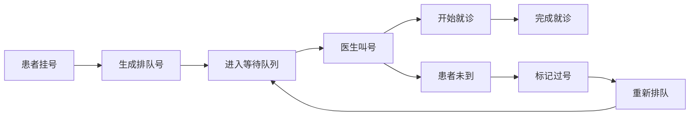
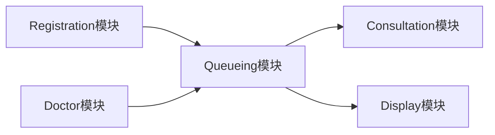

# Queueing（排队叫号）模块实现总结

## 模块概述

Queueing模块是凌隐宝堂中医诊所现场叫号系统的核心模块，与Registration（挂号）模块紧密结合，实现从挂号到叫号就诊的完整流程管理。

## 实现状态

✅ **已完成**

## 核心功能

### 1. 基础排队管理
- ✅ 排队记录的CRUD操作
- ✅ 排队状态管理（等待、就诊中、完成、过号、取消）
- ✅ 分页查询和搜索
- ✅ 排队信息编辑

### 2. 现场叫号功能
- ✅ **自动排队号生成** - 按医生当天递增编号
- ✅ **叫号功能** - 呼叫下一位等待患者
- ✅ **当前就诊查询** - 获取正在就诊的患者
- ✅ **等待队列查询** - 获取下一位等待患者
- ✅ **今日排队列表** - 按医生查看当天排队

### 3. 特殊情况处理
- ✅ **过号处理** - 标记未及时就诊的患者
- ✅ **重新排队** - 过号患者重新加入等待队列
- ✅ **插队功能** - VIP或加急患者优先就诊
- ✅ **暂停排队** - 患者临时离开

### 4. 统计分析
- ✅ **实时统计** - 今日排队数量、各状态统计
- ✅ **等待时间统计** - 平均等待时间分析
- ✅ **医生工作量统计** - 按医生统计接诊情况

## 技术实现

### 数据模型扩展

```csharp
// QueueingModel 扩展字段
public class QueueingModel : BaseQueueingModel {
    public Guid? RegistrationId { get; set; }     // 关联挂号记录
    public int QueueNumber { get; set; }          // 排队号
    public DateTime? EstimatedTime { get; set; }  // 预计就诊时间
    public DateTime? ActualTime { get; set; }     // 实际就诊时间
    public DateTime CreateTime { get; set; }      // 创建时间
    public DateTime? UpdateTime { get; set; }     // 更新时间
}
```

### 枚举状态扩展

```csharp
public enum QueueStatus {
    Waiting = 0,      // 等待
    Calling = 1,      // 呼叫中
    InProgress = 2,   // 就诊中
    Completed = 3,    // 已完成
    Missed = 4,       // 过号
    Cancelled = -1    // 已取消
}
```

### 核心服务方法

```csharp
public class QueueingService : IQueueingService {
    // 基础CRUD
    Task<QueueingDto?> AddAsync(QueueingCreateDto dto);
    Task<bool> UpdateAsync(QueueingEditDto dto);
    Task<bool> CancelAsync(Guid id);
    
    // 现场叫号核心功能
    Task<List<QueueingDto>> GetTodayQueuesAsync(Guid? doctorId = null);
    Task<QueueingDto?> GetCurrentQueueAsync(Guid doctorId);
    Task<QueueingDto?> GetNextWaitingQueueAsync(Guid doctorId);
    Task<bool> CallNextAsync(Guid doctorId, Guid operatorId, string operatorName);
    
    // 特殊处理
    Task<bool> RequeueAsync(Guid queueId, Guid operatorId, string operatorName);
    Task<bool> MarkAsMissedAsync(Guid queueId, Guid operatorId, string operatorName);
    Task<bool> InsertQueueAsync(Guid queueId, int position, Guid operatorId, string operatorName);
    
    // 统计分析
    Task<QueueStatisticsDto> GetStatisticsAsync(Guid? doctorId = null);
}
```

### API接口设计

```csharp
[Route("api/v1/[controller]")]
public class QueueingController : BaseController {
    // 基础操作
    [HttpGet]                        // 获取排队列表
    [HttpGet("{id}")]               // 获取排队详情
    [HttpPost]                       // 新增排队
    [HttpPut]                        // 更新排队
    [HttpDelete("{id}")]            // 删除排队
    
    // 状态管理
    [HttpPost("cancel/{id}")]        // 取消排队
    [HttpPost("complete/{id}")]      // 完成排队
    [HttpPost("hold/{id}")]          // 暂停排队
    
    // 现场叫号功能
    [HttpGet("today")]               // 今日排队列表
    [HttpGet("current/{doctorId}")]  // 当前就诊
    [HttpGet("next/{doctorId}")]     // 下一位患者
    [HttpPost("call-next/{doctorId}")] // 叫号
    [HttpPost("requeue/{id}")]       // 重新排队
    [HttpPost("miss/{id}")]          // 标记过号
    [HttpPost("insert/{id}")]        // 插队
    [HttpGet("statistics")]          // 获取统计
}
```

## 业务流程

### 现场挂号叫号流程



### 叫号逻辑

1. **自动叫号**: 医生点击"叫下一位"
2. **完成当前**: 先完成当前就诊（如果有）
3. **获取下一位**: 按排队号顺序获取等待患者
4. **更新状态**: 将等待状态改为就诊中
5. **记录时间**: 更新实际就诊时间

### 状态流转

```
等待 → 就诊中 → 已完成
  ↓      ↓
过号 → 重新排队 → 等待
  ↓
取消
```

## 数据契约（DTOs）

### 输入DTOs
- `QueueingCreateDto` - 创建排队
- `QueueingEditDto` - 编辑排队
- `QueueQueryDto` - 查询参数

### 输出DTOs
- `QueueingDto` - 排队基本信息
- `QueueingDetailDto` - 排队详细信息
- `QueueStatisticsDto` - 统计数据
- `CallDisplayDto` - 叫号显示
- `QueuePositionDto` - 排队位置信息

## 与其他模块的关系



- **Registration模块**: 挂号时自动创建排队记录
- **Consultation模块**: 就诊状态同步
- **Display模块**: 大屏显示叫号信息
- **Doctor模块**: 医生信息关联

## 核心特性

### 1. 排队号管理
- 按医生每天重新从1开始编号
- 自动递增，确保唯一性
- 支持插队时重新排序

### 2. 实时状态同步
- 叫号时自动完成上一位患者
- 状态变更实时更新
- 支持并发操作

### 3. 智能叫号
- 按排队号顺序叫号
- 过号患者可重新排队
- 支持VIP插队

### 4. 统计分析
- 实时统计各状态数量
- 计算平均等待时间
- 支持按医生分组统计

## 扩展功能点

### 已实现
- ✅ 基础排队管理
- ✅ 现场叫号
- ✅ 过号处理
- ✅ 统计分析

### 预留扩展
- 🔄 **语音播报** - 集成TTS叫号
- 🔄 **大屏显示** - 等候区显示屏
- 🔄 **微信提醒** - 叫号前几位微信通知
- 🔄 **预约排队** - 预约患者自动排队

## 性能考虑

### 优化措施
1. **今日数据缓存** - 当天排队数据缓存
2. **状态索引** - 按状态和日期建索引
3. **分页查询** - 大量数据分页处理
4. **异步处理** - 状态更新异步执行

### 并发控制
1. **乐观锁** - UpdateTime字段防并发
2. **原子操作** - 叫号操作原子性
3. **状态检查** - 状态变更前验证

## 测试建议

### 单元测试
- 排队号生成逻辑
- 状态流转验证
- 统计计算准确性

### 集成测试
- 与Registration模块联动
- 多医生并发叫号
- 状态同步验证

### 压力测试
- 大量排队数据处理
- 高并发叫号场景
- 实时统计性能

## 部署注意事项

1. **数据库索引** - 确保性能查询索引
2. **缓存配置** - 配置合适的缓存策略
3. **定时清理** - 历史数据定期归档
4. **监控告警** - 关键操作监控

## 用户界面建议

### 医生端
- 当前患者信息显示
- 一键叫号按钮
- 等待队列预览
- 过号处理快捷操作

### 前台端
- 今日排队总览
- 患者状态管理
- 插队授权操作
- 统计报表查看

### 患者端
- 排队位置查询
- 等待时间预估
- 叫号提醒推送

## 总结

Queueing模块成功实现了现场叫号的完整业务流程，通过与Registration模块的紧密配合，为诊所提供了高效的患者流管理方案。系统支持灵活的状态管理、智能的叫号逻辑和完善的统计分析，能够显著提升诊所的服务效率和患者体验。