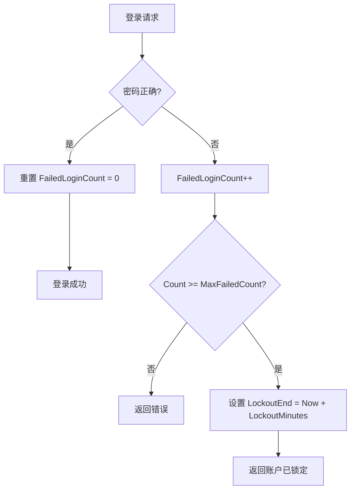
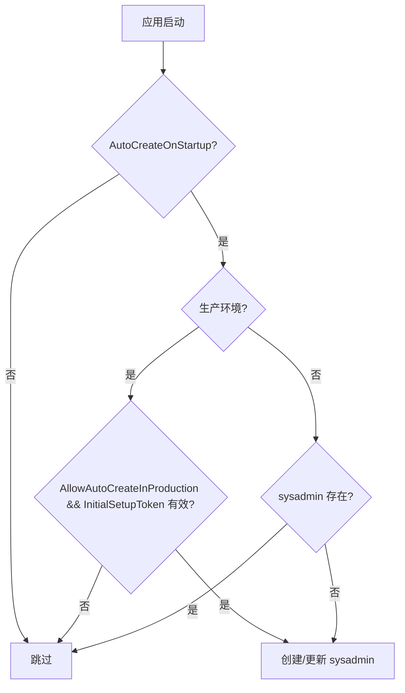

# 安全与密码管理
> 版本: v1.0 | 日期: 2026-08-20

## 概述

系统采用 ASP.NET Core Identity **PBKDF2** 密码哈希（UserManager 内置）+ 可配置账户锁定策略。本文档覆盖密码生命周期、系统管理员账户管理、开发环境配置。本文档覆盖密码生命周期、系统管理员账户管理、开发环境配置。

## 密码服务架构

### IPasswordService 接口

位置: `LYBT.Shared.Utilities/Security/IPasswordService.cs`

| 方法 | 用途 |
|------|------|
| `HashPassword(string)` | 经 UserManager/PasswordHasher 的 PBKDF2 哈希（Identity 内置——AQAAAA 前缀） |
| `VerifyPassword(string, string)` | 验证密码与哈希是否匹配 |
| `VerifyAndRehashIfNeeded(string, string)` | 验证 + 若 WorkFactor 过旧则自动重新哈希 |
| `ValidatePassword(string)` | 密码复杂度验证 (≥8 位，含大小写+数字+特殊字符) |
| `GenerateSecurePassword(int)` | 生成符合策略的安全密码 |
| `GenerateTemporaryPassword()` | 生成 12 位临时密码 |
| `SecureEquals(string, string)` | 定时安全比较，防止时序攻击 |

### 实现类

`BcryptPasswordService` (sealed) 封装 `PasswordHelper` 静态方法，通过 DI 注入:

```csharp
services.AddSingleton<IPasswordService, BcryptPasswordService>();
```

**设计意图**: 将静态工具类包装为可 Mock 接口，便于单元测试中隔离密码逻辑。

## 账户锁定配置

### AccountLockoutOptions

配置节: `Security:AccountLockout`

| 属性 | 类型 | 默认值 | 范围 | 说明 |
|------|------|--------|------|------|
| `Enabled` | bool | `true` | — | 是否启用账户锁定 |
| `MaxFailedCount` | int | `5` | 1-100 | 最大允许失败次数 |
| `LockoutMinutes` | int | `15` | 1-1440 | 锁定持续时间 (分钟) |

### 环境配置示例

**appsettings.json** (基础):
```json
{
  "Security": {
    "AccountLockout": {
      "Enabled": true,
      "MaxFailedCount": 5,
      "LockoutMinutes": 15
    }
  }
}
```

**appsettings.Test.json** (测试环境):
```json
{
  "Security": {
    "AccountLockout": {
      "Enabled": false
    }
  }
}
```

### 锁定流程



## 系统管理员 (sysadmin) 生命周期

### SystemAdminOptions 配置

配置节: `SystemAdmin`

| 属性 | 默认值 | 说明 |
|------|--------|------|
| `UserName` | `"sysadmin"` | 系统管理员用户名 |
| `AutoCreateOnStartup` | `true` | 启动时自动创建 (若不存在) |
| ~~`ForceResetOnStartup`~~ | ~~`false`~~ | **已移除（2026-08-13 回归设计）**——无强制重置密码机制；密码遗忘唯一途径 = PasswordHashGenerator 工具 |
| `AllowAutoCreateInProduction` | `false` | 生产环境是否允许自动创建 |
| `InitialSetupToken` | — | 生产环境创建时的安全令牌 |
| `SessionTimeoutMinutes` | `240` | 会话超时时间 |

### 启动流程



### ForceResetOnStartup 已移除（2026-08-13 生命周期回归）

**用户权威设计**：无「强制重置密码」机制——sysadmin 生命周期 = 空库创建（初始密码从配置文档读取）/ 有数据不创建不重置 / 密码遗忘唯一途径 = `src/Tools/PasswordHashGenerator`（PBKDF2 哈希 → 人工 SQL 更新 Users.PasswordHash）。

**边界场景（运维可观测性，启动时检测）**：
- 软异常（sysadmin 存在但 IsDeleted/Disabled）→ `LogWarning` 不阻断启动；登录返回明确提示「系统管理员账号异常，请联系运维使用密码初始化工具恢复」
- 硬删（系统数据存在但 SuperAdmin 缺失）→ `LogCritical` + 抛异常禁止启动（需工具恢复后重启）
- 空库首次启动 → 正常创建（不误报）

### 开发环境推荐配置

`appsettings.Development.json`:

```json
{
  "SystemAdmin": {
    "AutoCreateOnStartup": true,
    // ForceResetOnStartup 已移除（2026-08-13）——无强制重置机制
  },
  "DefaultPasswords": {
    "EnableInDevelopment": true
  },
  "Security": {
    "AccountLockout": {
      "Enabled": true,
      "MaxFailedCount": 10,
      "LockoutMinutes": 1
    }
  }
}
```

这样开发者每次启动都能用默认密码登录，不会因为反复测试而被锁定。

## 密码哈希生成

工具: `src/Tools/PasswordHashGenerator/`

```bash
dotnet run --project src/Tools/PasswordHashGenerator/PasswordHashGenerator -- "YourPassword"
```

默认密码 `DevPass123!` 的预计算哈希:
```
$2a$11$0IviQQSC517yFyWB47YDh.P.mHetOQwFkvgdMtl8UFWn6v4iKKJ8e
```

## 安全设计决策

| 决策 | 理由 |
|------|------|
| Identity PBKDF2 (UserManager 内置) | 与登录认证同算法（铁律 #3——全部走 UserManager，禁 BCrypt 落库） |
| IPasswordService 接口 | 测试可 Mock，避免静态方法直接依赖 |
| 可配置锁定策略 | 替代硬编码常量，便于不同环境调整 |
| ~~ForceResetOnStartup~~（已移除 2026-08-13） | 无强制重置机制——密码遗忘唯一途径 = PasswordHashGenerator 工具 |
| FixedTimeEquals 令牌比较 | 防止时序攻击泄漏 InitialSetupToken |

## Identity 集成约束（铁律）

> 以下约束源自 ASP.NET Core Identity 集成层，违反将导致运行时错误或安全漏洞。根 `AGENTS.md`「Common Pitfalls」同步。

### 1. DI 注册顺序：`AddIdentity()` 必须在 `AddAuthentication()` 前

`AddIdentity<TUser, TRole>()` 内部会调用 `AddAuthentication()` 并覆盖默认方案配置。若 JWT 的 `AddAuthentication()` 在其后注册，将覆盖 Identity 的默认方案，导致 JWT 持有者认证失效。

```csharp
// ✅ 正确顺序
builder.Services.AddIdentity<ApplicationUser, ApplicationRole>()
    .AddEntityFrameworkStores<AppDbContext>()
    .AddDefaultTokenProviders();
builder.Services.AddAuthentication(options => { /* JWT Bearer 配置 */ })
    .AddJwtBearer(/* ... */);

// ❌ 错误顺序 — Identity 会覆盖 JWT 方案
builder.Services.AddAuthentication(/* JWT */);
builder.Services.AddIdentity<ApplicationUser, ApplicationRole>(/* ... */);
```

### 2. `UserManager<T>` / `RoleManager<T>` 是 **SCOPED** 服务

这两个管理器持有 `DbContext`（Scoped）和 `ILogger`（Singleton）依赖。**禁止从 root provider 直接 resolve**：

```csharp
// ❌ 错误 — 在 startup 配置阶段、单例服务、事件回调中直接获取
var userManager = app.Services.GetRequiredService<UserManager<ApplicationUser>>();
await userManager.CreateAsync(user, password);

// ✅ 正确 — 从 scope 获取
using var scope = app.Services.CreateScope();
var userManager = scope.ServiceProvider.GetRequiredService<UserManager<ApplicationUser>>();
await userManager.CreateAsync(user, password);
```

`IdentitySeedData` 等启动初始化器必须使用 `scope.ServiceProvider`（参见 `DatabaseInitializationService`）。

### 3. BCrypt (`PasswordHelper`) 与 PBKDF2 (Identity) 不兼容 — 全部走 `UserManager`

ASP.NET Core Identity 内部使用 PBKDF2 算法哈希密码。本项目**已移除 BCrypt**（A-27 技术栈减法——`PasswordHelper` 哈希/验证改走 Identity）——当前唯一哈希路径 = UserManager/PasswordHasher（PBKDF2）。铁律保留作为历史教训：**两套哈希不互通**，任何场景不得引入第二套哈希算法落库。

```csharp
// ❌ 错误 — 用 BCrypt 哈希后存库，Identity 验证失败
user.PasswordHash = _passwordService.HashPassword(password);
await _userManager.UpdateAsync(user);

// ✅ 正确 — 全部通过 UserManager 处理（内部用 PBKDF2）
var result = await _userManager.CreateAsync(user, password);
// 修改密码
var result = await _userManager.ResetPasswordAsync(user, token, newPassword);
// 或 ChangePasswordAsync / RemovePasswordAsync + AddPasswordAsync
```

`BcryptPasswordService`（`IPasswordService`）仅用于非 Identity 路径（如 sysadmin 创建脚本的工具校验、`SecureEquals` 防时序比较等），不得作为用户密码落库入口。

### 4. `IdentitySeedData` 不存在才创建（幂等——已登录用户不被覆盖）

种子数据使用幂等策略：**用户不存在才创建**（`FindByNameAsync` 为 null 时用 `DefaultPasswords` 密码创建）——**已存在的用户（含已登录）完全跳过，密码不被覆盖**。开发者反复测试登录后重新启动服务不会破坏已设密码。

```csharp
// IdentitySeedData 实际逻辑（2026-08-13 审核对齐——不存在才创建，无 LastLoginAt 条件）
var existing = await _userManager.FindByNameAsync(userName);
if (existing == null)
{
    await _userManager.CreateAsync(new ApplicationUser { ... }, configuredPassword);
    _logger.LogInformation("创建系统管理员 (首次启动): {User}", userName);
}
```

如需强制重置（开发/测试），使用 `SystemAdmin:ForceResetOnStartup: true`——开发环境直接生效；非开发环境需 `InitialSetupToken` 验证通过（2026-08-13 审核对齐——见上 ForceResetOnStartup 行为）。

## 相关文档

- [配置架构](../03-architecture/07-configuration.md) — Options 模式与验证管道
- [API 认证](../04-api-reference/README.md) — JWT + RefreshToken 认证流程
- [测试指南](04-testing.md) — 测试中如何配置安全选项
