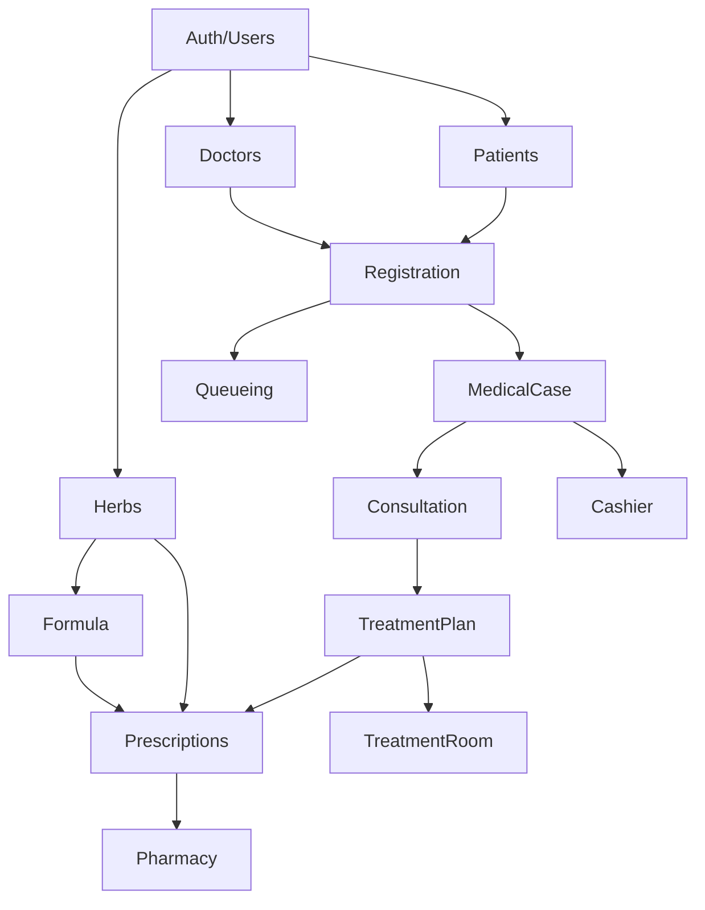

# 模块开发顺序指南

**文档版本**: v2.0.0  
**更新日期**: 2025-08-06  
**适用人员**: 独立开发者  
**开发周期**: 6周

---

## 📋 开发策略

### 核心原则
1. **完成度优先** - 先跑通主流程，再优化细节
2. **依赖前置** - 确保依赖模块先完成
3. **MVP思维** - 每个模块只实现核心80%功能
4. **快速迭代** - 2周一个可用版本

## 🗂️ 模块依赖关系



## 📅 6周开发计划详细

### 🔥 Week 1：基础架构与主数据
**目标**：建立认证系统和核心主数据

#### Day 1-2: Auth + Users
```csharp
// 核心功能
- JWT认证实现
- 用户登录/登出
- 基础角色管理（Admin, Doctor, Nurse, Cashier）
- 用户CRUD操作
```

#### Day 3-4: Doctors
```csharp
// 核心功能
- 医生档案CRUD
- 简单排班信息（可选）
- 专科设置
```

#### Day 5: Herbs
```csharp
// 核心功能
- 药材档案CRUD
- 基础分类
- 价格管理
- 简单库存字段（不做复杂库存管理）
```

**Week 1 验收标准**：
- ✅ 能登录系统
- ✅ 能管理医生和药材基础数据

---

### ⭐ Week 2：患者与挂号系统
**目标**：完成业务流程起点

#### Day 1-3: Patients
```csharp
// 核心功能
- 患者档案CRUD
- 快速检索（拼音码）
- 过敏史记录
- 就诊历史（简化版）
```

#### Day 4-5: Registration
```csharp
// 核心功能
- 挂号登记
- 选择医生
- 生成挂号单
- 挂号状态管理
```

**Week 2 验收标准**：
- ✅ 能创建患者档案
- ✅ 能完成挂号流程
- ✅ 主流程：患者 → 挂号 通畅

---

### 🎯 Week 3：流程控制中心
**目标**：建立诊疗流程框架

#### Day 1-3: Queueing（统一排队系统）
```csharp
// 核心功能
public enum QueueType {
    Consultation = 1,  // 看诊排队
    Payment = 2,       // 收银排队
    Pharmacy = 3,      // 取药排队
    Therapy = 4        // 理疗排队
}

// 基础实现
- 入队/出队管理
- 叫号功能
- 队列状态显示
- 自动流转（挂号→看诊队列）
```

#### Day 4-5: MedicalCase（医疗案例）
```csharp
// 核心功能
- 创建医疗案例（挂号时自动创建）
- 状态流转管理
- 关联各阶段记录
- 流程追踪
```

**Week 3 验收标准**：
- ✅ 挂号后自动进入看诊队列
- ✅ 能叫号和管理队列
- ✅ MedicalCase能追踪整个流程

---

### 💊 Week 4：核心诊疗功能
**目标**：完成看诊和治疗方案

#### Day 1-3: Consultation（看诊）
```csharp
// 核心功能
- 主诉记录
- 中医四诊（望闻问切）
- 诊断结果
- 医嘱记录
```

#### Day 4-5: TreatmentPlan（治疗方案）
```csharp
// 核心功能
public class TreatmentPlanModel {
    // 处方部分（可选）
    public TreatmentPrescriptionModel? Prescription { get; set; }
    
    // 理疗部分（可选）
    public List<PhysiotherapyItemModel> PhysiotherapyItems { get; set; }
    
    // 费用计算
    public decimal TotalAmount { get; }
}
```

**Week 4 验收标准**：
- ✅ 能完成看诊记录
- ✅ 能制定治疗方案（处方/理疗）
- ✅ 看诊后自动进入收银队列

---

### 🌿 Week 5：处方与药房系统
**目标**：完成处方开具和发药流程

#### Day 1-2: Formula（验方）
```csharp
// 核心功能
- 验方模板CRUD
- 验方明细管理
- 快速调用模板
```

#### Day 3-4: Prescriptions（处方）
```csharp
// 核心功能
- 开具处方
- 调用验方模板
- 药材用量调整
- 处方打印（简化版）
```

#### Day 5: Pharmacy（药房）
```csharp
// 核心功能
- 接收处方
- 发药确认
- 库存扣减（简化版）
- 发药记录
```

**Week 5 验收标准**：
- ✅ 能使用验方快速开方
- ✅ 能完成处方开具
- ✅ 药房能处理处方发药

---

### 💰 Week 6：收银与理疗系统
**目标**：完成收费和理疗执行

#### Day 1-3: Cashier（收银）
```csharp
// 核心功能
- 费用计算
- 收费确认
- 支付方式（现金/其他）
- 收据打印（简化版）
```

#### Day 4-5: TreatmentRoom（治疗室）
```csharp
// 核心功能
- 接收理疗方案
- 执行登记
- 完成确认
- 理疗记录
```

**Week 6 验收标准**：
- ✅ 能完成收银流程
- ✅ 能执行理疗项目
- ✅ 完整流程跑通

---

## 🚀 快速开发技巧

### 1. 代码复用策略
```csharp
// 基础CRUD控制器
public abstract class BaseController<TEntity, TDto> {
    // 通用的增删改查实现
}

// 各模块继承使用
public class PatientController : BaseController<Patient, PatientDto> {
    // 只需实现特殊逻辑
}
```

### 2. 简化实现建议
- 暂不实现复杂权限，用角色控制
- 暂不实现复杂报表，只做基础统计
- 暂不实现消息通知，手动刷新即可
- 暂不实现批量操作，单个处理即可

### 3. 测试策略
- 每完成一个模块，立即测试主流程
- 用Postman测试API
- 简单UI先用列表+表单模式

## 📊 进度追踪表

| 模块 | 计划开始 | 实际开始 | 计划完成 | 实际完成 | 状态 |
|------|----------|----------|----------|----------|------|
| Auth/Users | W1D1 | - | W1D2 | - | ⏳ |
| Doctors | W1D3 | - | W1D4 | - | ⏳ |
| Herbs | W1D5 | - | W1D5 | - | ⏳ |
| Patients | W2D1 | - | W2D3 | - | ⏳ |
| Registration | W2D4 | - | W2D5 | - | ⏳ |
| Queueing | W3D1 | - | W3D3 | - | ⏳ |
| MedicalCase | W3D4 | - | W3D5 | - | ⏳ |
| Consultation | W4D1 | - | W4D3 | - | ⏳ |
| TreatmentPlan | W4D4 | - | W4D5 | - | ⏳ |
| Formula | W5D1 | - | W5D2 | - | ⏳ |
| Prescriptions | W5D3 | - | W5D4 | - | ⏳ |
| Pharmacy | W5D5 | - | W5D5 | - | ⏳ |
| Cashier | W6D1 | - | W6D3 | - | ⏳ |
| TreatmentRoom | W6D4 | - | W6D5 | - | ⏳ |

## ✅ 每日检查清单

### 开发前
- [ ] 明确今日要完成的功能点
- [ ] 准备好相关的实体模型
- [ ] 确认依赖模块已完成

### 开发中
- [ ] 先实现核心功能
- [ ] 确保主流程通畅
- [ ] 及时提交代码

### 开发后
- [ ] 测试主要功能
- [ ] 更新进度表
- [ ] 记录遇到的问题

## 🎯 成功标准

### 2周后（MVP）
- 能完成基础的挂号→看诊→开方流程
- 系统基本可用

### 4周后（Beta）
- 所有核心模块完成
- 主流程完全通畅

### 6周后（Release）
- 系统功能完整
- 可以正式使用

---

**注意**：本指南为独立开发者优化，重点是快速交付可用系统。复杂功能可在后续迭代中完善。