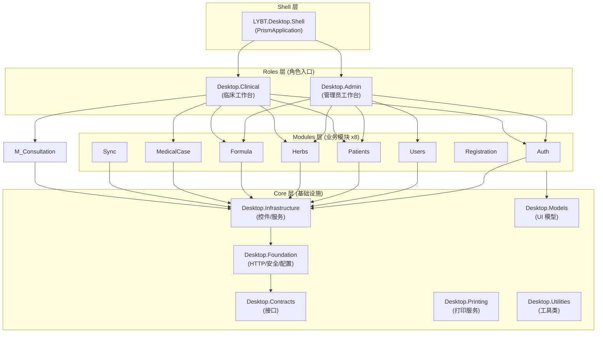

## 概述

桌面端采用 WPF + Prism 9.0 MVVM 架构，通过 DryIoc 依赖注入容器管理依赖，使用 Prism Region 机制实现模块间导航。项目共 16 个，分为 Shell（应用外壳）、Roles（角色入口）、Modules（业务模块）、Core（基础设施）四层，依赖方向严格单向：Shell → Roles → Modules → Infrastructure → Foundation → Contracts。

## 核心内容

### 四层架构结构



### ViewModel 基类体系

ViewModel 继承层次如下：

```
ObservableObject (CommunityToolkit.Mvvm)
  CoreViewModelBase             # 最小核心: IsBusy, Logger, EventAggregator
    NavigableViewModelBase      # 导航: INavigationAware, IRegionMemberLifetime
      ValidatingViewModelBase   # 验证: INotifyDataErrorInfo
      PageViewModelBase         # 主页面: PageTitle, RefreshCommand
    DialogViewModelBase         # 对话框: IDialogAware
```

| 基类 | 用途 | 关键功能 |
|------|------|----------|
| CoreViewModelBase | 最小核心 | IsBusy, Logger, EventAggregator |
| NavigableViewModelBase | 导航支持 | OnNavigatedTo/From, IRegionMemberLifetime |
| DialogViewModelBase | 对话框 | IDialogAware, RequestClose |
| ValidatingViewModelBase | 表单验证 | INotifyDataErrorInfo |
| PageViewModelBase | 主内容页 | PageTitle, RefreshCommand |

### 角色入口

系统提供两个角色工作台，每个角色包含不同的模块组合：

| 角色台 | 包含模块 | 核心功能 |
|--------|---------|---------|
| **Admin (管理员)** | Auth, Users, Patients, Herbs, Formula | 用户管理、数据维护、系统配置 |
| **Clinical (临床)** | Auth, Patients, MedicalCase, Consultation, Herbs, Formula, Sync | 诊疗流程、开方、处方打印 |

**视图分离原则**：角色台创建薄包装 View，引用业务模块的 Control。业务逻辑在 Control 层，角色特定 UI 在 View 层。

### 模块注册规范

DI 生命周期注册规则：

| 类型 | 生命周期 | 注册方式 |
|------|----------|----------|
| Repository | Singleton | `RegisterSingleton<IRepo, Repo>()` |
| DataManager | Scoped | `RegisterScoped<IDM, DM>()` |
| CommandHandler | Transient | `Register<ICH, CH>()` |
| ViewModel | Transient | `Register<VM>()` |

### Components 分层模式

大型 ViewModel 拆分为 Coordinator + Components 以控制复杂度：

```
ViewModels/
  {Feature}ViewModel.cs              # 协调器 (绑定 + 导航)
  Components/
    {Feature}DataManager.cs          # 数据加载、缓存
    {Feature}CommandHandler.cs       # CRUD 命令
    {Feature}Validator.cs            # 业务验证
    {Feature}Calculator.cs           # 计算逻辑 (可选)
```

| Component 类型 | 职责 | 必需性 |
|----------------|------|--------|
| CommandHandler | CRUD/批量操作 | 推荐 |
| DataManager | 数据加载、保存、导入导出 | 推荐 |
| Validator | 业务验证 | 推荐 |
| Calculator | 计算逻辑 | 可选 |
| Coordinator | 跨组件协调 | 可选 |
| StateMachine | 状态管理 | 可选 |

### Views 和 Controls 目录约定

| 目录 | 用途 | 命名约定 | 说明 |
|------|------|----------|------|
| `Views/` | 页面级视图 | `{Feature}View.xaml` | 与 ViewModel 1:1 对应，负责整体页面布局 |
| `Controls/` | 可复用业务控件 | `{Feature}Control.xaml` | 跨模块或模块内复用的 UI 组件，拥有独立 ViewModel |

**区分原则**：Views/ 中的视图是导航目标（通过 `RegisterForNavigation` 注册），Controls/ 中的控件是嵌入式组件（通过 XAML 引用或 Region 注入）。一个 View 可以组合多个 Control。

### 编辑模式状态机

MedicalCase 模块实现了 6 状态 10 事件的编辑模式状态机 (`EditModeStateMachine`)，管理医案的只读、编辑、脏数据、保存中、离开确认等状态转换，通过转换表驱动并带有重入保护。

## 相关链接

- overview - 项目整体概览
- ADR-006-component-decomposition - 组件分解决策记录
- ADR-007-viewmodel-composition - ViewModel 组合决策记录
- component-decomposition - 组件分解详细设计
