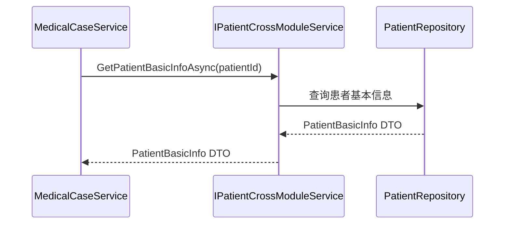

# 跨模块通信机制

## 定义与目标
跨模块通信机制是指在模块化架构中，不同业务模块（如医案、患者、药材、认证等）之间进行数据交换和业务联动的标准化方式。在 LYBTZYZS 系统中，该机制严格区分 Server 端和 Desktop 端的实现策略，旨在消除循环依赖，保障架构的单向依赖性，确保各业务模块能够独立演进并保持数据一致性。

## Server 端：基于 ISP 的域专用接口
在 ASP.NET Core WebAPI 层，模块间通信通过定义在共享层（Shared Layer）或核心契约层的接口进行，严格遵循**接口隔离原则 (ISP)**。模块间严禁直接引用其他模块的 `Repository`、`DbContext` 或具体 Service 实现。

### 核心接口与演进
系统正从通用的 `ICrossModuleService` 逐步迁移至更细粒度的域专用接口，以减少不必要的依赖暴露：

* **ICrossModuleService**：通用的跨模块数据查询接口。
  * `GetHerbByNameOrPinyinAsync(string nameOrPinyin)`：用于验方模块在导入或验证时，从药材模块获取药材信息。
  * `GetHerbBasicInfoAsync(int herbId)`：获取药材的基础元数据。
* **IPatientCrossModuleService**：提供患者基本信息查询 (`GetPatientBasicInfoAsync`) 及引用检查（如删除前检查是否有活跃医案）。
* **IHerbCrossModuleService**：提供药材信息查询及引用检查（如禁用前检查是否有未完成的处方）。
* **IUserCrossModuleService**：提供用户身份验证辅助及凭证操作。
* **ICrossModuleAuthService**：认证领域的专用跨模块接口。
  * `RevokeAllUserTokensAsync(int userId)`：当用户管理模块执行禁用、删除或重置密码等操作时（共 6 个场景），调用此方法通知认证模块立即撤销该用户的所有活跃 Token，确保权限即时生效与会话安全。

### 实施规则与流程
1. **契约先行**：在 Shared 层或契约项目中定义接口方法。
2. **数据持有方实现**：由实际持有数据的模块负责实现该接口。
3. **依赖注入调用**：调用方通过 DI 容器注入接口进行调用，严禁跨模块直接 `new` 或注入具体实现类。
4. **模块内自由调用**：同一模块内的 Service 层组件可以互相直接调用，无需经过跨模块接口。

### 通信流程示例
以下时序图展示了 `MedicalCase` 模块如何通过接口依赖获取患者信息，而不直接依赖 `Patients` 模块的具体实现：

### 性能考量与异常处理
* **同步调用开销**：跨模块调用通常涉及额外的服务定位和方法调用开销。在高频场景下，应考虑在调用方引入局部缓存，或由提供方提供批量查询接口以减少往返次数。
* **错误传播**：跨模块调用产生的异常应遵循 [异常类型体系](12-exception-hierarchy.md)，并在调用方进行适当的捕获和处理，避免底层实现细节泄露。

## Desktop 端：基于 Prism 的导航与事件总线
在 WPF Desktop 客户端，模块间不共享 ViewModel 引用，主要依赖 Prism 框架提供的导航与事件机制进行解耦交互。

### 核心组件
* **NavigationCoordinator**：封装 `IRegionManager`，提供统一的视图导航入口。模块间不直接引用彼此的 View 或 ViewModel，而是通过区域名称进行导航请求。
* **NavigationParameters**：用于在导航过程中传递轻量级数据（如主键 ID、状态标志位）。
* **IEventAggregator**：用于发布/订阅松散耦合的全局事件。

### 实施规则
1. **无状态导航**：ViewModel 之间不应持有彼此的引用。
2. **参数传递**：通过 `NavigationParameters` 传递必要的上下文信息，目标 ViewModel 在 `OnNavigatedTo` 生命周期方法中接收参数并加载数据。
3. **事件总线（按需使用）**：对于非导航类的松散耦合通知（如患者档案更新时发布 `PatientUpdatedEvent`，其他模块订阅以刷新缓存或 UI 状态），可使用 `IEventAggregator`。但需谨慎使用，避免业务逻辑过度分散。

## 核心设计原则
1. **禁止直接依赖**：任何模块不得直接跨模块实例化或注入其他业务模块的服务类、仓储或上下文。
2. **轻量级数据传输**：跨模块通信返回的数据应为精简的 BasicInfo DTO 或导航参数，避免传输大量冗余数据。
3. **单向数据流**：通信应遵循清晰的数据流向，严格避免循环调用，是单向依赖原则在运行时交互层面的具体落地。
4. **契约共享**：跨模块接口通常定义在共享层架构中，确保 Server 和 Client 端均可引用统一契约。

## 相关概念
* 单向依赖原则 (规划中)
* [组件分解](18-mvvm-prism.md)
* 服务端架构 (规划中)
* 共享层架构 (规划中)
* [异常类型体系](12-exception-hierarchy.md)
* NavigationCoordinator (规划中)
* ICrossModuleService (规划中)
* ICrossModuleAuthService (规划中)