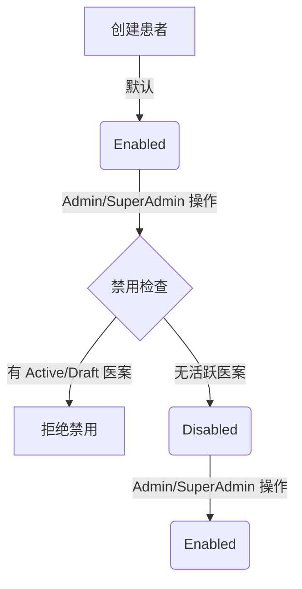

# 患者状态生命周期

## 定义

患者状态生命周期描述了患者档案从创建、启用、禁用到恢复的状态流转过程，以及不同状态下系统行为的约束规则。该机制主要用于处理已故患者、长期失联或特殊隐私保护场景，确保历史数据保留的同时限制不当操作。

## 状态定义

| 状态 | 说明 | 适用场景 |
|------|------|----------|
| **Enabled (启用)** | 默认状态，所有功能正常可用。 | 正常就诊患者。 |
| **Disabled (禁用)** | 限制新业务创建，列表可见性受限，姓名脱敏显示。 | 患者已故、长期未就诊且需隐藏、隐私保护要求。 |

## 状态流转规则

## 行为约束矩阵

| 操作/场景 | Enabled 状态 | Disabled 状态 |
|-----------|--------------|---------------|
| **创建新医案** | 允许 | **禁止** (返回 ERR-30105) |
| **前台列表可见性** | 可见 | **不可见** (自动过滤) |
| **医生列表可见性** | 可见 | 可见 (标注"禁用") |
| **管理员列表可见性** | 可见 | 可见 (标注"禁用") |
| **历史医案姓名显示 (医生)** | 完整姓名 | **脱敏** (如 "张*") |
| **历史医案姓名显示 (管理员)** | 完整姓名 | 完整姓名 |
| **删除操作** | 需通过引用检查 | 需通过引用检查 |
| **数据导出** | 完整数据 | 待定 (OQ-PAT-04) |

## 关键业务规则

1.  **禁用前置检查**：禁用患者前，系统必须校验其是否存在状态为 `Draft` 或 `Active` 的医案。若存在，必须先将医案完成或取消，否则拒绝禁用操作。
2.  **角色差异化脱敏**：禁用后，为了保护隐私或避免误导，医生在查看历史病历时看到的患者姓名将被掩码处理，而管理员仍可查看完整信息以进行审计或数据维护。
3.  **前台隔离**：前台接待人员（Receptionist）在查询患者列表时，系统自动过滤掉所有禁用状态的患者，防止误为已故或特殊患者预约。

## 相关链接

- [患者模块](modules/patient-module.md)
- [医案模块](modules/medical-case-module.md)
- user-personas
- resource-level-permissions