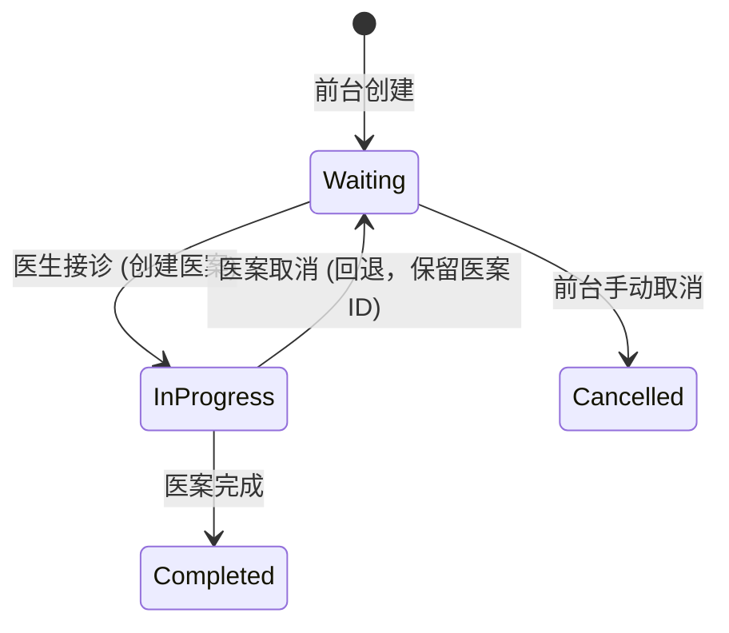
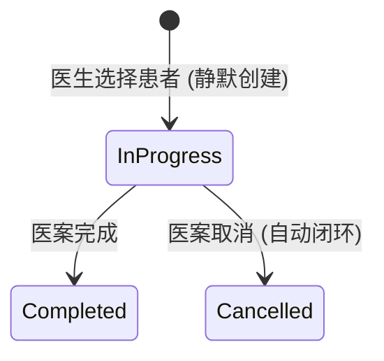

# 挂号生命周期与状态机

## 概述

**挂号生命周期 (Registration Lifecycle)** 定义了 `Registration` 实体从创建到终结的状态流转规则。其核心特征是**双模式入口**和**与医案状态的强耦合联动**。挂号状态并非独立演变，而是作为诊疗流程的“影子”，反映 [医案](modules/medical-case-module.md) 的进展。

## 状态定义

| 状态 | 说明 | 触发条件 |
|------|------|----------|
| **Waiting** | 等待接诊 | 前台创建挂号后；或医生模式下医案取消后回退至此。 |
| **InProgress** | 接诊中 | 医生从队列选中患者；或医生模式下静默创建时。 |
| **Completed** | 已完成 | 关联医案状态变为 Completed。 |
| **Cancelled** | 已取消 | 前台手动取消；或医生模式下医案取消后自动闭环。 |

## 双模式流转图

### 1. 前台模式 (Source = Receptionist)

*   **关键特征**：
    *   **回退机制**：医案取消后，挂号不回直接 Cancelled，而是回退至 `Waiting`。这允许前台重新安排患者或确认取消。
    *   **原医案恢复**：若挂号回退至 `Waiting`，医生再次接诊时，系统应**恢复**原医案（撤销软删除），而非创建新医案，以保留之前的诊断草稿。

### 2. 医生模式 (Source = Doctor)

*   **关键特征**：
    *   **静默创建**：医生无感知挂号存在，系统后台原子性创建 `Registration` (InProgress) 和 `MedicalCase`。
    *   **自动闭环**：医案取消直接导致挂号 Cancelled，无需前台介入。

## 关键业务规则

*   **状态联动 (Auto-Sync)**：`Registration` 的状态变更主要由 `MedicalCase` 的状态变更事件驱动（见 临床业务规则 REG-BR-005, REG-BR-006）。
*   **取消权限隔离**：
    *   `Source=Receptionist` 的挂号，仅 Receptionist 有权执行最终取消（REG-BR-002）。
    *   `Source=Doctor` 的挂号，由系统自动处理取消，医生无权手动操作挂号状态。
*   **取消前置校验 (REG-BR-001)**：
    *   仅当 `Status=Waiting` 且（无关联医案 OR 关联医案状态为 Cancelled）时，才允许执行取消操作。
    *   若存在 Active/Suspended/Completed 医案，拒绝取消并返回错误码 `REG-70003`。

## 数据一致性保障

*   **事务性创建**：在医生模式下，`Registration` 和 `MedicalCase` 必须在同一事务中创建（本地 LocalDB 模式尤为关键），确保数据不遗漏。
*   **软删除恢复**：前台模式下的“回退”逻辑要求 `MedicalCase` 模块支持将已软删除的医案恢复为 Active 状态，这在常规单向状态机中属于特殊逆向流转，需特别注意实现细节。

## 相关链接

*   [挂号模块](modules/registration-module.md)
*   [医案模块](modules/medical-case-module.md)
*   临床业务规则（business-rules，待补充）
*   [临床工作流](clinical-workflow.md)