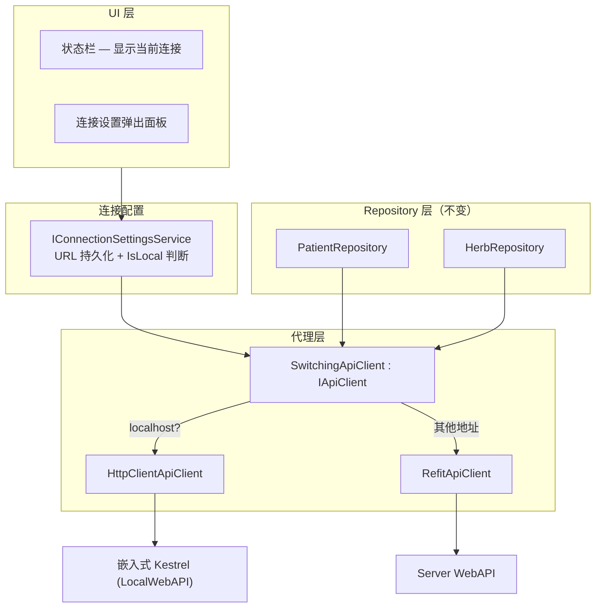

## 概述

双模式架构是凌隐宝堂中医诊所管理系统的核心设计特性，旨在同时满足诊所内网多用户在线协作和外出诊疗/网络故障时的离线单机作业需求。系统采用 **URL 驱动的连接切换机制**，用户无需手动选择“模式”。通过 `SwitchingApiClient` 代理根据当前配置的 URL 自动路由：非 localhost 地址使用 Refit 客户端访问远程服务器，localhost/127.0.0.1 则访问嵌入式 Kestrel WebAPI（本地 SQL Server）。该设计统一了数据访问层，Repository 层对底层实现完全无感知，彻底消除了早期架构中复杂的运行时状态切换逻辑。

## 架构演进历程

该系统的双模式架构经历了一次重大重构，从早期的“策略模式+运行时切换”演变为当前的“Remote + LocalWebAPI”架构。

| 版本/阶段 | 决策/代号 | 核心机制与说明 |
|-----------|-----------|----------------|
| **早期架构** | 初始策略模式 | 采用 `IDataSource` 抽象数据访问层，通过 `ConnectionMode` 配置在启动或运行时动态切换 DI 注册。本地存储最初为 SQLite，后迁移至 SQL Server LocalDB。**缺陷**：运行时切换逻辑复杂，易导致状态不一致；维护两套数据访问实现成本高。 |
| v2.0 | SYNC-D02 | 废除 `IDataSource` 抽象层，改用 Repository 双实现。 |
| v3.0 | SYNC-D03 | 移除运行时模式切换枚举。 |
| v5.0 | LOCALWEB | 引入 SQL Server 作为本地数据库，嵌入 Kestrel 服务。 |
| v6.0 | URL-CONN-01 | **当前架构基线**。确立 URL 驱动连接切换，废弃 `ApiMode` 枚举。统一使用 HTTP API (Refit) 交互，模式完全由 API Base URL 决定，业务层代码完全统一。 |

## 核心架构设计

### 连接路由逻辑

| URL 类型 | 客户端实现 | 目标服务 | 数据库 | 适用场景 |
|----------|-----------|---------|--------|----------|
| **非 localhost** | `RefitApiClient` | Server WebAPI | SQL Server (远程) | 多用户联网环境 |
| **127.0.0.1 / localhost** | `HttpClientApiClient` | 嵌入式 Kestrel (`LocalWebAPI`) | SQL Server LocalDB (本地) | 单用户离线/网络故障 |

### SwitchingApiClient 代理机制

`SwitchingApiClient` 实现了统一的 `IApiClient` 接口，内部维护两个底层实现：
- `_remoteApi` (`RefitApiClient`): 用于非 localhost 场景。
- `_localApi` (`HttpClientApiClient`): 用于 localhost/127.0.0.1 场景。

每次属性访问时实时读取 `IConnectionSettingsService.CurrentUrl`，URL 变更时自动重建底层客户端。配合 `IConnectionSettingsService` 完成 URL 持久化与 `IsLocal` 判断，确保 Repository 层零改动。

### 架构组件关系

### 关键组件说明
- **LocalWebAPI**: 轻量级 ASP.NET Core 应用，嵌入在 Desktop 客户端进程中或作为子进程运行（由 Desktop Shell 负责生命周期管理）。提供与远程服务端完全一致的 API 契约，数据持久化至本地 SQL Server LocalDB。
- **Sync Module**: 负责本地与远程数据同步。网络恢复时触发，上传本地新增/修改数据并拉取服务端更新。
- **Auth Module**: 本地模式下，`LocalWebAPI` 负责验证用户凭据并颁发本地有效的长效 JWT Token（1年有效期），确保认证流程与远程模式保持一致。

## 功能覆盖与数据同步

### 端点覆盖与本地增强
`LocalWebAPI` 实现了与远程服务端几乎完全一致的端点集合，覆盖 Auth、Users、Patients、Herbs、Formulas、MedicalCases、Registrations、Sync 等所有核心模块，总计约 **102 个端点**，覆盖率接近 100%。

**本地模式独有端点**（增强离线体验）：
- 验方克隆
- 按身份证号查询患者
- 待处理医案查询
- 数据库诊断信息

### 数据同步策略
- **同步范围**: 药材 (`Herb`)、患者 (`Patient`)、验方 (`Formula`)。
- **冲突解决**: 采用手动冲突解决机制。检测到同一记录在两端均有修改时，弹出对话框由用户选择保留版本。
- **医案与用户处理**: v1.0 中 **医案 (`MedicalCase`)** 和 **用户 (`User`)** 不参与双向同步。医案被视为高度上下文相关的临时数据，通常在本地完成诊疗闭环后通过其他方式处理；用户数据仅支持初始化下载，后续仅手动维护。

## 限制与安全考量

### 本地模式功能限制
部分对服务端有强依赖的功能在本地模式下不可用或行为受限：
- **Token 刷新**: 本地使用长效 Token（1年），不支持 Refresh Token 轮换机制。
- **审计日志查询**: 本地暂不持久化系统级审计日志。
- **自动登录令牌同步**: 自动登录依赖远程中心化存储，本地无法同步。
- **用户数据同步**: 用户数据不参与自动同步，需手动维护。

### 安全与数据保护
- **本地数据存储安全**: 本地模式使用 SQL Server LocalDB。需注意本地数据库文件的物理安全，建议结合操作系统的用户权限控制访问。
- **敏感数据处理**: 尽管本地模式在局域网或单机运行，仍需遵循[敏感数据分级与保护](sensitive-data-classification.md)原则。对身份证号、手机号等字段需进行脱敏或加密存储（v1.0 初期主要依赖 OS 权限控制，后续版本将逐步强化应用层加密）。

## 相关链接

- 项目整体概览
- ADR-002-dual-mode-architecture - 架构决策记录
- [数据同步模块](modules/sync-module.md) - 同步模块详细设计
- [认证模块](modules/auth-module.md) - 认证模块详细设计
- Desktop Shell - 负责 LocalWebAPI 生命周期管理
- [敏感数据分级与保护](sensitive-data-classification.md) - 数据安全规范