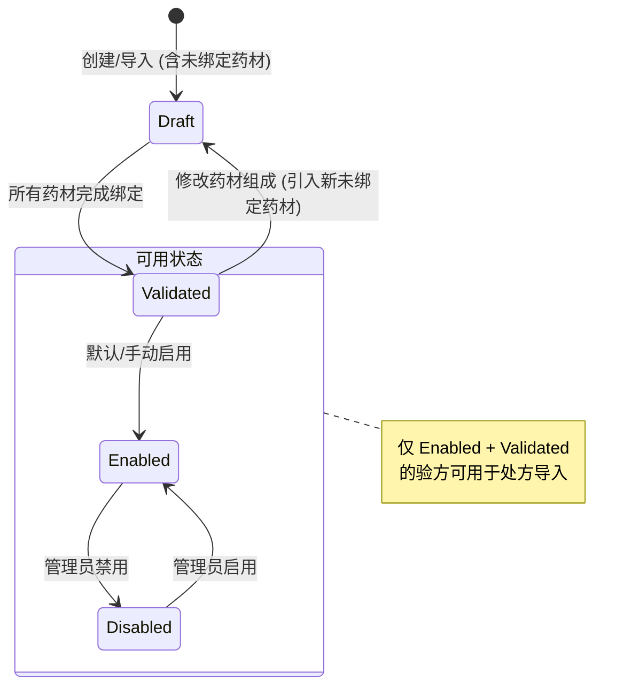

# 验方验证工作流

**验方验证工作流**定义了 [验方](modules/formula-module.md) 从创建/导入到可用于临床处方的状态流转过程，旨在确保处方数据的准确性和安全性。

## 状态定义

| 状态 | 说明 | 触发条件 |
|------|------|----------|
| **Draft (草稿/未验证)** | 验方中包含至少一个未绑定标准药材库的药材项 (`HerbId=null`)。 | 创建/导入时存在匹配失败的药材；或手动重置验证状态。 |
| **Validated (已验证)** | 验方中所有药材项均已成功绑定标准药材库 (`HerbId!=null` 且 `IsValidated=true`)。 | 所有药材项完成手动或自动绑定。 |

## 启用/禁用状态

除了验证状态，验方还有一个独立的 `Status` (Enabled/Disabled)：

*   **Enabled (启用)**：默认状态。
*   **Disabled (禁用)**：管理员可禁用存在争议或过时的验方。

## 处方导入约束 (MC-D08)

根据决策 **MC-D08**，在 [医案模块](modules/medical-case-module.md) 开具处方时，验方导入对话框**仅展示**同时满足以下两个条件的验方：
1.  `ValidationStatus == Validated`
2.  `Status == Enabled`

这意味着 `Draft` 状态或 `Disabled` 状态的验方对医生不可见，从而防止错误或未清洗的数据被用于临床诊疗。

## 工作流图示

## 角色职责

*   **医生**：创建验方，初步验证自己的药材绑定。
*   **管理员**：查看“待验证验方”列表，集中处理历史迁移数据的批量绑定；禁用不合格验方。

## 相关错误码

*   `ERR-60201` ~ `ERR-60205`：药材验证过程中的具体错误（如药材项不存在、已验证、所选药材无效等）。
