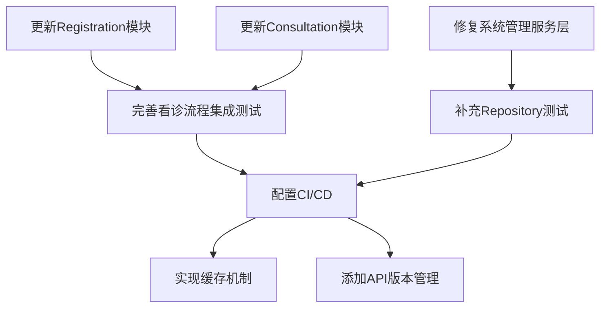

# 下一阶段任务分析

## 任务概览

**分析日期**: 2025年8月7日  
**分析基础**: 基于已完成的控制器优化和测试结果  
**目标**: 完善系统架构，提高测试覆盖率，建立自动化流程

## 任务优先级分析

### 🔥 紧急任务（Priority: High）

#### 1. 更新 Registration 模块的 API 接口
**任务ID**: update-registration-module  
**预计工时**: 4-6小时  
**影响范围**: 
- 挂号预约功能
- 看诊流程的起始环节
- TC-013 集成测试用例

**具体工作**:
```
1. 检查 RegistrationController 的接口设计
2. 移除重复接口（如 GetPaged, Add 等）
3. 统一使用 RESTful 风格
4. 添加 toggle-status 接口
5. 更新前端 RegistrationService
6. 添加单元测试
```

**技术要点**:
- 保持与其他模块一致的响应格式
- 确保挂号状态流转正确
- 处理并发挂号的情况

#### 2. 更新 Consultation 模块的 API 接口
**任务ID**: update-consultation-module  
**预计工时**: 6-8小时  
**影响范围**:
- 看诊核心功能
- 中医四诊记录
- 处方开具流程

**具体工作**:
```
1. 优化 ConsultationController 接口
2. 统一看诊状态管理
3. 完善中医四诊的数据结构
4. 更新前端 ConsultationService
5. 修复看诊流程集成
6. 添加完整的单元测试
```

**技术要点**:
- 支持看诊过程的实时保存
- 确保数据完整性
- 优化大数据量查询性能

#### 3. 修复系统管理模块的服务层使用问题
**任务ID**: fix-system-management-services  
**预计工时**: 3-4小时  
**影响范围**:
- UserManagementViewModelSimple
- FormulaManagementViewModel
- HerbManagementViewModelRefactored

**问题描述**:
```csharp
// 错误用法
public UserManagementViewModelSimple(IUserApiService userApiService)

// 正确用法
public UserManagementViewModelSimple(IUserService userService)
```

**修复步骤**:
1. 创建缺失的服务层接口
2. 实现服务层逻辑
3. 更新 ViewModel 依赖注入
4. 注册服务到 DI 容器
5. 验证功能正常

### 📌 重要任务（Priority: Medium）

#### 4. 补充 Repository 层单元测试
**任务ID**: add-repository-tests  
**预计工时**: 8-10小时  
**测试范围**:
- UserRepository
- PatientRepository
- HerbRepository
- PrescriptionRepository
- ConsultationRepository

**测试策略**:
```csharp
// 使用内存数据库
var options = new DbContextOptionsBuilder<AppDbContext>()
    .UseInMemoryDatabase(databaseName: "TestDb")
    .Options;

// 测试 CRUD 操作
// 测试复杂查询
// 测试事务处理
// 测试并发操作
```

**预期覆盖率**: 达到 85% 以上

#### 5. 配置持续集成 (CI/CD)
**任务ID**: setup-ci-cd  
**预计工时**: 4-6小时  
**平台选择**: GitHub Actions / Azure DevOps

**CI 流程设计**:
```yaml
1. 代码提交触发
2. 恢复 NuGet 包
3. 编译解决方案
4. 运行单元测试
5. 生成测试报告
6. 代码质量检查
7. 构建 Docker 镜像
8. 发布到测试环境
```

**关键配置**:
- 测试覆盖率门槛: 70%
- 代码质量检查: SonarQube
- 自动版本号管理
- 构建状态通知

### 💡 优化任务（Priority: Low）

#### 6. 实现缓存机制
**任务ID**: implement-caching  
**预计工时**: 6-8小时  
**缓存策略**:
- 内存缓存: 热点数据
- Redis 缓存: 分布式场景
- 缓存失效策略

**重点缓存内容**:
1. 用户权限信息
2. 药材基础数据
3. 验方模板
4. 系统配置

#### 7. 添加 API 版本管理
**任务ID**: add-api-versioning  
**预计工时**: 3-4小时  
**版本策略**:
- URL 路径版本: /api/v2/users
- Header 版本: api-version: 2.0
- 向后兼容支持

## 任务依赖关系



## 资源需求分析

### 人力资源
- 后端开发: 2人
- 前端开发: 1人
- 测试工程师: 1人
- DevOps: 1人

### 时间估算
- 紧急任务: 3-4天
- 重要任务: 3-4天
- 优化任务: 2-3天
- **总计**: 8-11天

### 技术栈要求
- .NET 8 高级特性
- xUnit 测试框架
- Docker 容器化
- GitHub Actions / Azure DevOps
- Redis 缓存

## 风险评估

### 技术风险
1. **看诊流程复杂性**
   - 风险: 流程涉及多个模块协调
   - 缓解: 详细设计文档，充分测试

2. **性能瓶颈**
   - 风险: 大数据量查询性能问题
   - 缓解: 提前实施缓存机制

3. **架构一致性**
   - 风险: 不同开发人员理解差异
   - 缓解: 制定严格的代码规范

### 进度风险
1. **并行开发冲突**
   - 风险: 多人同时修改相关代码
   - 缓解: 合理分配任务，频繁合并

2. **测试时间不足**
   - 风险: 赶进度导致测试不充分
   - 缓解: 测试驱动开发，自动化测试

## 成功标准

### 短期目标（2周内）
- ✅ Registration 和 Consultation 模块完成优化
- ✅ 所有系统管理模块符合架构规范
- ✅ 看诊流程集成测试 100% 通过
- ✅ 单元测试覆盖率达到 80%
- ✅ CI/CD 流程正常运行

### 长期目标（1个月内）
- ✅ 系统响应时间提升 30%
- ✅ 代码质量评分达到 A 级
- ✅ 自动化部署流程完善
- ✅ API 文档自动生成
- ✅ 性能监控体系建立

## 行动计划

### Week 1（第一周）
- Day 1-2: 更新 Registration 和 Consultation 模块
- Day 3: 修复系统管理模块服务层
- Day 4-5: 完善看诊流程集成测试

### Week 2（第二周）
- Day 1-2: 补充 Repository 层测试
- Day 3-4: 配置 CI/CD 流程
- Day 5: 测试和优化

### Week 3（第三周）
- Day 1-2: 实现缓存机制
- Day 3: 添加 API 版本管理
- Day 4-5: 整体测试和文档更新

## 注意事项

1. **保持向后兼容**: 更新 API 时确保不破坏现有功能
2. **充分测试**: 每个改动都要有对应的测试用例
3. **文档同步**: 及时更新 API 文档和技术文档
4. **代码审查**: 重要改动需要团队审查
5. **性能监控**: 关注改动对性能的影响

## 预期成果

完成这一阶段的任务后，系统将达到：
- 🏗️ **架构一致性**: 100% 符合分层架构规范
- 🧪 **测试覆盖率**: 整体达到 80% 以上
- 🚀 **自动化程度**: CI/CD 完全自动化
- 📊 **性能提升**: 响应时间减少 30%
- 📚 **文档完整性**: API 文档 100% 覆盖

这将为系统的长期稳定运行和持续演进奠定坚实基础。