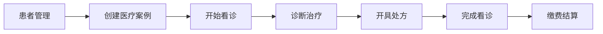

# 看诊流程集成测试方案

## 测试概览

**目标**: 验证完整的看诊流程功能正确性和数据一致性  
**范围**: 从患者创建到看诊完成的全流程  
**说明**: 本版本无挂号模块，流程从患者管理开始

## 看诊流程分析

### 标准流程（无挂号）



### 涉及模块

1. **Patients** - 患者档案管理
2. **MedicalCase** - 医疗案例管理
3. **Consultation** - 看诊管理（核心）
4. **Prescriptions** - 处方管理
5. **Billing** - 缴费结算

## 测试场景设计

### 场景1: 新患者完整看诊流程

**前置条件**: 系统中无该患者信息

**测试步骤**:
1. 创建新患者档案
2. 为患者创建医疗案例
3. 开始看诊
4. 录入四诊信息（望闻问切）
5. 设置诊断结果
6. 开具中药处方
7. 完成看诊
8. 验证数据一致性

**预期结果**:
- 患者信息正确保存
- 医疗案例状态正确
- 看诊记录完整
- 处方关联正确

### 场景2: 老患者复诊流程

**前置条件**: 患者已有历史就诊记录

**测试步骤**:
1. 查询现有患者
2. 查看历史就诊记录
3. 创建新的医疗案例
4. 开始新的看诊
5. 参考历史处方开具新处方
6. 完成看诊

**预期结果**:
- 能正确获取历史记录
- 新旧记录互不影响
- 历史处方可参考

### 场景3: 看诊状态流转测试

**测试重点**: 验证看诊状态的正确流转

**状态流转**:
- 待看诊 → 看诊中 → 已完成
- 待看诊 → 看诊中 → 已取消

**测试步骤**:
1. 创建看诊记录（待看诊）
2. 开始看诊（看诊中）
3. 完成看诊（已完成）
4. 测试取消流程

### 场景4: 并发看诊测试

**测试目标**: 验证多个医生同时看诊的情况

**测试步骤**:
1. 创建多个医生账号
2. 同时开始多个看诊
3. 验证数据隔离性
4. 验证队列管理

### 场景5: 异常流程测试

**测试场景**:
1. 看诊中断后恢复
2. 重复开始看诊
3. 无效状态转换
4. 数据不完整提交

## 测试数据准备

### 基础数据

```json
{
  "testPatient": {
    "name": "测试患者",
    "gender": "男",
    "age": 35,
    "phone": "13800138000",
    "idCard": "110101198801010001"
  },
  "testDoctor": {
    "username": "testdoctor",
    "realName": "测试医生",
    "department": "中医内科"
  },
  "testHerbs": [
    {
      "name": "黄芪",
      "category": "补虚药",
      "price": 0.5
    },
    {
      "name": "当归",
      "category": "补血药",
      "price": 0.8
    }
  ]
}
```

### 四诊信息模板

```json
{
  "inspection": "面色偏黄，精神尚可",
  "auscultationOlfaction": "语音低微，口气正常",
  "inquiry": "主诉：疲劳乏力3月余。现病史：近3月来感觉疲劳...",
  "palpation": "脉象：脉细弱",
  "tongueInspection": "舌质淡，苔薄白",
  "tcmDiagnosis": "气虚证",
  "diagnosis": "慢性疲劳综合征"
}
```

## 技术实现

### 1. 集成测试框架

使用 xUnit + ASP.NET Core TestServer

```csharp
public class ConsultationFlowIntegrationTests : IClassFixture<WebApplicationFactory<Program>>
{
    private readonly WebApplicationFactory<Program> _factory;
    private readonly HttpClient _client;
    
    public ConsultationFlowIntegrationTests(WebApplicationFactory<Program> factory)
    {
        _factory = factory;
        _client = _factory.CreateClient();
    }
}
```

### 2. 测试工具类

```csharp
public class TestDataHelper
{
    public static PatientCreateDto CreateTestPatient(string suffix = "")
    {
        // 创建测试患者数据
    }
    
    public static async Task<string> GetAuthTokenAsync(HttpClient client)
    {
        // 获取认证令牌
    }
}
```

### 3. 断言验证

```csharp
public static class ConsultationAssertions
{
    public static void AssertConsultationValid(ConsultationDetailDto consultation)
    {
        consultation.Should().NotBeNull();
        consultation.Id.Should().NotBeEmpty();
        consultation.Status.Should().BeOneOf(expected);
        // 更多断言...
    }
}
```

## 执行计划

### 第一阶段：基础流程测试（2小时）
1. 搭建测试框架
2. 实现场景1：新患者完整流程
3. 验证基本功能

### 第二阶段：复杂场景测试（2小时）
1. 实现场景2：老患者复诊
2. 实现场景3：状态流转
3. 边界条件测试

### 第三阶段：异常和性能测试（1小时）
1. 异常流程处理
2. 并发测试
3. 性能基准测试

## 预期成果

1. **测试覆盖率**: 核心流程 100% 覆盖
2. **测试用例数**: 20+ 个集成测试用例
3. **文档产出**: 
   - 测试执行报告
   - 发现的问题列表
   - 性能测试结果

## 风险和注意事项

1. **数据隔离**: 每个测试用例使用独立的测试数据
2. **事务回滚**: 测试完成后清理测试数据
3. **并发控制**: 注意测试执行的并发问题
4. **环境依赖**: 确保测试环境配置正确

## 成功标准

- ✅ 所有核心流程测试通过
- ✅ 无阻塞性缺陷
- ✅ 性能满足要求（单次看诊 < 3秒）
- ✅ 数据一致性验证通过