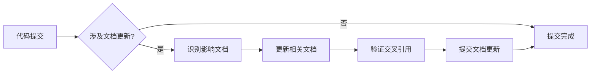

# 文档维护流程规范

**文档版本**：v1.0  
**创建时间**：2025-09-25  
**维护负责**：Claude Code  
**关联文档**：[文档系统架构](DOCUMENTATION_SYSTEM.md), [开发者指导](DEVELOPER_GUIDE.md)

## 🎯 维护目标

确保LYBTZYZS文档系统作为**开发工作的权威标准和限制**，维护其：
- **权威性**：文档内容是技术决策的唯一可信来源
- **实时性**：文档与代码保持同步，无滞后风险
- **一致性**：文档格式和质量标准统一执行
- **可用性**：开发者能快速准确地获取所需信息

## 👥 角色职责矩阵

### 主要维护角色

| 角色 | 核心职责 | 主要文档类型 | 更新触发条件 |
|------|----------|--------------|--------------|
| **Thinker** | 架构治理、需求管理、战略决策 | README.md, architecture/, prd/, tasks/pending/ | 架构变更、需求变化、任务发布 |
| **Claude Code** | 开发实现、技术文档、实施报告 | CLAUDE.md, development/, api/, src/*/README.md, tasks/completed/ | 代码实现、规范变化、任务完成 |
| **系统自动化** | 代码驱动文档、接口规范 | OpenAPI规范、XML文档、依赖图 | 代码提交、构建过程、部署流程 |

### 协作边界
- **Thinker优先**：架构决策、业务需求、项目规划类文档
- **Claude Code优先**：技术实现、开发指导、操作手册类文档
- **共同维护**：README.md根文档（Thinker负责业务架构，Claude Code负责技术实现）

## 🔄 维护工作流程

### 1. 日常维护流程

#### 代码变更驱动的文档更新


**触发条件**：
- 新增API端点 → 更新api/README.md + OpenAPI规范
- 架构调整 → 更新architecture/相关ADR + 根README.md
- 模块重构 → 更新src/*/README.md + development/规范文档
- 配置变更 → 更新环境配置文档 + 开发者指导

#### 定期检查和维护

**每周检查**（自动化脚本）：
- 检测超过7天未更新但代码有变更的文档
- 验证所有交叉引用链接的有效性
- 识别孤立文档（无引用的文档）
- 生成文档健康度报告

**每月回顾**（人工审查）：
- 检查文档架构是否需要调整
- 评估文档使用频率和效果
- 识别重复或冗余的文档内容
- 规划下月的文档优化计划

**每季度审计**（全面评估）：
- 文档系统完整性评估
- 开发者满意度调研
- 文档维护效率分析
- 文档标准规范更新

### 2. 文档创建流程

#### 新文档创建标准流程
1. **需求确认**：明确文档目标受众、解决的问题、预期效果
2. **模板选择**：使用对应层级和类型的标准模板
3. **内容创建**：遵循文档标准规范，包含必要元信息
4. **交叉引用**：建立与相关文档的双向链接
5. **质量检查**：使用文档验证脚本检查格式和链接
6. **导航更新**：更新相应的README索引和导航结构

#### 文档模板体系
```
docs/templates/
├── README-L1-template.md      # 项目总览层README模板
├── README-L2-template.md      # 领域专题层README模板  
├── README-L3-template.md      # 实施细节层README模板
├── ADR-template.md            # 架构决策记录模板
├── PRD-template.md            # 产品需求文档模板
├── TASK-template.md           # 任务文档模板
└── REPORT-template.md         # 报告文档模板
```

### 3. 文档更新流程

#### 强制更新场景
以下场景**必须**触发相应文档更新，否则不允许合并代码：

| 变更类型 | 必须更新的文档 | 验证方式 |
|----------|----------------|----------|
| API接口变更 | api/README.md + OpenAPI规范 | API文档构建检查 |
| 架构设计变更 | architecture/相关ADR + 根README.md | 架构评审会议记录 |
| 依赖关系变更 | 相关项目README.md + 根依赖说明 | 依赖图自动更新 |
| 配置参数变更 | 配置文档 + 开发者指导 | 环境验证脚本 |
| 业务流程变更 | 相关PRD + 业务文档 | 业务验收测试 |

#### 文档冲突解决
当多个角色需要同时更新同一文档时：
1. **沟通优先**：通过任务系统或直接沟通协调更新内容
2. **分工明确**：按照角色职责矩阵确定主要负责人
3. **版本控制**：使用Git合并解决冲突，保留完整变更历史
4. **质量保证**：重要文档的重大更新需要交叉审查

## 🛠 自动化工具和脚本

### 文档健康检查脚本
```powershell
# docs/scripts/DocumentationHealthCheck.ps1
# 功能：全面检查文档系统健康状态

参数：
  -CheckLinks          # 验证所有交叉引用链接
  -CheckFormat         # 检查文档格式规范符合度  
  -CheckTimestamp      # 识别过期文档（>7天未更新）
  -GenerateReport      # 生成详细健康度报告
  -FixableBrokenLinks  # 自动修复可修复的断链

输出：
  - 健康度评分（0-100）
  - 问题清单和修复建议
  - 文档覆盖率统计
  - 维护优先级建议
```

### 文档同步验证脚本
```powershell
# docs/scripts/DocumentationSyncCheck.ps1  
# 功能：检查代码变更与文档更新的同步性

参数：
  -Since <date>        # 检查指定日期以来的变更
  -ModuleFilter <name> # 仅检查指定模块
  -AutoFix             # 自动修复简单的同步问题

输出：
  - 未同步更新的文档列表
  - 代码-文档匹配度分析
  - 推荐的文档更新优先级
```

### 文档质量评估工具
```powershell
# docs/scripts/DocumentationQualityAssessment.ps1
# 功能：评估文档内容质量和使用效果

指标：
  - 完整性：必要章节的完整度
  - 准确性：与实际代码的一致性  
  - 可读性：结构清晰度和表达质量
  - 有用性：开发者反馈和使用频率

输出：
  - 每个文档的质量评分
  - 改进建议和优先级
  - 最佳实践案例识别
```

## 📊 质量标准和评估

### 文档质量评分体系

#### L1级文档（项目总览层）
- **完整性**（30%）：系统概览、技术栈、当前状态、构建说明
- **准确性**（25%）：与实际代码架构一致、状态信息及时更新
- **权威性**（25%）：技术约束明确、开发限制清晰
- **导航性**（20%）：到L2文档的链接完整有效

#### L2级文档（领域专题层）  
- **专业性**（30%）：领域知识深度、技术细节准确性
- **结构性**（25%）：逻辑清晰、章节组织合理
- **关联性**（25%）：与其他领域文档的交叉引用
- **实用性**（20%）：解决实际开发问题的有效性

#### L3级文档（实施细节层）
- **操作性**（35%）：步骤清晰、可直接执行
- **准确性**（30%）：与代码实现完全一致
- **时效性**（20%）：及时更新、无过期信息
- **完整性**（15%）：覆盖所有必要的操作细节

### 文档维护KPI指标

| 指标 | 目标值 | 计算方式 | 检查频率 |
|------|--------|----------|----------|
| **文档同步率** | >95% | (同步文档数/总文档数) × 100% | 每周 |
| **链接有效率** | >98% | (有效链接数/总链接数) × 100% | 每日 |
| **文档完整度** | >90% | (符合标准文档数/总文档数) × 100% | 每月 |
| **更新及时性** | <7天 | 代码变更到文档更新的平均时间 | 持续监控 |
| **开发者满意度** | >4.0/5.0 | 季度问卷调查平均分 | 每季度 |

## ⚠️ 维护纪律和执行力

### 强制执行规则

🚫 **零容忍**：
- 代码变更未同步更新文档 → **阻断合并请求**
- L1级README信息过期超过7天 → **暂停新功能开发**
- 断链和错误引用 → **立即修复，影响文档系统可信度**

✅ **激励机制**：
- 文档维护质量纳入开发者绩效评估
- 优秀文档案例作为团队最佳实践推广
- 文档改进建议和贡献给予公开认可

### 违规处理流程
1. **自动检测**：通过脚本工具自动识别违规情况
2. **及时通知**：向相关责任人发送提醒和修复指导
3. **宽限期**：提供24-48小时的修复时间窗口
4. **强制措施**：超时未修复则触发代码冻结或其他限制措施
5. **根因分析**：分析违规原因，改进工具和流程

## 🔄 持续改进机制

### 反馈收集渠道
- **开发者反馈**：通过任务系统提交文档问题和改进建议
- **使用数据**：通过工具统计文档访问频率和使用模式
- **质量评估**：定期的文档质量审查和评分
- **效率分析**：维护工作的时间成本和效果分析

### 优化改进策略
- **工具增强**：根据反馈不断改进自动化工具功能
- **流程简化**：消除不必要的维护步骤，提高效率
- **模板优化**：基于最佳实践持续改进文档模板
- **培训强化**：定期开展文档维护技能和意识培训

## 📅 实施计划

### Phase 1：基础建设（已完成）
- ✅ 建立文档系统架构
- ✅ 创建维护流程规范  
- ✅ 完善文档模板体系
- ✅ 更新现有核心文档

### Phase 2：工具开发（1-2周）
- 🔄 开发文档健康检查脚本
- 🔄 实现文档同步验证工具
- 🔄 集成到CI/CD流程
- 🔄 建立监控和告警机制

### Phase 3：流程优化（持续进行）
- 📋 收集使用反馈和改进建议
- 📋 优化维护工具和流程
- 📋 培训和推广最佳实践
- 📋 建立长期维护文化

---

## 🔗 相关资源

- [文档系统架构](DOCUMENTATION_SYSTEM.md) - 整体设计理念
- [开发者指导手册](DEVELOPER_GUIDE.md) - 使用文档系统的实践指南
- [文档模板集合](templates/) - 标准化文档创建模板
- [维护脚本工具](scripts/) - 自动化维护工具集

---

*本维护流程将随着项目发展和团队经验积累持续优化，确保文档系统始终为开发工作提供有效支撑。*