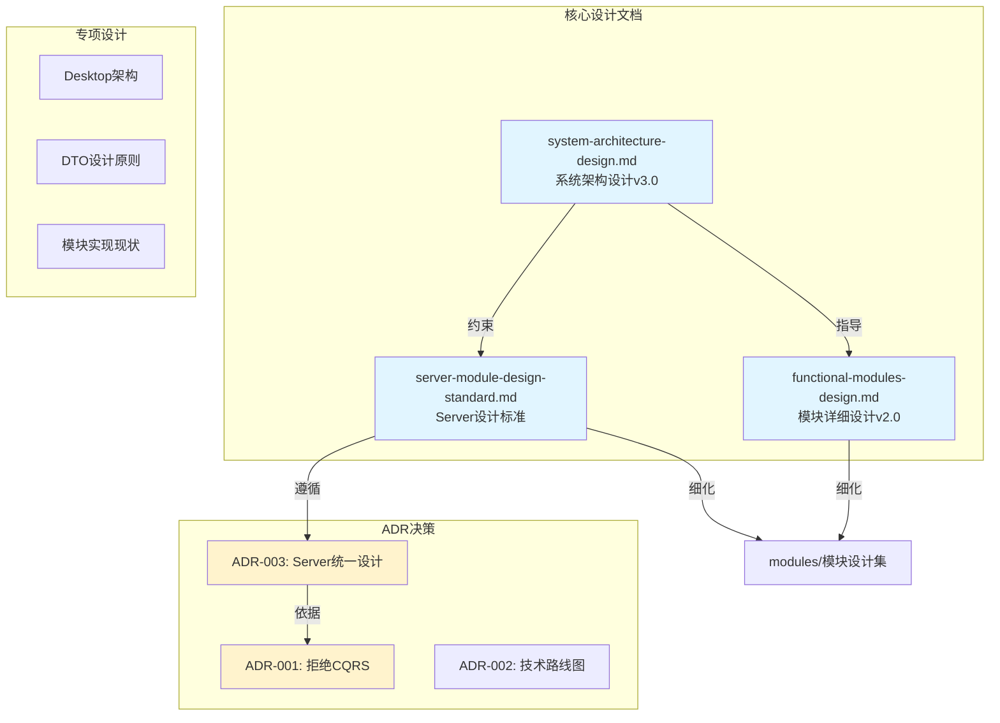

# 架构文档索引

- **维护人**：Claude Code
- **最后更新**：2025-10-11
- **版本**：v2.0（Phase 2 Day 3重构）

本目录收录LYBT项目的架构设计、决策记录（ADR）、专题分析与实施指南。

---

## 📖 快速导航

### 🎯 核心架构文档（必读）

| 文档 | 说明 | 版本 |
|------|------|------|
| **[system-architecture-design.md](system-architecture-design.md)** | **系统架构设计** - 整体架构图、技术栈、部署架构 | v3.0 |
| **[functional-modules-design.md](functional-modules-design.md)** | **功能模块详细设计** - 8个业务模块的完整设计 | v2.0 |
| **[server-module-design-standard.md](server-module-design-standard.md)** | **Server模块设计标准** - 三层架构、命名规范 | v1.0 |

> **阅读建议**：先读system-architecture-design.md了解宏观架构，再读functional-modules-design.md了解模块细节。

### 📝 ADR决策记录

| ADR | 标题 | 关键决策 |
|-----|------|---------|
| [ADR-001](ADR-001-cqrs-mediatr-rejection.md) | **拒绝CQRS + MediatR** | 禁止使用CQRS模式和MediatR库 |
| [ADR-002](ADR-002-technology-roadmap-suggestion.md) | 技术路线图建议 | P0-P3阶段规划 |
| [ADR-003](ADR-003-server-module-unified-design.md) | **Server模块统一设计** | 接口统一位置、禁止CQRS |

### 🏗️ 专项架构设计

#### Server端
- [server-module-design-standard.md](server-module-design-standard.md) - Server模块设计标准

#### Desktop端
- [desktop-core-new-architecture.md](desktop-core-new-architecture.md) - **Desktop核心架构** (权威文档，包含Issue #815完成的Core_New三层架构)

#### 跨层设计
- [dto-design-principles.md](dto-design-principles.md) - DTO设计原则

### 📂 子目录索引

| 目录 | 说明 |
|------|------|
| **[modules/](modules/README.md)** | **模块化设计文档集合** - Server/Client/Shared层详细设计 |
| [client/](client/) | 客户端架构设计 |
| [desktop/](desktop/) | 桌面应用架构 |
| [testing/](testing/) | 测试架构与策略 |
| [security/](security/) | 安全架构设计 |
| [tech-design/](tech-design/) | 技术设计文档 |
| [reports/](reports/) | 架构分析报告 |
| [adr/](adr/) | ADR存档目录 |

---

## 🗺️ 文档关系图

---

## 🎓 推荐阅读路径

### 新人入职（第一周）
1. 📘 [system-architecture-design.md](system-architecture-design.md) - 了解整体架构（30分钟）
2. 📗 [functional-modules-design.md](functional-modules-design.md) - 了解业务模块（1小时）
3. 📙 [ADR-001](ADR-001-cqrs-mediatr-rejection.md) + [ADR-003](ADR-003-server-module-unified-design.md) - 理解架构禁令（20分钟）
4. 📕 [modules/README.md](modules/README.md) - 查看最新模块设计（30分钟）

### 架构师/TechLead
1. 📘 [system-architecture-design.md](system-architecture-design.md) - 系统架构全貌
2. 📙 所有ADR文档 - 了解历史决策与理由
3. 📂 [reports/](reports/) - 查看最新架构分析报告
4. 📂 [modules/](modules/) - 审查模块设计文档

### Server端开发者
1. 📕 **[server-module-design-standard.md](server-module-design-standard.md)** - 必读！设计标准
2. 📙 [ADR-003](ADR-003-server-module-unified-design.md) - Server统一设计决策
3. 📗 [functional-modules-design.md](functional-modules-design.md) - 相关模块设计
4. 📂 [modules/](modules/README.md) - 查看你负责的模块

### Desktop端开发者
1. 📘 [desktop-core-new-architecture.md](desktop-core-new-architecture.md) - Desktop核心架构（完整指南）
2. 📂 [client/](client/) - 客户端架构详细设计
3. 📂 [modules/](modules/README.md) - 查看你负责的模块

---

## 🔗 衔接其他资料

- **开发标准**：[docs/development/standards.md](../development/standards.md)
- **编码规范**：[docs/development/coding-and-implementation-specification.md](../development/coding-and-implementation-specification.md)
- **测试指南**：[docs/development/testing-guide.md](../development/testing-guide.md)
- **架构测试**：[docs/architecture/testing/architecture-testing-guide.md](testing/architecture-testing-guide.md)
- **项目状态**：[docs/PROJECT-STATUS-2025-09-27.md](../PROJECT-STATUS-2025-09-27.md)

---

## 📋 维护规则

1. **ADR管理**：新增架构决策须产出ADR（`ADR-XXX-标题.md`），并在上述ADR表格中登记。
2. **版本控制**：重大架构变更需更新system-architecture-design.md版本号，并记录变更历史。
3. **过期文档**：过期或被取代的文档应在文首标注"历史版本"，并移动到`reports/archive/`。
4. **索引同步**：每次新增/删除架构文档时，必须同步更新本README.md索引。
5. **链接检查**：定期验证文档链接有效性，避免死链。

---

## 关键入口（代码证据）

### Server端
- WebAPI 入口：`src/Server/Services/LYBT.WebAPI/Program.cs:39`（创建 Builder）
- 统一注册：`src/Server/Services/LYBT.WebAPI/Extensions/UnifiedServiceRegistration.cs:22`（RegisterAllApplicationServices）
- 统一初始化：`src/Server/Services/LYBT.WebAPI/Extensions/UnifiedApplicationInitialization.cs:16`（InitializeAllApplicationServices）

### Desktop端
- 桌面入口：`src/Client/Desktop/Shell/App.xaml.cs:44`（CreateShell）

### 分层结构
- **Server**：Controllers → Services → Core/Modules（EF Core、缓存、鉴权）
- **Client**：Shell → Core → Infrastructure → Modules（Prism 模块化）
- **Shared**：Models/Interfaces/Utilities（契约与工具）

> **注意**：入口与装配变更需同步更新此处证据行号。

---

**📚 相关Issue**：[Epic #1138](https://github.com/shouqitao/LYBTZYZS/issues/1138) - 文档体系全面治理计划
**🔧 最后重构**：[Issue #1145](https://github.com/shouqitao/LYBTZYZS/issues/1145) - Phase 2 Day 3架构文档重构
