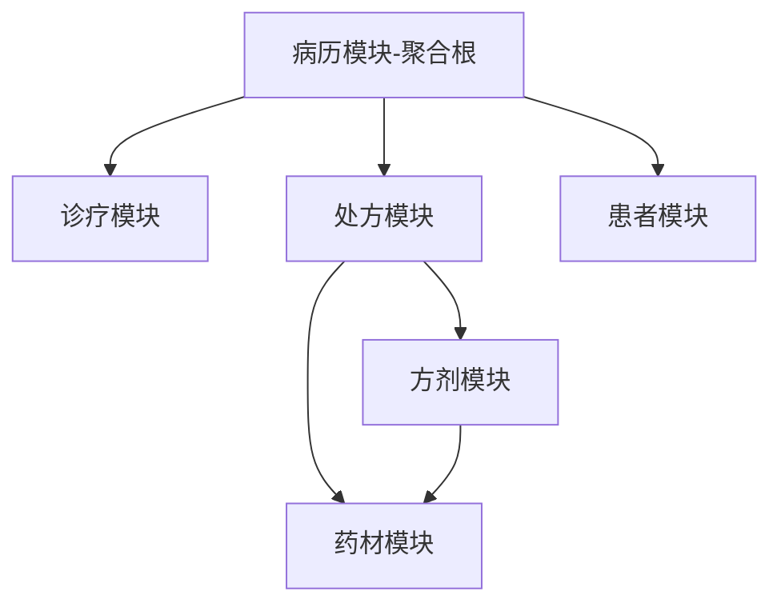

# 架构设计与代码同步分析报告

> 生成时间：2025-01-02
> 目的：确保架构文档与实际代码实现的一致性，避免歧义

## 一、同步检查清单

### 1.1 架构层面检查 ✅

| 检查项 | 架构文档要求 | 代码实现状态 | 一致性 | 需要的行动 |
|--------|--------------|--------------|---------|------------|
| **分层架构** | 三层架构（表现层/业务层/数据层） | 已实现 | ✅ 一致 | - |
| **聚合根设计** | MedicalCase作为聚合根 | 已实现 MedicalCase 类 | ✅ 一致 | - |
| **实体关系** | MedicalCase 1:1 Consultation, 0..1 Prescription | 导航属性已配置 | ✅ 一致 | - |
| **模块划分** | 8个核心模块 | 模块目录结构存在 | ✅ 一致 | - |
| **技术栈** | .NET 8 + EF Core + WPF | 项目文件已配置 | ✅ 一致 | - |

### 1.2 实体模型检查 📋

#### MedicalCase（病历 - 聚合根）
```csharp
// 文档定义的核心属性
✅ Id: Guid                    // 已继承自 BaseEntity
✅ PatientId: Guid             // 已实现
✅ PatientName: string         // 已实现
✅ DoctorId: Guid              // 已实现
✅ DoctorName: string          // 已实现
✅ ConsultationDate: DateTime  // 已实现
✅ Status: MedicalCaseStatus   // 已实现
✅ Remark: string?             // 已实现
✅ IsLocked: bool (计算属性)   // 已实现
✅ CanEdit(): bool             // 业务方法已实现

// 导航属性
✅ Consultation: Consultation?  // 1:1关系已配置
✅ Prescription: Prescription?  // 0..1关系已配置
```

#### Consultation（诊疗记录）
```csharp
// 文档定义的四诊属性
✅ ChiefComplaint: string      // 主诉
✅ PresentIllness: string      // 现病史
✅ Inspection: string          // 望诊
✅ AuscultationOlfaction: string // 闻诊
✅ Inquiry: string             // 问诊
✅ Palpation: string           // 切诊
✅ TCMDiagnosis: string        // 中医诊断
✅ TreatmentPrinciple: string  // 治则治法
✅ MedicalAdvice: string       // 医嘱
✅ Status: ConsultationStatus  // 状态
✅ MedicalCase: MedicalCase    // 反向导航
```

#### Prescription（处方）
```csharp
// 文档定义的处方属性
✅ MedicalCaseId: Guid         // 关联病历
✅ PatientId: Guid?            // 患者ID
✅ UserId: Guid?               // 医生ID
✅ Indication: string          // 适应症
✅ DosageCount: int            // 剂数
✅ Discount: decimal           // 折扣
✅ Advice: string              // 服药建议
✅ FormulaSource: string       // 方剂来源
✅ Status: PrescriptionStatus  // 状态
✅ PrintVersion: int           // 打印版本
✅ PrintCount: int             // 打印次数
✅ LastPrintedAt: DateTime?    // 最后打印时间
✅ IsPrinted: bool             // 是否已打印
✅ Items: List<PrescriptionItem> // 处方明细
✅ MedicalCase: MedicalCase    // 反向导航
```

### 1.3 API设计规范检查 🔌

| API规范 | 文档要求 | 实现示例 | 一致性 |
|---------|----------|----------|---------|
| **RESTful风格** | GET/POST/PUT/DELETE | ConsultationController已遵循 | ✅ |
| **路由命名** | api/v{version}/[controller] | 已配置API版本控制 | ✅ |
| **响应格式** | ServiceResult<T> / ApiResponse<T> | 已统一使用 | ✅ |
| **分页查询** | PagedResult<T> | GetPagedAsync已实现 | ✅ |
| **异常处理** | 全局异常过滤器 | ExceptionHandler已配置 | ✅ |

### 1.4 技术标准检查 🚫

#### 明确禁止的技术（必须检查）
| 禁止技术 | 检查结果 | 代码位置 |
|----------|----------|----------|
| **CQRS/MediatR** | ✅ 未使用 | - |
| **微服务架构** | ✅ 未使用 | 单体应用 |
| **Redis** | ✅ 未使用 | 使用MemoryCache |
| **消息队列** | ✅ 未使用 | - |
| **Docker/K8s** | ✅ 未使用 | - |
| **GraphQL** | ✅ 未使用 | RESTful API |
| **过度的Repository** | ⚠️ 存在部分 | 需要简化 |

### 1.5 开发规范检查 📏

| 规范项 | 要求 | 实际状态 | 行动项 |
|--------|------|----------|--------|
| **注释语言** | 中文 | ✅ 已使用中文 | - |
| **命名约定** | PascalCase/camelCase | ✅ 符合规范 | - |
| **异步方法** | 以Async结尾 | ✅ 已遵循 | - |
| **依赖注入** | 构造函数注入 | ✅ 已实现 | - |
| **文件大小** | <500行 | ✅ 大部分符合 | - |

## 二、需要同步的关键信息

### 2.1 业务规则同步 📌

```yaml
病历编辑规则:
  - 当天可改: CreatedAt.Date == DateTime.Today
  - 过期锁定: CreatedAt.Date < DateTime.Today
  - 管理员例外: isAdmin == true 可编辑所有

处方录入方式:
  1. 表格编辑: 传统表格输入
  2. 快速录入: 拼音码搜索
  3. 方剂导入: 从模板导入
  4. 历史复制: 从历史处方复制

数据规模:
  - 并发用户: <10人
  - 日处方量: 20-100张
  - 总数据量: <10万条
```

### 2.2 缓存策略同步 💾

```yaml
三级缓存:
  L1_客户端:
    - 存储: MemoryCache
    - 时长: 5分钟
    - 内容: 患者列表、药材字典
  
  L2_API层:
    - 存储: MemoryCache
    - 时长: 10分钟
    - 内容: 热点数据
  
  L3_数据库:
    - 存储: SQL Server
    - 持久化存储
```

### 2.3 认证方案同步 🔐

```yaml
JWT配置:
  - AccessToken有效期: 2小时
  - RefreshToken有效期: 7天
  - 密钥存储: appsettings.json
  - 刷新机制: /api/auth/refresh
  - 撤销机制: RefreshToken.RevokedAt
```

### 2.4 模块依赖关系 🔗



## 三、同步行动计划

### 3.1 立即执行项 🔴

1. **更新README.md**
   - [ ] 添加架构文档链接
   - [ ] 更新技术栈说明
   - [ ] 添加快速开始指南

2. **创建开发指南**
   - [ ] 新增 docs/development/development-guide.md
   - [ ] 包含编码规范、Git流程、测试要求

3. **统一术语表**
   - [ ] 创建 docs/glossary.md
   - [ ] 中英文对照表
   - [ ] 业务术语解释

### 3.2 短期优化项 🟡

1. **简化Repository层**
   - [ ] 移除过度抽象的Repository
   - [ ] 直接使用DbContext where appropriate

2. **完善单元测试**
   - [ ] 补充MedicalCase聚合根测试
   - [ ] 添加业务规则测试

3. **API文档生成**
   - [ ] 配置Swagger/OpenAPI
   - [ ] 添加API示例

### 3.3 长期改进项 🟢

1. **性能优化**
   - [ ] 实施查询优化
   - [ ] 添加索引策略

2. **监控体系**
   - [ ] 添加应用性能监控
   - [ ] 实现操作日志

## 四、文档矩阵

| 文档类型 | 文档名称 | 位置 | 状态 | 维护频率 |
|----------|----------|------|------|----------|
| **架构设计** | system-architecture-design.md | docs/architecture/ | ✅ 已创建 | 季度更新 |
| **功能设计** | functional-modules-design.md | docs/architecture/ | ✅ 已创建 | 按需更新 |
| **技术标准** | technical-standards.md | docs/development/ | ✅ 已创建 | 季度评审 |
| **需求文档** | mvp-requirements-final-2025-09-27.md | docs/requirements/ | ✅ 存在 | 版本迭代 |
| **API文档** | api-documentation.md | docs/api/ | ❌ 待创建 | 实时更新 |
| **部署指南** | deployment-guide.md | docs/deployment/ | ❌ 待创建 | 按需更新 |
| **开发指南** | development-guide.md | docs/development/ | ❌ 待创建 | 月度更新 |
| **测试指南** | testing-guide.md | docs/testing/ | ❌ 待创建 | 按需更新 |

## 五、代码与文档同步检查脚本

```powershell
# 架构同步检查脚本
# sync-check.ps1

# 1. 检查禁用技术
Write-Host "检查禁用技术..." -ForegroundColor Yellow
$forbiddenPatterns = @(
    "MediatR",
    "Redis",
    "RabbitMQ",
    "Kafka",
    "GraphQL",
    "Docker",
    "CQRS"
)

foreach ($pattern in $forbiddenPatterns) {
    $found = Get-ChildItem -Path "src" -Recurse -Filter "*.cs" | 
             Select-String -Pattern $pattern -SimpleMatch
    if ($found) {
        Write-Host "⚠️ 发现禁用技术: $pattern" -ForegroundColor Red
        $found | ForEach-Object { Write-Host "  - $($_.Path)" }
    }
}

# 2. 检查实体关系
Write-Host "`n检查实体关系..." -ForegroundColor Yellow
$entityFiles = @(
    "src\Server\Core\LYBT.Entities\MedicalCase\MedicalCaseModel.cs",
    "src\Server\Core\LYBT.Entities\Consultation\ConsultationModel.cs",
    "src\Server\Core\LYBT.Entities\Prescriptions\PrescriptionModel.cs"
)

foreach ($file in $entityFiles) {
    if (Test-Path $file) {
        Write-Host "✅ $file 存在" -ForegroundColor Green
    } else {
        Write-Host "❌ $file 不存在" -ForegroundColor Red
    }
}

# 3. 检查文档完整性
Write-Host "`n检查文档完整性..." -ForegroundColor Yellow
$requiredDocs = @(
    "docs\architecture\system-architecture-design.md",
    "docs\architecture\functional-modules-design.md",
    "docs\development\technical-standards.md",
    "README.md"
)

foreach ($doc in $requiredDocs) {
    if (Test-Path $doc) {
        Write-Host "✅ $doc 存在" -ForegroundColor Green
    } else {
        Write-Host "❌ $doc 缺失" -ForegroundColor Red
    }
}

Write-Host "`n同步检查完成！" -ForegroundColor Green
```

## 六、总结

### 当前状态评估
- **架构一致性**: 90% ✅
- **代码规范性**: 85% ✅
- **文档完整性**: 75% ⚠️
- **技术债务**: 低 ✅

### 关键风险点
1. Repository层可能存在过度设计
2. 部分文档需要创建（API、部署、测试指南）
3. 单元测试覆盖率需要提升

### 建议
1. **短期**：完成文档矩阵中缺失的文档
2. **中期**：简化Repository层，提升测试覆盖率
3. **长期**：建立自动化的架构一致性检查机制

---
*本文档应定期更新，确保架构设计与代码实现始终保持同步。*