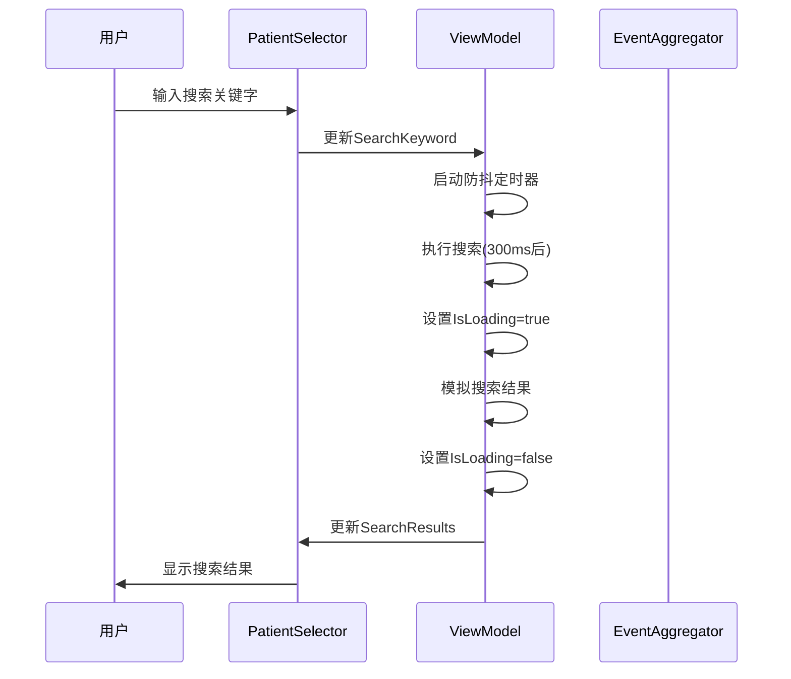
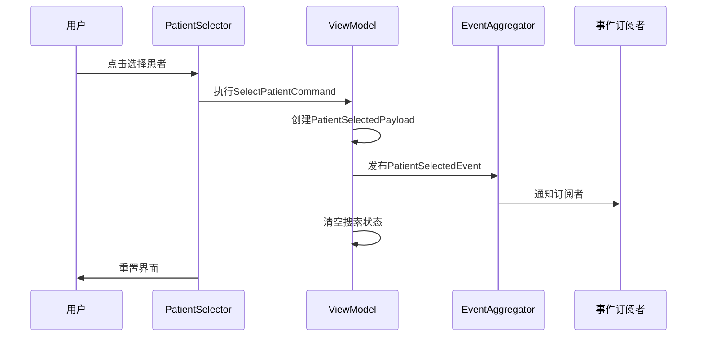

# PatientSelector 患者选择器组件

## 概述

PatientSelector是凌隐宝堂中医诊所系统中的核心UI组件，提供患者搜索、选择和快速创建功能。该组件采用MVVM架构模式，支持事件驱动的患者选择流程。

## 功能特性

### 🎯 核心功能
- **智能搜索**: 支持患者姓名、手机号等多维度搜索，带防抖优化
- **快速选择**: 点击即可选择患者，自动触发患者选择事件
- **快速创建**: 支持现场快速创建新患者档案
- **实时验证**: 表单输入实时验证，确保数据完整性
- **状态管理**: 完整的加载、错误、空数据状态处理

### 🔧 技术特性
- **MVVM架构**: 清晰的视图-视图模型分离
- **事件驱动**: 基于Prism.EventAggregator的松耦合事件系统
- **异步处理**: 非阻塞的搜索和数据操作
- **资源管理**: 正确的资源释放和内存管理
- **单元测试**: 完整的单元测试和集成测试覆盖

## 组件结构

```
PatientSelector/
├── PatientSelectorControl.xaml          # XAML视图定义
├── PatientSelectorControl.xaml.cs       # Code-behind逻辑
├── PatientSelectorViewModel.cs          # 视图模型
└── README.md                            # 组件文档
```

## 类设计

### PatientSelectorViewModel

视图模型负责所有业务逻辑和状态管理：

```csharp
public class PatientSelectorViewModel : BindableBase, IDisposable
{
    // 搜索相关属性
    public string SearchKeyword { get; set; }
    public ObservableCollection<object> SearchResults { get; set; }
    public bool IsLoading { get; set; }
    
    // 选择相关属性
    public object? SelectedPatient { get; set; }
    
    // 快速创建相关属性
    public bool ShowQuickCreate { get; set; }
    public string NewPatientName { get; set; }
    public string NewPatientGender { get; set; }
    public string NewPatientPhone { get; set; }
    
    // 命令定义
    public DelegateCommand SearchCommand { get; }
    public DelegateCommand<object?> SelectPatientCommand { get; }
    public DelegateCommand QuickCreateCommand { get; }
    public DelegateCommand ToggleQuickCreateCommand { get; }
}
```

### PatientSelectorControl

WPF用户控件，提供完整的用户界面：

- **搜索区域**: 带搜索图标的文本框，支持实时搜索
- **结果列表**: 显示搜索结果，支持点击选择
- **快速创建面板**: 可折叠的患者创建表单
- **加载遮罩**: 搜索时显示加载状态
- **错误提示**: 显示操作错误信息

## 使用方法

### 1. 组件注册

在依赖注入容器中注册组件：

```csharp
// 在模块初始化时
containerRegistry.RegisterPatientSelectorServices();
```

### 2. XAML中使用

```xml
<components:PatientSelectorControl 
    Width="400" 
    Height="600"/>
```

### 3. 事件订阅

订阅患者选择事件：

```csharp
public class PatientManagementViewModel
{
    public PatientManagementViewModel(IEventAggregator eventAggregator)
    {
        eventAggregator.GetEvent<PatientSelectedEvent>()
            .Subscribe(OnPatientSelected);
    }
    
    private void OnPatientSelected(PatientSelectedPayload payload)
    {
        // 处理患者选择逻辑
        SelectedPatient = payload;
        LoadPatientDetails(payload.PatientId);
    }
}
```

## 事件系统

### PatientSelectedEvent

患者选择事件，携带完整的患者信息：

```csharp
public class PatientSelectedPayload
{
    public Guid PatientId { get; set; }
    public string PatientName { get; set; }
    public string Gender { get; set; }
    public int Age { get; set; }
    public string PhoneNumber { get; set; }
    public DateTime? LastVisitDate { get; set; }
    public int VisitCount { get; set; }
    public string AllergyHistory { get; set; }
    public DateTime SelectedAt { get; set; }
}
```

## 数据流程

### 搜索流程


### 选择流程


## 样式定制

组件使用内置样式，支持主题定制：

```xml
<Style x:Key="SearchTextBoxStyle" TargetType="TextBox">
    <!-- 自定义搜索框样式 -->
</Style>

<Style x:Key="PatientListItemStyle" TargetType="ListBoxItem">
    <!-- 自定义列表项样式 -->
</Style>
```

## 测试覆盖

### 单元测试
- ViewModel属性和命令测试
- 搜索逻辑测试
- 患者选择逻辑测试
- 快速创建逻辑测试
- 错误处理测试

### 集成测试
- 完整的用户交互流程测试
- 事件发布订阅测试
- 状态管理测试
- UI组件集成测试

运行测试：
```bash
dotnet test tests/UnitTests/Client/Desktop/LYBT.Desktop.PatientSelector.Tests/
dotnet test tests/IntegrationTests/Client/Desktop/LYBT.Desktop.PatientSelector.IntegrationTests/
```

## 性能优化

### 搜索防抖
- 300ms防抖延迟，避免频繁搜索请求
- CancellationToken确保搜索请求正确取消

### 内存管理
- 实现IDisposable接口，正确释放资源
- 事件订阅的适当清理

### UI虚拟化
- 大量搜索结果时启用列表虚拟化
- 延迟加载优化

## 错误处理

### 搜索错误
```csharp
try
{
    // 搜索逻辑
}
catch (Exception ex)
{
    ErrorMessage = $"搜索失败: {ex.Message}";
}
```

### 创建错误
- 手机号重复检查
- 表单验证失败处理
- 网络错误处理

## 扩展点

### 1. 自定义搜索逻辑
继承ViewModel并重写搜索方法：
```csharp
public class CustomPatientSelectorViewModel : PatientSelectorViewModel
{
    protected override async Task SearchAsync()
    {
        // 自定义搜索实现
    }
}
```

### 2. 自定义验证规则
扩展CanQuickCreate方法：
```csharp
protected override bool CanQuickCreate()
{
    // 添加自定义验证逻辑
    return base.CanQuickCreate() && CustomValidation();
}
```

### 3. 自定义事件负载
扩展PatientSelectedPayload：
```csharp
public class ExtendedPatientSelectedPayload : PatientSelectedPayload
{
    public string AdditionalInfo { get; set; }
}
```

## 部署注意事项

### 依赖项
- Prism.Wpf框架
- AutoMapper (用于对象映射)
- Microsoft.Extensions.Logging

### 配置要求
- 确保EventAggregator正确注册
- 配置适当的日志级别
- 设置合理的搜索超时时间

## 版本历史

### v2.0.0 (2025-01-15)
- 初始版本发布
- 完整的搜索和选择功能
- 快速创建患者功能
- 事件驱动架构
- 完整的测试覆盖

## 相关文档

- [MVVM设计规范](../../../client/unified-design-standard.md)
- [事件系统设计](../../events/README.md)
- [依赖注入配置](../../dependency-injection/README.md)
- [测试标准](../../../development/test-architecture-standard.md)

## 维护团队

- **架构设计**: LYBT架构团队
- **开发实现**: LYBT客户端开发团队
- **测试验证**: LYBT质量保证团队

---

*本文档最后更新时间: 2025-01-15*