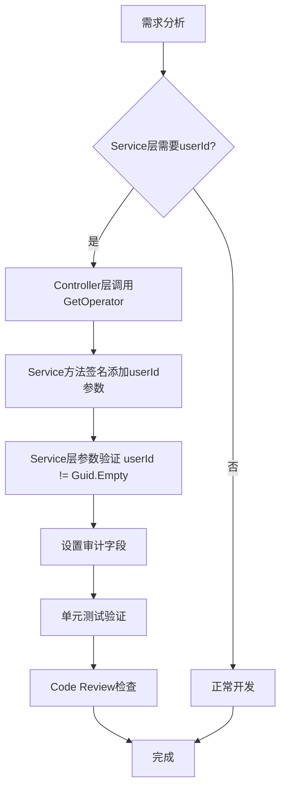

# ADR-001: 用户上下文传递模式（User Context Propagation Pattern）

**状态**: ✅ Accepted（已接受）
**日期**: 2025-11-22
**决策者**: Claude Code
**Epic**: #2210 PatientSelection优化 + P0 MedicalCase创建Bug修复
**Issue**: #2220 Task 2.1.2 - 制定用户上下文传递规范

---

## 1. 上下文（Context）

### 1.1 问题背景

在Epic #2210 Phase 1的P0 Bug修复中，发现MedicalCase模块存在严重的数据丢失问题：

- **问题**: 所有MedicalCase记录的DoctorId = Guid.Empty，DoctorName = null，PatientName = null
- **根因**: MedicalCaseService.CreateAsync()方法未接收doctorId参数，无法获取当前医生信息
- **影响**: 诊疗记录丢失关键审计字段，无法追溯是哪位医生创建的病案

**Issue #2211-#2215修复**: 在Controller层通过`GetOperator()`提取当前医生ID，并显式传递给Service层。

### 1.2 全局审计发现

在Task 2.1.1全局Service Create方法审计中（Issue #2219），发现类似问题存在于多个模块：

| 模块 | 问题 | 风险等级 |
|------|------|----------|
| Patient | CreateAsync缺失createdBy参数 | P1 - 无法追溯患者档案创建者 |
| Formula | CreateAsync缺失authorId参数 | P2 - 无法追踪方剂作者 |
| Herb | CreateAsync缺失createdBy参数 | P2 - 无法追踪中药主数据维护者 |

**核心问题**: 缺乏统一的用户上下文传递规范，导致相同bug模式在不同模块重复出现。

### 1.3 架构挑战

在ASP.NET Core三层架构（Controller → Service → Repository）中：

- **Controller层**: 有HttpContext，可获取当前登录用户
- **Service层**: 无HttpContext，无法直接获取当前用户
- **需求**: Service层需要用户信息进行业务逻辑处理（审计、权限检查）

**反模式**（Anti-Patterns）:
1. Service层直接注入`IHttpContextAccessor` - 违反单一职责，增加耦合
2. Service层使用静态上下文 - 无法单元测试，线程不安全
3. Controller层隐式传递userId（通过DTO） - 业务数据与上下文数据混淆

---

## 2. 决策（Decision）

### 2.1 核心决策

在LYBTZYZS项目中，采用**显式用户上下文传递模式**（Explicit User Context Propagation Pattern）：

1. **Controller层**: 通过`GetOperator()`方法提取当前用户信息
2. **Service层**: 方法签名显式包含userId/operatorId参数
3. **传递原则**: 显式 > 隐式，类型安全 > 动态类型

### 2.2 GetOperator()标准实现

**位置**: `src/Server/Core/LYBT.Infrastructure/Web/BaseControllerCore.cs`

**方法签名**:
```csharp
protected (Guid OperatorId, string OperatorName, string OperatorRole) GetOperator()
```

**实现特点**:
- 从JWT Claims中提取用户信息（兼容多种Claims标准）
- 返回Tuple: (OperatorId, OperatorName, OperatorRole)
- 如果无法获取有效用户信息，抛出`UnauthorizedAccessException`

**完整实现**:
```csharp
protected (Guid OperatorId, string OperatorName, string OperatorRole) GetOperator()
{
    // 尝试多种方式获取用户ID（兼容JwtRegisteredClaimNames和ClaimTypes）
    var userId = User?.FindFirst(ClaimTypes.NameIdentifier)?.Value
                ?? User?.FindFirst(JwtRegisteredClaimNames.Sub)?.Value
                ?? User?.FindFirst("sub")?.Value;

    // 尝试多种方式获取用户名
    var userName = User?.Identity?.Name
                  ?? User?.FindFirst(ClaimTypes.Name)?.Value
                  ?? User?.FindFirst(JwtRegisteredClaimNames.UniqueName)?.Value
                  ?? User?.FindFirst("unique_name")?.Value
                  ?? User?.FindFirst("name")?.Value;

    // 尝试多种方式获取角色
    var roleStr = User?.FindFirst(ClaimTypes.Role)?.Value
                 ?? User?.FindFirst("role")?.Value
                 ?? User?.FindFirst("roles")?.Value
                 ?? User?.FindFirst("Admin")?.Value;

    if (Guid.TryParse(userId, out var opId) && !string.IsNullOrEmpty(userName))
    {
        return (opId, userName, roleStr ?? "User");
    }

    throw new UnauthorizedAccessException("未登录或用户信息无效");
}
```

### 2.3 Controller层模式

**模式1: 仅传递OperatorId**（适用于创建/审计场景）

```csharp
[HttpPost]
public async Task<ActionResult<ApiResponse<MedicalCaseEntity>>> CreateMedicalCase(
    [FromBody] CreateMedicalCaseRequest request)
{
    try
    {
        // ✅ 提取当前医生ID
        var (doctorId, _, _) = GetOperator();

        // ✅ 显式传递给Service层
        var result = await _medicalCaseService.CreateAsync(
            request.PatientId,
            request.VisitDate,
            doctorId);  // ← userId参数

        return Ok(ApiResponse<MedicalCaseEntity>.CreateSuccess(result, "病案创建成功"));
    }
    catch (ArgumentException ex)
    {
        // DoctorId参数验证失败
        return BadRequest(ApiResponse<MedicalCaseEntity>.CreateFail(ex.Message));
    }
}
```

**模式2: 传递OperatorId + Role**（适用于权限检查场景）

```csharp
[HttpPut("{id}/consultation")]
public async Task<ActionResult<ApiResponse<MedicalCaseEntity>>> UpdateConsultation(
    Guid id,
    [FromBody] ConsultationInputDto request)
{
    try
    {
        // ✅ 提取当前用户ID和角色
        var (operatorId, _, operatorRole) = GetOperator();
        var isAdmin = operatorRole?.Contains("Admin", StringComparison.OrdinalIgnoreCase) ?? false;

        // ✅ 显式传递给Service层
        var result = await _medicalCaseService.UpdateConsultationAsync(
            id,
            request,
            operatorId,  // ← userId参数
            isAdmin);    // ← 权限标识

        return Ok(ApiResponse<MedicalCaseEntity>.CreateSuccess(result, "辨证信息更新成功"));
    }
    catch (InvalidOperationException ex)
    {
        return BadRequest(ApiResponse<MedicalCaseEntity>.CreateFail(ex.Message));
    }
}
```

### 2.4 Service层模式

**模式1: 接收userId参数**

```csharp
public async Task<MedicalCaseEntity?> CreateAsync(
    Guid patientId,
    DateTime visitDate,
    Guid doctorId)  // ✅ 显式userId参数
{
    // ✅ 参数验证
    if (doctorId == Guid.Empty)
        throw new ArgumentException("DoctorId不能为空", nameof(doctorId));

    // ✅ 查询关联信息
    var doctor = await _userRepository.GetByIdAsync(doctorId);
    if (doctor == null)
        throw new InvalidOperationException($"医生不存在，DoctorId: {doctorId}");

    // ✅ 设置审计字段
    var entity = new MedicalCaseEntity
    {
        DoctorId = doctorId,              // ← 从参数设置
        DoctorName = doctor.RealName,     // ← 从查询结果设置
        // ...
    };

    return await _repository.AddAsync(entity);
}
```

**模式2: 接收userId + 权限标识**

```csharp
public async Task<MedicalCaseEntity?> UpdateConsultationAsync(
    Guid medicalCaseId,
    ConsultationInputDto dto,
    Guid operatorId,  // ✅ 当前操作者ID
    bool isAdmin)     // ✅ 权限标识
{
    var medicalCase = await _repository.GetByIdAsync(medicalCaseId);
    if (medicalCase == null)
        return null;

    // ✅ 权限检查：仅创建者或管理员可修改
    if (medicalCase.DoctorId != operatorId && !isAdmin)
        throw new UnauthorizedAccessException("无权修改此病案");

    // 更新业务逻辑...
}
```

### 2.5 参数命名约定

| 场景 | 参数名 | 类型 | 说明 |
|------|--------|------|------|
| 医生创建医案 | `doctorId` | Guid | 特定领域语义 |
| 用户创建患者 | `createdBy` | Guid | 通用审计语义 |
| 用户创建方剂 | `authorId` | Guid | 特定领域语义 |
| 权限检查 | `operatorId` | Guid | 通用操作者语义 |
| 角色权限 | `isAdmin` / `operatorRole` | bool/string | 权限标识 |

**命名原则**:
1. **优先使用领域语义**: doctorId > userId（医疗场景）
2. **审计场景使用createdBy**: 强调审计追踪
3. **权限场景使用operatorId**: 强调操作者身份

### 2.6 参数顺序约定

```csharp
public async Task<T> CreateAsync(
    /* 1. 业务主键参数 */
    Guid entityId,

    /* 2. 业务数据参数 */
    BusinessDto dto,

    /* 3. 用户上下文参数 */
    Guid userId,        // 或 doctorId/createdBy/authorId

    /* 4. 可选参数 */
    CancellationToken cancellationToken = default)
{
    // ...
}
```

**顺序原则**:
1. 业务主键参数在前
2. 业务数据参数居中
3. **用户上下文参数在业务参数之后、可选参数之前**
4. 可选参数最后（CancellationToken等）

### 2.7 异常处理规范

**Controller层**:
```csharp
try
{
    var (userId, _, _) = GetOperator();
    // 调用Service...
}
catch (UnauthorizedAccessException ex)
{
    // GetOperator()失败 - 用户未登录或信息无效
    return Unauthorized(ApiResponse.CreateFail(ex.Message));
}
catch (ArgumentException ex)
{
    // Service层参数验证失败（如userId = Guid.Empty）
    return BadRequest(ApiResponse.CreateFail(ex.Message));
}
catch (InvalidOperationException ex)
{
    // Service层业务规则验证失败（如实体不存在）
    return BadRequest(ApiResponse.CreateFail(ex.Message));
}
```

**Service层**:
```csharp
public async Task<T> CreateAsync(Guid userId, ...)
{
    // ✅ userId参数验证
    if (userId == Guid.Empty)
        throw new ArgumentException("UserId不能为空", nameof(userId));

    // ✅ 实体存在性验证
    var user = await _userRepository.GetByIdAsync(userId);
    if (user == null)
        throw new InvalidOperationException($"用户不存在，UserId: {userId}");

    // 业务逻辑...
}
```

---

## 3. 替代方案（Alternatives）

### 3.1 方案A: Service层注入IHttpContextAccessor

**实现**:
```csharp
public class PatientService
{
    private readonly IHttpContextAccessor _httpContextAccessor;

    public async Task<T> CreateAsync(BusinessDto dto)
    {
        var userId = _httpContextAccessor.HttpContext.User
            .FindFirst(ClaimTypes.NameIdentifier)?.Value;
        // ...
    }
}
```

**优点**:
- 无需修改方法签名
- Service层自主获取用户信息

**缺点**（致命）:
- ❌ 违反单一职责原则（Service层依赖HTTP基础设施）
- ❌ 增加耦合（Service层依赖ASP.NET Core）
- ❌ 单元测试困难（需Mock HttpContext）
- ❌ 代码可读性差（隐式依赖）

**决策**: ❌ **拒绝** - 违反架构分层原则

### 3.2 方案B: 通过DTO隐式传递userId

**实现**:
```csharp
public class CreatePatientDto
{
    public string Name { get; set; }
    public string Phone { get; set; }
    public Guid CreatedBy { get; set; }  // ← 混入业务DTO
}

public async Task<T> CreateAsync(CreatePatientDto dto)
{
    var userId = dto.CreatedBy;  // ← 从DTO提取
    // ...
}
```

**优点**:
- 无需新增方法参数

**缺点**:
- ❌ 业务数据与上下文数据混淆
- ❌ DTO污染（审计字段不应在DTO中）
- ❌ Controller层需手动设置dto.CreatedBy（容易遗漏）
- ❌ 缺乏类型安全（可能被业务代码修改）

**决策**: ❌ **拒绝** - DTO应仅包含业务数据

### 3.3 方案C: 使用静态上下文

**实现**:
```csharp
public static class UserContext
{
    private static AsyncLocal<Guid> _currentUserId = new();

    public static Guid CurrentUserId
    {
        get => _currentUserId.Value;
        set => _currentUserId.Value = value;
    }
}

// Controller
UserContext.CurrentUserId = userId;

// Service
var userId = UserContext.CurrentUserId;
```

**优点**:
- 无需修改方法签名
- 线程安全（使用AsyncLocal）

**缺点**:
- ❌ 隐式依赖（代码可读性差）
- ❌ 单元测试困难（需管理全局状态）
- ❌ 容易被错误使用（静态变量缺乏约束）
- ❌ 无法强制调用方设置（容易遗漏）

**决策**: ❌ **拒绝** - 隐式依赖降低可维护性

---

## 4. 后果（Consequences）

### 4.1 正面影响

#### 4.1.1 架构清晰

- ✅ **清晰的依赖关系**: Service层的userId依赖通过方法签名显式声明
- ✅ **分层明确**: Controller层负责提取用户上下文，Service层负责业务逻辑
- ✅ **单一职责**: Service层不依赖HTTP基础设施

#### 4.1.2 可测试性

**Controller层单元测试**:
```csharp
[Fact]
public async Task CreateMedicalCase_ShouldExtractDoctorId_AndPassToService()
{
    // Arrange
    var mockService = new Mock<IMedicalCaseService>();
    var controller = new MedicalCaseController(mockService.Object);

    // Mock User.Claims（模拟已登录医生）
    var claims = new List<Claim>
    {
        new Claim(ClaimTypes.NameIdentifier, "doctor-guid-123"),
        new Claim(ClaimTypes.Name, "李医生")
    };
    controller.ControllerContext = CreateControllerContext(claims);

    // Act
    await controller.CreateMedicalCase(new CreateMedicalCaseRequest(...));

    // Assert: 验证Service层收到正确的doctorId
    mockService.Verify(x => x.CreateAsync(
        It.IsAny<Guid>(),
        It.IsAny<DateTime>(),
        Guid.Parse("doctor-guid-123")),  // ✅ 验证传递正确
        Times.Once);
}
```

**Service层单元测试**:
```csharp
[Fact]
public async Task CreateAsync_WithValidDoctorId_ShouldSetDoctorFields()
{
    // Arrange
    var doctorId = Guid.NewGuid();
    var mockUserRepo = new Mock<IUserRepository>();
    mockUserRepo.Setup(x => x.GetByIdAsync(doctorId))
        .ReturnsAsync(new User { Id = doctorId, RealName = "赵医生" });

    var service = new MedicalCaseService(mockUserRepo.Object, ...);

    // Act
    var result = await service.CreateAsync(patientId, visitDate, doctorId);

    // Assert: ✅ 验证DoctorId和DoctorName正确设置
    result.DoctorId.Should().Be(doctorId);
    result.DoctorName.Should().Be("赵医生");
}
```

#### 4.1.3 代码可读性

```csharp
// ✅ 显式参数 - 一目了然
public async Task<T> CreateAsync(Guid userId, BusinessDto dto)
{
    // userId从哪来？→ 方法签名清晰显示
    // 如何获取？→ Controller层GetOperator()
}

// ❌ 隐式依赖 - 需要查找代码
public async Task<T> CreateAsync(BusinessDto dto)
{
    var userId = _httpContextAccessor.HttpContext.User...;  // ← 从哪来？
}
```

#### 4.1.4 类型安全

```csharp
// ✅ 类型安全
public async Task<T> CreateAsync(Guid userId)
{
    // 编译期检查：userId必须是Guid类型
}

// ❌ 字符串传递
public async Task<T> CreateAsync(string userId)
{
    // 运行时才发现：userId可能不是有效Guid
    Guid.TryParse(userId, out var id);
}
```

### 4.2 负面影响

#### 4.2.1 方法签名膨胀

**影响**: 每个需要用户上下文的Service方法都需要增加userId参数

**示例**:
```csharp
// 修复前
public async Task<T> CreateAsync(BusinessDto dto)

// 修复后
public async Task<T> CreateAsync(BusinessDto dto, Guid userId)  // ← 新增参数
```

**缓解措施**:
1. 仅在真正需要userId的方法中添加参数
2. 使用Tuple返回值减少参数数量（如GetOperator()）
3. 遵循参数顺序约定，保持一致性

#### 4.2.2 Controller层代码增加

**影响**: 每个需要userId的API都需要调用GetOperator()

**示例**:
```csharp
// 每个API都需要加这两行
var (userId, _, _) = GetOperator();
var result = await _service.CreateAsync(..., userId);
```

**缓解措施**:
1. GetOperator()在BaseControllerCore中统一实现，避免重复
2. 通过代码审查确保一致性
3. 使用代码生成工具（未来优化）

#### 4.2.3 重构成本

**影响**: 现有代码需要大量重构

**Task 2.1.1审计结果**:
- 3个模块需要修复（Patient/Formula/Herb）
- 预计总工时: 6小时

**缓解措施**:
1. 分优先级修复（P1 > P2）
2. 利用全局搜索替换工具
3. 增量重构（不影响已有功能）

### 4.3 风险与应对

| 风险 | 概率 | 影响 | 应对措施 |
|------|------|------|----------|
| 开发人员忘记传递userId | 中 | 高 | 1. Code Review检查清单<br>2. 单元测试验证<br>3. 架构合规检查工具 |
| GetOperator()失败导致500错误 | 低 | 中 | 1. 统一异常处理<br>2. 返回401 Unauthorized<br>3. 记录详细日志 |
| 参数顺序不一致 | 中 | 低 | 1. 文档化参数顺序约定<br>2. Code Review检查<br>3. ReSharper/Rider配置 |

---

## 5. 实施指南

### 5.1 新功能开发流程



### 5.2 现有代码重构流程

**步骤1: 识别需要修复的Service方法**
```bash
# 搜索所有Create/Update方法
grep -r "public.*Async" src/Server/Modules/*/Services/*.cs
```

**步骤2: 修改Service方法签名**
```csharp
// 修复前
public async Task<T> CreateAsync(BusinessDto dto)

// 修复后
public async Task<T> CreateAsync(BusinessDto dto, Guid userId)
{
    // 添加参数验证
    if (userId == Guid.Empty)
        throw new ArgumentException("UserId不能为空", nameof(userId));

    // 原有逻辑...
}
```

**步骤3: 修改Controller调用**
```csharp
// 修复前
var result = await _service.CreateAsync(dto);

// 修复后
var (userId, _, _) = GetOperator();
var result = await _service.CreateAsync(dto, userId);
```

**步骤4: 添加单元测试**
```csharp
[Fact]
public async Task CreateAsync_WithEmptyUserId_ShouldThrowArgumentException()
{
    var exception = await Assert.ThrowsAsync<ArgumentException>(
        () => _service.CreateAsync(dto, Guid.Empty));

    exception.ParamName.Should().Be("userId");
}
```

**步骤5: Code Review检查清单**
- [ ] Service方法签名已添加userId参数
- [ ] Controller层正确调用GetOperator()
- [ ] Service层参数验证完整
- [ ] 审计字段正确设置
- [ ] 单元测试覆盖正常流程和异常流程
- [ ] 异常处理符合规范

### 5.3 Code Review检查清单

**Controller层检查**:
```markdown
- [ ] 是否调用了GetOperator()提取userId
- [ ] 是否正确传递userId给Service层
- [ ] GetOperator()异常是否正确处理（返回401）
- [ ] 日志是否包含userId信息
```

**Service层检查**:
```markdown
- [ ] 方法签名是否包含userId参数
- [ ] 参数命名是否符合约定（doctorId/createdBy/authorId/operatorId）
- [ ] 参数顺序是否符合约定
- [ ] 是否验证userId != Guid.Empty
- [ ] 是否查询User实体验证存在性
- [ ] 审计字段是否正确设置
- [ ] 异常消息是否清晰
```

**单元测试检查**:
```markdown
- [ ] 是否测试userId = Guid.Empty场景（应抛ArgumentException）
- [ ] 是否测试User不存在场景（应抛InvalidOperationException）
- [ ] 是否测试正常流程（验证审计字段正确设置）
- [ ] 是否使用Mock隔离依赖
```

---

## 6. 参考资料

### 6.1 相关Issue

- **Epic #2210**: PatientSelection优化 + P0 MedicalCase创建Bug修复
- **Issue #2211-#2215**: MedicalCase P0修复系列
- **Issue #2219**: Task 2.1.1 - 全局审计Service Create方法签名
- **Issue #2220**: Task 2.1.2 - 制定用户上下文传递规范

### 6.2 相关文档

- `docs/audits/service-create-methods-audit-2025-11-22.md` - Service Create方法全局审计报告
- `docs/explanation/design/patient-selection-optimization-p0-bug-fix-design.md` - P0 Bug修复设计文档
- `docs/explanation/architecture/server/three-layer-architecture.md` - Server端三层架构说明

### 6.3 代码示例

- **GetOperator()实现**: `src/Server/Core/LYBT.Infrastructure/Web/BaseControllerCore.cs` (Line 28-54)
- **Controller使用示例**: `src/Server/Services/LYBT.WebAPI/Controllers/MedicalCaseController.cs` (Line 60, Line 104)
- **Service实现示例**: `src/Server/Modules/LYBT.Module.MedicalCase/Services/MedicalCaseService.cs` (Line 62-142)

### 6.4 外部资源

- [ASP.NET Core Best Practices](https://docs.microsoft.com/en-us/aspnet/core/fundamentals/best-practices)
- [Clean Architecture by Robert C. Martin](https://blog.cleancoder.com/uncle-bob/2012/08/13/the-clean-architecture.html)
- [Architecture Decision Records (ADR)](https://adr.github.io/)

---

**文档版本**: v1.0
**最后更新**: 2025-11-22
**维护者**: Claude Code
**审批状态**: ✅ Accepted（已接受）
